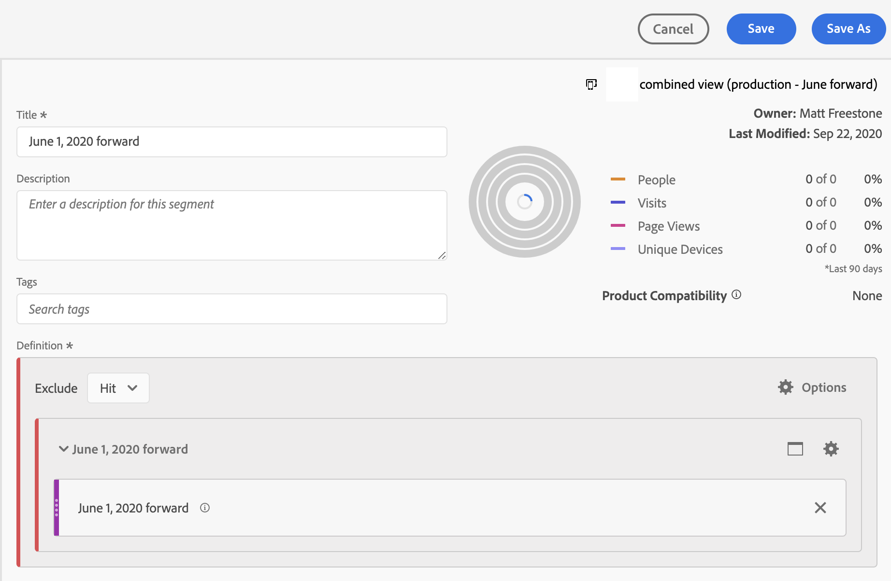

# 仮想レポートスイートを特定の日付に制限

{{available-existing-customers}}

ステッチをオンにすると、特定の日付にステッチが始まります。 その日付が 6 月 1 日だと仮定しましょう。 CDA仮想レポートスイートには、6月1日より前に未結合データが含まれます。 6月1日より前にバーチャルレポートスイートのデータを非表示にして、ステッチ開始後に分析を日付範囲に集中させることができます。

仮想レポートスイートのデータを特定の日付に制限するには、次の操作を行います。

## 手順1：日次ローリング日付範囲を含む仮想レポートスイートの作成

仮想レポートスイートを設定する場合、「コンポーネント」の下に、日次ローリング日付範囲を持つ固定開始の日付範囲を追加します。 開始日固定は、ステッチを開始した日にする必要があります。

## 手順 2：「除外 - 除外」セグメントの作成

次に、別の除外コンテナ内の除外コンテナに日付範囲を配置するヒットセグメントを作成します。 これは「除外する」ことです。

「除外された除外」の理由は、日付範囲がレポートの日付範囲を上書きするためです。 したがって、6 月 1 日以降を含めると、レポートの日付範囲は常に 6 月 1 日以降になります。 これは望ましくない結果につながります。 「除外を除外」すると、この動作が上書きされ、取得できるデータが適切な日付範囲に制限されます。

## 手順3：このセグメントをクロスデバイス Analytics仮想レポートスイートに適用する

## 手順 4：結果をレポートで確認

レポートは、ステッチが最初に実装された日と同じ日の、目的の日付に開始します。

