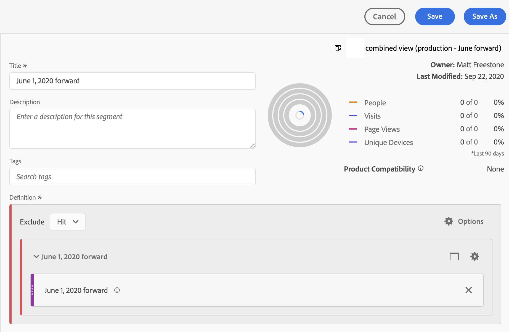

# VRSを特定の日付に制限する

ステッチをオンにすると、特定の日付のステッチ開始が表示されます。 その日付が6月1日だと仮定します。 CDA VRSには、6月1日より前に未関連付けデータが含まれます。 6月1日より前のVRSのデータはすべて非表示にして、分析がステッチ開始後に日付範囲に集中できるようにします。

VRSデータを特定の日付に制限するには、次の手順を実行します。

## 手順1:日周期の日付範囲を持つVRSの作成

VRSを設定する場合は、「Components」の下で、固定開始の日付範囲を日周期的な日付範囲で追加します。 固定開始は、ステッチが開始された日にする必要があります。

## 手順2:「除外する」セグメントの作成

次に、別の除外コンテナ内の除外コンテナに日付範囲を配置するヒットセグメントを作成します。 これは「除外する」です。

「除外する」の理由は、日付範囲がレポートの日付範囲を上書きすることを目的としていることです。 したがって、6月1日を先送りにすると、レポートの日付範囲は常に6月1日から先送りになります。 これは望ましくない結果につながる。 「除外する」場合、この動作は上書きされ、描画元のデータが適切な日付範囲に制限されます。

## 手順3:このセグメントをCDA VRSに適用します。

## 手順4:結果をレポートで確認する

レポートは、ステッチが最初に実施された日と同じ日に、目的の日付に開始します。

