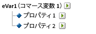
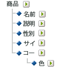

# 下位分類について

Adobe Analytics では、単一レベルの分類モデルと複数レベルの分類レベルの両方をサポートしています。分類階層を使用すると、分類に対して分類を適用できます。

>[!NOTE]
>
>下位分類は、分類をさらに分類する機能です。ただし、[!UICONTROL 階層レポート]の作成に使用する[!UICONTROL 分類階層]と同じものではありません。分類階層の詳細については、「[分類階層](/help/admin/admin/conversion-var-admin/classification-hierarchies.md)」を参照してください。

次に例を示します。

このモデルの分類はそれぞれ独立しており、選択したレポート変数の新しいサブレポートに対応しています。さらに、データファイルでは、各分類が 1 つのデータ列を構成しており、列見出しに分類名が付けられます。次に例を示します。

| キー | プロパティ 1 | プロパティ 2 |
|---|---|---|
| 123 | ABC | A12B |
| 456 | DEF | C3D4 |

データファイルについて詳しくは、[分類データファイル](/help/components/classifications/importer/c-saint-data-files.md)を参照してください。

複数レベルの分類は、親の分類と子の分類から構成されます。次に例を示します。

**親の分類：**&#x200B;子の分類が関連付けられている分類は、すべて親の分類となります。分類は、親の分類にも子の分類にも指定できます。最上位レベルの親の分類は、単一レベルの分類に相当します。

**子の分類：**&#x200B;変数ではなく別の分類を親として持つ分類は、すべて子の分類になります。子の分類は、親の分類についての追加情報を示します。例えば、[!UICONTROL キャンペーン]分類はキャンペーン所有者という子の分類を持つ場合があります。[!UICONTROL 数値]の分類は、分類レポートで指標としても機能します。

各分類は、親の場合も子の場合も、データファイルで 1 つのデータ列を構成します。子の分類の列見出しには、次の名前形式が使用されます。

`<parent_name>^<child_name>`

データファイルの形式について詳しくは、[分類データファイル](/help/components/classifications/importer/c-saint-data-files.md)を参照してください。

次に例を示します。

| キー | プロパティ 1 | プロパティ 1^プロパティ 1-1 | プロパティ 1^プロパティ 1-2 | プロパティ 2 |
|---|---|---|---|---|
| 123 | ABC | グリーン | 小 | A12B |
| 456 | DEF | 赤 | 大 | C3D4 |

複数レベルの分類用のファイルテンプレートはより複雑ですが、複数レベルの分類には、異なるレベルをそれぞれ別のファイルとしてアップロードできるという強力な利点があります。この方法を使用すると、データを時間の経過につれて変化するものと、変化しないものという分類レベルにグループ分けすることにより、定期的に（毎日、毎週など）アップロードする必要のあるデータの量を最小限に抑えることができます。

>[!NOTE]
>
>データファイルの[!UICONTROL キー]列が空白の場合、データ行ごとに一意のキーが自動生成されます。第 2 レベル以上の分類データを使用してデータファイルをアップロードする場合のファイルの破損を防ぐために、[!UICONTROL キー]列の各行にアスタリスク（*）を入力してください。

## 例

>[!NOTE]
>
>製品分類データは、製品に直接関係するデータ属性に制限されます。データは、Web サイトでの製品の分類方法や販売方法に制限されません。販売カテゴリ、サイト閲覧ノード、または販売項目などのデータ要素は製品分類データではありません。これらの要素は、レポートのコンバージョン変数によってキャプチャされます。

この製品分類のデータファイルをアップロードするとき、分類データを単一のファイルまたは複数のファイルとしてアップロードできます（以下を参照してください）。色コードをファイル 1 に、色名をファイル 2 に分けると、色名データ（数行のみの可能性があります）の更新は、新しい色コードが作成された場合にのみ必要となります。したがって、頻繁に更新するファイル 1 から色名（CODE^COLOR）フィールドが排除され、データファイルを生成するときのファイルサイズと複雑さを軽減することができます。

### 製品の分類 - 単一ファイル {#section_E8C5E031869C449F9B636F5EB3BFEC17}

| キー | 製品名 | 製品の詳細 | 性別 | サイズ | コード | コード^色 |
|---|---|---|---|---|---|---|
| 410390013 | Polo-SS | メンズポロシャツ、半袖（M、01） | M | M | 01 | グレー |
| 410390014 | Polo-SS | メンズポロシャツ、半袖（L、03） | M | L | 03 | アクアマリン |
| 410390015 | Polo-LS | レディースポロシャツ、長袖（S、23） | F | S | 23 | 水色 |

### 製品の分類 - 複数ファイル（ファイル 1）  {#section_A99F7D0F145540069BA4EEC0597FF13F}

| キー | 製品名 | 製品の詳細 | 性別 | サイズ | コード |
|---|---|---|---|---|---|
| 410390013 | Polo-SS | メンズポロシャツ、半袖（M、01） | M | M | 01 |
| 410390014 | Polo-SS | メンズポロシャツ、半袖（L、03） | M | L | 03 |
| 410390015 | Polo-LS | レディースポロシャツ、長袖（S、23） | F | S | 23 |

### 製品の分類 - 複数ファイル（ファイル 2）  {#section_19ED95C33B174A9687E81714568D56A3}

| キー | コード | コード^色 |
|---|---|---|
| * | 01 | グレー |
| * | 03 | アクアマリン |
| * | 23 | 水色 |
