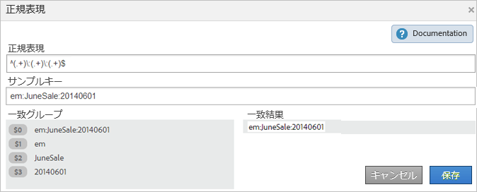
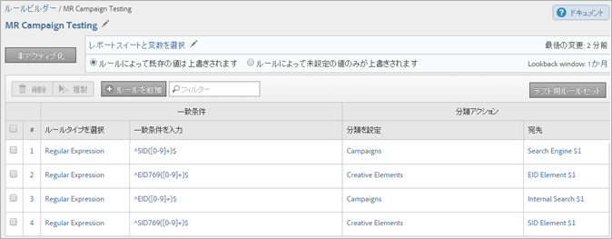

# 分類ルール（レガシー）

{{classification-rulebuilder-deprecation}}

分類ルールは、定期的に未分類の用語を検索します。 ルールの一致が見つかった場合、ルールは分類データテーブルに自動的に用語を追加します。 また、分類ルールを使用して、既存のキーを上書きすることもできます。

**[!UICONTROL Analytics]**／**[!UICONTROL 管理者]**／**[!UICONTROL 分類ルールビルダー]**

ルールビルダーを使用すると、*分類ルールセット*&#x200B;を作成できます。これは、*分類ルール*&#x200B;のリストです。ルールが指定した条件に一致すると、アクションが実行されます。

分類ルールは、次の場合に便利です。

* **メール** および **ディスプレイ広告**： メールキャンペーンに対するディスプレイ広告キャンペーンのパフォーマンスを確認できるように、個々のディスプレイ広告キャンペーンをグループ化する分類ルールを作成します。

* **トラッキングコード**：トラッキングコードの文字列から派生したキー値を分類し、定義した特定の条件に一致させる分類ルールを作成します。
* **検索用語**: [&#x200B; 正規表現 &#x200B;](/help/components/classifications/crb/classification-quickstart-rules.md) とワイルドカードを使用して、検索用語の分類を簡略化します。 例えば、検索語に *`baseball`* が含まれる場合、*`Sports League`* 分類を「*`MLB`*」に設定できます。

例えば、メールキャンペーン ID が次のトラッキングコードを持つとします。

`em:Summer:20XX:Sale` を参照してください。

ここで、文字列の一部を識別する 3 つのルールをルールセットに設定し、値を分類することができます。

| ルールタイプを選択 | 一致条件を入力 | 分類を設定 | 設定値 |
|---|---|---|---|
| 次の語句で始まる | em: | チャネル | 電子メール |
| 次の語句で終わる | 販売 | タイプ | 販売 |
| 次を含む | 20XX | 年 | 20XX |

## ルールの処理方法 {#how-rules-are-processed}

分類ルールの処理方法に関する重要な情報。

<!-- 

about_classification_rules.xml

 -->

* [&#x200B; 重要な規則等 &#x200B;](/help/components/classifications/crb/classification-rule-builder.md)
* [&#x200B; ルールでキーが分類されないのはどのような場合ですか？](/help/components/classifications/crb/classification-rule-builder.md)
* [ルールの優先度について](/help/components/classifications/crb/classification-quickstart-rules.md)

>[!NOTE]
>
>[!UICONTROL ルールビルダー]は数値 2 分類をサポートしていません。

## ルールに関する重要な情報

* **正規表現**：[分類ルールの正規表現](/help/components/classifications/crb/classification-quickstart-rules.md)でヘルプを利用できます。

* **レポートスイート**：少なくとも 1 つのレポートスイートが選択されるまで、分類を選択できません。 ルールセットを作成して変数を割り当てるまで、レポートスイートを適用できません。

  ルールセットをテストする場合、レポートのキー（分類される変数）を使用して、ルールセットによってどの程度影響を受けるかを確認します。 （[&#x200B; キー &#x200B;](/help/components/classifications/importer/c-saint-data-files.md) は、分類されている変数または分類アップロードテーブルの最初の列です。）

* **ルールの優先度**：キーが同じ分類を設定した複数のルール（「[!UICONTROL &#x200B; 分類を設定 &#x200B;]」列内）と一致する場合、分類に一致した最後のルールが使用されます。 [&#x200B; ルール優先度について &#x200B;](/help/components/classifications/crb/classification-quickstart-rules.md) を参照してください。

* **ルール数の制限**：作成できるルール数に設定された制限はありません。 ただし、多数のルールがブラウザーのパフォーマンスに影響を与える可能性があります。
* **処理**：ルールは、分類関連のトラフィックの量に応じて、頻繁に処理されます。

  アクティブなルールは 4 時間ごとに処理され、通常 1 か月前の分類データが調査されます。 ルールにより、新しい値が自動的にチェックされ、インポーターを使用して分類がアップロードされます。

* **既存の分類の上書き**：詳しくは、[ルールによるキーの分類が行われない状況を参照してください。](/help/components/classifications/crb/classification-quickstart-rules.md)必要に応じて、インポーターを使用して既存の分類を削除できます。

## ルールでキーが分類されないのはどのような場合ですか？

ルールをアクティブ化すると、既存の分類を上書きできます。 次の状況では、次の場合、分類ルールは [key](/help/components/classifications/importer/c-saint-data-files.md) （変数）を分類しません。

* キーは既に分類済みで、「分類を上書き [&#x200B; を選択していません &#x200B;](/help/components/classifications/crb/classification-rule-definitions.md)。

  ルールを [&#x200B; 追加してアクティブ化 &#x200B;](/help/components/classifications/crb/classification-quickstart-rules.md) するとき、および Data Connectors 統合をアクティブ化する際に、分類を上書きできます。 （データコネクタの場合、ルールは開発センターでパートナーによって作成され、[!UICONTROL 分類ルールビルダー]に表示されます）。

* [&#x200B; 分類を上書き &#x200B;](/help/components/classifications/crb/classification-rule-definitions.md) を有効にした後でも、キーを上書きするときに指定した時間枠以降に、分類されたキーがデータに表示されない。
* キーが分類されず、約 1 ヶ月前から始まる時間枠が経過した後もキーが [!DNL Adobe Analytics] に渡されない。

  >[!NOTE]
  >
  >レポートでは、分類は、キーが存在するかどうかに関係なく、指定されたすべての時間枠に適用されます。レポートの日付範囲はレポートに影響しません。


## 分類ルールの正規表現 {#regex-in-classification-rules}

正規表現を使用して、一貫性のある形式の文字列値を分類に一致させます。 例えば、トラッキングコードの特定の文字から分類を作成できます。特定の文字、単語、文字のパターンに一致させることができます。

>[!NOTE]
>
>ベストプラクティスとして、正規表現は、区切り文字を使用するトラッキングコードに最も適しています。

## 正規表現 - トラッキングコードの例 {#section_2EF7951398EB4C2F8E52CEFAB4032669}

>[!NOTE]
>
>トラッキングコードが URL エンコードされている場合、ルールビルダーによって分類され **せん**。

この例では、次のキャンペーン ID を分類することを前提とします。

サンプル キー：`em:JuneSale:20XX0601`

分類するトラッキングコードの一部：

* `em` = 電子メール
* `JuneSale` = キャンペーン名
* `20XX0601` = 日付

正規表現：`^(.+)\:(.+)\:(.+)$`

正規表現とキャンペーン ID との相関関係：


一致グループ：キャンペーン ID の位置を分類できるように、正規表現がキャンペーン ID の文字にどのように対応するかを表示します。



この例が示しているルールでは、キャンペーンの日付 `20XX0601` は `$3` で識別された 3 番目のグループ `(.+)` にあります。

**[!UICONTROL ルールビルダー]**

[!UICONTROL ルールビルダー]で、次のようにルールを設定します。

| ルールタイプを選択 | 一致条件を入力 | 分類を設定 | 設定値 |
|---|---|---|---|
| 正規表現 | &Hat;(.+）\:（.+）\:（.+）$ | キャンペーン日 | $3 |

**構文**

| 正規表現 | 文字列または一致の結果 | 対応する一致グループ |
|--- |--- |--- |
| `^(.+)\:(.+)\:(.+)$` | `em:JuneSale:20XX0601` | `$0`: `em:JuneSale:20XX0601` `$1`: em `$2`: JuneSale `$3`: 20XX0601 |
| 構文の構築 | `^`= 行の先頭 () = 文字をグループ化し、括弧内の一致する文字を抽出します。`(.+)` = 1 ( .) 文字と ( + ) 任意の  \ = 文字列の先頭。`$` = 前の文字（または文字グループ）が行の末尾であることを示しています。 | |

正規表現の文字が何を意味しているかについては、 [正規表現 - 参照表](/help/components/classifications/crb/classification-quickstart-rules.md) を参照してください。

## 正規表現 – 特定の文字の分類 {#section_5D300C03FA484BADACBFCA983E738ACF}

正規表現を使用する 1 つの方法は、文字列の特定の文字を分類することです。 例えば、次のトラッキングコードに 2 つの重要な文字が含まれているとします。

サンプル キー：`4s3234`

* `4` = ブランド名
* `s` = Google などの検索エンジンを識別する


**[!UICONTROL ルールビルダー]**

[!UICONTROL ルールビルダー]で、次のようにルールを設定します。

| ルールタイプを選択 | 一致条件を入力 | 分類を設定 | 設定値 |
|--- |--- |--- |--- |
| 正規表現 | `^.(s).*$` | ブランドおよびエンジン | `$0`（ブランド名および検索エンジンの最初の 2 文字をキャプチャします。） |
| 正規表現 | `^.(s).*$` | 検索エンジン | `$1`（Google の 2 番目の文字をキャプチャします。） |

## 正規表現 - 様々な長さのトラッキングコードの一致 {#section_E86F5BF5C2F44ABC8FFCE3EA67EE3BB2}

この例では、様々な長さのトラッキングコードがある場合に、コロン区切り記号間の特定の文字を識別する方法を示します。 Adobeでは、トラッキングコードごとに 1 つの正規表現を使用することをお勧めします。

サンプルキー：

* `a:b`
* `a:b:c`
* `a:b:c:d`

**構文**


**[!UICONTROL ルールビルダー]**

[!UICONTROL ルールビルダー]で、次のようにルールを設定します。

| ルールタイプを選択 | 一致条件を入力 | 分類を設定 | 設定値 |
|--- |--- |--- |--- |
| 一致文字列 `a:b` の正規表現 | `^([^\:]+)\:([^\:]+)$` | a | `$1` |
| 一致文字列 `a:b` の正規表現 | `^([^\:]+)\:([^\:]+)$` | b | `$2` |
| 一致文字列 `a:b:c` の正規表現 | `^([^\:]+)\:([^\:]+)\:([^\:]+)$` | a | `$1` |
| 一致文字列 `a:b:c` の正規表現 | `^([^\:]+)\:([^\:]+)\:([^\:]+)$` | b | `$2` |
| 一致文字列 `a:b:c` の正規表現 | `^([^\:]+)\:([^\:]+)\:([^\:]+)$` | c | `$3` |
| 一致文字列 `a:b:c:d` の正規表現 | `^([^\:]+)\:([^\:]+)\:([^\:]+)\:([^\:])$` | d | `$4` |

## 正規表現 - 「含まない」の例 {#section_FCA88A612A4E4B099458E3EF7B60B59C}

この例では、特定の文字を含まないすべての文字列を一致させる正規表現を提供します。ここでは `13` です。

正規表現：

`^(?!.*13.*).*$`

テスト文字列：

```
a:b:
a:b:1313
c:d:xoxo
c:d:yoyo
```

一致する結果：

```
a:b:
c:d:xoxo
c:d:yoyo
```

この例では、`a:b:1313` は一致を示していません。

## 正規表現 - 参照テーブル {#section_0211DCB1760042099CCD3ED7A665D716}

| 式 | 説明 |
|---|---|
| `(?ms)` | 正規表現全体を複数行の入力と照合し、任意の改行文字に一致するワイルドカード |
| （`?i`） | 正規表現全体で大文字と小文字を区別しないようにする |
| [`abc`] | a、b または c の 1 文字 |
| [`^abc`] | a、b、c 以外の 1 文字 |
| [`a-z`] | a ～ z の範囲内の 1 文字 |
| [`a-zA-Z`] | a ～ z または A ～ Z の範囲内の 1 文字 |
| `^` | 行の開始（行の開始に一致） |
| `$` | 行の末尾（または末尾の新しい行の前に一致） |
| `\A` | 文字列の開始 |
| `\z` | 文字列の末尾 |
| `.` | 任意の文字の一致（改行を除く） |
| `\s` | 空白文字 |
| `\S` | 空白以外の文字 |
| `\d` | 数字 |
| `\D` | 数字以外 |
| `\w` | 任意の単語（文字、数字、アンダースコア） |
| `\W` | 任意の単語以外の文字 |
| `\b` | 任意の単語境界 |
| `(...)` | 囲まれている内容をすべてキャプチャ |
| `(a\b)` | a または b |
| `a?` | 0 または 1 個の a |
| `a*` | 0 個以上の a |
| `a+` | 1 つ以上の a |
| `a{3}` | 3 個の a |
| `a{3,}` | 3 個以上の a |
| `a{3,6}` | 3 ～ 6 個の a |

正規表現の有効性のテストに関する参考資料については、 [https://rubular.com/](https://rubular.com/) を参照してください。

## ルールの優先度について

キーが複数のルールと一致し、[!UICONTROL &#x200B; 分類の設定 &#x200B;] 列に表示されているのと同じ分類列を設定する場合は、最後のルールが使用されます。 したがって、ルールセット内で最も重要な最後の項目をランク付けすることができます。

<!-- 

rule_priority.xml

 -->

同じ分類を共有しない複数のルールを作成する場合、処理順序は関係ありません。

アスリートの検索タイプを分類する検索語句ルールの例に続くもの：

| ルール番号 | ルールタイプ | 次に一致 | 分類を設定 | 設定値 |
|---|---|---|---|---|
| 1 | 次を含む | カウボーイ | 検索タイプ | チーム |
| 2 | 次を含む | ファンタジー | 検索タイプ | ファンタジー |
| 3 | 次を含む | ロモ | 検索タイプ | プレイヤー |

ユーザーが *`Cowboys fantasy Tony Romo`* を検索すると、「分類を設定」列に表示される最後の指定された分類に一致するので、*`Player`* という用語が分類されます。

同様に、次の検索語句に対して 2 つのルールをセットで設定したとします。

| ルール番号 | ルールタイプ | 次に一致 | 分類を設定 | 設定値 |
|---|---|---|---|---|
| 1 | 次を含む | カウボーイ | 市区町村 | ダラス |
| 2 | 次を含む | ブロンコス | 市区町村 | デンバー |

ユーザーが *`Cowboys vs. Broncos`* を検索します。 ルールビルダーがルールマッチングで競合を検出した場合、2 番目のルールの分類（Denver）がこの検索に適用されます。

## ルール設定に対する分類ルールの追加 {#add-classification-to-rule-set}

<!-- 

t_classification_rule.xml

 -->

分類に条件を対応させることによってルールを追加し、そのアクションを指定します。

>[!NOTE]
>
>この手順では、ルールを 1 つ以上のレポートスイートに適用する必要があります。ルールセットあたりのルールの推奨数は 500 ～ 1000 ですが、制限はありません。 ルールが 100 を超える場合は、[&#x200B; 下位分類 &#x200B;](/help/components/classifications/importer/subclassifications.md) を使用してルールセットを簡素化することを検討してください。

分類ルールを追加または編集するには：

1. [分類ルールセットを作成します](/help/components/classifications/crb/classification-rule-set.md)。
1. ルールセットページで、「**[!UICONTROL ルールを追加]**」をクリックします。

   

1. **[!UICONTROL レポートスイート]**&#x200B;の隣の&#x200B;**[!UICONTROL スイートの追加]**&#x200B;をクリックし、このルールセットに割り当てるレポートスイートを指定します。

   **[!UICONTROL レポートスイートを選択]**&#x200B;ページが表示されます。

   >[!NOTE]
   >
   >レポートスイートは、次の条件を満たした場合&#x200B;*のみ*、このページに表示されます。
   >
   >* レポートスイートに、[!UICONTROL 管理ツール]でその変数に対して定義された分類が 1 つ以上あるとき。
   >
   >   （この前提条件については、 [&#x200B; 分類ルールセット](/help/components/classifications/crb/classification-rule-set.md) の *変数* を参照してください。）
   >
   >* **[!UICONTROL 使用可能なレポートスイート]**&#x200B;ページでレポートスイートを選択しました。このページは、[ルールセットの追加](/help/components/classifications/crb/classification-rule-set.md)をクリックしてルールセットを作成した後に表示されます。

1. 既存の値を上書きするかどうかを指定します。

   | **ルールは既存の値を上書き** | （デフォルト設定）常に、インポーター（SAINT）を介してアップロードされた分類を含む、既存の分類キーを上書きします。 |
   |---|---|
   | **ルールは未設定の値のみを上書き** | 空白の（未設定の）セルにのみ入力します。 既存の分類は変更されません。 |

1. [ルールを定義します](/help/components/classifications/crb/classification-rule-definitions.md#section_4A5BF384EEEE4994B6DC888339833529)。

   

   ルールの作成例については、「[分類ルールビルダー](/help/components/classifications/crb/classification-rule-builder.md)」および「[分類ルールの正規表現](/help/components/classifications/crb/classification-quickstart-rules.md)」を参照してください。

   >[!NOTE]
   >
   >（分類を設定列で）同じ分類が設定されているルールが複数あり、それにキーが合致した場合には、分類に合致した最後のルールが使用されます。ルールの並べ替えの詳細については、 **ルールの優先度について** を参照してください。

1. [ルールセットをテストします](/help/components/classifications/crb/classification-quickstart-rules.md)。
1. テストが完了したら、**[!UICONTROL アクティブ]**&#x200B;をクリックしてルールを検証およびアクティブ化します。

   ルールをアクティブ化すると、自動的にファイルが構築され、アップロードされます。

   フィールド定義：このページのインターフェイスオプションの完全な定義については、 [分類ルールビルダー](/help/components/classifications/crb/classification-rule-definitions.md) を参照してください。

## 分類ルールセットのテスト

<!-- 

t_classifications_test_rule.xml

 -->

分類ルールまたはルールセットをテストできます。テストを実行すると、セット内のすべてのルールがチェックされます。

分類ルールセットをテストするには：

1. [分類ルールセットを作成します](/help/components/classifications/crb/classification-rule-set.md)。
1. [!UICONTROL 分類ルールビルダー]で、ルールセット名をクリックします。
1. ルールセットがレポートスイートに関連付けられていることを確認します。
1. ルールエディターで「**[!UICONTROL テスト用ルールセット]**」をクリックします。

   

1. 「[!UICONTROL サンプルキー]」フィールドにテストキーを入力するか、貼り付けます。

   サンプルキーは次のとおりです。

   * トラッキングコード
   * キーワードまたはフレーズを検索

   正規表現のテストについて詳しくは、[&#x200B; 分類ルールの正規表現 &#x200B;](/help/components/classifications/crb/classification-quickstart-rules.md) を参照してください。
1. 「**[!UICONTROL テストを実行]**」をクリックします。

   「[!UICONTROL 結果]」テーブルに一致するルールが表示されます。
1. （任意）ルールをアクティブにする場合、また既存の分類を上書きする場合は、「**[!UICONTROL アクティブ化]**」をクリックします。

   ルールを使用して既存の分類を上書きする方法の詳細を参照してください。

## 分類ルールの検証とアクティブ化

<!-- 

t_validate_rules.xml

 -->

分類ルールを検証してアクティブ化するには：

1. [分類ルールセットを作成](/help/components/classifications/crb/classification-rule-set.md)してから、セットに[分類ルールを追加](/help/components/classifications/crb/classification-quickstart-rules.md)します。
1. ルールエディターで「**[!UICONTROL アクティブ化]**」をクリックします。

   

1. （任意）分類を上書きするには、「**[!UICONTROL 次の分類を上書き]**：&lt;*選択*>」を有効にします。

   このオプションを使用すると、影響を受けるキーの既存の分類を上書きできます。

   このオプションの定義については、 [ルールページ](/help/components/classifications/crb/classification-rule-definitions.md#section_4A5BF384EEEE4994B6DC888339833529) を参照してください。
