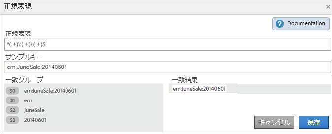

# 分類ルール - 定義

分類ルールビルダーのページ上のインターフェイスエレメントの定義です。

## ルールページ {#section_4A5BF384EEEE4994B6DC888339833529}

このページには、ルールセットに含まれるルールが表示されます。

**定義**

<table id="table_2B3A8BB7BDE14836ACA6A1D444B011CD"> 
 <thead> 
  <tr> 
   <th colname="col1" class="entry"> 要素 </th> 
   <th colname="col2" class="entry"> 説明 </th> 
  </tr> 
 </thead>
 <tbody> 
  <tr> 
   <td colname="col1"> 
レポートスイートと変数の選択 
 </td> 
   <td colname="col2"> 
<b>レポートスイート</b> 
 
ルールセットを適用するレポートスイート。 
 
<b>変数</b> 
 
分類ルールセットを作成するときは、変数を 1 つだけ適用できます。1 つの変数に対して複数のルールセットを作成するには、それぞれのルールセットを複数のレポートスイートに適用する必要があります。 
 
注意：レポートスイートでは、アクセス権のある変数のみを使用できます。変数は、その変数に対して 1 つ以上の分類が定義されている場合にのみ新しいルールセットパネルに表示されます。 
 
 変数の分類を作成するには、管理者／レポートスイート／トラフィック／トラフィック分類（またはコンバージョン／コンバージョンの分類）を使用します。次に、変数を選択し、「分類の追加」をクリックします。 
 
管理ヘルプの<a href="https://docs.adobe.com/content/help/ja-JP/analytics/admin/admin-tools/traffic-variables/traffic-classifications.html"  >トラフィック分類</a>および<a href="https://docs.adobe.com/content/help/ja-JP/analytics/admin/admin-tools/conversion-variables/conversion-classifications.html"  >コンバージョンの分類</a>を参照してください。 
 </td> 
  </tr> 
  <tr> 
   <td colname="col1"> 
 アクティブ化 
 </td> 
   <td colname="col2"> 
ルールを検証し、アクティブ化します。アクティブなルールは毎日処理され、通常、分類データの調査は月に 1 回行われます。ルールでは、自動的に新しい値がチェックされ、分類がアップロードされます。 
 </td> 
  </tr> 
  <tr> 
   <td colname="col1"> 
 非アクティブ化 
 </td> 
   <td colname="col2"> 
ルールを編集およびテストできるように非アクティブ化します。 
 </td> 
  </tr> 
  <tr> 
   <td colname="col1"> 
レポートスイートと変数を設定 
 </td> 
   <td colname="col2"> 
利用可能なレポートスイートが表示されます。このページでは、利用可能なレポートスイートから、すべてのルールセットで使用する 1 つ以上のレポートスイートを選択できます（このページは、分類ルールビルダーを最初に実行したときにも表示されます）。 
 
この機能は、非常に多くの利用可能なレポートスイートが存在する場合に、レポートスイートのロード時間を短縮するのに役立ちます。 
 
ここで選択したレポートスイートは、ルールの作成時に「スイートを追加」をクリックすると、ルールレベルで利用できるようになります。 
 
レポートスイートは、管理ツールで、変数に対して定義された分類がレポートスイートに 1 つ以上ある場合にのみ使用可能になります。 
（この前提条件については、<a href="/help/components/classifications/crb/classification-rule-set.md"  >分類ルールセット</a>の変数を参照してください。） 
 
 </td> 
  </tr> 
  <tr> 
   <td colname="col1"> 
ルールによって既存の値は上書きされます 
 </td> 
   <td colname="col2"> 
 （デフォルト設定）インポーター（SAINT）を使用してアップロードされた分類を含む、既存の分類キーを常に上書きします。 
 </td> 
  </tr> 
  <tr> 
   <td colname="col1"> 
ルールによって未設定の値のみが上書きされます 
 </td> 
   <td colname="col2"> 
空欄（未設定）のセルにのみ記入します。既存の分類は、変更されません。 
 </td> 
  </tr> 
  <tr> 
   <td colname="col1"> 
ルックバックウィンドウ 
 </td> 
   <td colname="col2"> 
ルールをアクティブ化および検証する場合、そのルールの影響を受けるキーの既存の分類を上書きするかどうかを指定できます（指定した期間内に Adobe Analytics に渡された分類されたキーのみが影響を受けます）。 
 
ルックバックウィンドウを指定しなかった場合、（今日がその月の何日かによって異なりますが）およそ 1 ヶ月の間、過去のルールが参照されます。このオプションを有効にしなければ、既存の分類が上書きされることはありません。 
 
<b>開発センター</b>：パートナーは、開発センターで分類ルールを作成できます。これらのルールは、顧客が統合をアクティブ化すると表示されます。開発センターで「以降を上書き」オプションを使用すると、パートナーは、顧客が統合をアクティブ化または編集するときに上書き値を決定できるかどうかを指定できます。 
 
ルール処理について詳しくは、<a href="/help/components/classifications/crb/classification-quickstart-rules.md"  >ルールの処理方法</a>を参照してください。 
 </td> 
  </tr> 
  <tr> 
   <td colname="col1"> <a href="/help/components/classifications/crb/classification-quickstart-rules.md"  >ルールを追加</a> </td> 
   <td colname="col2"> 
ルールをルールセットに追加します。 
 
注意：1 つの値がルールセット内で複数回一致する場合は、最後のルールを使用して値が分類されます。 
 </td> 
  </tr> 
  <tr> 
   <td colname="col1"> ドラフト </td> 
   <td colname="col2"> ルールがドラフトモードであることを指定します。ドラフトステータスでは、ルールを実行する前にテストできます。 </td> 
  </tr> 
  <tr> 
   <td colname="col1"> 複製 </td> 
   <td colname="col2"> ルールセットを別の変数や異なるレポートスイートの同じ変数に適用できるように、ルールセットを複製（コピー）します。 </td> 
  </tr> 
  <tr> 
   <td colname="col1"> 
 <a href="/help/components/classifications/crb/classification-quickstart-rules.md"  > テスト用ルールセット </a> 
 </td> 
   <td colname="col2"> 
ルールセットの正当性をテストします。 
 </td> 
  </tr> 
  <tr> 
   <td colname="col1"> 一致条件 </td> 
   <td colname="col2"> ルールの条件を指定します。 </td> 
  </tr> 
  <tr> 
   <td colname="col1"> 分類アクション </td> 
   <td colname="col2"> 
一致条件が発生したときに実行するアクションを指定します。 
 
例えば、キャンペーン名を $2 に設定します。これは、トラッキングコードの位置 2 をキャンペーン名として識別するものです。 
 </td> 
  </tr> 
  <tr> 
   <td colname="col1"> # </td> 
   <td colname="col2"> 
ルール番号。 
 
詳しくは、<a href="/help/components/classifications/crb/classification-quickstart-rules.md"  >ルールの処理方法</a>を参照してください。 
 </td> 
  </tr> 
  <tr> 
   <td colname="col1"> ルールタイプを選択 </td> 
   <td colname="col2"> 
それぞれのルールセットを特定の変数に適用します。有効な選択肢は次のとおりです。 
 
    <ul id="ul_6A8E06BB4AF2402B99C215823CB3D59D"> 
     <li id="li_5C702D4F460841D38A59621A5161A3BC">次の語句で始まる </li> 
     <li id="li_8052A741D9F34A2FBC136C181600193E">次の語句で終わる </li> 
     <li id="li_D0FA6EA4F09644FFBC9E6BC568BE80AC">次を含む </li> 
     <li id="li_48675FE5253942ED887C6A72D1DCEF54"> <a href="/help/components/classifications/crb/classification-quickstart-rules.md"  >正規表現</a> </li> 
    </ul> </td> 
  </tr> 
  <tr> 
   <td colname="col1"> 一致条件を入力 </td> 
   <td colname="col2"> キー内で検索するテキストパターン。これらの条件には、検索用語、文字または正規表現を指定できます。 </td> 
  </tr> 
  <tr> 
   <td colname="col1"> 分類を設定 </td> 
   <td colname="col2"> 一致条件が満たされた場合に設定する分類列。 </td> 
  </tr> 
  <tr> 
   <td colname="col1"> 設定値 </td> 
   <td colname="col2"> 一致条件が満たされた場合に選択した分類列に指定する値。 </td> 
  </tr> 
  <tr> 
   <td colname="col1"> フィルター </td> 
   <td colname="col2"> ルールを検索します。 </td> 
  </tr> 
 </tbody> 
</table>

## 正規表現ページ {#section_C932A5469E774841B2229965A154163C}

[!UICONTROL 正規表現]ページでは、正規表現を編集できます。

**定義**

| 要素 | 説明 |
|---|---|
| サンプルキー | 使用するテスト文字列。例えば、トラッキングコードの特定の文字から分類を作成できます。特定の文字、単語または文字パターンを一致させることができます。 |
| 一致グループ | キャンペーン ID 内の位置を分類できるように、正規表現がどのようにキャンペーン ID 文字に一致するかを示します。 |
| 一致結果 | 正規表現に一致する文字列の部分を表示します。 |

詳しくは、[分類ルールの正規表現](/help/components/classifications/crb/classification-quickstart-rules.md)を参照してください。

## テストページ {#section_EC926F97901C4E65901413F9683AA70A}

このページでは、セットに含まれるルールをテストできます。

**定義**

| 要素 | 説明 |
|---|---|
| テストを実行 | ルールセットをテストするときは、レポートのキーを使用して、ルールセットによる影響を確認します。 |
| フィルター | 「[!UICONTROL 結果]」パネルの値をフィルターします。 |

