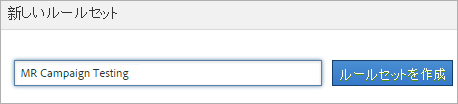
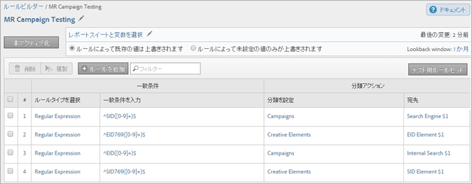

# 分類ルールセット

ルールセットは、特定の変数の分類ルールのグループです。変数をルールセットに適用します。1 つの変数に対して複数のルールセットを作成するには、それぞれのルールセットを複数のレポートスイートに適用する必要があります。

## 分類ルールビルダーページ {#section_C60B0888C76D49C596EF19F11808B718}

**[!UICONTROL Analytics]**／**[!UICONTROL 管理者]**／**[!UICONTROL 分類ルールビルダー]**

[!UICONTROL 分類ルールビルダー]には、次のフィールドとオプションがあります。

<table id="table_A5D92409969747E39E041216A5AA32CD"> 
 <thead> 
  <tr> 
   <th colname="col1" class="entry"> 要素 </th> 
   <th colname="col2" class="entry"> 説明 </th> 
  </tr> 
 </thead>
 <tbody> 
  <tr> 
   <td colname="col1"> 
<a href="/help/components/classifications/crb/classification-rule-set.md"  >ルールセットを追加</a>      
 </td> 
   <td colname="col2"> 
ルールセットを作成します。 
 </td> 
  </tr> 
  <tr> 
   <td colname="col1"> 
ルール 
 </td> 
   <td colname="col2"> セットに含まれるルールの数を表示します。 </td> 
  </tr> 
  <tr> 
   <td colname="col1"> 
ステータス 
 </td> 
   <td colname="col2"> ルールセットのアクティビティステータス（ドラフト、アクティブなど）を表示します。アクティブなルールは毎日処理され、通常、分類データの調査は月に 1 回行われます。ルールでは、自動的に新しい値がチェックされ、分類がアップロードされます。 </td> 
  </tr> 
  <tr> 
   <td colname="col1"> 
最後の変更 
 </td> 
   <td colname="col2"> ルールセットがいつ編集されたかを示します。 </td> 
  </tr> 
  <tr> 
   <td colname="col1"> 
複製 
 </td> 
   <td colname="col2"> ルールセットを別の変数や異なるレポートスイートの同じ変数に適用できるように、ルールセットを複製（コピー）します。 </td> 
  </tr> 
 </tbody> 
</table>

## 分類ルールセットの作成 {#create-classification-rule-set}

分類ルールセットに名前を付け、変数を適用して、上書き設定を指定します。

1. （前提条件）**[!UICONTROL 管理者]**／**[!UICONTROL レポートスイート]**&#x200B;で、分類構造を定義します。

   （分類の追加については、管理ツールのヘルプの[分類](https://docs.adobe.com/content/help/ja-JP/analytics/components/classifications/c-classifications.html)を参照してください。）

   変数は、その変数に対して 1 つ以上の分類が定義されている場合にのみ[!UICONTROL 新しいルールセット]パネルに表示されます。

   変数の分類を作成するには、**[!UICONTROL 管理者]**／**[!UICONTROL レポートスイート]**／**[!UICONTROL トラフィック]**／**[!UICONTROL トラフィック分類]**（または&#x200B;**[!UICONTROL コンバージョン]**／**[!UICONTROL コンバージョンの分類]**）を使用します。次に、変数を選択し、「**[!UICONTROL 分類の追加]**」をクリックします。

1. ルールセットを作成するには、**[!UICONTROL 管理者]**／**[!UICONTROL 分類ルールビルダー]**／**[!UICONTROL ルールセットを追加]**&#x200B;をクリックします。

   

1. ルールセットに名前を付けて、「**[!UICONTROL ルールセットを作成]**」をクリックします。
1. 編集するルールセットを選択します。

   

1. 「**[!UICONTROL レポートスイートと変数を選択]**」をクリックします。

   レポートスイートと変数リストには、ログインしている会社のすべてのレポートスイートで利用できるすべての分類された変数が入力されます。レポートスイート内の 1 つの変数が所属することのできるルールセットは、1 つのみです。

   詳しくは、*`Variable`*（[分類ルールビルダー](/help/components/classifications/crb/classification-rule-definitions.md)ページの定義）を参照してください。
1. 使用するレポートスイートおよび変数を指定して、「**[!UICONTROL 保存]**」をクリックします。
1. 引き続き、[分類ルールの追加](/help/components/classifications/crb/classification-rule-set.md)をおこないます。
