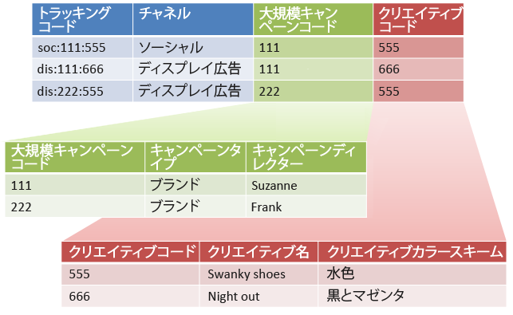
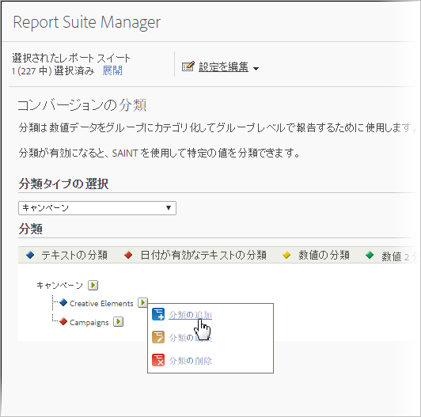

# 下位分類とルールビルダー

すべての下位分類に親値が設定されている場合は、分類ルールビルダーを副分類と組み合わせることができます。

分類ルールビルダーを下位分類と組み合わせることで、分類の管理をシンプル化し、必要なルール数を削減できます。トラッキングコードに、個別に分類したいコードが含まれているような場合に、この方法を使用できます。

下位分類の概念情報については、[下位分類](/help/components/classifications/c-sub-classifications.md)を参照してください。

## 例

以下のようなトラッキングコードがあるとします。

`channel:broad_campaign:creative`

分類階層を使用すると、分類に対して分類を適用できます（*`sub-classification`* と呼びます）。つまり、複数のテーブルが含まれるリレーショナルデータベースのようにインポーターを使用することができます。あるテーブルでトラッキングコード全体をキーにマッピングし、別のテーブルでこれらのキーをさらに別のテーブルにマッピングします。

この構造を作成したら、[分類ルールビルダー](/help/components/classifications/crb/classification-rule-builder.md)を使用して、参照テーブル（前述の画像の緑と赤のテーブル）を更新するだけの小さなファイルをアップロードできます。次に、このルールビルダーを使用して、メインの分類テーブルを最新の状態に維持できます。

以下のタスクで、この実現方法を説明します。

## ルールビルダーを使用した下位分類の設定 {#task_2D9016D8B4E84DBDAF88555E5369546F}

ルールビルダーを使用して下位分類をアップロードする方法についての手順の例を説明します。

>[!NOTE]
>
>次の手順では、「[下位分類とルールビルダー](/help/components/classifications/crb/sub-classification-rule-builder.md)」に記載された使用例を実現する方法を説明します。

1. [分類マネージャー](https://experienceleague.adobe.com/docs/analytics/components/classifications/c-classifications.html)で、分類と下位分類を作成します。

   例：

   

1. [分類ルールビルダー](/help/components/classifications/crb/classification-rule-builder.md)で、元のトラッキングコードから下位分類キーを分類します。

   この操作には、正規表現を使用します。この例では、*`Broad Campaign code`* の設定ルールで次の正規表現を使用します。

   | `#` | ルールタイプ | 次に一致 | 分類を設定 | 設定値 |
   |---|---|---|---|---|
   |  | 正規表現 | `[^\:]:([^\:]):([^\:]`) | 幅広いキャンペーンコード | `$1` |
   |  | 正規表現 | `[^\:]:([^\:]):([^\:]`) | クリエイティブコード | `$2` |

   >[!NOTE]
   >
   >この時点では、下位分類の *`Campaign Type`* および *`Campaign Director`* は入力しないでください。

1. 指定した下位分類のみを含む分類ファイルをアップロードします。

   「[複数レベルの分類](/help/components/classifications/c-sub-classifications.md)」を参照してください。

   例：

   | キー | チャネル | 幅広いキャンペーンコード | 幅広いキャンペーンコード&amp;Hat;キャンペーンタイプ | 幅広いキャンペーンコード&amp;Hat;キャンペーンディレクター | ： |
   |---|---|---|---|---|---|
   | * |  | 111 | ブランド | Suzanne |  |
   | * |  | 222 | ブランド | Frank |  |

1. 参照テーブルをメンテナンスするために、（この例のような）小さなファイルをアップロードします。

   例えば、新しい *`Broad Campaign code`* が導入されたときにこのファイルをアップロードします。このファイルは、以前に分類した値に適用されます。同様に、新しい下位分類を作成する場合は（例えば       *`Creative Theme`* を *`Creative code`* の副分類として）、分類ファイル全体ではなく、副分類ファイルのみをアップロードします。

   レポーティングでは、これらの下位分類はトップレベル分類と同様に機能します。これにより、分類の利用に必要となる管理上の負荷が軽減されます。-->
