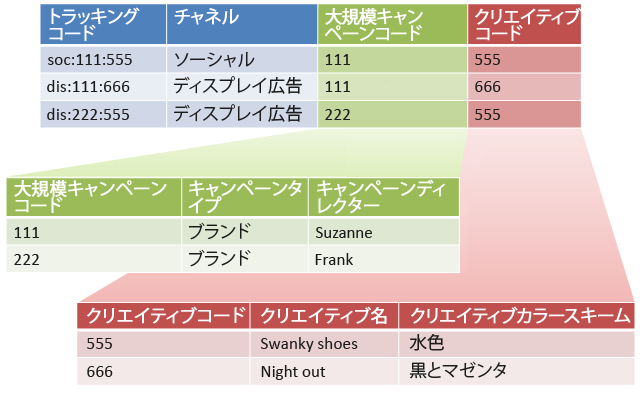

# サブ分類とルールビルダー（レガシー）

{{classification-rulebuilder-deprecation}}

すべての下位分類に親値が設定されている場合は、分類ルールビルダーを副分類と組み合わせることができます。

分類ルールビルダーを下位分類と組み合わせることで、分類の管理をシンプル化し、必要なルール数を削減できます。 トラッキングコードに、個別に分類したいコードが含まれているような場合に、この方法を使用できます。

下位分類の概念情報については、[下位分類](/help/components/classifications/importer/subclassifications.md)を参照してください。

## 例

以下のようなトラッキングコードがあるとします。

`channel:broad_campaign:creative`

分類階層を使用すると、分類に対して分類を適用できます（*`sub-classification`* と呼びます）。 つまり、複数のテーブルを持つリレーショナルデータベースのようにインポーターを使用できます。 1つのテーブルは完全なトラッキングコードをキーにマッピングし、別のテーブルはそのキーを他のテーブルにマッピングします。

この構造を配置したら、[分類ルールビルダー](/help/components/classifications/crb/classification-rule-builder.md)を使用して、ルックアップテーブル（前の画像の緑と赤のテーブル）のみを更新する小さなファイルをアップロードできます。 次に、ルールビルダーを使用して、メイン分類テーブルを最新の状態に保つことができます。

次のタスクでは、これを実現する方法について説明します。

## ルールビルダーを使用したサブ分類の設定

ルールビルダーを使用してサブ分類をアップロードする方法を説明する手順の例。

1. 分類マネージャーで分類と分類を作成します。

   例：

   

1. [分類ルールビルダー](/help/components/classifications/crb/classification-rule-builder.md)で、元のトラッキングコードからサブ分類キーを分類します。

   これは、正規表現を使用して実行します。 この例では、*`Broad Campaign code`*&#x200B;を入力するルールは、次の正規表現を使用します。

   | `#` | ルールタイプ | 次に一致 | 分類を設定 | 設定値 |
   |---|---|---|---|---|
   |   | 正規表現 | `[^\:]:([^\:]):([^\:])` | 幅広いキャンペーンコード | `$1` |
   |   | 正規表現 | `[^\:]:([^\:]):([^\:])` | クリエイティブコード | `$2` |

   >[!NOTE]
   >
   >この時点では、下位分類の *`Campaign Type`* および *`Campaign Director`* は入力しないでください。

1. 指定した下位分類のみを含む分類ファイルをアップロードします。

   「[複数レベルの分類](/help/components/classifications/importer/subclassifications.md)」を参照してください。

   例：

   | キー | チャネル | 幅広いキャンペーンコード | Broad Campaign code&amp;Hat；キャンペーンタイプ | Broad Campaign code&Hat;Campaign Director | ... |
   |---|---|---|---|---|---|
   | &#42; |  | 111 | ブランド | スザンヌ |  |
   | &#42; |  | 222 | ブランド | フランク |  |

1. 参照テーブルをメンテナンスするために、（この例のような）小さなファイルをアップロードします。

   例えば、新しい *`Broad Campaign code`* が導入されたときにこのファイルをアップロードします。 このファイルは、以前に分類した値に適用されます。 同様に、新しいサブ分類（*`Creative Theme`*&#x200B;を&#x200B;*`Creative code`*&#x200B;のサブ分類として作成するなど）を作成する場合、分類ファイル全体ではなく、サブ分類ファイルのみをアップロードします。

   これらのサブ分類は、トップレベル分類とまったく同じように機能します。 これにより、それらを使用するために必要な管理負担が軽減されます。
