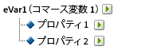

# 下位分類

{{classification-importer-deprecation}}

Adobe Analytics では、単一レベルの分類モデルと複数レベルの分類レベルの両方をサポートしています。 分類階層を使用すると、分類に対して分類を適用できます。

>[!NOTE]
>
>サブ分類とは、分類の分類を作成する機能を指します。 ただし、[!UICONTROL 階層レポート]の作成に使用する[!UICONTROL 分類階層]と同じものではありません。 分類階層について詳しくは、[分類階層](/help/admin/tools/manage-rs/edit-settings/conversion-var-admin/classification-hierarchies.md)を参照してください。

次に例を示します。

このモデルの各分類は独立しており、選択したレポート変数の新しいサブレポートに対応します。 さらに、各分類は、データファイル内の1つのデータ列を構成し、分類名を列見出しとして使用します。 次に例を示します。

| キー | プロパティ 1 | プロパティ 2 |
|---|---|---|
| 123 | ABC | A12B |
| 456 | DEF | C3D4 |

データファイルについて詳しくは、[分類データファイル](/help/components/classifications/importer/c-saint-data-files.md)を参照してください。

複数レベルの分類は、親分類と子分類で構成されます。 次に例を示します。

**親の分類：**&#x200B;子の分類が関連付けられている分類は、すべて親の分類となります。 分類は、親の分類にも子の分類にも指定できます。 最上位レベルの親の分類は、単一レベルの分類に相当します。

**子の分類：**&#x200B;変数ではなく別の分類を親として持つ分類は、すべて子の分類になります。 子分類は、親の分類に関する追加情報を提供します。 例えば、[!UICONTROL &#x200B; キャンペーン &#x200B;]分類には、キャンペーン所有者の子分類がある場合があります。 [!UICONTROL 数値]分類は、分類レポートの指標としても機能します。

親または子の各分類は、データファイル内の1つのデータ列を構成します。 次の命名形式を使用した子分類の列見出し。

`<parent_name>^<child_name>`

データファイルの形式について詳しくは、[分類データファイル](/help/components/classifications/importer/c-saint-data-files.md)を参照してください。

次に例を示します。

| キー | プロパティ 1 | プロパティ 1^プロパティ 1-1 | プロパティ 1^プロパティ 1-2 | プロパティ 2 |
|---|---|---|---|---|
| 123 | ABC | グリーン | 小 | A12B |
| 456 | DEF | 赤 | 大 | C3D4 |

マルチレベル分類のファイルテンプレートはより複雑ですが、マルチレベル分類の機能は、個別のレベルを個別のファイルとしてアップロードできることです。 このアプローチは、時間とともに変化する分類レベルとそうでない分類レベルにデータをグループ化することで、定期的（毎日、毎週など）にアップロードする必要があるデータの量を最小限に抑えるために使用できます。

>[!NOTE]
>
>データファイルの[!UICONTROL キー]列が空白の場合、データ行ごとに一意のキーが自動生成されます。 第 2 レベル以上の分類データを使用してデータファイルをアップロードする場合のファイルの破損を防ぐために、[!UICONTROL キー]列の各行にアスタリスク（*）を入力してください。

## 例

>[!NOTE]
>
>製品分類データは、製品に直接関係するデータ属性に制限されます。 データは、製品がweb サイトでどのように分類または販売されるかに限定されません。 販売カテゴリ、サイト閲覧ノード、販売項目などのデータ要素は、製品分類データではありません。 これらの要素は、レポートのコンバージョン変数に取り込まれます。

この製品分類のデータファイルをアップロードする場合、分類データを1つのファイルまたは複数のファイルとしてアップロードできます（以下を参照）。 ファイル 1のカラーコードとファイル 2のカラー名を分離することで、新しいカラーコードを作成する場合にのみ、カラー名データ（数行のみ）を更新する必要があります。 これにより、より頻繁に更新されるファイル 1からカラー名（CODE^COLOR）フィールドが削除され、データファイルを生成する際のファイルサイズと複雑さが軽減されます。

### 製品の分類 - 単一ファイル {#section_E8C5E031869C449F9B636F5EB3BFEC17}

| キー | 製品名 | 商品詳細 | 性別 | サイズ | コード | CODE^COLOR |
|---|---|---|---|---|---|---|
| 410390013 | ポロ・SS | メンズポロシャツ、半袖（M,01） | M | M | 01 | ストーン |
| 410390014 | ポロ・SS | メンズポロシャツ、半袖（L,03） | M | L | 03 | Heather |
| 410390015 | ポロ・LS | 女性ポロシャツ、長袖（S,23） | F | S | 23 | アクア |

### 製品分類 – 複数のファイル（ファイル 1） {#section_A99F7D0F145540069BA4EEC0597FF13F}

| キー | 製品名 | 商品詳細 | 性別 | サイズ | コード |
|---|---|---|---|---|---|
| 410390013 | ポロ・SS | メンズポロシャツ、半袖（M,01） | M | M | 01 |
| 410390014 | ポロ・SS | メンズポロシャツ、半袖（L,03） | M | L | 03 |
| 410390015 | ポロ・LS | 女性ポロシャツ、長袖（S,23） | F | S | 23 |

### 製品分類 – 複数のファイル（ファイル 2） {#section_19ED95C33B174A9687E81714568D56A3}

| キー | コード | CODE^COLOR |
|---|---|---|
| &#42; | 01 | ストーン |
| &#42; | 03 | Heather |
| &#42; | 23 | アクア |
