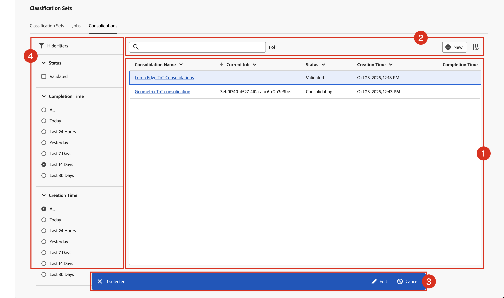

# 分類統合の管理

類似の分類データを含む複数の分類セットがある場合は、それらを単一の分類セットに統合できます。 2つ以上の分類セットを統合すると、Adobeは、各分類セットのすべての分類データを含む新しい分類セットを生成します。 統合は、多くのレポートスイートにデータをアップロードした場合に便利です。 同じ分類データを含むディメンションがあり、それらを単一のワークフローに結合する場合などに使用します。

分類セット統合マネージャーを表示するには、Adobe Analyticsの製品管理者アクセス権が必要です。

分類統合を管理する手順は、次のとおりです。

1. Adobe Analytics の上部メニューバーで&#x200B;**[!UICONTROL コンポーネント]**&#x200B;を選択し、**[!UICONTROL 分類セット]**&#x200B;を選択します。
1. **[!UICONTROL 分類セット]**&#x200B;で、「**[!UICONTROL 統合]**」タブを選択します。

## 分類統合マネージャー

**[!UICONTROL 分類セット – 統合]** マネージャーには、次のインターフェイス要素があります。

### 分類統合リスト

リスト ➊には、作成および検証済みの分類統合が表示されます。この統合は、統合中の可能性があります。 リストには、次の列があります。

| 列 | 説明 |
|---|---|
| **[!UICONTROL 統合名]** | 分類セット統合の名前。 |
| **[!UICONTROL 現在のジョブ]** | 分類セット統合に関連付けられているジョブ。 |
| **[!UICONTROL ステータス]** | 分類セット統合のステータス。 可能な値は次のとおりです。**[!UICONTROL 作成済み]**、**[!UICONTROL キャンセル済み]**、**[!UICONTROL キャンセル]**、**[!UICONTROL 検証中]**、**[!UICONTROL 検証失敗]**、**[!UICONTROL 検証済み]**、**[!UICONTROL 比較中]**、**[!UICONTROL 比較失敗]**、**[!UICONTROL 統合]**、**[!UICONTROL 送信済み]**、**[!UICONTROL 統合に失敗]**、****、**[!UICONTROL 承認待ち]**、**[!UICONTROL 最終処理]**、**[!UICONTROL 失敗]**、**[!UICONTROL 完了]**。**** |
| **[!UICONTROL 作成時間]** | 分類セット統合の作成時間。 |
| **[!UICONTROL 完了時間]** | 分類統合の完了時間。 |

分類統合リストの列のサイズを変更するには、次の操作を行います。

* 列区切り記号にカーソルを合わせ、列区切り記号を目的の列幅にドラッグします。
* を選択し、**[!UICONTROL 列のサイズ変更]**&#x200B;を選択します。 「サイズ変更」ボタンを使用して垂直線を使用すると、列のサイズを目的のサイズに変更できます。

分類統合リストの列をソートするには

* を選択し、**[!UICONTROL 昇順を並べ替え]**&#x200B;または&#x200B;**[!UICONTROL 降順を並べ替え]**&#x200B;を選択します。 矢印（↑↓）は、どの列と列がどのように並べ替えられるかを示します。

### 検索とボタン

分類統合リストの上の領域➋で、次の操作を実行できます。

* 分類統合をします。 結果は、分類統合リストに表示されます。 を選択して検索をクリアします。
* 分類セット統合リストに適用されているフィルターをすべて削除します。 フィルターを削除するには、を選択します。
* 新しい分類セットの統合を作成します。 分類セット統合ダイアログを開き、新しい分類セット統合を定義するには、 **[!UICONTROL New]**&#x200B;を選択します。
* 分類統合リストの列を定義します。 を選択し、**[!UICONTROL テーブルをカスタマイズ]** ダイアログで、**[!UICONTROL の下に表示する列を選択して、]**&#x200B;を表示します。 **[!UICONTROL 適用]**&#x200B;を選択して、列設定を適用します。

### アクションバー

分類セットリストで1つ以上の分類セットを選択すると、青いアクションバー➌が表示されます。 アクションバーでは、次のアクションを使用できます。

| アイコン | アクション | 説明 |
|---|---|---|
|  | **[!UICONTROL 編集]** | [分類セットの統合を編集](process.md#edit-a-consolidation) |
|  | **[!UICONTROL 表示]** | 分類セット統合の詳細を表示します。 ステータスに応じて、統合を[承認](process.md#approve)または[ キャンセル ](process.md#cancel)できます。 |

### フィルターパネル

を選択すると、分類の統合リストをフィルターできるフィルターパネル ➍が表示されます。 次の条件でフィルタリングできます。

* **[!UICONTROL ステータス]**。 使用可能な値の1つを選択して、ステータスに関する分類統合リストをフィルタリングします。 |
* **[!UICONTROL 完了時間]**。 使用可能な値の1つを選択して、完了時間に分類の統合リストをフィルタリングします。
* **[!UICONTROL 作成時間]**。 使用可能な値の1つを選択して、完了時間に分類の統合リストをフィルタリングします。

「 **[!UICONTROL フィルターを非表示]**」を選択して、フィルターパネルを非表示にします。

フィルターパネルに表示されるフィルターは、プリロードされた分類統合のオプションを反映していることに注意してください。
