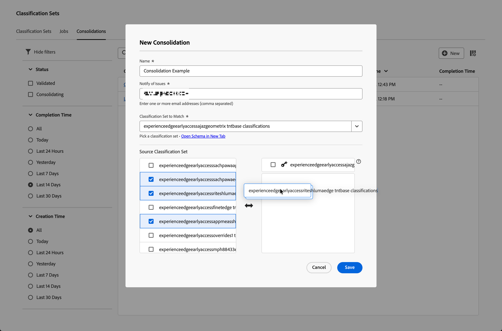
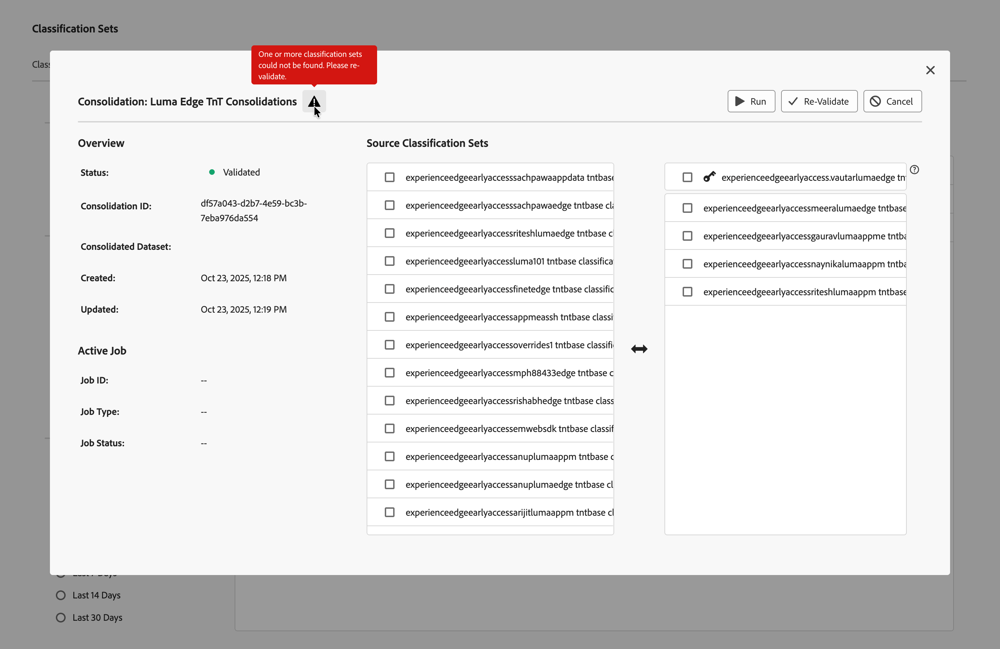
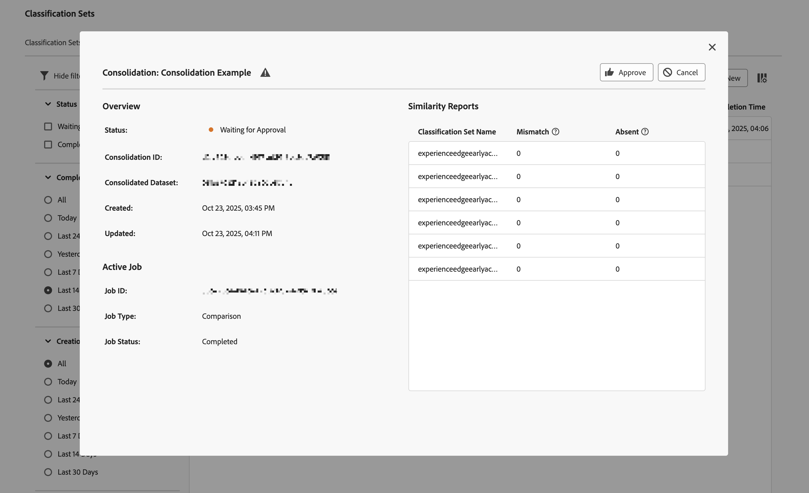

# 分類統合の作成と編集

分類セットの統合を使用すると、複数の分類セットから分類を取得し、それらを1つに結合できます。 このインタフェースを使用して、最初から最後まで分類セットの統合を作成します。 このインターフェイスは、従来の分類から分類セットに移行する組織にとって最も価値のあるものです。 分類セットを既に使用している組織では、この統合ワークフローを使用する必要はありません。

## 統合の作成 {#create-a-consolidation}

>[!CONTEXTUALHELP]
>id="classificationsets_consolidation_setpriority"
>title="分類セット優先度"
>abstract="*分類セット*&#x200B;は基本分類セットで、スキーマ全体を定義します。結合の競合が発生した場合は、このセットが優先されます。 その他の分類セットは、上から順に適用されます。"

分類の統合を作成するには、メインのAdobe Analytics インターフェイスで次の操作を行います。

1. 「**[!UICONTROL コンポーネント]**」メニューから「**[!UICONTROL 分類セット]**」を選択します。
1. **[!UICONTROL 分類セット]** マネージャーで、「**[!UICONTROL 統合]**」タブを選択します。
1. **[!UICONTROL 分類セット – 統合]** マネージャーで、 **[!UICONTROL New]**&#x200B;を選択します。
1. **[!UICONTROL 新規統合]** ダイアログで，

   
   1. **[!UICONTROL 名前]**&#x200B;を入力します。 例：`Consolidation Example`。
   1. **[!UICONTROL 説明（オプション）]**&#x200B;を入力します。 例：`Example classification set`。
   1. 「**[!UICONTROL 問題を通知]**」に 1 つ以上のメールアドレス（コンマ区切り）を入力します。 問題に関するメール通知がこれらのユーザーに送信されます。
   1. 「**[!UICONTROL 分類セットの一致先]**」ドロップダウンメニューから分類セットを選択します。

      左の&#x200B;**[!UICONTROL Source分類セット]**&#x200B;のリストには、選択した分類リストに類似した分類セットが入力され、統合に使用できます。 右側のリストには、選択した分類セットが自動的に入力されます。 このベースセットはスキーマ全体を定義し、結合の競合では常に優先されます。

   1. 左側のリストから統合する分類セットを選択し、選択した ベース **[!UICONTROL _分類セット_]**&#x200B;の下の右側のリストに選択したセットをドロップします。

      追加の分類セットは、連結を実行する際に昇順で連結されます。 キーが複数の追加セットに存在する場合、上位のランキング分類セットのキーの値が取得されます。 キーが基本セットと追加セットの両方に存在する場合、基本セットの値が使用されます。

      使用するキーの値を管理するには、リスト内の個々の分類セットと選択した分類セットをドラッグ&amp;ドロップで移動します。 また、 **[!UICONTROL _分類セット_]**&#x200B;を、選択した分類セットにドラッグ&amp;ドロップで置き換えることもできます。

   1. 分類の統合を保存するには、**[!UICONTROL 保存]**&#x200B;を選択します。 「**[!UICONTROL キャンセル]**」を選択すると、キャンセルします。

保存すると、分類の統合が自動的に検証され、統合されます。 この検証により、個々の分類セットがこの統合に対して有効であることが確認されます。 成功すると、分類統合リストのエントリに、ステータス **[!UICONTROL 検証済み]**&#x200B;が表示されます。

統合を作成した後、次の手順は次のとおりです。

* [初期設定に変更を加えたときに、分類統合を](#re-validate)再検証します。
* [分類統合を実行](#run)。
* [分類統合を承認](#approve)します。

## 統合の編集 {#edit-a-classification}

>[!CONTEXTUALHELP]
>id="classificationsets_consolidations_mismatch"
>title="不一致"
>abstract="統合された分類セット内の値がソース分類セットと一致しない場合のキーの不一致の割合。"

>[!CONTEXTUALHELP]
>id="classificationsets_consolidations_absent"
>title="不在"
>abstract="統合された分類セット内には含まれるが、ソースの分類セットには含まれないキーの割合。"

分類の統合を編集するには、メインのAdobe Analytics インターフェイスで次の操作を行います。

1. 「**[!UICONTROL コンポーネント]**」メニューから「**[!UICONTROL 分類セット]**」を選択します。
1. **[!UICONTROL 分類セット]** マネージャーで、「**[!UICONTROL 統合]**」タブを選択します。
1. **[!UICONTROL 分類セット統合]** マネージャーで：
   1. 分類統合の名前を選択します。 **[!UICONTROL 統合：_分類統合名_]**ダイアログが表示されます。 外観と使用可能なアクションは、統合の現在のステータスと、分類の統合を変更するオプションがあるかどうかによって異なります。

      | 使用可能なアクション | 説明 |
      |---|---|
      |  **[!UICONTROL キャンセル]** | [統合をキャンセル ](#cancel)。 |
      |  **[!UICONTROL 再検証]** | [統合の再検証](#re-validate)。 |
      |  **[!UICONTROL 実行]** | [統合を実行](#run)。 |
      |  **[!UICONTROL 承認]** | [統合を承認](#approve)。 |

### 再検証

「統合：分類統合」ダイアログで、分類統合を再検証できます。 は、統合の再構成が必要な統合に関する問題について追加情報を提供する場合があります。

分類統合を再検証するには、次の手順に従います。

1. 統合の作成に使用したのと同じドラッグ&amp;ドロップのインターフェイスを使用して、統合を再構成します。
1.  **[!UICONTROL 再検証]**&#x200B;を選択します。 検証では、個々の分類セットがこの統合に対して有効であることを確認します。 成功すると、トーストメッセージが表示されます。 **[!UICONTROL 検証用の統合が正常に送信されました！]**
1. ダイアログを閉じるには、を選択します。 または、 **[!UICONTROL 実行]**&#x200B;を選択して統合を実行するか、 **[!UICONTROL キャンセル]**&#x200B;して分類をキャンセルします。

<!--
Once you have created a consolidation, a list of source datasets appears on the right. The **[!UICONTROL Validate]** button makes sure that each individual classification set is valid for this consolidation. You can reorder the classification steps here to determine priority in cases of mismatched classification values. **The highest classification set in the list overwrites any mismatched values in other classification sets.**

-->

### 実行

分類の統合が正常に検証されたら、統合を実行できます。

分類統合を実行する手順は、次のとおりです。

1.  **[!UICONTROL 実行]**&#x200B;を選択します。 トーストメッセージに **[!UICONTROL 処理のための統合が正常に送信されました！]**
1. ダイアログを閉じるには、を選択します。

### 承認

分類の統合が正常に実行されると、統合ステータスは **[!UICONTROL 承認待ち]**&#x200B;になります。 分類統合の承認は、個々の分類セットを統合分類セットに置き換え、個々の分類セットを削除します。

分類セットの統合を承認するには、次の手順に従います。

1. **[!UICONTROL 類似性レポート]**&#x200B;を使用して、統合を確認します。 このレポートには、次の列を含むテーブルが表示されます。

   * **[!UICONTROL 分類セット名]**：分類セットの名前。
   * **[!UICONTROL Mismatch]**: キー値がソース分類セットと一致しない行の割合。 不一致の割合が高い場合、不一致は、分類データが異なりすぎることを示している可能性があります。 選択した分類セットに類似した分類データがあることを確認します。
   * **[!UICONTROL Absent]**: キー値が分類セットに含まれ、ソース分類セットに含まれていない行の割合。 欠落しているすべての行が、統合された分類セットに追加されます。

1. 分類を承認する準備ができたら、 **[!UICONTROL 承認]**&#x200B;を選択します。 **[!UICONTROL 統合を承認しますか？]** 確認を求めるダイアログが表示されます。 **[!UICONTROL 承認]**&#x200B;を選択して、統合を承認します。 「**[!UICONTROL キャンセル]**」を選択すると、キャンセルします。

承認されると、統合された分類セットが作成されます。 ステータスは&#x200B;**[!UICONTROL 完了]**&#x200B;に設定されています。

### キャンセル

承認前に分類統合をキャンセルできます。

分類統合をキャンセルするには、次の手順に従います。

1. 「**[!UICONTROL キャンセル]**」を選択します。

   統合がキャンセルされると、統合を再開できません。
1. 統合をキャンセルするには、**[!UICONTROL 統合をキャンセル]**&#x200B;を選択します。 「**[!UICONTROL 戻る]**」を選択して、解約を元に戻します。
