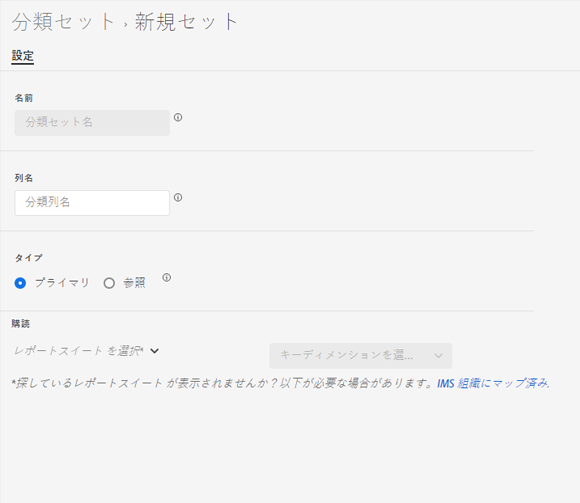

# 分類セットを作成

分類セットマネージャーを使用して、分類セットを作成できます。

>[!NOTE]
>
>この機能は、分類セットアーキテクチャのすべてのお客様が利用できます。 詳しくは、AdobeカスタマーケアまたはAdobeアカウントチームにお問い合わせください。

**[!UICONTROL コンポーネント]**／**[!UICONTROL 分類セット]**／**[!UICONTROL セット]**／**[!UICONTROL 追加]**

分類セットを作成する際に、次のフィールドを使用できます。

* **[!UICONTROL 名前]**：分類セットを識別するために使用されるテキストフィールド。このフィールドは作成時には編集できませんが、後で名前を変更できます。
* **[!UICONTROL 列名]**：作成する分類ディメンションの名前。 このフィールドは、Analysis Workspace で使用されるディメンション名で、分類データを書き出す際の列名です。
* **[!UICONTROL タイプ]**：分類のタイプを示すラジオボタン。 通常、プライマリ分類が使用され、ルックアップ分類は[サブ分類](../c-sub-classifications.md)を表します。
* **[!UICONTROL 購読]** この分類セットが適用されるレポートスイートおよびディメンション。複数のレポートスイートのサポートが予定されています。

特定のレポートスイート + 変数に分類セットが存在する場合、代わりに分類がスキーマに追加されます。
