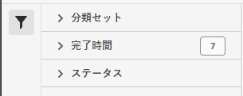

# 分類セットジョブマネージャー

分類セットジョブマネージャーを使用すると、分類セットから生成された、現在の分類ジョブと完了した分類ジョブを確認できます。また、このインターフェイスを使用して、特定のジョブの分類データやテンプレートをダウンロードしたり、ジョブに追加のデータをアップロードしたりできます。

>[!NOTE]
>
>この機能は、新しい分類アーキテクチャに移行されたレポートスイートを持つすべてのお客様が利用できます。 詳しくは、Adobeカスタマーケアまたは担当のアカウントマネージャーにお問い合わせください。

**[!UICONTROL コンポーネント]**／**[!UICONTROL 分類セット]**／**[!UICONTROL ジョブ]**

このインターフェイスからジョブを作成することはできません。代わりに、分類セットにデータをアップロードしたり、ダウンロードファイルをリクエストしたり、テンプレートファイルをリクエストしたりして、ジョブを作成できます。

## 分類セットをフィルタリング

分類セットジョブマネージャーの左側には、目的のジョブを見つけるためのフィルター設定があります。フィルターアイコンをクリックすると、フィルター設定の表示が切り替わります。分類セットは、**[!UICONTROL 分類セット]**、**[!UICONTROL 完了時間]**&#x200B;または&#x200B;**[!UICONTROL ステータス]**&#x200B;でフィルタリングできます。

分類セットジョブマネージャーの列の上に、次の追加のフィルターオプションが表示されます。

* **[!UICONTROL タイトルで検索]**：ファイル名でジョブを検索します。
* **[!UICONTROL さらに読み込む]**：分類セットジョブマネージャーには、最初に最大 1,000 個のジョブが表示されます。このボタンをクリックすると、さらに 1,000 個のジョブを読み込むことができます。
* **列の表示／非表示**：[!UICONTROL ファイル名]と[!UICONTROL 完了時間]以外の列の表示を切り替えます。

## 分類セットジョブマネージャーの列

分類セットジョブマネージャーでは、次の列を使用できます。

* **[!UICONTROL ファイル名]**：アップロードファイルまたはダウンロードファイルの名前。
* **[!UICONTROL 分類セット]**：ファイルを適用する分類セットの名前。分類セット名をクリックすると、分類セットの[設定](settings.md)に移動できます。
* **[!UICONTROL サイズ]**：ファイルのサイズ。
* **[!UICONTROL ステータス]**：ファイルを処理するジョブのステータス。
   * **[!UICONTROL 作成済み]**：ジョブが送信されました。
   * **[!UICONTROL 待機中]**：ファイルの処理準備が整い、分類サーバーがファイルを処理するのを待機しています。
   * **[!UICONTROL 検証済み]**：ファイルは有効で、処理待ちの状態です。
   * **[!UICONTROL 検証に失敗しました]**：ファイルの形式が正しくないか、無効です。ファイルは処理を実行しません。
   * **[!UICONTROL 処理中]**：ファイルは、アドビでアクティブに処理されています。
   * **[!UICONTROL 処理に失敗しました]**：ファイルの処理に失敗しました。
   * **[!UICONTROL 完了]**：処理が完了しました。分類データは、レポートに表示されます。
   * **[!UICONTROL 失敗]**：検証または処理に関連しない一般的なエラー。
* **[!UICONTROL タイプ]**：ジョブのタイプ。
* **[!UICONTROL ファイルのダウンロード]**：分類データのダウンロードやテンプレートのダウンロードなど、ダウンロードジョブにのみ適用されます。 ダウンロードの準備が整うと、この列にダウンロードリンクが表示されます。
* **[!UICONTROL 完了時間]**：ジョブが完了（または失敗）した日時。
