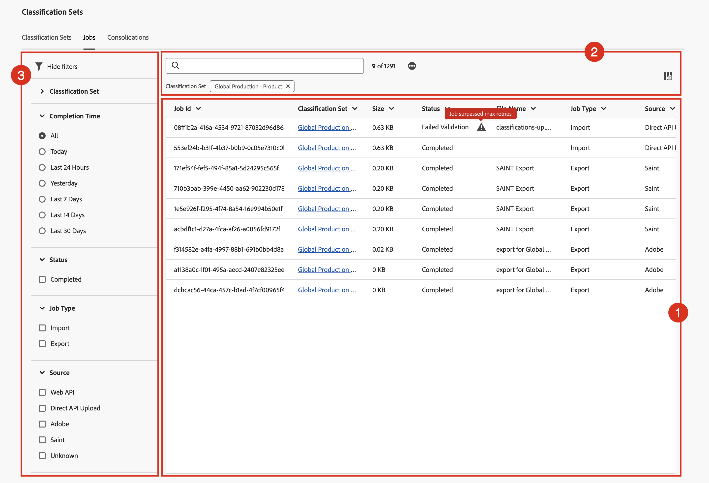

# 分類ジョブの表示と処理

分類ジョブマネージャーには、分類セット用に生成された現在の分類ジョブと完了済みの分類ジョブが表示されます。 マネージャーを使用して、特定のジョブの分類データまたはテンプレートをダウンロードすることもできます。

分類ジョブを表示してアクションを実行するには：

1. Adobe Analytics の上部メニューバーで&#x200B;**[!UICONTROL コンポーネント]**&#x200B;を選択し、**[!UICONTROL 分類セット]**&#x200B;を選択します。
1. **[!UICONTROL 分類セット]**&#x200B;で、「**[!UICONTROL ジョブ]**」タブを選択します。

## 分類ジョブマネージャー

**[!UICONTROL 分類セット – ジョブ]** マネージャーには、次のインターフェイス要素があります。

### 分類ジョブリスト

**[!UICONTROL 分類ジョブ]** リスト ➊には、分類ジョブが表示されます。 リストには、次の列があります。

| 列 | 説明 |
|---|---|
| **[!UICONTROL ジョブ ID]** | 分類ジョブの識別子。 |
| **[!UICONTROL 分類セット]** | 分類ジョブに関連付けられている分類セット。 |
| **[!UICONTROL サイズ]** | 分類ジョブの一部としてエクスポートまたはインポートされたファイルのサイズ。 |
| **[!UICONTROL ステータス]** | 分類ジョブのステータス。 可能な値は、**[!UICONTROL 作成済み]**、**[!UICONTROL キュー]**、**[!UICONTROL 検証済み]**、**[!UICONTROL 検証失敗]**、**[!UICONTROL 処理中]**、**[!UICONTROL 処理中]**、**[!UICONTROL 処理失敗]**、**[!UICONTROL 完了]**、または&#x200B;**[!UICONTROL 進行状況]**&#x200B;です。 表示されている場合は、アラート にカーソルを合わせると、追加情報が表示されます。 |
| **[!UICONTROL ファイル名]** | 分類ジョブの一部として、ファイルの読み込みまたは書き出しに使用する名前または機能を識別します。 使用可能な値： <ul><li>*値なし*</li><li>分類ジョブの一部として処理されるファイルの名前。</li><li>**[!UICONTROL SAINT エクスポート]**: ジョブは[従来の分類インターフェイス ](/help/components/classifications/importer/c-working-with-saint.md)からのエクスポートです。</li><li>_タイムスタンプ&#x200B;_]**の_分類セット _の**[!UICONTROL 書き出し：ジョブは[ スキーマ ](manage/schema.md#download) インターフェイスからのダウンロードです。</li></ul> |
| **[!UICONTROL ジョブの種類]** | 分類ジョブのタイプ。 使用可能な値は、**[!UICONTROL Import]**&#x200B;または&#x200B;**[!UICONTROL Export]**&#x200B;です。 |
| **[!UICONTROL ソース]** | 分類ジョブのソース。 使用可能な値は、**[!UICONTROL Web API]**、**[!UICONTROL Direct API Upload]**、**[!UICONTROL Adobe]**、**[!UICONTROL SAINT]**&#x200B;または&#x200B;**[!UICONTROL 不明]**&#x200B;です。 |
| **[!UICONTROL 変更行]** | 分類ジョブが変更した変更済み行の数。 |
| **[!UICONTROL 合計行]** | 分類ジョブが処理した合計行数。 |
| **[!UICONTROL 完了時間]** | 分類ジョブの完了時間。 |
| **[!UICONTROL ファイルのダウンロード]** | を使用して、分類ジョブに関連付けられているファイル（テンプレートまたはデータ）をダウンロードします。 |

分類ジョブリストの列のサイズを変更するには、次の操作を行います。

* 列区切り記号にカーソルを合わせ、列区切り記号を目的の列幅にドラッグします。
* を選択し、**[!UICONTROL 列のサイズ変更]**&#x200B;を選択します。 「サイズ変更」ボタンを使用して垂直線を使用すると、列のサイズを目的のサイズに変更できます。

分類ジョブ リストの列を並べ替えるには

* を選択し、**[!UICONTROL 昇順を並べ替え]**&#x200B;または&#x200B;**[!UICONTROL 降順を並べ替え]**&#x200B;を選択します。 矢印（↑↓）は、どの列と列がどのように並べ替えられるかを示します。

### 検索とボタン

分類ジョブ リストの上にある領域➋では、次の操作を実行できます。

* 分類ジョブをします。 結果は分類ジョブ リストに表示されます。 を選択して検索をクリアします。
* 分類ジョブリストに適用されているフィルターをすべて削除します。 フィルターを削除するには、を選択します。
* 追加の1000個の分類ジョブを読み込むには、を選択します。 最初に、分類セットリストには最大1000個の分類ジョブが表示されます。
* 分類セットのジョブリストの列を定義します。 を選択し、**[!UICONTROL テーブルをカスタマイズ]** ダイアログで、**[!UICONTROL の下に表示する列を選択して、]**&#x200B;を表示します。 **[!UICONTROL 適用]**&#x200B;を選択して、列設定を適用します。

### フィルターパネル

を選択すると、分類ジョブリストをフィルターできるフィルターパネル ➌が表示されます。 次の条件でフィルタリングできます。

* **[!UICONTROL 分類セット]**。 分類ジョブリストをフィルタリングするには、1つ以上の分類セットを選択します。
* **[!UICONTROL 完了時間]**。 使用可能な値の1つを選択して、完了時間に分類ジョブ リストをフィルタリングします。
* **[!UICONTROL ステータス]**。 使用可能な値の1つを選択して、ステータスに関する分類ジョブ・リストをフィルタリングします。
* **[!UICONTROL ジョブの種類]** 使用可能な値の1つを選択して、ジョブタイプの分類ジョブリストをフィルタリングします。
* **[!UICONTROL Source]**。 可能な値の1つを選択して、ソースの分類ジョブリストをフィルタリングします。

「 **[!UICONTROL フィルターを非表示]**」を選択して、フィルターパネルを非表示にします。

フィルターパネルに表示されるフィルターは、プリロードされた分類ジョブのオプションを反映しています。
