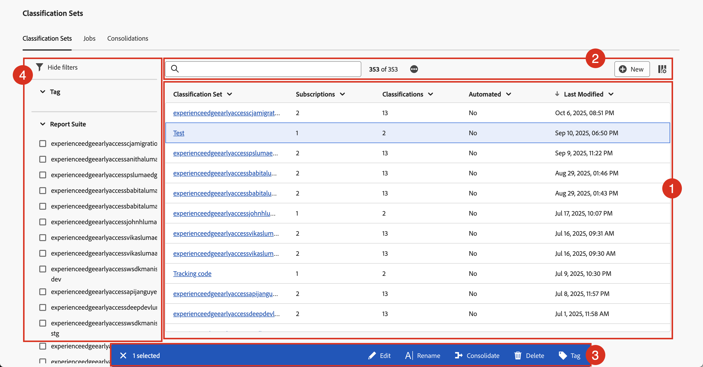

# 分類セットの管理

分類セット管理インターフェイスでは、分類セットを作成、名前変更、編集、統合、削除、タグ付けすることができます。 また、特定の分類セットをフィルタリングして検索することもできます。

分類セットを管理するには：

1. Adobe Analytics の上部メニューバーで&#x200B;**[!UICONTROL コンポーネント]**&#x200B;を選択し、**[!UICONTROL 分類セット]**&#x200B;を選択します。
1. **[!UICONTROL 分類セット]**&#x200B;で、「**[!UICONTROL 分類セット]**」タブを選択します。

## 分類セットマネージャー

**[!UICONTROL 分類セット]** マネージャーには、次のインターフェイス要素があります。

### 分類セットリスト

**[!UICONTROL 分類セット]** リスト ➊には、すべての分類セットが表示されます。 リストには、次の列があります。

| 列 | 説明 |
|---|---|
| **[!UICONTROL 分類セット]** | 分類セットの名前。 名前を選択して[分類セットを編集](create-set.md#edit-a-classification-set)します。 |
| **[!UICONTROL サブスクリプション]** | 分類セットが適用されるサブスクリプションの数。 |
| **[!UICONTROL 分類]** | 分類セットに含まれる分類ディメンションの数。 |
| **[!UICONTROL 自動化]** | 分類セットは、クラウドの場所からデータを自動的に読み込むように設定されていますか？ この自動化は、[分類セットスキーマ &#x200B;](manage/schema.md)の一部として設定できます。 |
| **[!UICONTROL 最終変更日]** | 分類セットの最後の変更のタイムスタンプ。 |

分類セットリストの列のサイズを変更するには、次の操作を行います。

* 列区切り記号にカーソルを合わせ、列区切り記号を目的の列幅にドラッグします。
* を選択し、**[!UICONTROL 列のサイズ変更]**&#x200B;を選択します。 「サイズ変更」ボタンを使用して垂直線を使用すると、列のサイズを目的のサイズに変更できます。

分類セット リストの列を並べ替えるには

* を選択し、**[!UICONTROL 昇順を並べ替え]**&#x200B;または&#x200B;**[!UICONTROL 降順を並べ替え]**&#x200B;を選択します。 矢印（↑↓）は、どの列と列がどのように並べ替えられるかを示します。

### 検索とボタン

分類セット リストの上の領域➋で、次の操作を行うことができます。

* 分類セットをします。 結果は、分類セットのリストに表示されます。 を選択して検索をクリアします。
* 分類セットリストに適用されているフィルターをすべて削除します。 フィルターを削除するには、を選択します。
* 追加の1000個の分類セットを読み込むには、を選択します。 最初、分類セットリストには最大1000個の分類セットが表示されます。
*  **[!UICONTROL New]**&#x200B;を選択して[新しい分類セットを作成](create-set.md#create-a-classification-set)します。
* 分類セットリストの列を定義します。 を選択し、**[!UICONTROL テーブルをカスタマイズ]** ダイアログで、**[!UICONTROL の下に表示する列を選択して、]**&#x200B;を表示します。 **[!UICONTROL 適用]**&#x200B;を選択して、列設定を適用します。

### アクションバー

分類セットリストで1つ以上の分類セットを選択すると、青いアクションバー➌が表示されます。 アクションバーでは、次のアクションを使用できます。

| アイコン | アクション | 説明 |
|---|---|---|
|  | **[!UICONTROL 編集]** | [分類セットビルダーで分類セット &#x200B;](create-set.md#edit-a-classification-set)を編集します。 |
|  | **[!UICONTROL 名前変更]** | 分類セットの名前を変更します。  「**[!UICONTROL 名前変更：_分類セット_]**」ダイアログで、新しい名前を入力し、**[!UICONTROL 名前変更]**」を選択します。 |
|  | **[!UICONTROL 統合]** | [分類セットの統合](/help/components/classifications/sets/consolidations/manage.md)。 |
|  | **[!UICONTROL 削除]** | 分類セットを削除します。 **[!UICONTROL 分類セット _を削除_?]** ダイアログが表示されます。 分類セットの削除を元に戻すことはできません。 この分類セットを使用するスケジュール済みプロジェクトまたは統合では、スケジュール済みプロジェクトを再保存するか、スケジュール済み統合を再検証するまで、この分類セットの定義が引き続き使用されます。 分類セットを削除するには、**[!UICONTROL 削除]**&#x200B;を選択します。 |
|  | **[!UICONTROL タグ]** | 分類セットにタグ付けします。  「**[!UICONTROL タグ：_分類セット_]**」ダイアログで、**[!UICONTROL タグ]**&#x200B;ドロップダウンメニューから1つ以上のタグを選択してタグを追加します。 または1つ以上の新しいタグを入力します。 タグを削除するには、を使用します。   タグを保存するには、**[!UICONTROL 保存]**&#x200B;を選択します。 |

### フィルターパネル

分類セットリストをフィルタリングできるフィルターパネル ➍を表示するには、を選択します。 次の条件でフィルタリングできます。

* **[!UICONTROL タグ]** 1つ以上のタグを選択して、タグの分類セットリストをフィルタリングします。
* **[!UICONTROL レポートスイート]**。 1つ以上のレポートスイートを選択して、レポートスイートの分類セットリストをフィルタリングします。

「 **[!UICONTROL フィルターを非表示]**」を選択して、フィルターパネルを非表示にします。

フィルターパネルに表示されるフィルターは、プリロードされた分類セットのオプションを反映しています。
