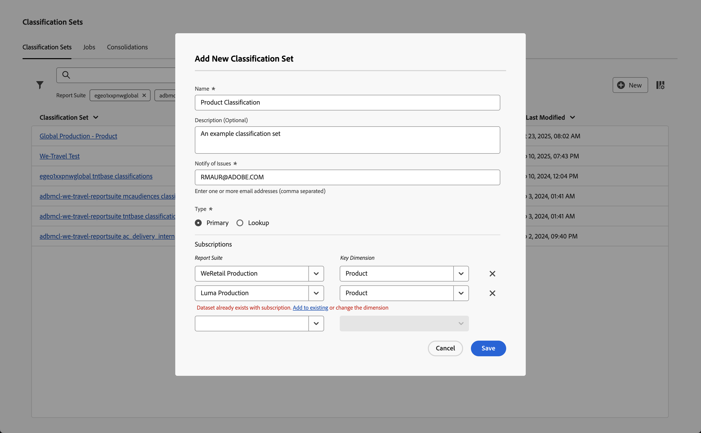

# 分類セットの作成と編集

分類セットマネージャーから分類セットを [ 作成 ](#create-a-classification-set) および [ 編集 ](#edit-a-classification-set) します。

## 分類セットを作成

分類セットを作成するには：

1. Adobe Analyticsの上部メニューバーで **[!UICONTROL コンポーネント]** を選択し、**[!UICONTROL 分類セット]** を選択します。
1. **[!UICONTROL 分類セット]** で、「**[!UICONTROL 分類セット]**」タブを選択します。
1.  **[!UICONTROL New]** を選択します。
1. **[!UICONTROL 新しい分類セットを追加]** ダイアログで、次の手順を実行します。

   

   1. **[!UICONTROL 名前]** を入力します。 例：`Classification Set Example`。
   1. **[!UICONTROL 説明（オプション）]** を入力します。 例：`Example classification set`。
   1. **[!UICONTROL 問題の通知]** に 1 つ以上のメールアドレス（コンマ区切り）を入力します。 問題に関するメール通知がこれらのユーザーに送信されます。
   1. 分類セットの **[!UICONTROL タイプ]** を選択します。 使用できるタイプは次のとおりです。
      * **[!UICONTROL プライマリ]**。 プライマリ分類セットは、Adobe Analyticsで収集されたディメンションに適用されます。 プライマリ分類は、詳細なディメンション値を、より意味のあるデータレベルにグループ化（分類）する方法です。 例えば、内部検索キーワードを内部検索カテゴリにグループ化して、検索データのテーマを把握することができます。 または、商品 SKU を色またはカテゴリ別に分類します。
         * 1 つ以上の **[!UICONTROL 購読]** を入力します。  分類セットに対して複数の **[!UICONTROL レポートスイート]** と **[!UICONTROL Dimension]** の組み合わせを定義できます。

         *  を選択して、**[!UICONTROL レポートスイート]** と **[!UICONTROL キーDimension]** の組み合わせを削除します。

        **[!UICONTROL レポートスイート]** と、別の分類セットに既に存在する **[!UICONTROL キーDimension]** の組み合わせを追加すると、その組み合わせの下に赤いアラートが表示されます。 **[!UICONTROL 既存に追加]** を選択して他の分類セットを開き、その他の分類セットの [ スキーマに分類を追加 ](schema.md) するか、ディメンションを変更できます。
      * **[!UICONTROL ルックアップ]**。 一般に子またはサブ分類と呼ばれる、ルックアップテーブルはプライマリ分類の分類です。 ルックアップは、元のディメンションではなく、分類値に関するメタデータです。 例えば、*製品* ディメンションは、*カラーコード* という主要分類を持つ場合があります。 次に、*カラー名* の参照テーブルを *カラーコード* に添付して、各カラーコードを説明できます。
1. 「**[!UICONTROL 保存]**」を選択して、分類セットを保存します。 「**[!UICONTROL キャンセル]**」を選択して、定義をキャンセルします。
1. 分類セットのスキーマを定義するには、新しく作成した分類セットを **[!UICONTROL 分類セット]** マネージャーから選択して [ 分類セットを編集 ](#edit-a-classification-set) します。

## 分類セットを編集

分類セットを編集するには：

1. Adobe Analyticsの上部メニューバーで **[!UICONTROL コンポーネント]** を選択し、**[!UICONTROL 分類セット]** を選択します。
1. **[!UICONTROL 分類セット]** で、「**[!UICONTROL 分類セット]**」タブを選択します。
1. 分類セットのタイトルを選択します。
1. **[!UICONTROL 分類セット：_分類セットタイトル_]**ダイアログでは、分類セットの [ 設定 ](settings.md) と [ スキーマ ](schema.md) を定義できます。
1. 完了したら、「**[!UICONTROL 保存]** を選択して変更を保存します。 「**[!UICONTROL キャンセル]**」を選択すると、キャンセルします。

<!--

### Schema

In the Schema tab 

You can use the Classification set manager to create a classification set.

**[!UICONTROL Components]** > **[!UICONTROL Classification sets]** > **[!UICONTROL Sets]** > **[!UICONTROL Add]**

When creating a classification set, the following fields are available.

* **[!UICONTROL Name]**: A text field used to identify the classification set. This field cannot be edited upon creation, but can be renamed later.
* **[!UICONTROL Column Name]**: The name of the first classification dimension that you want to create. This field is the dimension name used in Analysis Workspace, and the column name when exporting classification data. You can add more column names after the classification set is created.
* **[!UICONTROL Type]**: Radio buttons that indicate the type of classification.
  * **[!UICONTROL Primary]**: Apply to dimensions collected in Analytics. They are a way to group (classify) granular dimension values into more meaningful levels of data. For example, you might want to group internal search keywords into internal search categories, to better understand themes in your search data.
  * **[!UICONTROL Lookup]**: Commonly referred to as child or subclassifications, a lookup table is a classification of a primary classification. It is metadata about a classification value, rather than the original dimension. For example, the Product variable might have a primary classification of 'Color code'. A lookup table of 'Color name' could then be attached to 'Color code' to further explain what each code means.
* **[!UICONTROL Subscriptions]** The report suites and dimensions that this classification set applies to. You can add multiple report suite and dimension combinations to a classification set.

If a classification set exists for a given report suite + variable, the classification is added to the schema instead. A given report suite + variable combination cannot belong to multiple classification sets.

-->