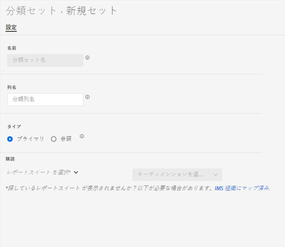

# 分類セットを作成

分類セットマネージャーを使用して、分類セットを作成できます。

**[!UICONTROL コンポーネント]**／**[!UICONTROL 分類セット]**／**[!UICONTROL セット]**／**[!UICONTROL 追加]**

分類セットを作成する際に、次のフィールドを使用できます。

* **[!UICONTROL 名前]**：分類セットを識別するために使用されるテキストフィールド。 このフィールドは作成時には編集できませんが、後で名前を変更できます。
* **[!UICONTROL 列名]**：作成する最初の分類ディメンションの名前。 このフィールドは、Analysis Workspaceで使用されるディメンション名で、分類データを書き出す際の列名です。 分類セットを作成した後で、列名をさらに追加できます。
* **[!UICONTROL タイプ]**：分類のタイプを示すラジオボタン。 通常、プライマリ分類が使用され、ルックアップ分類は[サブ分類](../../c-sub-classifications.md)を表します。
* **[!UICONTROL 購読]** この分類セットが適用されるレポートスイートおよびディメンション。 分類セットには、複数のレポートスイートとディメンションの組み合わせを追加できます。

特定のレポートスイート +変数に分類セットが存在する場合、代わりに分類がスキーマに追加されます。 特定のレポートスイート +変数の組み合わせは、複数の分類セットに属することはできません。
