# 分類セットのルール

ルールを使用して、キーディメンションが絶えず変化するシナリオで自動分類をサポートします。 [&#x200B; アップロード &#x200B;](/help/components/classifications/sets/manage/schema.md#upload)または[自動化](/help/components/classifications/sets/manage/schema.md#automate)による分類の更新は、面倒なプロセスになるか、新しいディメンション値の適切な分類に遅れることがあります。 たとえば、社内キャンペーン、トラッキングコード、製品SKUなどです。

ディメンションには、1つ以上のルールを適用できる値が含まれている必要があります。これにより、ディメンション値から分類データを導き出すことができます。

ルールは、分類セットのコンテキスト内で定義します。このコンテキストは、分類セットにサブスクライブされているすべてのレポートスイートとキーディメンションの組み合わせにルールが（アクティブ化された場合）適用されることを意味します。 この実装は、従来の分類ルールビルダーの仕組みとは異なります。 分類ルールビルダーでは、ルールセットの一部として1つ以上のルールを個別に定義し、ルールセットを1つ以上のレポートスイートに関連付けます。 新しいインターフェイスでは、分類セット内のルールはルールセットとも呼ばれます。 ただし、ルールセットは、他の分類セット属性を設定するのと同じインターフェイス内で定義されます。

分類セットのルール・セットを定義する手順は、次のとおりです。

1. Adobe Analytics の上部メニューバーで&#x200B;**[!UICONTROL コンポーネント]**&#x200B;を選択し、**[!UICONTROL 分類セット]**&#x200B;を選択します。
1. **[!UICONTROL 分類セット]**&#x200B;で、「**[!UICONTROL 分類セット]**」タブを選択します。
1. **[!UICONTROL 分類セット]** マネージャーで、ルールを定義する分類セットを選択します。
1. **[!UICONTROL 分類セット : _分類セット名_]**&#x200B;ダイアログで、「**[!UICONTROL ルール]**」タブを選択します。

   * 分類セットに対して&#x200B;**[!UICONTROL ルール]** インターフェイスに初めてアクセスする場合、または従来のルールビルダーインターフェイスを引き続き使用する場合は、開始方法を選択できるダイアログが表示されます。 オプションは次のとおりです。

      * **既存のルールを移行**。 現在の分類ルールを読み込み、新しいインターフェイスでこれらのルールを引き続き操作します。 既存のルールは保持され、新しい形式に変換されます。
         * 続行するには、「**[!UICONTROL ルールを移行]**」を選択します。
         * **[!UICONTROL 移行の確認]** ダイアログで、移行の意味を確認します。
            * 「**[!UICONTROL ルールを移行]**」を選択して、移行を確認します。 移行が完了したら、[&#x200B; ルールセットインターフェイス &#x200B;](#rule-set-interface)を使用して新しいルールを作成し、既存の移行済みルールを編集します。
            * 移行をキャンセルするには、**[!UICONTROL キャンセル]**&#x200B;を選択します

      * **新しい作業を開始**。 新しいルールビルダーを使って、新しい分類ルールをゼロから作成できます。分類ロジックを再設計するか、新しい分類ルールで最初からやり直す場合は、このオプションを選択します。
         * 続行するには、**[!UICONTROL 新しいルールを作成]**&#x200B;を選択します。
         * **[!UICONTROL 開始確認の新規]** ダイアログで、新しい開始の意味を読み取ります。
            * **[!UICONTROL 新しい開始]**&#x200B;を選択して、新しい開始を確認し、既存のルールをすべて破棄します。 [&#x200B; ルール セット インターフェイス &#x200B;](#rule-set-interface)を使用して、新しいルールを作成します。
            * 「**[!UICONTROL キャンセル]**」を選択すると、キャンセルします。

      * **従来のインターフェイス**&#x200B;を使用します。 以前のルールビルダーインターフェイスを引き続きご利用ください。新しいインターフェイスには、準備が整い次第いつでも移行できます。
         * **[!UICONTROL レガシーインターフェイス]**&#x200B;に移動して続行します。 従来の&#x200B;**[!UICONTROL 分類ルールビルダー]** インターフェイスに移動します。

   * 既にルールを移行したり、分類セット用に新しいルールを作成したりしている場合は、ルールセットインターフェイスに直接移動します。

## ルールセットインターフェイス {#rule-set-interface}

>[!CONTEXTUALHELP]
>id="classificationsets_rules_samplekeys"
>title="サンプルキー"
>abstract="ルールセットをテストするテストキーを入力または貼り付けます。各行は個別のキー値です。「**[!UICONTROL ルールセットをテスト]**」を選択して、結果を含むダイアログを表示します。"

ルールを作成または編集するには、ルールセットインターフェイスを使用します。

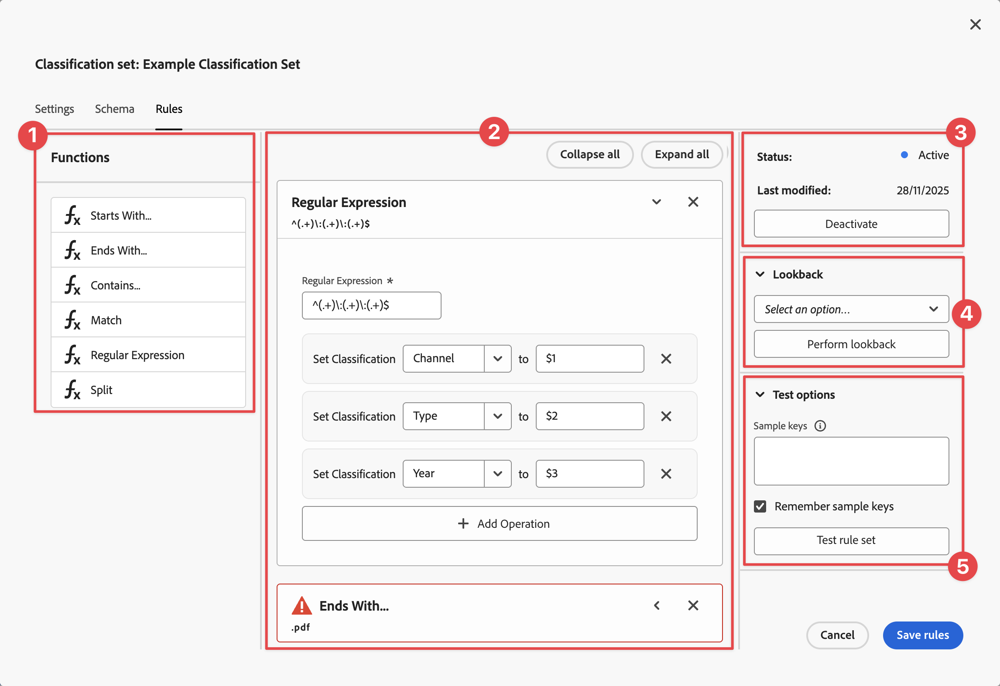

| | 名前 | 説明 |
|---|---|---|
| 1 | **[!UICONTROL 関数]** | **[!UICONTROL 関数]**&#x200B;領域を使用して、関数を選択し、ルールセットビルダーにドラッグ&amp;ドロップします。 |
| 2 | **ルールセットビルダー** | 1つ以上のルールを使用してルールセットを作成します。 ルールは関数の実装であり、常に1つの関数にのみ関連付けられます。 1つの関数に複数の演算子を含めることができます。 ルールを作成するには、関数をルールセットビルダーにドラッグ&amp;ドロップします。 関数タイプは、ルールのインターフェイスを定義します。  詳細については、[&#x200B; ルール インターフェイス &#x200B;](#rule-interface)を参照してください。 任意の場所に関数を挿入できます。関数は順番に実行され、分類の最終値が決定されます。 すべてのルールを折りたたむには、**[!UICONTROL すべてを折りたたむ]**&#x200B;を使用し、すべてのルールを展開するには、**[!UICONTROL すべてを展開]**&#x200B;を使用します。 |
| 3 | **[!UICONTROL ステータス]** | ルールセットのステータスと最終変更日を表示します。   ルール セットをアクティブ化するには、**[!UICONTROL アクティブ化]**&#x200B;を選択します。   ルール セットを非アクティブ化するには、**[!UICONTROL 非アクティブ化]**&#x200B;を選択します。 |
| 4 | **[!UICONTROL 振り返り]** | ルールセットのルックバックウィンドウを指定します。  ドロップダウンメニューからオプション（1か月から6か月まで）を選択します。 選択したルックバック期間を使用してルックバックを実行するには、**[!UICONTROL ルックバックを実行]**&#x200B;を選択します。 |
| 5 | **[!UICONTROL テストオプション]** | サンプルキーディメンション値を使用して、分類をテストします。 <ul><li>**[!UICONTROL サンプルキー]** テキスト領域に値を追加またはペーストします。 **[!UICONTROL サンプルキーを記憶]**&#x200B;して、ルールセットインターフェイスの様々な使用法でサンプルキーが保持されていることを確認します。</li><li>ルール セットをテストするには、**[!UICONTROL ルール セットのテスト]**&#x200B;を選択します。</li></ul> |

## ルールインターフェイス

ルールインターフェイスで設定したルールセット内で、個々のルールを定義します。 インターフェイスは次の要素で構成されます。

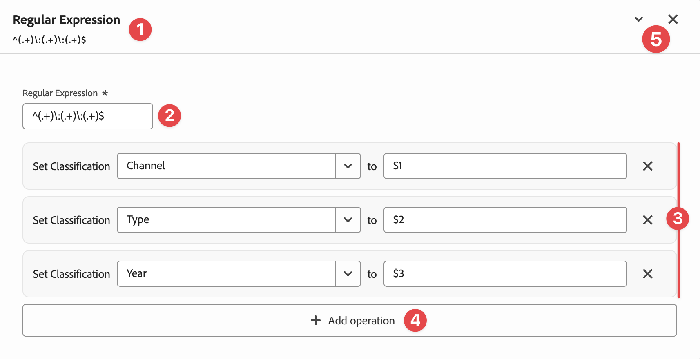

| | 説明 |
|---|---|
| 1 | 選択した関数の名前と、関数に入力された入力。 |
| 2 | 選択した関数の入力。 入力は、選択した関数によって異なります。 例えば、**[!UICONTROL 正規表現]**&#x200B;関数の場合、入力は正規表現です。 また、**[!UICONTROL Split]**&#x200B;関数の場合、入力はトークンです。 特定の関数に適した入力を入力します。 例えば、内部キャンペーンコード内の3つの分類を識別する正規表現の`^(.+)\:(.+)\:(.+)$`などです。 |
| 3 | 各操作は、特定の分類を値に設定します。  分類を&#x200B;**[!UICONTROL 分類を設定]** ドロップダウンメニューから選択し、**[!UICONTROL から]**&#x200B;までの値を入力します。   リストから操作を削除するには、を使用します。 |
| 4 | 「 **[!UICONTROL 操作を追加]**」を選択して、関数に追加の操作を追加します。 |
| 5 | ルールを折りたたむには、を選択します。 ルールを展開するには、を選択します。  ルールを削除するには、を選択します。 |

## 関数リファレンス

サポートされる各関数について、必要な入力とサンプルのユースケースについて以下で詳細を確認してください。

### 最初に…

キーディメンションの開始点となる特定の値に基づいて分類を設定します。

+++ 詳細 

#### 必須の入力

**[!UICONTROL で始まる]**&#x200B;の値を入力してください。 例：`em`。

#### ユースケース

主要ディメンションの内部キャンペーンの値が`Email`で始まる場合に、**[!UICONTROL を]** チャネル `em`分類の値として割り当てるルールを定義する（例：`em:FY2025:Summer Sale`）。

>[!BEGINTABS]

>[!TAB  ルール ]

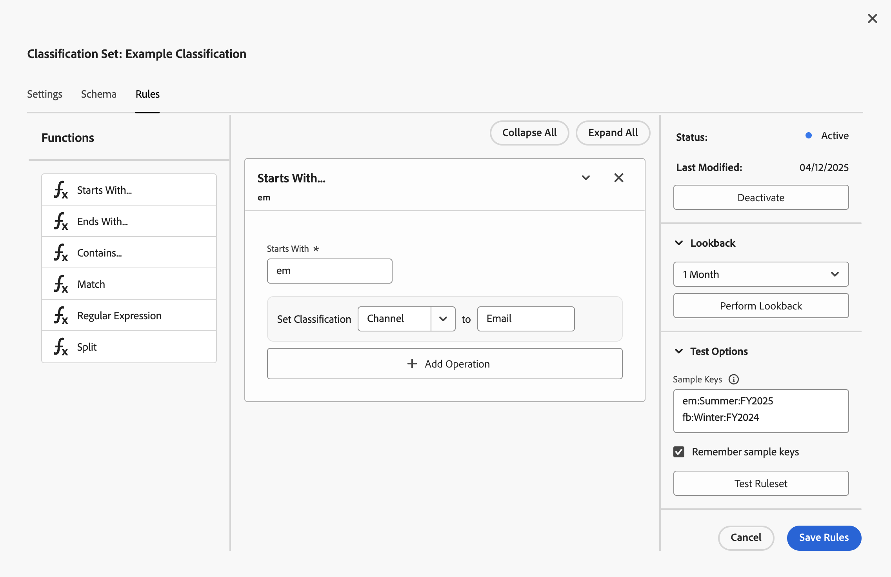で始まる

>[!TAB  テスト結果]

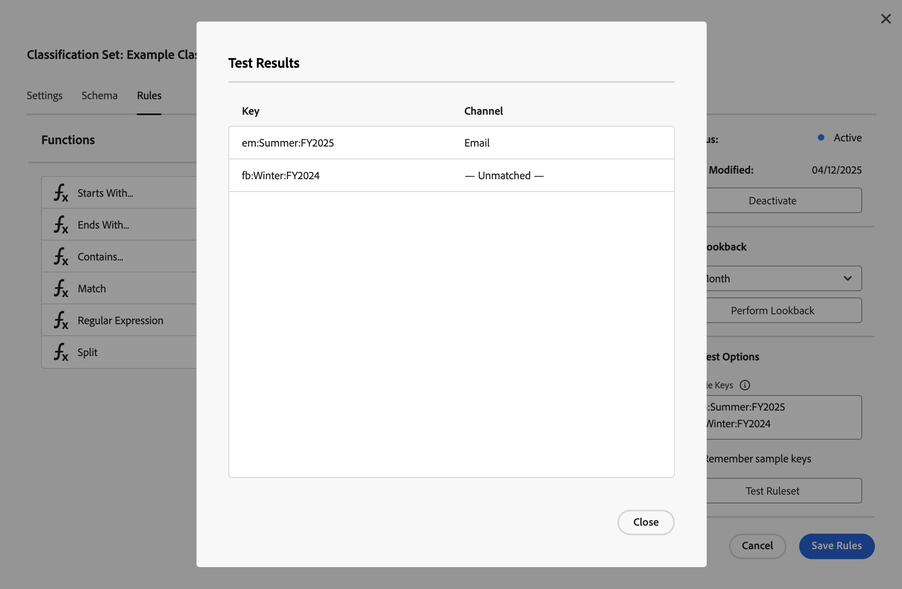

>[!ENDTABS]

+++

### で終了…

キーディメンションの末尾に含まれる特定の値に基づいて分類を設定します。

+++ 詳細 

#### 必須の入力

**[!UICONTROL の値を]**&#x200B;で終わるように入力します。 例：`2025`。

#### ユースケース

キーディメンションの内部キャンペーンの値に`2025`が含まれている場合に、**[!UICONTROL を]**&#x200B;年`2025`分類に値として割り当てるルールを定義する場合（例：`em:Summer Sale:FY2025`）。

>[!BEGINTABS]

>[!TAB  ルール ]

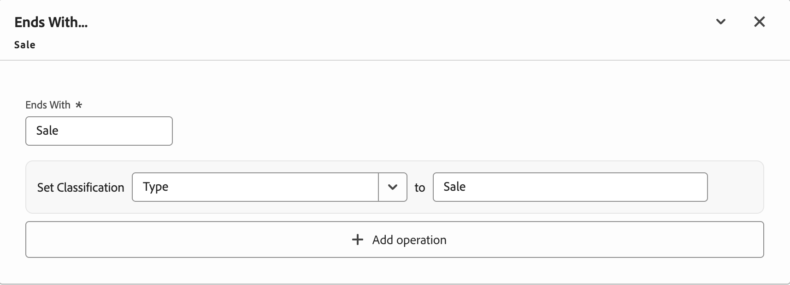で終わる

>[!TAB  テスト結果]

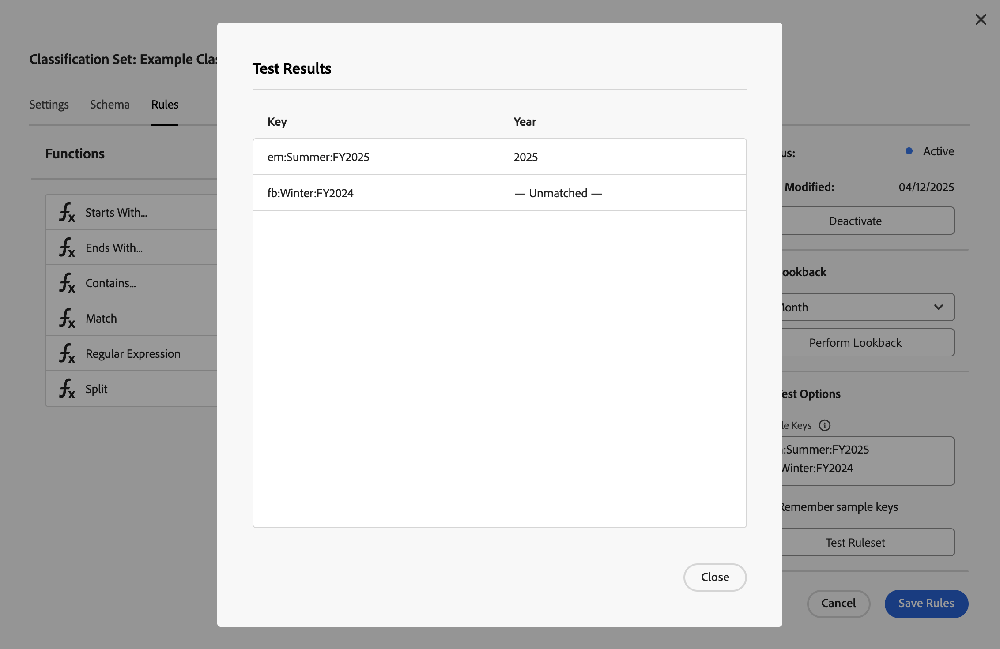

>[!ENDTABS]

+++

### 含む…

キーディメンションに含まれる特定の値に基づいて分類を設定します。

+++ 詳細 

#### 必須の入力

**[!UICONTROL Contains]**&#x200B;の値を入力します。 例：`Winter`。

#### ユースケース

キーディメンションの内部キャンペーンの値に`Winter Sale`が含まれている場合に、**[!UICONTROL を]** タイプ `Winter`分類に値として割り当てるルールを定義します（例：`fb:Winter:FY2024`）。

>[!BEGINTABS]

>[!TAB  ルール ]

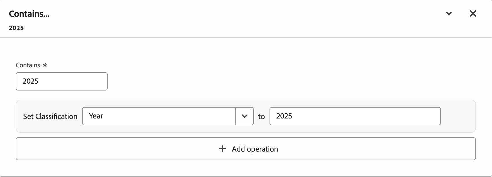を含む

>[!TAB  テスト結果]

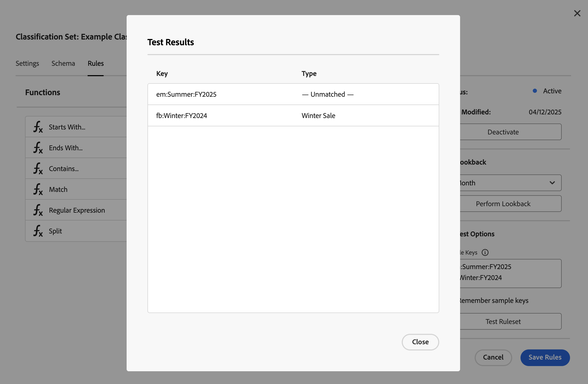

>[!ENDTABS]

+++

### 抽出される: 

キーのディメンション値と一致する特定の値に基づいて分類を設定します。

+++ 詳細 

#### 必須の入力

**[!UICONTROL Matches]**&#x200B;の値を入力します。 例：`em:Summer:2025`。

#### ユースケース

`Email`を値として&#x200B;**[!UICONTROL チャネル]**&#x200B;分類に割り当てるルール、値として`Summer Sale`を&#x200B;**[!UICONTROL タイプ]**&#x200B;分類に割り当てるルール、および`2025`を&#x200B;**[!UICONTROL 年]**&#x200B;分類に割り当てるルールを定義します。 ただし、キーディメンションの内部キャンペーンの値が`em:Summer:2025`に一致する場合に限ります。

>[!BEGINTABS]

>[!TAB  ルール ]

>[!TAB  テスト結果]

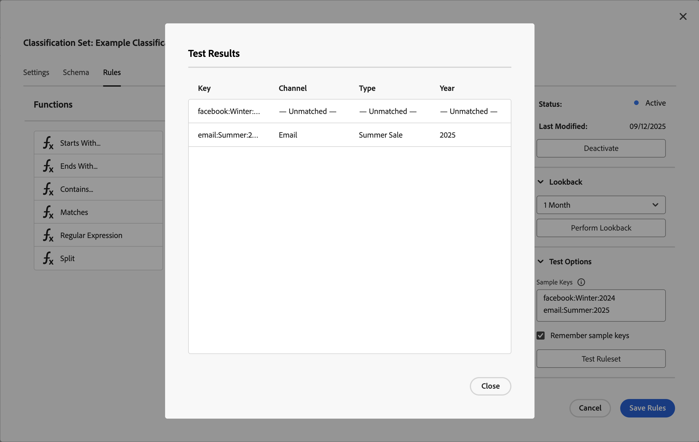

>[!ENDTABS]

+++

### 正規表現

キーのディメンション値に適用される正規表現に基づいて、1つ以上の分類を設定します。

+++ 詳細 

#### 必須の入力

**[!UICONTROL 正規表現]**&#x200B;の値を入力してください。 例：`^(.+)\:(.+)\:FY(.+)$`。

#### ユースケース

正規表現&#x200B;**[!UICONTROL を適用し、一致グループ （]**、**[!UICONTROL 、および]**）を主要ディメンションの内部キャンペーンの値に使用することで、**[!UICONTROL チャネル]**、`^(.+)\:(.+)\:FY(.+)$` タイプ `$1`および`$2`年`$3`の分類に値を割り当てるルールを定義します。

>[!BEGINTABS]

>[!TAB  ルール ]

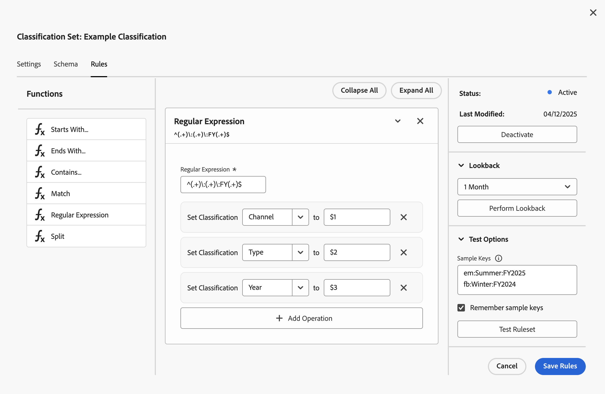

>[!TAB  テスト結果]

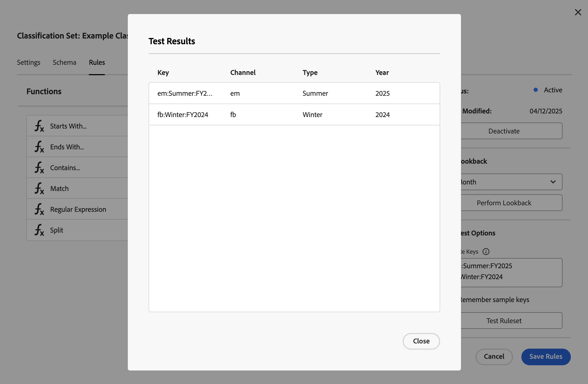

>[!ENDTABS]

#### 参照テーブル

正規表現の参照表については、以下を参照してください。

| 正規表現 | 説明 |
|---|---|
| `(?ms)` | 複数行の入力に対して正規表現全体を一致させ、任意の改行文字に`.` ワイルドカードを一致させます |
| `(?i)` | 正規表現全体を一致させて、大文字と小文字を区別しない |
| `[abc]` | a、b または c の 1 文字 |
| `[^abc]` | a、b、c 以外の 1 文字 |
| `[a-z]` | a ～ z の範囲内の 1 文字 |
| `[a-zA-Z]` | a ～ z または A ～ Z の範囲内の 1 文字 |
| `^` | 行の開始（行の開始に一致） |
| `$` | 行の末尾（または末尾の改行前）を一致させます |
| `\A` | 文字列の開始 |
| `\z` | 文字列の末尾 |
| `.` | 任意の文字の一致（改行を除く） |
| `\s` | 空白文字 |
| `\S` | 空白以外の文字 |
| `\d` | 数字 |
| `\D` | 数字以外 |
| `\w` | 任意の単語（文字、数字、アンダースコア） |
| `\W` | 任意の単語以外の文字 |
| `\b` | 任意の単語境界 |
| `(...)` | 囲まれている内容をすべてキャプチャ |
| `(a\b)` | a または b |
| `a?` | 0 または 1 個の a |
| `a*` | 0 個以上の a |
| `a+` | 1 つ以上の a |
| `a{3}` | 3 個の a |
| `a{3,}` | 3 個以上の a |
| `a{3,6}` | 3 ～ 6 個の a |

+++

### Split

トークンに基づいて、キーディメンションの値を1つ以上の分類に分割します。

+++ 詳細

#### 必須の入力

**[!UICONTROL Split]**&#x200B;の値を入力します。 例：`:`。

#### ユースケース

**&#x200B;**&#x200B;トークン **[!UICONTROL に基づいて、主要ディメンション内部キャンペーンの値を]** チャネル **[!UICONTROL 、]** タイプ `:`、**[!UICONTROL 年]**&#x200B;の分類に分割するルールを定義します。

>[!BEGINTABS]

>[!TAB  ルール ]

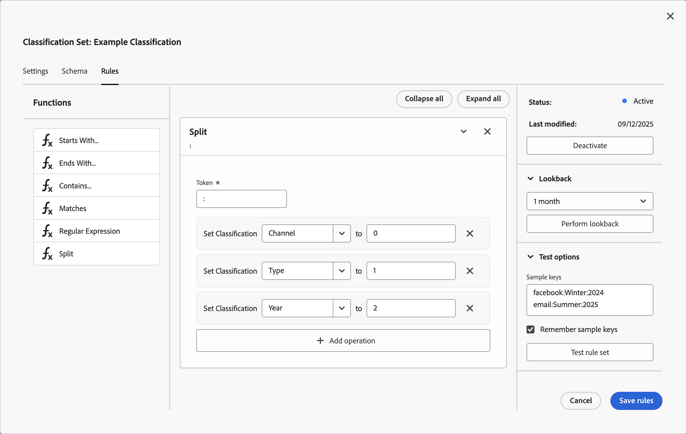

>[!TAB  テスト結果]

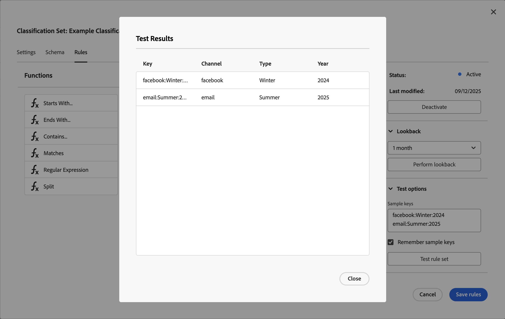

>[!ENDTABS]

+++

## ルールの優先順位

最後のルールは、次の場合に分類の値を決定します。

* 1つのキーディメンションの値が複数のルールに一致します。
* ルールセットには、同じ&#x200B;**[!UICONTROL Set Classification]**&#x200B;操作を持つルールが含まれています。

したがって、最も重要な&#x200B;**[!UICONTROL Set Classification]**&#x200B;操作を、ルールセットの最後のルールの一部としてランク付けする必要があります。

同じ&#x200B;**[!UICONTROL Set Classification]**&#x200B;操作を共有しない複数のルールを作成する場合、処理順序は問題ではありません。

### 例

ユーザーが検索文字列をキーディメンションとして使用してアスリートを検索する方法を&#x200B;**[!UICONTROL Type]**&#x200B;という分類で分類する必要があります。 例えば、次のルールセットを使用します。

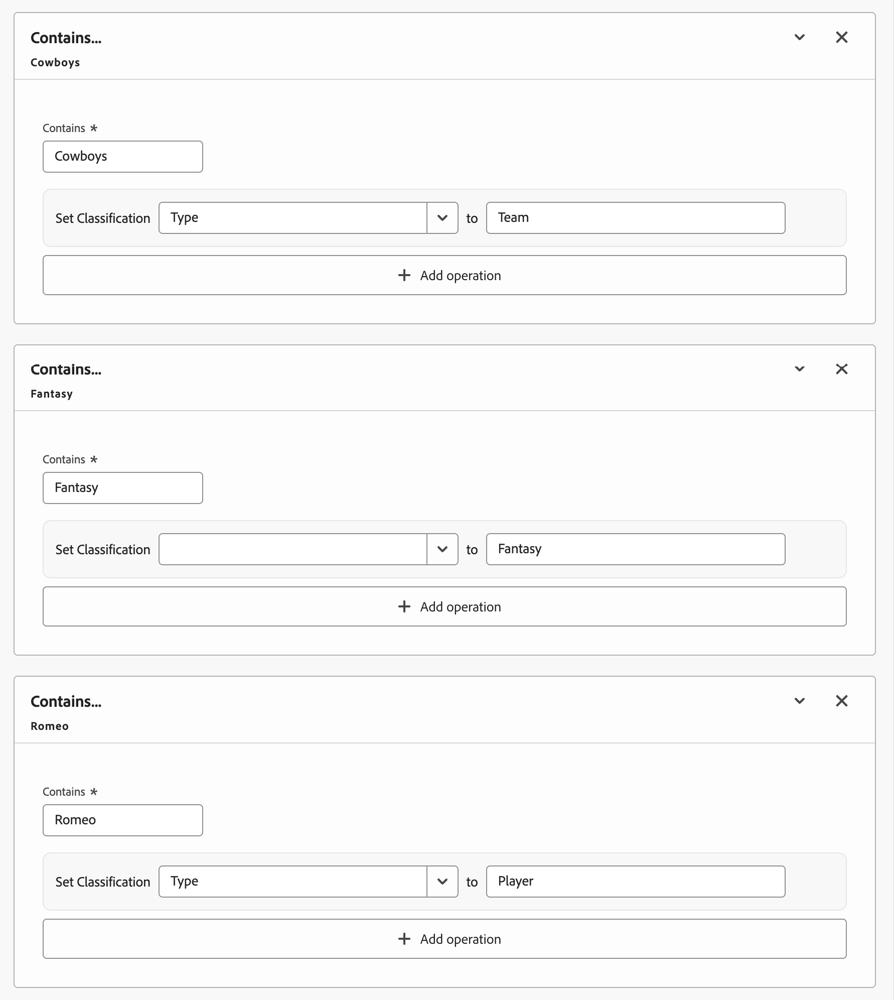

* ユーザーが`Cowboys Fantasy Tony Romo`を検索すると、`Romo`は&#x200B;**[!UICONTROL 種類]**&#x200B;に分類されます。
* ユーザーが`Cowboys Fantasy Tony Romeo`を検索すると、`Fantasy`は&#x200B;**[!UICONTROL 種類]**&#x200B;に分類されます。
* ユーザーが`Cowboys vs. Broncos`を検索すると、`Team`は&#x200B;**[!UICONTROL 種類]**&#x200B;に分類されます。
