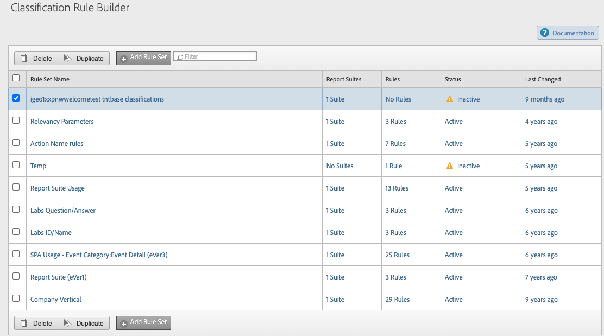

# 分類セットルール

分類セットルールを使用すると、変数の設定値に基づいて値を自動的に分類できます。 これらのルールは、分類セットのすべてのサブスクリプションのすべての受信変数値に適用されます。

**[!UICONTROL コンポーネント]**/**[!UICONTROL 分類セット]**/**[!UICONTROL セット]**/目的の分類セット名/**[!UICONTROL ルール]** をクリックします。

## ルール設定

ルールのセット全体に適用される設定。

* **[!UICONTROL ルールの上書き]**：分類値が存在する場合の、すべてのルールの動作を決定します。
   * **[!UICONTROL すべての値に適用]**：ルールが一致する場合、常に分類値を上書きします。
   * **[!UICONTROL 未設定の値にのみ適用]**：ルールが一致する場合、分類値が空白の場合にのみ書き込みます。 分類の値が存在する場合は、何もしません。
* **[!UICONTROL ルックバックウィンドウ]**：このルールがアクティブ化されると、すべてのルールが、ここで設定されたルックバックウィンドウ内で見られるすべての一意の値に対して実行されます。

## ルール

一意の値ごとに実行されるルールのリスト。

* **[!UICONTROL 検索]**：一致条件でルールをフィルタリングできる検索ボックス。
* **[!UICONTROL ルールを追加]**：ルールテーブルに空白行を追加します。
* **[!UICONTROL ルールセットをテスト]**：ルールを検証できるテスト UI を起動します。 左側では、手動でキー値を入力したり、分類ファイルをドラッグ&amp;ドロップしてテストする値を多数読み込んだりできます。 右側の表には、ルール・セットがアクティブ化された場合の分類済み値の初期結果が表示されます。 このインターフェイスは検証専用なので、値は分類されません。

目的のルールの横にあるチェックボックスをクリックして、1 つ以上のルールを選択します。 ルールを選択すると、次のオプションが表示されます。

* **[!UICONTROL 削除]**：ルールテーブルから行を削除します。
* **[!UICONTROL 複製]**：選択した行をルールテーブルの新しい行にコピーします。

## ルールテーブル

ルールテーブルは、マッチング条件と分類アクションの 2 つの主要な部分に垂直に分かれています。 各行（個々のルール）には、一致する条件と分類アクションが含まれています。

* **ルール番号**：ルールは、ルールテーブルを設定するのと同じ順序で実行されます。 [!UICONTROL &#x200B; ルールの上書き &#x200B;] が [!UICONTROL &#x200B; すべての値に適用 &#x200B;] に設定されている場合、最後の一致ルールにより、同じ分類ディメンションの以前のルールが上書きされます。 [!UICONTROL &#x200B; ルールの上書き &#x200B;] が [!UICONTROL &#x200B; 未設定の値にのみ適用 &#x200B;] に設定されている場合、分類値を設定する最初のルールが適用されます。
* **[!UICONTROL ルールタイプを選択]**：ルールの条件。 オプションには、「[!UICONTROL &#x200B; 次を含む &#x200B;]」、「[!UICONTROL &#x200B; 次で終わる &#x200B;]」、「[!UICONTROL &#x200B; 正規表現 &#x200B;]」、「[!UICONTROL &#x200B; 正規表現 &#x200B;]」、「[!UICONTROL &#x200B; 次で始まる &#x200B;] があります。
* **[!UICONTROL 一致条件を入力]**：一致するテキスト文字列。 ルールタイプとして [!UICONTROL &#x200B; 正規表現 &#x200B;] を選択すると、オーバーレイが表示され、値の入力、正規表現のテスト、サンプル構文の提供を行うことができます。
* **[!UICONTROL 分類を設定]**：値を割り当てる分類ディメンションを設定するドロップダウンリスト。 有効なオプションには、[ スキーマ ](schema.md) の要素が含まれます。
* **[!UICONTROL To]**：分類された値を設定するテキスト文字列。 ルールタイプが [!UICONTROL &#x200B; 正規表現 &#x200B;] の場合、テキストと一致グループの組み合わせを含めることができます。
