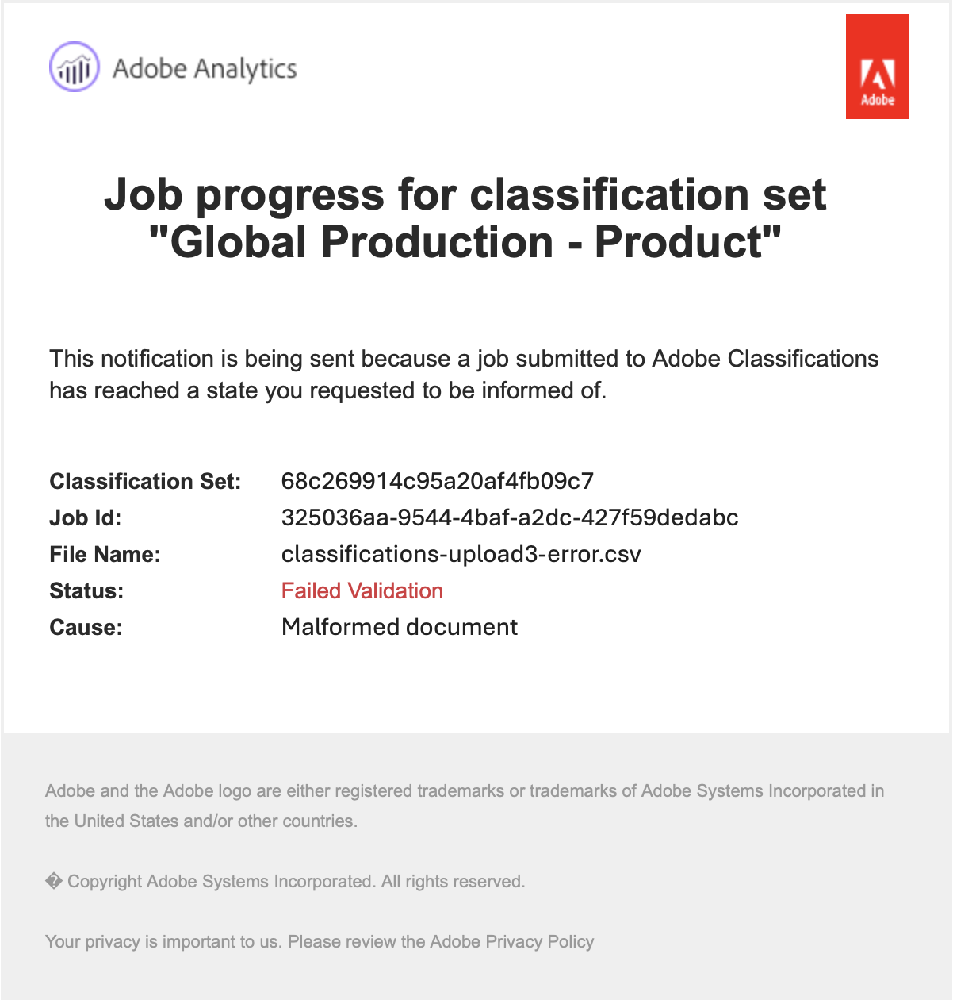

# 分類セットスキーマ

スキーマは、分類セットに対して定義した主要ディメンションに適用する分類のリストです。 例えば、製品をキーディメンションとして定義し、このフィールドに製品 SKU が含まれている場合、スキーマを使用して、製品名、製品カラー、製品サイズなどの分類を追加します。

分類セットのスキーマを編集するには：

1. Adobe Analytics の上部メニューバーで&#x200B;**[!UICONTROL コンポーネント]**&#x200B;を選択し、**[!UICONTROL 分類セット]**&#x200B;を選択します。
1. **[!UICONTROL 分類セット]**&#x200B;で、「**[!UICONTROL 分類セット]**」タブを選択します。
1. **[!UICONTROL 分類セット]** マネージャーで、スキーマを編集する分類セットを選択します。
1. **[!UICONTROL 分類セット：_分類セット名_]**&#x200B;ダイアログで、「**[!UICONTROL スキーマ]**」タブを選択します。 このタブは、次のインターフェイス要素で構成されます。

   

   * [分類リスト](#classification-list)
   * [検索](#search)
   * [アクション](#actions)
   * [アクションバー](#action-bar)

## 分類リスト

分類のリストには、次の列があります。

| 列 | 説明 |
|---|---|
| **[!UICONTROL 分類名]** | 分類に指定した名前。 |
| **[!UICONTROL ID 名]** | 分類に対するシステムの派生名。 この名前は読み取り専用で、ID 名を使用できます |
| **[!UICONTROL 分類者]** | 使用される場合、この分類の分類に使用されるルックアップ分類セットへのリンク。 |

## 検索

1 つ以上の分類をすばやく検索  できます。 検索をクリアするには、 を使用します。

## アクション

分類リストの上部にあるボタンとして、次のアクションを使用できます。

| アイコン | アクション | 説明 |
|---|---|---|
|  | **[!UICONTROL 追加]** | リストに [&#x200B; 分類を追加 &#x200B;](#add) します。 |
|  | **[!UICONTROL アップロード]** | [JSON、CSV、TSV、TAB ファイルをアップロードします &#x200B;](#upload)。 |
|  | **[!UICONTROL ダウンロード]** | [&#x200B; 分類データをダウンロード &#x200B;](#download)。 |
|  | **[!UICONTROL テンプレート]** | 分類データの [&#x200B; テンプレートをダウンロード &#x200B;](#template) します。 |
|  | **[!UICONTROL ジョブ履歴]** | 選択した分類セットでフィルタリングした [&#x200B; 分類セットジョブマネージャー &#x200B;](/help/components/classifications/sets/job-manager.md) を表示します。 |
|  | **[!UICONTROL 自動化]** | クラウドの場所を使用して [&#x200B; 分類データの取り込みを自動化 &#x200B;](#automate) します。 |

### 追加

新しい分類を追加するには、「**[!UICONTROL 追加]**」を選択します。

**[!UICONTROL 分類セット名 _の新しい分類を追加_]**&#x200B;ダイアログで、**[!UICONTROL 分類名]**&#x200B;を入力して&#x200B;**[!UICONTROL 追加]**&#x200B;を選択します。 分類がリストに追加されます。

### Upload

分類データを分類用のスキーマに読み込むには、**[!UICONTROL Upload]** を選択します。

1. **[!UICONTROL 新しい分類を追加]** ダイアログで、次の操作を行います。

   * 分類データを含むファイルをドラッグし、**[!UICONTROL ここにドラッグ&amp;ドロップ]** にドロップします。
   * **[!UICONTROL 参照]** を選択し、コンピューターまたはネットワークからファイルを選択します。

   ファイルのコンテンツの **[!UICONTROL スキーマプレビュー]** が表示されます。 プレビューには、ファイルのデータ列が表示されます。 列のサイズを変更するには、「」を選択し、「**[!UICONTROL 列のサイズ変更]**」を選択します。 列のサイズを変更できるハンドルが表示されます。

   列の分類セットで分類が定義されていない場合は、アラート  が表示されます。 このアラートは、既存の分類スキーマセットに分類が存在せず、読み込み時に作成されることを説明します。

1. **[!UICONTROL 競合時にデータを上書きしますか？現在の分類データを、新しく読み込んだデータで上書きするかどうかを]** します。 例：

   | | キー | 現在の製品カラー | ファイルを読み込み | 新しい製品カラー |
   |---|---|---|---|---|
   | **[!UICONTROL 競合時にデータを上書きしますか？]** | 1234 | 緑 | 青 | 青 |
   | **[!UICONTROL 競合時にデータを上書きしますか？]** | 1234 | 緑 | 青 | 緑 |

1. 「**[!UICONTROL 適用]**」を選択します。列が既存のスキーマセットに分類として存在しない場合、アラートが表示されます。 これらの列は、アップロードを確定すると、新しい分類として追加されます。

   

   「**[!UICONTROL アップロードを確認]**」を選択して、アップロードを確定します。 **[!UICONTROL アップロードをキャンセル]** を選択して、アップロードをキャンセルします。

### ダウンロード

分類データをダウンロードするには、「**[!UICONTROL ダウンロード]**」を選択します。

**[!UICONTROL 分類セット名 _のデータをダウンロード_]**&#x200B;ダイアログで、

1. ダウンロードする **[!UICONTROL 行]** の数を入力します。 例：`10000`。
1. 分類データの行をダウンロードする期間を選択するには、「**[!UICONTROL 次の期間に受信した行をダウンロード]**」に開始データと終了データを入力します。 または  を使用して、カレンダーポップアップを使用して期間を選択します。
1. 返すデータを選択するには、「返されるデータ **[!UICONTROL からオプションを選択し]** す。

   * **[!UICONTROL すべての値]** 現在の分類データのすべての値を返します。
   * **[!UICONTROL すべての列が空です]** 既存の分類データのキー値を含む列を返します。 値が存在しない分類データの、値のない列。
   * **[!UICONTROL すべての列が空]** 既存の分類データの値を含むキー列を返します。 分類データの値を持たない列。
1. ダウンロードした分類データの [&#x200B; ファイル形式 &#x200B;](/help/components/classifications/sets/data-files.md#general-file-requirements) を選択するには、**[!UICONTROL ファイル形式]** ドロップダウンメニューからオプションを選択します。 オプションは次のとおりです。

   * **[!UICONTROL JSON]**。
   * **[!UICONTROL コンマ区切り値]** （CSV）
   * **[!UICONTROL Excel タブ区切り値]** （TSV または TAB）。

1. ファイルのダウンロード時に使用する [&#x200B; ファイルエンコーディング &#x200B;](/help/components/classifications/sets/data-files.md#general-file-requirements) を選択するには、「ファイルエンコーディング」ドロップダウンメニューからオプションを選択します。 オプションは次のとおりです。

   * **[!UICONTROL UTF-8]**。
   * **[!UICONTROL Latin-1]**。

1. 「**[!UICONTROL ダウンロード]**」を選択して、分類データをダウンロードします。 ダウンロードしたファイルは、ブラウザーのデフォルトのダウンロードディレクトリにあります。ファイルのタイトルは「<code><i> 分類セット </i> です。<i>json</i>|<i>csv</i>|<i>tsv</i></code>。ファイルが既に存在する場合は、シーケンス番号 <code> （<i>x</i>）</code> がファイル名に追加されます。  データを返さないオプションを指定した場合は、日付範囲と返されるデータのオプションを変更するように通知する **[!UICONTROL 通知]** ダイアログが表示されます。

### テンプレート

分類データのテンプレートをダウンロードするには、「**[!UICONTROL テンプレート]**」を選択します。

**[!UICONTROL 分類セット名 _のテンプレートをダウンロード_]**&#x200B;ダイアログで、

1. ダウンロードした分類データの [&#x200B; ファイル形式 &#x200B;](/help/components/classifications/sets/data-files.md#general-file-requirements) を選択するには、**[!UICONTROL ファイル形式]** ドロップダウンメニューからオプションを選択します。 オプションは次のとおりです。

   * **[!UICONTROL コンマ区切り値]**。
   * **[!UICONTROL Excel タブ区切り値]**。

1. ファイルのダウンロード時に使用する [&#x200B; ファイルエンコーディング &#x200B;](/help/components/classifications/sets/data-files.md#general-file-requirements) を選択するには、「ファイルエンコーディング」ドロップダウンメニューからオプションを選択します。 オプションは次のとおりです。

   * **[!UICONTROL UTF-8]**。
   * **[!UICONTROL Latin-1]**。

1. 「**[!UICONTROL ダウンロード]**」を選択して、分類データテンプレートをダウンロードします。 ダウンロードしたファイルは、ブラウザーのデフォルトのダウンロードディレクトリにあります。タイトルは <code><i> 分類セット </i> です。<i>csv</i>|<i>tsv</i></code>。ファイルが既に存在する場合は、シーケンス番号 <code> （<i>x</i>）</code> がファイル名に追加されます。

### 自動化 {#automate}

>[!CONTEXTUALHELP]
>id="classificationsets_schema_automate_locationaccount"
>title="場所のアカウント"
>abstract="分類データのインポートをサポートするアカウントタイプの場所アカウントのリスト。 **[!UICONTROL 新しいアカウント]** を選択して、新しい場所アカウントを作成します。"
>additional-url="https://experienceleague.adobe.com/docs/analytics/components/locations/configure-import-accounts.html?lang=ja" text="クラウドのインポートおよびエクスポートアカウントの設定"

>[!CONTEXTUALHELP]
>id="classificationsets_schema_automate_location"
>title="場所"
>abstract="分類データのインポートをサポートする、選択した場所アカウントでの場所のリスト。 **[!UICONTROL 新しい場所]** を選択して、新しい場所を作成します。"
>additional-url="https://experienceleague.adobe.com/docs/analytics/components/locations/configure-import-locations.html?lang=ja" text="クラウドの読み込み場所と書き出し場所の設定"

分類の取り込みを自動化するには、「 **[!UICONTROL 自動化]**」を選択します。

**[!UICONTROL 分類セット名 _ダイアログの_]**&#x200B;取り込み場所を関連付ける/更新」ダイアログで、

1. クラウドの場所を選択するには、**[!UICONTROL 場所アカウント]** からオプションを選択します。 [&#x200B; 分類データの読み込みを許可する、サポートされているアカウントタイプの場所アカウント &#x200B;](https://experienceleague.adobe.com/ja/docs/analytics/components/locations/configure-import-accounts) のみが表示されます。 新しいアカウントを作成するには、「**[!UICONTROL 新しいアカウント]**」を選択します。
1. 場所を選択するには、**[!UICONTROL 場所]** からオプションを選択します。 分類データのインポート用に選択した勘定科目タイプの場所のみが表示されます。 新しい場所を作成するには、「**[!UICONTROL 新しい場所]**」を選択します。

   >[!IMPORTANT]
   >
   >作成または選択する場所には、分類データファイルをホストする **[!UICONTROL バケット]** 内に **[!UICONTROL プレフィックス]** （フォルダー）を含める必要があります。 例えば、`files` という名前のフォルダーです。 バケットのルートでのファイルのホスティングは、ほとんどのクラウドの場所では機能しません。
   >

1. 区切り文字を選択するには、「**[!UICONTROL リスト区切り]**」ドロップダウンメニューからオプションを選択します。 次のオプションがあります。
   * **[!UICONTROL コンマ，]**
   * **[!UICONTROL セミコロン ;]**
   * **[!UICONTROL コロン :]**
   * **[!UICONTROL 縦棒グラフ |]**
   * **[!UICONTROL スペース]**
   * **[!UICONTROL タブ]**
1. ファイルのダウンロード時に [&#x200B; ファイルエンコーディング &#x200B;](/help/components/classifications/sets/data-files.md#general-file-requirements) を選択するには、**[!UICONTROL ファイルエンコーディング]** ドロップダウンメニューからオプションを選択します。 オプションは次のとおりです。

   * **[!UICONTROL UTF-8]**。
   * **[!UICONTROL Latin-1]**。

1. 取り込みジョブの完了をユーザーに通知するには、**[!UICONTROL 個のメール （取り込みジョブの完了時に通知する） （コンマ区切り）]** をコンマで区切ってメールアドレスを入力します。
1. 「**[!UICONTROL 検証]**」を選択します。 クラウドの場所への接続が検証されます。
1. 検証が成功すると、**[!UICONTROL Location の検証が成功したことを示すトーストメッセージが表示されます。 クラウドストレージへの接続が確認されました。]**  クラウド接続への接続を作成した場合は、「**[!UICONTROL &#x200B; 保存 &#x200B;]**」を選択します。 それ以外の場合は、「**[!UICONTROL &#x200B; 更新 &#x200B;]**」を選択します。 または、「**[!UICONTROL &#x200B; キャンセル &#x200B;]**」を選択して、クラウドの場所の設定をキャンセルします。

クラウドの場所にファイルをアップロードすると、15 分以内にファイルが検出され、読み込みジョブとして送信されます。 そのインポートジョブの結果は、[&#x200B; 分類ジョブマネージャー &#x200B;](/help/components/classifications/sets/job-manager.md) にレポートされます。 取り込みジョブの完了を通知するユーザーのリストに追加された場合は、メールメッセージも届きます。

例：

{width="400"}

## アクションバー

アクションバーには、選択した分類で使用可能なアクションが表示されます。 利用可能なオプションは次のとおりです。

| アイコン | アクション | 説明 |
|---|---|---|
|  | **[!UICONTROL ルックアップの追加]** | 分類セットをルックアップ（サブ分類）として追加します。  添付 **[!UICONTROL 参照]** テーブルで、次の操作を行います。 <ol><li>**[!UICONTROL 分類名]** ドロップダウンメニューからルックアップ分類を選択します。</li><li>「**[!UICONTROL 追加]**」を選択します。</li></ol>ルックアップ分類が分類に追加され、内部 ID を使用して **[!UICONTROL 分類者]** 列にリストされます。 |
|  | **[!UICONTROL ルックアップを削除]** | 分類セットをルックアップとして削除します。 分類からルックアップを完全に削除するには、**[!UICONTROL 分類セット _から_ 分類 _確認ダイアログの_]**&#x200B;削除&#x200B;**[!UICONTROL を選択します]**。 |
|  | **[!UICONTROL 名前変更]** | 分類の **[!UICONTROL 分類名]** の名前を変更します。 **[!UICONTROL 名前を変更：_分類名_]**&#x200B;ダイアログで、新しい名前を入力して&#x200B;**[!UICONTROL 名前を変更]**&#x200B;を選択します。 |
|  | **[!UICONTROL 削除]** | 分類を削除します。 **[!UICONTROL 分類名を削除 _ダイアログが表示され_]**&#x200B;す。 分類を削除するには、「**[!UICONTROL 削除]**」を選択します。 |

<!--

View currently configured classification dimensions for this classification set.

**[!UICONTROL Components]** > **[!UICONTROL Classification sets]** > **[!UICONTROL Sets]** > Click the desired classification set name > **[!UICONTROL Schema]**

The following buttons are available:

* **[!UICONTROL Upload]**: Manually upload classification data for a classification dimensions. `JSON`, `CSV`, `TSV`, and `TAB` files are supported. Uploading a valid file shows a table preview of data to classify.
  * **[!UICONTROL File encoding]**: Select the correct file encoding using this drop-down. Valid options include [!UICONTROL UTF-8] and [!UICONTROL Latin1].
  * **[!UICONTROL List delimiter]**: Select the correct list delimiter. If using a downloaded file or template file, make sure that the [!UICONTROL List delimiter] here matches the [!UICONTROL List delimiter] when the file was downloaded.
  * **[!UICONTROL Apply]**: Save the uploaded classification data to the classification set.

  

* **[!UICONTROL Download]**: Download key values and their classification columns.
  * **[!UICONTROL Rows]**: The maximum number of rows to include in the download file.
  * **[!UICONTROL Download rows received between]**: A calendar date picker that allows you to filter key values by when they appear in reporting. If a key value was not collected in this date range, it does not appear in the downloaded file.
  * **[!UICONTROL Data returned]**: A drop-down list that lets you filter key values included in the downloaded file based on their associated classification data.
    * **[!UICONTROL All classified values]**: Includes rows where classification data is included in at least one column.
    * **[!UICONTROL All unclassified values]**: Includes rows where classification data is missing in at least one column.
  * **[!UICONTROL File format]**: A drop-down list that determines the file format that the download file is in. Options include [!UICONTROL JSON], [!UICONTROL Comma separated values], and [!UICONTROL Excel tab separated values].
  * **[!UICONTROL File encoding]**: A drop-down list that determines the file encoding. Options include [!UICONTROL UTF-8] and [!UICONTROL Latin1]. UTF-8 is recommended.

  

* **[!UICONTROL Template]**: Download a template file. This file is similar to the [!UICONTROL Download] button, except it does not contain any classification data or key values.
  * **[!UICONTROL File format]**: A drop-down list that determines the file format that the template file is in. Options include [!UICONTROL Comma separated values], and [!UICONTROL Excel tab separated values].
  * **[!UICONTROL File encoding]**: A drop-down list that determines the file encoding. Options include [!UICONTROL UTF-8] and [!UICONTROL Latin1]. UTF-8 is recommended.
  * **[!UICONTROL List delimiters]**: A drop-down list that determines the list delimiter separating classification columns on each row.

  

* **[!UICONTROL Job history]**: A shortcut link that takes you to the [Job manager](../job-manager.md), showing jobs only for this classification set.
* **[!UICONTROL Automate]**: Automatically ingest data from external storage locations.
  * **[!UICONTROL Location account]**: A drop-down list showing existing location accounts that your organization has configured. If your organization hasn't already configured a location account, you can configure one by selecting [!UICONTROL **Create a new account**].
    
    For information about configuring the location account, see [Configure cloud import and export accounts](/help/components/locations/configure-import-accounts.md).

  * **[!UICONTROL Location]**: A drop-down list showing existing locations that your organization has configured. If your organization hasn't already configured a location, you can configure one by selecting [!UICONTROL **Create a new location**]. 

    For information about configuring a location, see [Configure cloud import and export locations](/help/components/locations/configure-import-locations.md). 

  * **[!UICONTROL Delimiter]**: The column delimiter for uploaded files. Options include [!UICONTROL Comma], [!UICONTROL Semicolon], [!UICONTROL Colon], [!UICONTROL Vertical bar], [!UICONTROL Space], [!UICONTROL Forward slash], [!UICONTROL Backward slash], [!UICONTROL Dash], or [!UICONTROL Underscore].

  * **[!UICONTROL Encoding]**: A drop-down list that determines the file encoding. Options include [!UICONTROL UTF-8] and [!UICONTROL Latin1]. UTF-8 is recommended.

The following actions are available only after selecting a classification.

* **Add lookup**: A lookup table is a classification of a classification. It is metadata about a classification value, rather than the variable itself. For example, the Product variable might have a classification of "color code". A lookup table of "color name" might be attached to "color code" to explain what the colors are.

  

* **Rename**: Lets you rename the classification.

* **Delete**: Lets you delete the classification.
-->