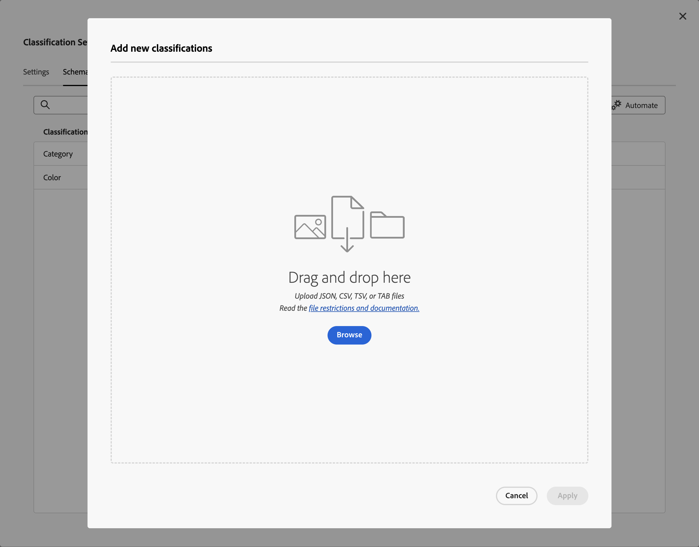
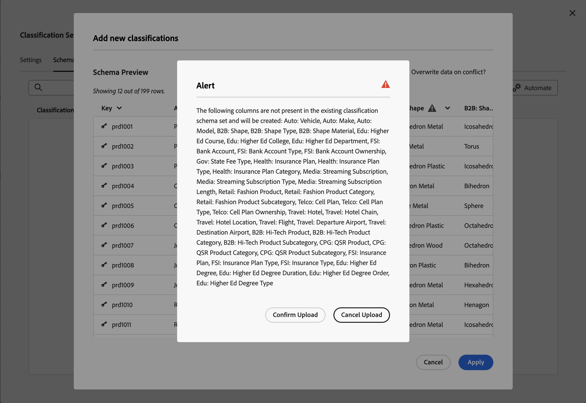
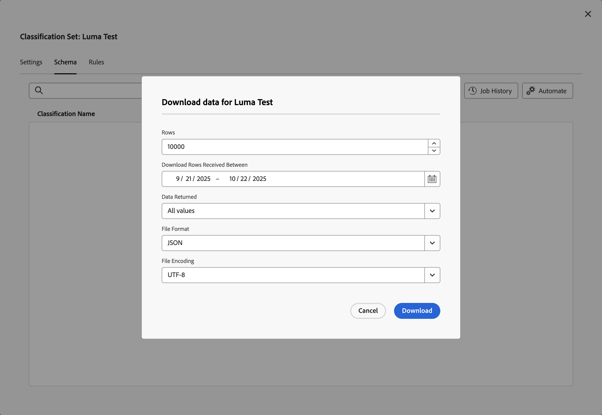

# 分類セットスキーマ

スキーマは、分類セット用に定義したキー次元に適用する分類のリストです。 例えば、製品をキーディメンションとして定義し、このフィールドに製品SKUが含まれている場合、スキーマを使用して製品名、製品カラー、製品サイズなどの分類を追加します。

分類セットのスキーマを編集するには：

1. Adobe Analytics の上部メニューバーで&#x200B;**[!UICONTROL コンポーネント]**&#x200B;を選択し、**[!UICONTROL 分類セット]**&#x200B;を選択します。
1. **[!UICONTROL 分類セット]**&#x200B;で、「**[!UICONTROL 分類セット]**」タブを選択します。
1. **[!UICONTROL 分類セット]** マネージャーで、スキーマを編集する分類セットを選択します。
1. **[!UICONTROL 分類セット : _分類セット名_]**&#x200B;ダイアログで、「**[!UICONTROL スキーマ]**」タブを選択します。 このタブは、次のインターフェイス要素で構成されます。

   

   * [分類リスト](#classification-list)
   * [検索](#search)
   * [アクション](#actions)
   * [アクションバー](#action-bar)

## 分類リスト

分類のリストには、次の列があります。

| 列 | 説明 |
|---|---|
| **[!UICONTROL 分類名]** | 分類に指定した名前。 |
| **[!UICONTROL ID名]** | 分類のシステムによる派生名。 この名前は読み取り専用の値で、ID名を使用できます |
| **[!UICONTROL 分類者：]** | 使用する場合は、この分類の分類に使用する検索分類セットへのリンクを指定します。 |

## 検索

で1つ以上の分類をすばやく検索できます。 を使用して検索をクリアします。

## アクション

分類リストの上部にあるボタンとして、次のアクションを使用できます。

| アイコン | アクション | 説明 |
|---|---|---|
|  | **[!UICONTROL 追加]** | [分類](#add)をリストに追加します。 |
|  | **[!UICONTROL アップロード]** | [JSON、CSV、TSV、またはTAB ファイルをアップロード &#x200B;](#upload)。 |
|  | **[!UICONTROL ダウンロード]** | [分類データをダウンロード &#x200B;](#download)。 |
|  | **[!UICONTROL テンプレート]** | [分類データ用のテンプレート &#x200B;](#template)をダウンロードします。 |
|  | **[!UICONTROL ジョブ履歴]** | 選択した分類セット用にフィルタリングされた[分類セットジョブマネージャー](/help/components/classifications/sets/job-manager.md)を表示します。 |
|  | **[!UICONTROL 自動化]** | [&#x200B; クラウドの場所を使用して、分類データ &#x200B;](#automate)の取り込みを自動化します。 |

### 追加

新しい分類を追加するには、 **[!UICONTROL 追加]**&#x200B;を選択します。

**[!UICONTROL 分類セット名&#x200B;_の新しい分類を追加ダイアログで、_]**&#x200B;分類名&#x200B;**[!UICONTROL を入力し、]**&#x200B;追加&#x200B;**[!UICONTROL を選択します。]**&#x200B;分類がリストに追加されます。

### アップロード

分類データを分類のスキーマに読み込むには、 **[!UICONTROL Upload]**&#x200B;を選択します。

1. **[!UICONTROL 新しい分類を追加]** ダイアログ：

   * 分類データを含むファイルをドラッグして、**[!UICONTROL ここにドラッグ&amp;ドロップ]**&#x200B;します。
   * **[!UICONTROL 参照]**&#x200B;を選択し、コンピューターまたはネットワークからファイルを選択します。

   ファイルの内容の&#x200B;**[!UICONTROL スキーマプレビュー]**&#x200B;が表示されます。 プレビューには、ファイルのデータ列が表示されます。 列のサイズを変更するには、を選択し、**[!UICONTROL 列のサイズ変更]**&#x200B;を選択します。 列のサイズを変更できるハンドルが表示されます。

   列の分類セットで分類が定義されていない場合、アラート が表示されます。 このアラートは、分類が既存の分類スキーマセットに存在せず、読み込み時に作成されることを説明します。

1. 競合に関するデータを&#x200B;**[!UICONTROL 上書きを選択しますか？現在の分類データを新しく読み込まれたデータで上書きする場合は、]**。 例：

   | | キー | 現在の商品カラー | ファイルを読み込む | 新商品のカラー |
   |---|---|---|---|---|
   |  **[!UICONTROL 競合に関するデータを上書きしますか？]** | 1234 | グリーン | 青 | 青 |
   |  **[!UICONTROL 競合に関するデータを上書きしますか？]** | 1234 | グリーン | 青 | グリーン |

1. 「**[!UICONTROL 適用]**」を選択します。既存のスキーマセットに分類として列が存在しない場合は、アラートが表示されます。 アップロードを確認すると、これらの列は新しい分類として追加されます。

   

   「**[!UICONTROL アップロードの確認]**」を選択して、アップロードを確認します。 「**[!UICONTROL アップロードをキャンセル]**」を選択して、アップロードをキャンセルします。

### ダウンロード

分類データをダウンロードするには、 **[!UICONTROL ダウンロード]**&#x200B;を選択します。

**[!UICONTROL 分類セット名&#x200B;_のデータをダウンロード ダイアログで次の操作を行います。_]**

1. ダウンロードする&#x200B;**[!UICONTROL 行]**&#x200B;の数を入力します。 例：`10000`。
1. 分類データの行をダウンロードする期間を選択するには、**[!UICONTROL 受信した行を]**&#x200B;の間でダウンロードするための開始データと終了データを入力します。 または、を使用して、カレンダーのポップアップを使用して期間を選択します。
1. 返すデータを選択するには、**[!UICONTROL 返されるデータ]**&#x200B;からオプションを選択します。

   * **[!UICONTROL すべての値]**&#x200B;は、現在の分類データのすべての値を返します。
   * **[!UICONTROL 空の列]**&#x200B;は、既存の分類データのキー値を持つ列を返します。 値が存在しない分類データの値を持たない列を返します。
   * **[!UICONTROL すべての列が空です]**&#x200B;は、既存の分類データの値を持つキー列を返します。 分類データの値を持たない列があります。
1. ダウンロードした分類データの[&#x200B; ファイル形式](/help/components/classifications/sets/data-files.md#general-file-requirements)を選択するには、**[!UICONTROL ファイル形式]** ドロップダウンメニューからオプションを選択します。 オプションは次のとおりです。

   * **[!UICONTROL JSON]**。
   * **[!UICONTROL コンマ区切り値]** （CSV）。
   * **[!UICONTROL タブ区切りの値]** （TSVまたはTAB）。

1. ファイルのダウンロード時に[&#x200B; ファイルエンコーディング &#x200B;](/help/components/classifications/sets/data-files.md#general-file-requirements)を選択するには、「ファイルのエンコーディング」ドロップダウンメニューからオプションを選択します。 オプションは次のとおりです。

   * **[!UICONTROL UTF-8]**。
   * **[!UICONTROL Latin-1]**。

1. 分類データをダウンロードするには、**[!UICONTROL ダウンロード]**&#x200B;を選択します。 ダウンロードしたファイルは、ブラウザーのデフォルトのダウンロードディレクトリで見つけることができ、ファイルのタイトルは<code><i>分類セット </i>です。<i>json</i>|<i>csv</i>|<i>tsv</i></code>。ファイルが既に存在する場合、シーケンス番号<code> （<i>x</i>）</code> がファイル名に追加されます。  データを返さないオプションを指定した場合は、**[!UICONTROL 通知]** ダイアログが表示され、日付範囲と返されるデータのオプションを変更するよう通知されます。

### テンプレート

分類データのテンプレートをダウンロードするには、 **[!UICONTROL Template]**&#x200B;を選択します。

**[!UICONTROL 分類セット名&#x200B;_ダイアログの_]**&#x200B;ダウンロードテンプレートで：

1. ダウンロードした分類データの[&#x200B; ファイル形式](/help/components/classifications/sets/data-files.md#general-file-requirements)を選択するには、**[!UICONTROL ファイル形式]** ドロップダウンメニューからオプションを選択します。 オプションは次のとおりです。

   * **[!UICONTROL コンマ区切り値]**。
   * **[!UICONTROL Excel タブ区切り値]**。

1. ファイルのダウンロード時に[&#x200B; ファイルエンコーディング &#x200B;](/help/components/classifications/sets/data-files.md#general-file-requirements)を選択するには、「ファイルのエンコーディング」ドロップダウンメニューからオプションを選択します。 オプションは次のとおりです。

   * **[!UICONTROL UTF-8]**。
   * **[!UICONTROL Latin-1]**。

1. 分類データテンプレートをダウンロードするには、**[!UICONTROL ダウンロード]**&#x200B;を選択します。 ダウンロードしたファイルは、ブラウザーのデフォルトのダウンロードディレクトリで見つかります。タイトルは<code><i>分類セット </i>です。<i>csv</i>|<i>tsv</i></code>。ファイルが既に存在する場合、シーケンス番号<code> （<i>x</i>）</code> がファイル名に追加されます。

### 自動化 {#automate}

>[!CONTEXTUALHELP]
>id="classificationsets_schema_automate_locationaccount"
>title="場所のアカウント"
>abstract="分類データの読み込みをサポートするアカウントタイプの、場所アカウントのリスト。「**[!UICONTROL 新規アカウント]**」を選択して、新しい場所アカウントを作成します。"
>additional-url="https://experienceleague.adobe.com/docs/analytics/components/locations/configure-import-accounts.html?lang=jp" text="クラウドの読み込みアカウントおよび書き出しアカウントの設定"

>[!CONTEXTUALHELP]
>id="classificationsets_schema_automate_location"
>title="場所"
>abstract="分類データの読み込みをサポートする、選択した場所アカウントでの場所のリスト。「**[!UICONTROL 新しい場所]**」を選択して、新しい場所を作成します。"
>additional-url="https://experienceleague.adobe.com/docs/analytics/components/locations/configure-import-locations.html?lang=jp" text="クラウドの読み込み場所および書き出し場所の設定"

クラウドアカウントとクラウドの場所の設定と使用により、分類データの取り込みを自動化できます。

>[!IMPORTANT]
>クラウドアカウントからの分類取り込みを自動化するには、ネットワークにデータを取り込むために、IP アドレス範囲を指定する必要があります。 使用するAnalytics データセンターの場所に応じて、1つ以上のIP アドレス範囲を設定します。
>
>| Analytics データセンターの場所 | このIP アドレス範囲をネットワーク内の許可リストに追加する |
>|---|---:|
>| 太平洋岸北西部 | `52.254.104.0/22` |
>| ロンドン | `51.138.16.0/22` |
>| シンガポール | `20.40.0.0/14 ` |
>

分類の取り込みを自動化するには、 **[!UICONTROL 自動化]**&#x200B;を選択します。

**[!UICONTROL 分類セット名&#x200B;_の取り込み場所の関連付け/更新ダイアログで、次の操作を行います。_]**

1. クラウドの場所を選択するには、**[!UICONTROL 場所アカウント]**&#x200B;からオプションを選択します。 分類データ [の読み込みを許可する、サポートされているアカウントタイプの](https://experienceleague.adobe.com/ja/docs/analytics/components/locations/configure-import-accounts)場所アカウントのみが表示されます。 新しいアカウントを作成するには、**[!UICONTROL 新しいアカウント]**&#x200B;を選択します。
1. 場所を選択するには、**[!UICONTROL 場所]**&#x200B;からオプションを選択します。 分類データのインポート用に選択したアカウントタイプの場所のみが表示されます。 新しい場所を作成するには、**[!UICONTROL 新しい場所]**&#x200B;を選択します。

   >[!IMPORTANT]
   >
   >作成または選択する場所には、分類データファイルをホストするために、**[!UICONTROL バケット]**&#x200B;内の&#x200B;**[!UICONTROL 接頭辞]** （フォルダー）を含める必要があります。 例えば、`files`という名前のフォルダーがあります。 バケットのルートでファイルをホストすると、ほとんどのクラウドの場所で機能しません。
   >

1. 区切り文字を選択するには、**[!UICONTROL リスト区切り]** ドロップダウンメニューからオプションを選択します。 オプションは次のとおりです。
   * **[!UICONTROL カンマ ,]**
   * **[!UICONTROL セミコロン ;]**
   * **[!UICONTROL コロン :]**
   * **[!UICONTROL 縦棒|]**
   * **[!UICONTROL スペース]**
   * **[!UICONTROL タブ]**
1. ファイルのダウンロード時に[&#x200B; ファイルエンコーディング &#x200B;](/help/components/classifications/sets/data-files.md#general-file-requirements)を選択するには、**[!UICONTROL ファイルエンコーディング]** ドロップダウンメニューからオプションを選択します。 オプションは次のとおりです。

   * **[!UICONTROL UTF-8]**。
   * **[!UICONTROL Latin-1]**。

1. 取り込みジョブの完了をユーザーに通知するには、取り込みジョブの完了時に通知する電子メール **[!UICONTROL 件の電子メールアドレスをコンマで区切って入力します（コンマで区切ります）]**。
1. 「**[!UICONTROL 検証]**」を選択します。 クラウドの場所への接続が検証されます。
1. 検証が成功すると、 **[!UICONTROL 場所の検証が成功したことを示すトーストメッセージが表示されます。 クラウドストレージへの接続が検証されました。]**  クラウド接続への接続を作成した場合は、**[!UICONTROL &#x200B;保存&#x200B;]**&#x200B;を選択します。 それ以外は、**[!UICONTROL &#x200B;更新&#x200B;]**&#x200B;を選択してください。 または、**[!UICONTROL &#x200B; キャンセル &#x200B;]**&#x200B;を選択して、クラウドの場所の設定をキャンセルします。

クラウドの場所にファイルをアップロードすると、15分以内にファイルが検出され、インポートジョブとして送信されます。 その読み込みジョブの結果は、[分類ジョブマネージャー](/help/components/classifications/sets/job-manager.md)に報告されます。 取り込みジョブの完了を通知するためにユーザーのリストに追加された場合は、メールメッセージも受信します。

例：

{width="400"}

## アクションバー

アクションバーには、選択した分類で使用可能なアクションが表示されます。 利用可能なオプションは次のとおりです。

| アイコン | アクション | 説明 |
|---|---|---|
|  | **[!UICONTROL ルックアップの追加]** | 分類セットをルックアップ（サブクラス分け）として追加します。 **[!UICONTROL 添付ルックアップ]** テーブルで： <ol><li>「**[!UICONTROL 分類名]**」ドロップダウンメニューから検索分類を選択します。</li><li>「**[!UICONTROL 追加]**」を選択します。</li></ol>検索分類が分類に追加され、内部IDを使用して&#x200B;**[!UICONTROL 分類基準]**&#x200B;列に一覧表示されます。 |
|  | **[!UICONTROL ルックアップの削除]** | 参照として分類セットを削除します。 参照を分類から完全に削除するには、**[!UICONTROL 分類セット _を_分類&#x200B;_確認ダイアログから削除で_]**&#x200B;削除&#x200B;**[!UICONTROL を選択します。]** |
|  | **[!UICONTROL 名前変更]** | 分類の&#x200B;**[!UICONTROL 分類名]**&#x200B;の名前変更。 **[!UICONTROL 名前変更：_分類名_]**&#x200B;ダイアログで、新しい名前を入力し、**[!UICONTROL 名前変更]**&#x200B;を選択します。 |
|  | **[!UICONTROL 削除]** | 分類を削除します。 **[!UICONTROL 分類名&#x200B;_を削除_]**&#x200B;ダイアログが表示されます。 分類を削除するには、**[!UICONTROL 削除]**&#x200B;を選択します。 |
