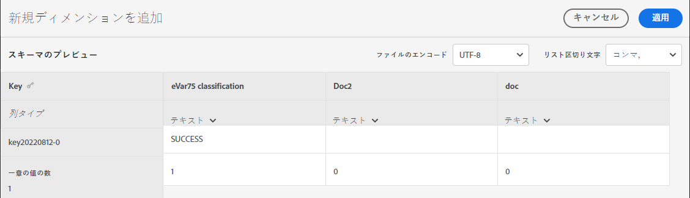

# スキーマ

この分類セットに対して現在設定されている分類ディメンションを表示します。

**[!UICONTROL コンポーネント]** > **[!UICONTROL 分類セット]** > **[!UICONTROL セット]** > 目的の分類セット名をクリック > **[!UICONTROL スキーマ]**

次のボタンを使用できます。

<!--* **[!UICONTROL Add]**: Adds an empty row so that you can add a classification dimension to the schema.-->
* **[!UICONTROL アップロード]**：1 つ以上の分類ディメンションの分類データを手動でアップロードします。`JSON`, `CSV`, `TSV`、および `TAB` ファイルがサポートされています。 有効なファイルをアップロードすると、分類するデータのテーブルプレビューが表示されます。
   * **[!UICONTROL ファイルのエンコーディング]**:このドロップダウンを使用して、適切なファイルエンコーディングを選択します。 有効なオプションは、[!UICONTROL UTF-8] および [!UICONTROL Latin1] です。
   * **[!UICONTROL リスト区切り]**：正しいリスト区切り文字を選択します。 ダウンロードしたファイルまたはテンプレートファイルを使用する場合は、ここの[!UICONTROL リスト区切り文字]がファイルのダウンロード時の[!UICONTROL リスト区切り文字]と一致していることを確認してください。
   * **[!UICONTROL 適用]**:アップロードした分類データを分類セットに保存します。

  

* **[!UICONTROL ダウンロード]**：キー値とその分類列をダウンロードします。
   * **[!UICONTROL 行]**：ダウンロードファイルに含める行の最大数。
   * **[!UICONTROL 次の期間に受信した行をダウンロード]**：レポートに表示されるときにキー値をフィルタリングできるカレンダー日付選択。この日付範囲でキー値が収集されなかった場合、ダウンロードされたファイルには表示されません。
   * **[!UICONTROL 返されたデータ]**:関連する分類データに基づいて、ダウンロードしたファイルに含まれるキー値をフィルタリングできるドロップダウンリストです。
      * **[!UICONTROL すべての分類済み値]**：分類データが 1 つ以上の列に含まれる行を含みます。
      * **[!UICONTROL すべての未分類の値]**：分類データが 1 つ以上の列に存在しない行を含みます。
   * **[!UICONTROL ファイル形式]**:ダウンロードファイルの形式を決定するドロップダウンリスト。 オプションには、[!UICONTROL JSON]、[!UICONTROL コンマ区切り値]および [!UICONTROL Excel タブ区切り値]があります。
   * **[!UICONTROL ファイルのエンコーディング]**:ファイルのエンコーディングを決定するドロップダウンリストです。 オプションには、[!UICONTROL UTF-8] および [!UICONTROL Latin1] があります。UTF-8 をお勧めします。

  

* **[!UICONTROL テンプレート]**：テンプレートファイルをダウンロードします。このファイルは、分類データやキー値が含まれていないことを除けば、[!UICONTROL ダウンロード]ボタンに似ています。
   * **[!UICONTROL ファイル形式]**:テンプレートファイルが含まれるファイル形式を決定するドロップダウンリスト。 オプションには、[!UICONTROL コンマ区切り値]および [!UICONTROL Excel タブ区切り値]があります。
   * **[!UICONTROL ファイルのエンコーディング]**:ファイルのエンコーディングを決定するドロップダウンリストです。 オプションには、[!UICONTROL UTF-8] および [!UICONTROL Latin1] があります。UTF-8 をお勧めします。
   * **[!UICONTROL リスト区切り文字]**:各行の分類列を区切るリスト区切り文字を決定するドロップダウンリスト。

  

* **[!UICONTROL ジョブ履歴]**:次の場所に移動するためのショートカットリンク： [ジョブマネージャー](../job-manager.md)：この分類セットのジョブのみを表示しています。
* **[!UICONTROL 自動化]**:外部のストレージの場所からデータを自動的に取り込みます。
   * **[!UICONTROL 場所アカウント]**:組織が設定した既存のロケーションアカウントを示すドロップダウンリスト。 ロケーションアカウントを作成するためのボタンが使用できます。
   * **[!UICONTROL 場所]**:組織が設定した既存の場所を示すドロップダウンリスト。 ロケーションを作成するためのボタンが使用できます。
   * **[!UICONTROL 区切り]**:アップロードされたファイルの列区切り文字。 次のオプションがあります [!UICONTROL コンマ], [!UICONTROL セミコロン], [!UICONTROL コロン], [!UICONTROL 縦棒グラフ], [!UICONTROL スペース], [!UICONTROL フォワードスラッシュ], [!UICONTROL バックスラッシュ], [!UICONTROL ダッシュ]または [!UICONTROL アンダースコア].
   * **[!UICONTROL エンコード]**:ファイルのエンコーディングを決定するドロップダウンリストです。 オプションには、[!UICONTROL UTF-8] および [!UICONTROL Latin1] があります。UTF-8 をお勧めします。
