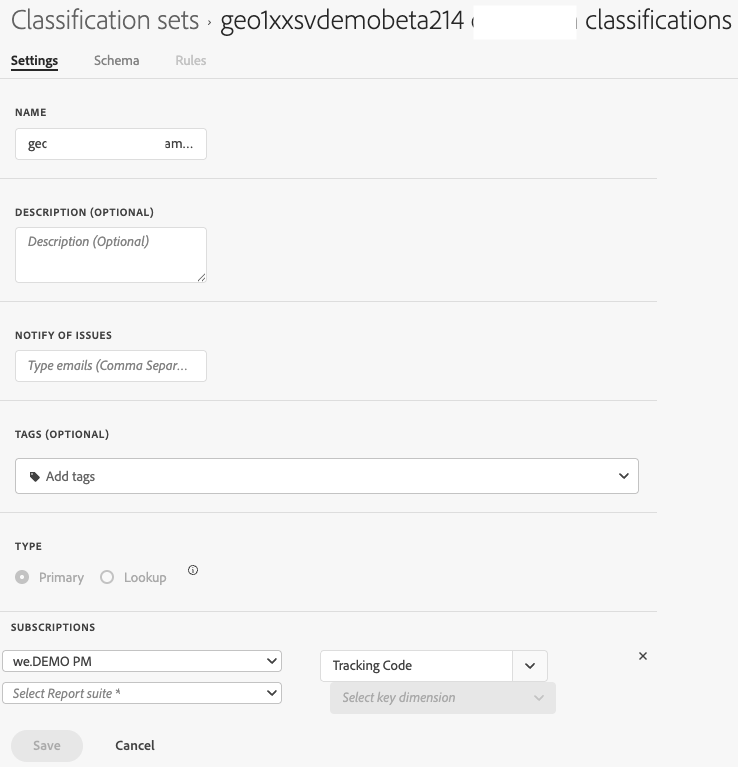

# 分類セット設定

分類セットの初期設定を編集できます。

**[!UICONTROL 分類セット]** マネージャーで、設定を編集する分類セットを選択します。

必要に応じて、**[!UICONTROL 分類セット：]** 分類セットタイトル **[!UICONTROL ダイアログの _設定_]**&#x200B;タブで、以下の操作を行います。

1. **[!UICONTROL 名前]** を編集します。
1. **[!UICONTROL 説明（オプション）]** を編集します。
1. メールアドレスのリスト（コンマ区切り）を **[!UICONTROL 問題の通知]** で編集します。 これらのユーザーには、問題が発生するとメールで通知されます。
1. 分類セットに 1 つ以上の **[!UICONTROL タグ （オプション）]** を追加します。 **[!UICONTROL タグ]** ドロップダウンメニューから既存のタグを選択するか、新しいタグを入力します。 タグを削除するには、 を使用します。
1. **[!UICONTROL 購読]** を編集します。
   * 分類セットに対して複数の **[!UICONTROL レポートスイート]** と **[!UICONTROL Dimension]** の組み合わせを定義できます。
   *  を選択して、**[!UICONTROL レポートスイート]** と **[!UICONTROL キーDimension]** の組み合わせを削除します。

<!--

Configure a classification set's settings.

**[!UICONTROL Components]** > **[!UICONTROL Classification sets]** > **[!UICONTROL Sets]** > Click the desired classification set name > **[!UICONTROL Settings]**

The following fields are available in this tab:

* **[!UICONTROL Name]**: The classification set name.
* **[!UICONTROL Description]**: The description for the classification set.
* **[!UICONTROL Notify of issues]**: A comma-delimited list of email addresses that are notified of issues with this classification set.
* **[!UICONTROL Tags]**: Add one or more tags to the selected classification set. Tags allow you to organize or group classification sets so that it is easier to locate them in the future.
* **[!UICONTROL Type]**: The type of classification between [!UICONTROL Primary] and [!UICONTROL Lookup]. Primary classifications are typically used. You cannot alter a classification set's type after it is created.
* **[!UICONTROL Subscriptions]**: The report suite and dimension combinations that the classification set applies to.

-->