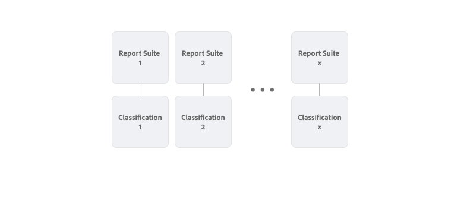

# 分類セットの概要

分類セットは、分類とルールを管理するための単一のインターフェイスを提供します。このワークフローは、レポートスイート設定での分類の作成と [&#x200B; 分類インポーター &#x200B;](/help/components/classifications/sets/manage/set-manager.md) を組み合わせたものです。 その結果、分類データを作成および管理するための直感的なインターフェイスが 1 つになりました。


## 分類セットと従来の分類

分類セットと従来の分類の主な違いは、分類とレポートスイートの関係です。

従来の分類では、各分類はレポートスイートに直接リンクされます。 非常に類似した分類（製品カタログなど）は、複数のレポートスイート間で使用される場合にレプリケートされます。



分類セットでは、レポートスイートとキーディメンションの組み合わせの購読を定義します。 例えば、複数のレポートスイートに適用できる製品カタログ分類で、製品（SKU）ディメンションに基づいている場合、分類セットとして定義する必要があるのは 1 回だけです。 その分類セット内で、複数のレポートスイートとキーディメンションの組み合わせを設定し、その分類セットを購読できます。


Adobe Analytics インターフェイスの **[!UICONTROL コンポーネント]** メニューから **[!UICONTROL 分類セット]** にアクセスするには、製品管理者であるか、権限項目 [!UICONTROL &#x200B; レポートスイートツール &#x200B;]/[!UICONTROL &#x200B; 分類 &#x200B;] を含む製品プロファイルに属している必要があります。 従来の分類管理インターフェイスは、**[!UICONTROL 管理]** メニューから使用できます。

分類セットは、次の 3 つの機能領域で構成されます。

* [**[!UICONTROL &#x200B; 分類セット &#x200B;]**](manage/set-manager.md)：分類セットを作成、編集および削除する。
* [**[!UICONTROL &#x200B; ジョブ &#x200B;]**](job-manager.md)：分類セットジョブのステータスを表示します。
* [**[!UICONTROL &#x200B; 統合 &#x200B;]**](consolidations/manage.md)：複数の分類セットを 1 つの分類セットに組み合わせます。


## ワークフロー

通常、分類セットのワークフローには次の手順が含まれます。

1. 分類セットを作成するレポートスイートとディメンションの組み合わせを検討します。 例えば、詳細を含む製品を分類するレポートスイートに対して作成した製品分類セットを定義します。 例えば、カテゴリや色などの詳細です。
1. 製品を識別する 1 つ以上のレポートスイートとキーディメンションの組み合わせのサブスクリプションを使用して、[&#x200B; 分類セットを作成 &#x200B;](/help/components/classifications/sets/manage/create.md) します。 例：

   | レポートスイート | 主なディメンション |
   |---|---|
   | レポートスイート 1 | 製品 ID |
   | レポートスイート 2 | 製品 SKU |

1. 識別した分類を分類セットスキーマに [&#x200B; 追加 &#x200B;](/help/components/classifications/sets/manage/schema.md#add) します。 例：

   | 分類名 | ID 名 |
   |---|---|
   | カテゴリ | category |
   | Color | color |

1. 分類データを含むファイルを手動で作成します。 [&#x200B; テンプレートを使用 &#x200B;](/help/components/classifications/sets/manage/schema.md#template) して、[&#x200B; サポートされているファイル形式 &#x200B;](data-files.md#classification-set-file-formats) とファイルの列を確実に使用します。 次に、データをテンプレートファイルに追加します。

   または、テンプレートに準拠した列を使用して、[&#x200B; サポートされているファイル形式 &#x200B;](data-files.md#classification-set-file-formats) で製品カタログから直接データを書き出すこともできます。 例えば、次のような CSV ファイルです。

   ```
   Key,Category,Color
   Adobe Nike Tech Fleece Full-Zip Hoodie - Men's,Men,Black
   Adobe Nike Tech Fleece Full-Zip Hoodie - Women's,Women,Black
   Men's North Face Adobe Jacket,Men,Black
   Nike Air Hybrid 2 Golf Bag,Equipment,Blue
   STITCH&reg; Ultimate Garment Bag,Equipment,Brown
   Adobe Analytics Training Tee - Navy,Men,Navy
   AirPods Pro 2,Electronics,White
   Adobe Analytics Training Tee - Green,Men,Green
   Women's North Face Adobe Jacket,Women,Blue
   Adobe Analytics Training Tee - Grey,Men,Gray
   Adobe Analytics One Million Views - Grey,Equipment,Grey
   Adobe and MGM Tee - White,Women,White
   Adobe and MGM Tee - Charcoal,Women,Charcoal
   ```

分類データファイルでは、**[!UICONTROL を使用して各レポートスイートの主要なディメンション（例：]** 製品 ID **[!UICONTROL および]** 製品 SKU`Key`）を参照します。 また、**[!UICONTROL 分類名]** を使用して、各分類を参照できます（例：`Category` または `Color`）。

1. [&#x200B; アップロード &#x200B;](/help/components/classifications/sets/manage/schema.md#upload) 分類データを含むファイルを分類セットスキーマに追加します。

1. [&#x200B; 自動化 &#x200B;](/help/components/classifications/sets/manage/schema.md#automate) クラウドの場所を使用して、分類データに反映させる、製品カタログの更新プロセス。

1. [&#x200B; ダウンロード &#x200B;](/help/components/classifications/sets/manage/schema.md#download) 分類データを使用して、コンテンツを検証します。

1. [&#x200B; ジョブ履歴を検査 &#x200B;](/help/components/classifications/sets/job-manager.md) して、分類でのアクション（アップロード、ダウンロード、テンプレートなど）の結果を確認します。
1. 従来の分類機能から移行した結果、類似した分類セットが複数ある場合は、これらの分類セットを [&#x200B; 統合 &#x200B;](consolidations/manage.md) します。


## 機能強化

分類セットでリリースされたバックエンドアーキテクチャには、いくつかの改善点が含まれています。

* 処理時間を短縮しました（72 時間から 24 時間に短縮）。
* 分類を管理するための再設計されたユーザーインターフェイス。
* 分類データ用の [Adobe Analytics ソースコネクタ &#x200B;](https://experienceleague.adobe.com/ja/docs/experience-platform/sources/connectors/adobe-applications/classifications) を介してAdobe Experience Platformで分類データを使用するオプション。

分類セットでリリースされたバックエンドアーキテクチャには、次のようないくつかの変更も含まれています。

* ブラウザーまたは自動読み込みを使用する場合、**[!UICONTROL 競合時に上書き]** は常に有効になっています。
* ブラウザーまたは自動読み込みを使用する場合、読み込み直後に書き出すオプションはサポートされなくなりました。書き出しは、別途開始する必要があります。
* Analytics 2.0 `GetDimensions` API エンドポイントで、数値識別子ではなく、分類の文字列識別子を返すようになりました。 数値識別子は引き続き使用できますが、可能な限り新しい文字列識別子を使用することをお勧めします。 数値識別子は、`?expansion=hidden` クエリ文字列パラメーターを使用して取得できます。

>[!IMPORTANT]
>
>分類セットのパフォーマンスは、主に、データを含む一意のキー値の数に依存します。一意の値を多数含む変数がある場合は注意が必要です。 特に、複数のレポートスイートやディメンションのこのような変数を 1 つの分類セットに組み合わせる場合。

## 制限事項

* 分類セットは、まだルールをサポートしていません。 [&#x200B; 従来のルールビルダー &#x200B;](/help/components/classifications/crb/classification-rule-builder.md) 機能が使用できなくなる前に、ルール機能が分類セットインターフェイスに追加されます。
* 従来の分類ルールおよび設定を分類セットに移行する必要はありません。 従来の分類機能が使用できなくなる前に、移行ユーティリティが分類セットインターフェイスに追加されます。
