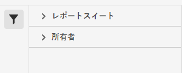

# 分類セットマネージャー

分類セットマネージャーを使用すると、分類セットを作成、編集、削除できます。

>[!NOTE]
>
>この機能は現在、限定リリース中です。この機能へのアクセスをご希望の場合は、アドビカスタマーケアまたは担当のアカウントマネージャーにお問い合わせください。プロビジョニングのリクエストは分類チームに転送されます。

**[!UICONTROL コンポーネント]**／**[!UICONTROL 分類セット]**／**[!UICONTROL セット]**

分類セットは、**購読**（この分類セットが適用されるレポートスイート）および&#x200B;**分類名**（分類データを含む追加のディメンション）で構成されています。

## 分類セットをフィルタリング

分類セットマネージャーの左側には、目的の分類セットを見つけるためのフィルター設定が表示されます。フィルターアイコンをクリックすると、フィルター設定の表示が切り替わります。分類セットは、**[!UICONTROL タグ]**、**[!UICONTROL レポートスイート]**、**[!UICONTROL 所有者]**&#x200B;でフィルタリングできます。

## 分類セットマネージャーの列

分類セットマネージャーでは、次の列を使用できます。

* **[!UICONTROL 分類セット]**：分類セット名。分類セット名をクリックして、[設定を編集](settings.md)します。
* **[!UICONTROL 購読]**：この分類セットが適用される購読の数またはレポートスイートの数。
* **[!UICONTROL 所有者]**：分類セットの所有者。
* **[!UICONTROL 分類]**：分類セットに含まれる分類ディメンションの数。
* **[!UICONTROL 最終変更]**：分類セットが最後に変更された日時。

## オプションを作成または編集

分類セットマネージャーでは、次のボタンを使用できます。

* **[!UICONTROL 追加]**：分類セットを[作成](create.md)します。
* **[!UICONTROL タイトルで検索]**：名前で分類セットを検索します。
* **[!UICONTROL さらに読み込む]**：分類セットマネージャーには、最初に最大 1,000 個の分類セットが表示されます。このボタンをクリックすると、さらに 1,000 個の分類セットが読み込まれます。
* **列を表示／非表示**：[!UICONTROL 分類セット]以外の任意の列の表示を切り替えます。

目的の分類セットの横にあるチェックボックスをオンにして、1 つ以上の分類セットを選択します。分類セットを選択すると、次のオプションが表示されます。

* **[!UICONTROL タグ]**：選択した分類セットに 1 つ以上のタグを追加します。これにより、分類セットを整理またはグループ化して、将来見つけやすくすることができます。
* **[!UICONTROL 名前を変更]**：選択した分類セットの名前を変更します。
