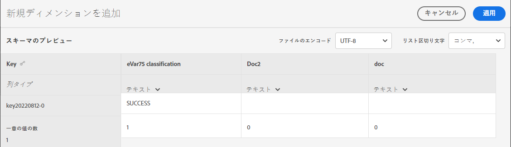
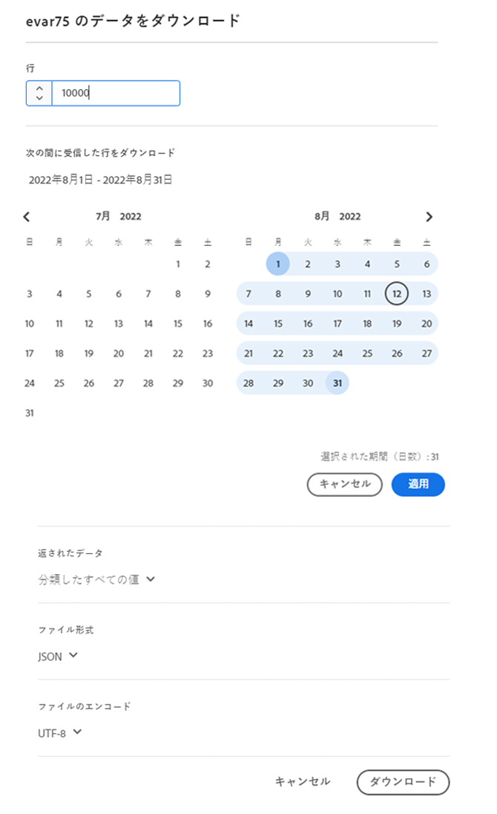
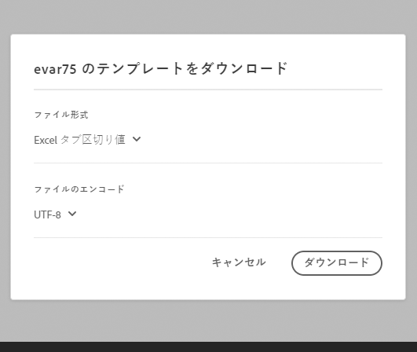

# 分類セットの設定

分類セットの設定、データのアップロード、データのダウンロードを行います。

>[!NOTE]
>
>この機能は、分類セットアーキテクチャのすべてのお客様が利用できます。 詳しくは、AdobeカスタマーケアまたはAdobeアカウントチームにお問い合わせください。

**[!UICONTROL コンポーネント]**／**[!UICONTROL 分類セット]**／**[!UICONTROL セット]**／目的の分類セット名をクリックします。

分類セットの編集時には、「**[!UICONTROL スキーマ]**」および「**[!UICONTROL 設定]**」の 2 つのタブを使用できます。 

## 設定

次のフィールドは「[!UICONTROL 設定]」タブで利用可能で、編集できます。

* **[!UICONTROL 名前]**：分類セット名。
* **[!UICONTROL 説明]**：分類セットの説明。
* **[!UICONTROL 所有者名]**：所有者の名前。
* **[!UICONTROL 所有者のメール]**：所有者のメールアドレス。
* **[!UICONTROL 問題の通知]**：この分類セットの問題を通知するメールアドレスのコンマ区切りリスト。
* **[!UICONTROL タグ]**：選択した分類セットに 1 つ以上のタグを追加します。これにより、分類セットを整理またはグループ化して、将来見つけやすくすることができます。

その他のフィールドは情報提供の目的で利用可能であり、編集はできません。

* **[!UICONTROL タイプ]**：[!UICONTROL プライマリ]と[!UICONTROL ルックアップ]の間の分類のタイプ。通常、プライマリの分類が使用されます。
* **[!UICONTROL 購読]**：分類セットが適用されるレポートスイートと変数。現時点では、特定の分類セットでサポートされているレポートスイートは 1 つだけです。複数のレポートスイートのサポートが予定されています。

## スキーマ

このサブスクリプションで現在設定されている分類ディメンションを表示します。次のボタンを使用できます。

* **[!UICONTROL アップロード]**：1 つ以上の分類ディメンションの分類データを手動でアップロードします。JSON、CSV、TSV、TAB の各ファイルがサポートされています。有効なファイルをアップロードすると、分類するデータのテーブルプレビューが表示されます。
   * **[!UICONTROL ファイルのエンコーディング]**：このドロップダウンを使用して、正しいファイルエンコーディングを選択します。有効なオプションは、[!UICONTROL UTF-8] および [!UICONTROL Latin1] です。
   * **[!UICONTROL リスト区切り]**：正しいリスト区切り文字を選択します。 ダウンロードしたファイルまたはテンプレートファイルを使用する場合は、ここの[!UICONTROL リスト区切り文字]がファイルのダウンロード時の[!UICONTROL リスト区切り文字]と一致していることを確認してください。
   * **[!UICONTROL 適用]**：アップロードした分類データを分類セットに保存します。

   

* **[!UICONTROL ダウンロード]**：キー値とその分類列をダウンロードします。
   * **[!UICONTROL 行]**：ダウンロードファイルに含める行の最大数。
   * **[!UICONTROL 次の期間に受信した行をダウンロード]**：レポートに表示されるときにキー値をフィルタリングできるカレンダー日付選択。この日付範囲でキー値が収集されなかった場合、ダウンロードされたファイルには表示されません。
   * **[!UICONTROL 返されたデータ]**：関連する分類データに基づいて、ダウンロードしたファイルに含まれるキー値をフィルタリングできるドロップダウン。
      * **[!UICONTROL すべての分類済み値]**：分類データが 1 つ以上の列に含まれる行を含みます。
      * **[!UICONTROL すべての未分類の値]**：分類データが 1 つ以上の列に存在しない行を含みます。
   * **[!UICONTROL ファイル形式]**：ダウンロードファイルのファイル形式を決定するドロップダウン。オプションには、[!UICONTROL JSON]、[!UICONTROL コンマ区切り値]および [!UICONTROL Excel タブ区切り値]があります。
   * **[!UICONTROL ファイルのエンコーディング]**：ファイルのエンコーディングを決定するドロップダウン。オプションには、[!UICONTROL UTF-8] および [!UICONTROL Latin1] があります。UTF-8 をお勧めします。
   * **[!UICONTROL リスト区切り文字]**：各行の分類列を区切るリスト区切り文字を決定するドロップダウン。

   

* **[!UICONTROL テンプレート]**：テンプレートファイルをダウンロードします。このファイルは、分類データやキー値が含まれていないことを除けば、[!UICONTROL ダウンロード]ボタンに似ています。
   * **[!UICONTROL ファイル形式]**：テンプレートファイルのファイル形式を決定するドロップダウン。 オプションには、[!UICONTROL コンマ区切り値]および [!UICONTROL Excel タブ区切り値]があります。
   * **[!UICONTROL ファイルのエンコーディング]**：ファイルのエンコーディングを決定するドロップダウン。オプションには、[!UICONTROL UTF-8] および [!UICONTROL Latin1] があります。UTF-8 をお勧めします。
   * **[!UICONTROL リスト区切り文字]**：各行の分類列を区切るリスト区切り文字を決定するドロップダウン。
* **[!UICONTROL ジョブ履歴]**：[ジョブマネージャー](job-manager.md)に移動するためのショートカットリンク。この分類セットのジョブのみが表示されます。

   
