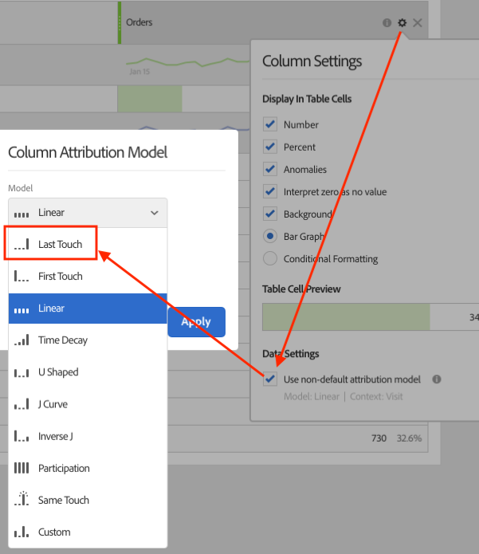

# eVar（マーチャンダイジング）

>[!BEGINSHADEBOX]

*このヘルプページでは、マーチャンダイジング eVarが[&#x200B; ディメンション &#x200B;](overview.md)として機能する仕組みについて説明します。 マーチャンダイジング eVarの実装方法について詳しくは、実装ユーザーガイドの[eVar（マーチャンダイジング変数） &#x200B;](/help/implement/vars/page-vars/evar-merchandising.md)を参照してください。*

>[!ENDSHADEBOX]

マーチャンダイジングeVarは、標準的なeVarと同様に機能しますが、各商品に独自のコピーがあります。 永続性、割り当て、有効期限はすべて同じように機能しますが、各製品は別々に機能します。 標準のeVarには、訪問者ごとに1つの永続的な値が保持され、成功イベントごとにクレジットが付与されます。 マーチャンダイジング eVarは、商品ごとに1つの永続的な値を保持し、その値はその商品の成功イベントに対するクレジットを受け取ります。

* 製品A → `eVar1` = `value A`
* 製品B → `eVar1` = `value B`

各製品の値は、その製品を含むヒットでのみ設定または変更できます。 設定した値は、有効期限が切れるまで保持され、その製品の成功イベントに対してのみクレジットを受け取ります。 製品Aの値を変更しても、製品Bには影響しません。

マーチャンダイジング eVarは、[`products`](/help/implement/vars/page-vars/products.md)変数でのみ機能します。 商品にバインドされていないマーチャンダイジング eVarの値には、クレジットは付与されません。 商品がないヒットの成功要因は、マーチャンダイジング eVarごとに`"None"`に起因します。

>[!TIP]
>
>永続値を製品以外のディメンションにバインドするには、Customer Journey Analyticsで[[!UICONTROL &#x200B; バインド ディメンション &#x200B;]](https://experienceleague.adobe.com/en/docs/analytics-platform/using/cja-dataviews/component-settings/persistence#binding-dimension)を使用することを検討してください。

## マーチャンダイジング eVarsを利用する理由

製品ごとに個別の価値を維持することは、訪問者が購入するあらゆる商品に対して単一の価値でクレジットを獲得すべきではない場合に重要です。 標準的なeVarは、外部キャンペーンや外部の検索語に適しています。この場合、発生した成功イベントに対して1つの値にクレジットを割り当てます。 例えば、顧客がメールキャンペーンのリンクをクリックしてweb サイトにアクセスした場合、その結果として行われたすべての購入は、そのキャンペーンに入金される必要があります。

内部検索とカテゴリーブラウジングは異なります。訪問者は、多くの場合、それらを使用して複数の商品を見つけますが、それぞれ異なる方法で見つけます。 例えば、顧客がサイトで「`"goggles"`」を検索し、買い物かごに追加したとします。


チェックアウトの前に、顧客は`"winter coat"`を検索し、ダウンジャケットをカートに追加します。


訪問者がこの購入を完了すると、内部検索キーワード `"winter coat"`は、eVarの最新の値（[!UICONTROL 最新（最後） &#x200B;]のデフォルト割り当て）であるため、ゴーグルを含む注文全体に対するクレジットを受け取ります。 検索語`"goggles"`は、購入の一部につながったにもかかわらず、クレジットを受け取りません。

| 内部検索語 | 売上高 |
| --- | --- |
| 冬のコート | $157 |

## マーチャンダイジングのeVarsがこの問題を解決する方法

前の例でeVarでマーチャンダイジングが有効になっている場合、検索語`"goggles"`はスノーゴーグルにバインドされ、検索語`"winter coat"`はダウンジャケットにバインドされます。 マーチャンダイジング eVarsは製品レベルで収益を割り当てるため、各用語には、その用語がバインドされる製品の売上額に対するクレジットが割り当てられます。

| 内部検索語 | 売上高 |
| --- | --- |
| 冬のコート | $119 |
| ゴーグル | $38 |

## バインディングと割り当ての仕組み

マーチャンダイジング eVarは、次の3つの概念に依存しています。

* **Binding**：商品とeVar値の関連付け。 EVarでは、各商品に固有のバインディングが適用されます。 EVarの標準的な値と同様に、バインディングは後でヒットした場合も有効期限が切れるまで保持されます。 例えば、製品ページの製品にバインドされた値は、その製品が後のページで購入されたときに、値を再度設定することなく、クレジットを受け取ります。 値が商品に到達する方法は、以下で説明するeVarの構文によって異なります。
* **配分**: [!UICONTROL 配分]設定は、新しい値が&#x200B;**既に連結されている製品にバインドしようとしたときに発生する処理を決定します**。 配分は商品ごとに個別に評価されるため、異なる商品に関連付けられたeVarの値が互いに競合することはありません。
  * **[!UICONTROL 元の値（最初）]**：既存のバインディングは保持されます。 バインディングが期限切れになるまで、その製品では新しい値は無視されます。
  * **[!UICONTROL 最新（最後）]**：製品が新しい値に再バインドされます。
* **有効期限**: [!UICONTROL 有効期限]設定によって、バインディングが終了するタイミングが決まります。 各製品のバインディングには、その製品がバインディングされた時点からカウントされる独自の有効期限があります。 例えば、[!UICONTROL 週]の有効期限が設定されている場合、製品Aが月曜日にバインドされ、製品Bが水曜日にバインドされている場合、製品Aのバインディングは次の月曜日に期限切れになり、製品Bのバインディングは次の水曜日に期限切れになります。 バインディングが期限切れになると、そのeVarの値が製品に含まれなくなり、標準のeVarの有効期限が切れた後も値が含まれなくなります。 その製品の成功イベントは、製品が再びバインドされるまで`"None"`に関連付けられます。

各マーチャンダイジング eVarでは、2つの構文のいずれかを使用します。[&#x200B; レポートスイート設定](/help/admin/tools/manage-rs/edit-settings/conversion-var-admin/conversion-var-admin.md)の[!UICONTROL &#x200B; マーチャンダイジング &#x200B;]設定で設定されています。 構文は、値が製品に到達する方法を決定します。

* **[製品の構文](#product-syntax)**：値は`products`変数の各製品に直接設定され、そのヒットの製品にバインドされます。
* **[コンバージョン変数構文](#conversion-variable-syntax)**：値はeVar自体で設定され、標準のeVar値のように保持されます。 バインディングイベントを含む同じヒットまたは後のヒットの製品にバインドされます。

どちらの構文も、上記と同じバインディング、割り当て、有効期限の動作を使用します。 両者には次のような違いがあります。

| | 製品の構文 | コンバージョン変数の構文 |
| --- | --- | --- |
| 値が設定されている場所 | 各製品の[`products`](/help/implement/vars/page-vars/products.md)変数 | [`eVar`](/help/implement/vars/page-vars/evar-merchandising.md)自体では、標準のeVarと同じように |
| バインディングが発生した場合 | 任意のヒットで、商品に値が設定されている | 製品と設定済みのバインディングイベントの両方を含むヒットで |
| ヒットごとの値 | 製品ごとに異なる値を設定できます | バインディングヒット内の各商品は、同じ値を受け取ります |
| 導入の労力 | 上位 | 下 |

## 製品の構文

product構文を使用すると、eVar値は`products`変数の各商品に設定されます。 `products`文字列では、商品の最後のセミコロンの後の値は、マーチャンダイジング eVarです。 完全な構文については、[製品構文を使用した実装](/help/implement/vars/page-vars/evar-merchandising.md#implement-using-product-syntax)を参照してください。

そのヒット時に値がその商品に直接結びつきます。 バインディングイベントは使用されません。 カートの追加や購入など、製品を含む後のヒットは、値を繰り返す必要はありません。 各製品には独自の値が含まれているため、**同じヒット**&#x200B;の製品に&#x200B;**異なる**&#x200B;値が必要な場合は、製品構文が唯一のオプションです。

+++例：同じ製品が2つの値を受け取る

| ヒット | `products` | `events` |
| --- | --- | --- |
| 1 | `;12345;;;;eVar1=internal keyword search` | |
| 2 | `;12345;;;;eVar1=internal campaign` | |
| 3 | `;12345;1;50` | `purchase` |

* **[!UICONTROL 元の値（最初）]**：ヒット 2は製品`12345`に対して無視されます。 購入は`internal keyword search`に割り当てられます。
* **[!UICONTROL 最新（最後）]**: ヒット 2は製品`12345`を再バインドします。 購入は`internal campaign`に割り当てられます。

+++

+++例：2つの製品の値が異なる

| ヒット | `products` | `events` |
| --- | --- | --- |
| 1 | `;productA;;;;eVar1=value A` | |
| 2 | `;productB;;;;eVar1=value B` | |
| 3 | `;productA;1;50,;productB;1;30` | `purchase` |

各製品は独自のバインディングを保持するので、この例では割り当て設定は影響しません。 `value A`は製品Aの収益に対するクレジットを受け取り、`value B`は製品Bの収益に対するクレジットを受け取ります。 両方の値は1つの注文を受け取ります。これは、注文には各値にバインドされた商品が含まれているためです。

+++

+++例：同じIDと異なる値を持つ製品

訪問者がミディアムブルーのT シャツと大きな赤いT シャツを購入し、両方とも親製品ID `tshirt123`と`eVar10`が子SKUをキャプチャします。

```js
s.events = "purchase";
s.products = ";tshirt123;1;20;;eVar10=tshirt123-m-blue,;tshirt123;1;20;;eVar10=tshirt123-l-red";
```

各子SKUは、独自のインスタンス `tshirt123`に対するクレジットを受け取ります。

+++

トレードオフは、バインディングが発生するたびに、製品構文には各製品の完全な値文字列が必要になるということです。 通常、一度に複数のeVarを使用する製品検索メソッドの場合、文字列は次のようになります。

```js
s.products = ";sandal123;;;;eVar2=sandals|eVar1=internal keyword search|eVar3=non-internal campaign|eVar4=non-browse|eVar5=non-cross-sell";
```

検索方法は、訪問者が商品を操作した後にのみクレジットを受け取る必要があるため、この文字列は通常、検索結果ページではなく、商品詳細ページまたはカート追加画面に設定されます。 そのために、開発者は次のことをおこなう必要があります。

* 検索方法の詳細を検索方法ページから製品詳細ページに移動するか、カートが結果ページから起動したときに検索方法の詳細を表示します。
* 構文エラーなしで完全な`products`文字列をアセンブリします。

コンバージョン変数構文は、両方の要件を回避します。

## コンバージョン変数の構文

コンバージョン変数構文では、値はeVar自体で設定されます。

```js
s.eVar1 = "internal keyword search";
```

EVarは&#x200B;*ステージング領域*&#x200B;として機能します。 EVarで設定された値は、バインディングイベントがヒット時に商品にバインドされるまで、そこで保持されます。 バインディングは、次の2つの段階で行われます。

1. **ステージング**: eVarが設定されている場合、その値は、その後のヒットで期限切れになるまで保持されます。 この永続値は、[&#x200B; データフィード &#x200B;](/help/export/analytics-data-feed/data-feed-overview.md)の`post_evar`列です。 コンバージョン変数構文を使用するマーチャンダイジング eVarの場合、[!UICONTROL 配分]設定に関係なく、ステージングされた値&#x200B;**は常に最新の値**&#x200B;を反映します。 新しい値ごとに、以前にステージングされた値が置き換えられます。
1. **バインディング**: ヒットに商品と設定された[!UICONTROL &#x200B; マーチャンダイジングバインディングイベント &#x200B;]の両方が含まれている場合、ステージングされた値はそのヒットのすべての商品にバインドされます。 製品が既に連結されている場合、[!UICONTROL 配分]は、新しい値が既存の連結に置き換えられるかどうかを判断します。 既にバインドされている製品は、[!UICONTROL 元の値（最初） &#x200B;]で値を維持するか、[!UICONTROL 最新（最後） &#x200B;]で再バインドします。

EVar、変数`products`およびバインディングイベントがすべて同じヒットに設定されている場合、ステージングとバインディングは同時に行われます。 新しい値は、そのヒットの商品にすぐに結びつきます。

バインディングイベントを使用せずにeVarを製品と一緒に設定しても、その製品に値がバインドされません。 ステージングされた値は、商品にバインドされるまでクレジットを受け取りません。

### バインディングイベントの仕組み

バインディングイベントは、Adobeに対して、ステージされた値をヒット上の商品にバインドするように指示するトリガーです。

* バインディングイベントは、標準イベントまたはカスタム成功イベント、トラッキングコード （[!UICONTROL &#x200B; キャンペーンイベント &#x200B;]）、eVarのいずれかです。 Propはバインディングに影響しません。
* [!UICONTROL 製品ビューイベント &#x200B;]、[!UICONTROL 買い物かごの追加イベント &#x200B;]、[!UICONTROL 購入イベント &#x200B;]など、複数のバインディングイベントを設定できます。 これらのイベントのいずれかが製品でヒットした場合、ステージングされた値はそのヒットのすべての製品にバインドされます。
* デフォルト（[!UICONTROL すべて]）では、他のイベントまたはeVarが商品と同じヒットを受けるたびにバインディングが発生します。 バインディングイベントが明示的に選択されていない場合、[!UICONTROL すべて]が使用されます。 [!UICONTROL すべて]で、製品を含むヒットにeVarを設定すると、そのヒットに対して常にトリガーがバインドされます。 以前のヒットでステージングされた値は、商品やその他のイベントやeVarを含む次のヒットにバインドされます。

+++例：バインディングイベントによるバインディング

次のヒットを考えてみましょう。

```js
// Hit 1
s.eVar1 = "internal keyword search";
s.eVar2 = "sandals";

// Hit 2
s.products = ";sandal123";
s.events = "prodView";
```

`prodView`が両方のeVarのバインディングイベントである場合は、2つのバインド `internal keyword search` （`eVar1`）と`sandals` （`eVar2`）を`sandal123`にヒットします。 EVarが`prodView`をバインディングイベントとしてリストしない場合、そのeVarにバインディングは発生しません。

+++

+++例：配分は製品ごとに評価されます

| ヒット | `eVar1` | `products` | `events` |
| --- | --- | --- | --- |
| 1 | `value A` | | |
| 2 | | `;productA,;productB` | 入札イベント |
| 3 | `value B` | | |
| 4 | | `;productA` | 入札イベント |
| 5 | | `;productA;1;50,;productB;1;30` | `purchase` |

ヒット 3の後、ステージングされた値（`post_evar1`）は、いずれかの割り当て設定で`value B`になります。

* **[!UICONTROL 元の値（最初）]**：製品Aは既にバインドされているため、ヒット 4は製品Aでは無視されます。 両方の製品は、すべての購入クレジットを受け取る`value A`にバインドされたままです。
* **[!UICONTROL 最新（最後）]**: ヒット 4は商品Aを`value B`に再バインドします。 商品Bはヒット 4ではないため、`value A`にバインドされたままです。 製品Aの購入クレジットは`value B`に対し、製品Bの購入クレジットは`value A`に対して付与されます。

ヒット 1、2、5のみの1回のバインディング試行では、両方の設定で同じ結果が生成されます。 配分が重要なのは、すでに連結されている製品が別の結合試行を受け取った場合のみです。

+++

## ベストプラクティス：商品検索方法

多くの小売サイトでは、マーチャンダイジング eVarとして、次のような商品検索方法を追跡する利点があります。

* 内部検索キーワード （例：`eVar2`）
* 内部キャンペーントラッキングコード （例：`eVar3`）
* マーチャンダイジングまたはカテゴリの閲覧（例：`eVar4`）
* クロスセルリンク （例：`eVar5`）
* 商品ページへの外部リンクなどのメソッドを含む、すべてのメソッドを比較する全体的な商品検索方法eVar（例：`eVar1`）

訪問者が1つのメソッドを使用する場合、他の検索方法eVarsを「非」値に設定します。 そうでなければ、未使用のメソッドの以前の値は、別のメソッドを通じて見つかった製品に対するクレジットを受け取る可能性があります。 例えば、「sandals」の内部検索の結果ページで次のように指定します。

```js
s.eVar1 = "internal keyword search";
s.eVar2 = "sandals";
s.eVar3 = "non-internal campaign";
s.eVar4 = "non-browse";
s.eVar5 = "non-cross-sell";
```

コンバージョン変数の構文では、開発者はpropの検索語などの単純な値のみを設定でき、実装内のロジックはマーチャンダイジング eVarに入力できます。 ページ間で渡したり、`products`文字列に組み込んだりする必要はありません。 バインドが発生するヒットには、`products`変数が引き続き必要です。

Adobeでは、商品の検索方法eVarについて、次の設定をお勧めします。

| 設定 | 値 |
| --- | --- |
| [!UICONTROL 配分] | [!UICONTROL 元の値（最初） &#x200B;] |
| [!UICONTROL 有効期限] | [!UICONTROL &#x200B; カスタム &#x200B;]を使用して14日または30日など、製品が自動削除されるまでのカート内での滞在時間。 買い物かごに制限がない場合は、[!UICONTROL 購入]を使用してください。 |
| [!UICONTROL タイプ] | [!UICONTROL &#x200B; テキスト文字列] |
| [!UICONTROL &#x200B; マーチャンダイジングの有効化] | [!UICONTROL 有効] |
| [!UICONTROL &#x200B; マーチャンダイジング &#x200B;] | [!UICONTROL &#x200B; コンバージョン変数構文] |
| [!UICONTROL &#x200B; マーチャンダイジング結合イベント &#x200B;] | [!UICONTROL 製品ビューイベント &#x200B;]、[!UICONTROL 買い物かごの追加イベント &#x200B;]、[!UICONTROL 購入イベント &#x200B;] |

各設定の説明については、管理者ガイドの[&#x200B; コンバージョン変数](/help/admin/tools/manage-rs/edit-settings/conversion-var-admin/conversion-var-admin.md)を参照してください。

+++最新（最後）ではなく元の値（最初）を使用する理由

訪問者は、多くの場合、既に閲覧したりカートに追加された商品を再検索します。 次に例を示します。

1. 訪問者が「サンダル」を検索し、結果ページから`sandal123`をカートに追加します。 製品が`internal keyword search`にバインドされます。
1. 3日後、訪問者は&#x200B;**女性/靴/サンダル** （`eVar1` = `browse`）に移動し、`sandal123`を再度閲覧してから購入します。

[!UICONTROL 直近（最後） &#x200B;]では、ステップ 2の製品ビューは`sandal123`から`browse`に再バインドされ、その後、購入クレジットが付与されます。 最初に製品を見つけたメソッドは、何も受け取りません。

[!UICONTROL 元の値（最初） &#x200B;]では、手順2のバインド試行は無視され、`internal keyword search`はクレジットを保持します。

訪問者が製品を購入しない場合、有効期限が切れるとバインディングが削除されるため、訪問者が使用する次の検索方法で製品にバインディングできます。 そのため、[!UICONTROL 有効期限]は、商品がカートに入っている期間と一致する必要があります。

+++

## マーチャンダイジング eVarのインスタンス

デフォルトの[&#x200B; インスタンス &#x200B;](../metrics/instances.md)指標は、マーチャンダイジング変数での使用はお勧めしません。

* 製品の構文を使用するマーチャンダイジング変数の場合、インスタンスはまったく増えません。
* コンバージョン変数の構文を使用するマーチャンダイジング変数の場合、eVar が設定されるたびにインスタンスがカウントされます。 ただし、同じヒットで次のすべてが発生しない限り、インスタンスはディメンション項目`"None"`に属性を割り当てます。
  * マーチャンダイジング eVar に値が設定されます。
  * `products` 変数は値で定義されます。
  * バインディングイベントが設定される。

コンバージョン変数構文のほとんどのユースケースでは、異なるヒットに対してeVar変数とproducts変数を必要とするため、デフォルトのインスタンス指標は使用するのが現実的ではありません。

コンバージョン変数構文で送信された各値のインスタンスをカウントするには、**ラストタッチ** [&#x200B; アトリビューションモデル &#x200B;](/help/analyze/analysis-workspace/attribution/overview.md)をインスタンス指標に適用します。 アトリビューションモデルでは、ステージ済みの値や商品のバインディングではなく、各ヒットで送信された値を使用します。 ルックバックウィンドウは関係ありません。ラストタッチは、eVarの割り当て設定に関係なく、送信されたヒットの各値をクレジットするためです。


