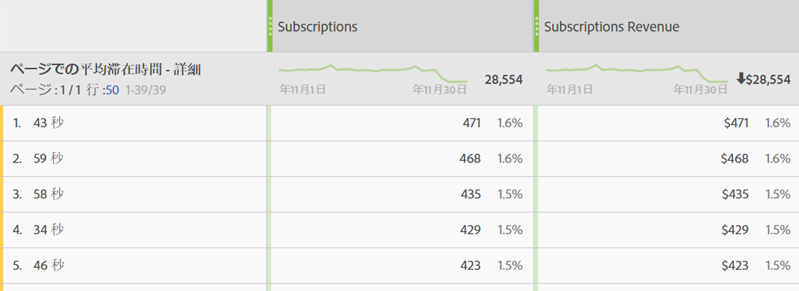

# ページでの滞在時間

「ページでの滞在時間」ディメンションは、訪問者がページで滞在した時間を記録します。 次の手順を使用して計算を測定します。

1. 特定のヒットについて、タイムスタンプを確認します。
2. このヒットを、訪問の次のヒットのタイムスタンプと比較します。ページ表示とリンクトラッキングのヒット数の両方。
3. この2つのヒットの間の経過時間が滞在時間に寄与します。

このディメンションは、訪問者がサイト上の特定の指標とどの程度の時間やり取りを行うかを把握する場合に役立ちます。

>[!TIP] 滞在時間は、その後のイメージリクエストで経過時間を測定できないので、訪問の最後のヒットに関しては測定されません。 この概念は、単一のヒット（バウンス）から成る訪問にも適用されます。

このディメンションはヒットに基づいています。つまり、ヒットごとに値が異なります。 このディメンションを、[訪問別滞在時間](time-spent-per-visit.md)（訪問ベースのディメンション）と比較します。滞在時間が長いと、訪問者が1ページ（ヒット）に長く滞在したことを意味します。

## このディメンションにデータを入力する

このディメンションは、すべての実装で初期設定の状態で動作します。 レポートスイートにデータが含まれる場合、このディメンションは機能します。

## 分析コード値

ページでの滞在時間に対して複数のディメンションが存在します。

* **ページでの滞在時間 — グループ**: 時間がグループ化されます。 ディメンション値の範囲は～ `"Less than 15 seconds"` で `"More than 30 minutes"`す。 ページ表示間の時間は通常30分を超えません。 ただし、タイムスタンプ付きのヒットまたはデータソースを使用する場合、ページ表示間の時間は30分を超える可能性があります。
* **ページでの滞在時間 — 詳細**: 各秒数は、一意のディメンション値です。

滞在時間の一般情報について詳しくは、 [滞在時間の概要](../metrics/time-spent.md) （英語）を参照してください。
