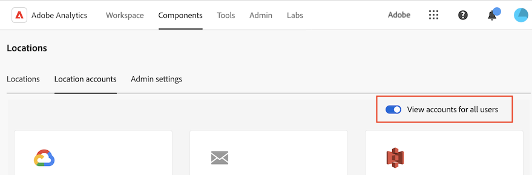

# クラウドの読み込みアカウントおよび書き出しアカウントの設定

<!-- This page is almost duplicated with the "Configure cloud export locations" article in CJA. Differences are that Snowflake isn't supported here and there is a Suffix field for each account type. -->

>[!NOTE]
>
>アカウントを作成および編集する際には、次の点を考慮してください。 <ul><li>システム管理者は、[ ユーザーがアカウントを作成できるかどうかを設定する](/help/components/locations/locations-manager.md#configure-whether-users-can-create-accounts)の説明に従って、ユーザーのアカウント作成を制限できます。 この節の説明に従ってアカウントを作成できない場合は、システム管理者にお問い合わせください。</li><li>アカウントは、作成したユーザーまたはシステム管理者のみが編集できます。</li></ul>

次のいずれかの目的または目的のすべてで使用されるクラウドアカウントを設定できます。

* [ データフィード ](/help/export/analytics-data-feed/create-feed.md)を使用したファイルのエクスポート
* [Data Warehouse](/help/export/data-warehouse/create-request/dw-request-report-destinations.md)を使用したレポートのエクスポート
* [Report Builder](/help/analyze/report-builder/report-builder-export.md)の使用時にファイルをエクスポートする
* [分類セット ](/help/components/classifications/sets/overview.md)を使用したスキーマの読み込み

クラウドアカウントにアクセスするために必要な情報をAdobe Analyticsに設定する必要があります。 このプロセスでは、この記事で説明されているようにアカウント（Amazon S3 Role ARN、Google Cloud Platformなど）を追加および設定し、[ クラウドの読み込みと書き出しの場所の設定](/help/components/locations/configure-import-locations.md)で説明されているように、そのアカウント内の場所（アカウント内のフォルダーなど）を追加および設定します。

既存のアカウントを表示および削除する方法について詳しくは、[Locations manager](/help/components/locations/locations-manager.md)を参照してください。

## アカウントページからアカウントの作成または編集を開始します

1. Adobe Analyticsで、[!UICONTROL **コンポーネント**]/[!UICONTROL **場所**]&#x200B;を選択します。
1. [!UICONTROL 場所] ページで、「[!UICONTROL **場所アカウント**]」タブを選択します。
1. （条件付き）システム管理者の場合は、[!UICONTROL **すべてのユーザーのアカウントを表示**] オプションを有効にして、組織内のすべてのユーザーが作成したアカウントを表示できます。
   
1. 新しいアカウントを作成するには、[!UICONTROL **アカウントを追加**]&#x200B;を選択します。

   [!UICONTROL **場所アカウントの詳細**] ダイアログが表示されます。

   または

   既存のアカウントを編集するには、編集するアカウントを見つけて、[!UICONTROL **詳細を編集**] ボタンを選択します。

   「[!UICONTROL **アカウントを追加**]」ダイアログが表示されます。

1. [場所アカウントの設定](#configure-a-location-account)で続行します。

## 位置情報アカウントの設定

クラウドの読み込みまたは書き出しアカウントを作成または編集を開始した後に設定するには、次の手順を実行します。

1. 次の情報を指定します。

   | フィールド | 関数 |
   |---------|----------|
   | [!UICONTROL **場所アカウント名**] | 場所アカウントの名前。 この名前は、場所を作成する際に表示されます。 |
   | [!UICONTROL **場所アカウントの説明**] | 同じアカウントタイプの他のアカウントと区別するのに役立つ、アカウントの短い説明を入力します。 |
   | [!UICONTROL **組織内のすべてのユーザーがアカウントを使用できるようにする**] | 組織内の他のユーザーがアカウントを使用できるようにするには、このオプションを有効にします。
セグメントを共有する際は、次の点を考慮してください。
<ul><li>共有したアカウントは、共有解除できません。</li><li>共有したアカウントは、アカウントの所有者のみが編集できます。</li><li>誰でも共有したアカウントの場所を作成できます。</li></ul> |
   | [!UICONTROL **アカウントタイプ**] | クラウドのアカウントタイプを選択します。 アカウントタイプごとに 1 つのアカウントを作成し、そのアカウント内で必要に応じて複数の場所を使用することをお勧めします。
システム管理者は、[ユーザーがアカウントを作成できるかどうかを設定](/help/components/locations/locations-manager.md#configure-whether-users-can-create-accounts)の説明に従って、ユーザーが作成できるアカウントタイプを制限できます。 この節の説明に従ってアカウントを作成できない場合は、システム管理者にお問い合わせください。
 |

1. 「[!UICONTROL **アカウントプロパティ**]」セクションで、選択したアカウントタイプに固有の情報を指定します。

   設定手順については、選択した&#x200B;[!UICONTROL **アカウントタイプ**]&#x200B;に対応する以下の節を展開します。 （追加の従来のアカウントタイプも使用できますが、お勧めしません）。

   **アカウントタイプ**

   +++Amazon S3 Role ARN

   **メモ：** データフィード、Data Warehouse、および分類でAmazon S3を使用する場合、SSE-S3暗号化のみがサポートされます。

   Amazon S3 Role ARN アカウントを設定するには、次の情報を指定します。

   | フィールド | 関数 |
   |---------|----------|
   | [!UICONTROL **役割 ARN**] | アドビが Amazon S3 アカウントへのアクセス権を取得するために使用できる役割 ARN（Amazon リソースネーム）を指定する必要があります。 これを行うには、ソースアカウントの IAM 権限ポリシーを作成し、そのポリシーをユーザーに関連付けてから、宛先アカウントの役割を作成します。 詳しくは、[この AWS ドキュメント](https://repost.aws/ja/knowledge-center/cross-account-access-iam)を参照してください。 |

   {style="table-layout:auto"}

   +++

   +++Google Cloud Platform

   Google Cloud Platform アカウントを設定するには、次の情報を指定します。

   | フィールド | 関数 |
   |---------|----------|
   | [!UICONTROL **プロジェクト ID**] | お客様の Google Cloud プロジェクト ID。 [プロジェクト ID の取得に関する Google Cloud ドキュメント](https://cloud.google.com/resource-manager/docs/creating-managing-projects?hl=ja#identifying_projects)を参照してください。 |

   {style="table-layout:auto"}

   +++

   +++Azure SAS

   Azure SAS アカウントを設定するには、次の情報を指定します。

   | フィールド | 関数 |
   |---------|----------|
   | [!UICONTROL **アプリケーション ID**] | 作成した Azure アプリケーションからこの ID をコピーします。 Microsoft Azure では、この情報はアプリケーション内の「**概要**」タブにあります。 詳しくは、[Microsoft ID プラットフォームでのアプリケーションの登録方法に関する Microsoft Azure ドキュメント](https://learn.microsoft.com/ja-jp/entra/identity-platform/quickstart-register-app)を参照してください。 |
   | [!UICONTROL **テナント ID**] | 作成した Azure アプリケーションからこの ID をコピーします。 Microsoft Azure では、この情報はアプリケーション内の「**概要**」タブにあります。 詳しくは、[Microsoft ID プラットフォームでのアプリケーションの登録方法に関する Microsoft Azure ドキュメント](https://learn.microsoft.com/ja-jp/entra/identity-platform/quickstart-register-app)を参照してください。 |
   | [!UICONTROL **Key Vault URI**] | 
Azure Key Vault 内の SAS トークンへのパス。  Azure SAS を設定するには、Azure Key Vault を使用して SAS トークンを秘密鍵として保存する必要があります。 詳しくは、[Azure Key Vault で秘密鍵を設定および取得する方法に関する Microsoft Azure ドキュメント](https://learn.microsoft.com/ja-jp/azure/key-vault/secrets/quick-create-portal?source=recommendations)を参照してください。

Key Vault URI を作成したら、作成した Azure アプリケーションに権限を付与するために、Key Vault にアクセスポリシーを追加します。 詳しくは、[Key Vault アクセスポリシーの割り当て方法に関する Microsoft Azure ドキュメント](https://learn.microsoft.com/ja-jp/azure/key-vault/general/assign-access-policy?tabs=azure-portal)を参照してください。
 |
   | [!UICONTROL **Key Vault シークレット名**] | Azure Key Vault に秘密鍵を追加する際に作成した秘密鍵名。 Microsoft Azure では、この情報は、作成した Key Vault の **Key Vault** 設定ページにあります。 詳しくは、[Azure Key Vault からシークレットを設定および取得する方法に関する Microsoft Azure ドキュメント](https://learn.microsoft.com/ja-jp/azure/key-vault/secrets/quick-create-portal?source=recommendations)を参照してください。 |
   | [!UICONTROL **場所アカウントの秘密鍵**] | 作成した Azure アプリケーションからシークレットをコピーします。 Microsoft Azure では、この情報はアプリケーション内の「**証明書とシークレット**」タブにあります。 詳しくは、[Microsoft ID プラットフォームでのアプリケーション登録方法に関する Microsoft Azure ドキュメント](https://learn.microsoft.com/ja-jp/entra/identity-platform/quickstart-register-app)を参照してください。 |

   {style="table-layout:auto"}

   +++   

   +++Azure RBAC

   Azure RBAC アカウントを設定するには、次の情報を指定します。

   | フィールド | 関数 |
   |---------|----------|
   | [!UICONTROL **アプリケーション ID**] | 作成した Azure アプリケーションからこの ID をコピーします。 Microsoft Azure では、この情報はアプリケーション内の「**概要**」タブにあります。 詳しくは、[Microsoft ID プラットフォームでのアプリケーションの登録方法に関する Microsoft Azure ドキュメント](https://learn.microsoft.com/ja-jp/entra/identity-platform/quickstart-register-app)を参照してください。 |
   | [!UICONTROL **テナント ID**] | 作成した Azure アプリケーションからこの ID をコピーします。 Microsoft Azure では、この情報はアプリケーション内の「**概要**」タブにあります。 詳しくは、[Microsoft ID プラットフォームでのアプリケーションの登録方法に関する Microsoft Azure ドキュメント](https://learn.microsoft.com/ja-jp/entra/identity-platform/quickstart-register-app)を参照してください。 |
   | [!UICONTROL **場所アカウントの秘密鍵**] | 作成した Azure アプリケーションからシークレットをコピーします。 Microsoft Azure では、この情報はアプリケーション内の「**証明書とシークレット**」タブにあります。 詳しくは、[Microsoft ID プラットフォームでのアプリケーション登録方法に関する Microsoft Azure ドキュメント](https://learn.microsoft.com/ja-jp/entra/identity-platform/quickstart-register-app)を参照してください。 |

   {style="table-layout:auto"}

   +++

   +++電子メール

   >[!NOTE]
   >
   >メールアカウントは、[Data Warehouse](/help/export/data-warehouse/create-request/dw-request-report-destinations.md)でのみ使用できます。 （メールアカウントは、[ データフィード ](/help/export/analytics-data-feed/create-feed.md)または[分類セット ](/help/components/classifications/sets/overview.md)ではサポートされていません）。

   Azure RBAC アカウントを設定するには、次の情報を指定します。

   | フィールド | 関数 |
   |---------|----------|
   | [!UICONTROL **受信者**] | レポートの送信時に、特定のユーザーにメール通知を送信できます。 単一のメールアドレスまたはメールアドレスのコンマ区切りのリストを指定します。 |

   {style="table-layout:auto"}

   +++

   **レガシーアカウントの種類**

   これらの従来のアカウントタイプは、[ データフィード ](/help/export/analytics-data-feed/create-feed.md)および[Data Warehouse](/help/export/data-warehouse/create-request/t-dw-create-request.md)を使用してデータを書き出す場合にのみ使用できます。 これらのオプションは、[分類セット ](/help/components/classifications/sets/manage/schema.md)を含むデータを読み込む場合は使用できません。

   +++FTP

   >[!IMPORTANT]
   >
   >データはプレーンテキストでインターネット上を流れるので、FTPは使用しないでください。

   データフィードのデータは、アドビまたは顧客のホストする FTP の場所に配信できます。 FTP ホスト、ユーザー名、パスワードが必要です。

   | フィールド | 関数 |
   |---------|----------|
   | [!UICONTROL **ホスト名**] | 必要なFTP宛先URLを入力します。 例：`ftp.adobe.com`。 |
   | [!UICONTROL **ポート**] | 空白のままにできます。 このフィールドを使用して、フィードファイルをフォルダーに配置します。 フォルダーは既に存在する必要があります。指定したポートが存在しない場合、フィードはエラーをスローします。 |
   | [!UICONTROL **ユーザー名**] | FTP サイトにログインするユーザー名を入力します。 |
   | [!UICONTROL **場所アカウントの秘密鍵**] | FTP サイトにログインするためのパスワード（秘密鍵）を入力します。 |

   {style="table-layout:auto"}

   +++

   +++SFTP

   データフィードの SFTP サポートを利用できます。 これには、有効なRSAまたはed25519公開鍵を含むSFTP ホスト、ユーザー名、および宛先サイトが必要です。 フィードの作成時に、適切な公開キーをダウンロードできます。

   データフィード用のRSAまたはed25519公開鍵をダウンロードする場合は、次のいずれかの操作を行います。

   * ダウンロードした公開鍵ファイルの名前を`authorized_keys`に変更し、SFTP サーバー上の`.ssh` フォルダーにファイルをアップロードします。

   * 既に他のキーを含む既存の`authorized_keys` ファイルがある場合は、Adobeが提供するキーを既存の`authorized_keys` ファイルに追加し、既存のキーを上書きしないようにします。

   +++

   +++S3

   ウェアハウスデータは Amazon S3 バケットに直接送信できます。 この宛先タイプには、バケット名、アクセスキー ID および秘密キーが必要です。 詳しくは、Amazon S3 ドキュメント内の [Amazon S3 バケットの命名要件](https://docs.aws.amazon.com/ja_jp/awscloudtrail/latest/userguide/cloudtrail-s3-bucket-naming-requirements.html)を参照してください。

   データウェアハウスのデータをアップロードするために指定するユーザーには、次の[権限](https://docs.aws.amazon.com/ja_jp/AmazonS3/latest/API/API_Operations_Amazon_Simple_Storage_Service.html)が必要です。

   * s3:GetObject
   * s3:PutObject
   * s3:PutObjectAcl

   以下の 16 の標準 AWS 地域がサポートされます（必要に応じて適切な署名アルゴリズムを使用）。

   * us-east-2
   * us-east-1
   * us-west-1
   * us-west-2
   * ap-south-1
   * ap-northeast-2
   * ap-southeast-1
   * ap-southeast-2
   * ap-northeast-1
   * ca-central-1
   * eu-central-1
   * eu-west-1
   * eu-west-2
   * eu-west-3
   * eu-north-1
   * sa-east-1

   >[!NOTE]
   >
   >Cn-north-1 地域はサポートされていません。

   +++

   +++Azure BLOB

   データウェアハウスはAzure Blobの宛先をサポートしています。 コンテナ、アカウント、およびキーが必要です。 Amazon は保存データを自動的に暗号化します。 データをダウンロードすると、自動的に復号化されます。 詳細については、Microsoft Azure ドキュメント内の「[ストレージアカウントの作成](https://docs.microsoft.com/ja-jp/azure/storage/common/storage-quickstart-create-account?tabs=azure-portal#view-and-copy-storage-access-keys)」を参照してください。

   >[!NOTE]
   >
   >データウェアハウス宛先のディスク領域を管理するには、独自のプロセスを実装する必要があります。 アドビはサーバーからデータを削除しません。

   +++

1. 「[!UICONTROL **保存**]」を選択します。

1. [ クラウドの読み込みと書き出しの場所の設定](/help/components/locations/configure-import-locations.md)を続行します。
