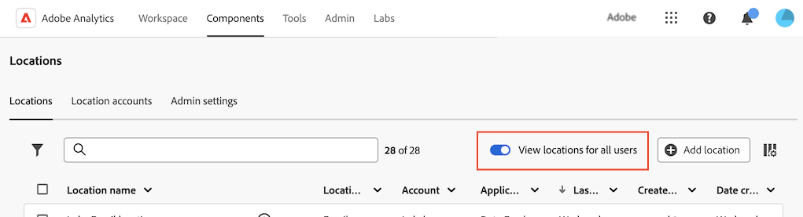

# クラウドの読み込み場所および書き出し場所の設定

<!-- This page is almost duplicated with the "Configure cloud export locations" article in CJA. Differences are that Snowflake isn't supported here and there is a Suffix field for each account type. -->

>[!NOTE]
>
>場所を作成および編集する場合は、次の点を考慮してください。<ul><li>システム管理者は、[ ユーザーが場所を作成できるかどうかを設定](/help/components/locations/locations-manager.md#configure-whether-users-can-create-locations)で説明しているように、場所の作成をユーザーに制限できます。 この節の説明に従って場所を作成できない場合は、システム管理者にお問い合わせください。</li><li>場所は、作成したユーザーまたはシステム管理者のみが編集できます。</li></ul>

[ クラウドアカウントを設定](/help/components/locations/configure-import-accounts.md)した後、そのアカウントの場所を設定できます。 1つの場所は、次のいずれかの目的で使用できます（1つの場所を複数の目的に関連付けることはできません）。

* [ データフィード ](/help/export/analytics-data-feed/create-feed.md)を使用したファイルのエクスポート
* [Data Warehouse](/help/export/data-warehouse/create-request/dw-request-report-destinations.md)を使用したレポートのエクスポート
* [Report Builder](/help/analyze/report-builder/report-builder-export.md)の使用時にファイルをエクスポートする
* [分類セット ](/help/components/classifications/sets/overview.md)を使用したスキーマの読み込み

クラウドアカウントにアクセスするには、必要な情報をAdobe Analyticsに設定する必要があります。 このプロセスは、[Configure cloud import and export accounts](/help/components/locations/configure-import-accounts.md)で説明されているように、アカウント（Amazon S3 Role ARN、Google Cloud Platformなど）を追加および設定し、そのアカウント内の場所を追加および設定することから構成されます（この記事を参照）。

既存の場所を表示および削除する方法について詳しくは、[場所マネージャー](/help/components/locations/locations-manager.md)を参照してください。

## 場所の作成または編集を開始

1. Adobe Analyticsで、[!UICONTROL **コンポーネント**]/[!UICONTROL **場所**]&#x200B;を選択します。

1. [!UICONTROL 場所] ページで、「[!UICONTROL **場所**]」タブを選択します。

1. （条件付き）システム管理者の場合は、[!UICONTROL **すべてのユーザーの場所を表示**] オプションを有効にして、組織内のすべてのユーザーが作成した場所を表示できます。
   

1. 新しい場所を追加するには、[!UICONTROL **場所を追加**]&#x200B;を選択します。 （まだアカウントを追加していない場合は、[ クラウドのインポートとエクスポートのアカウントの設定](/help/components/locations/configure-import-accounts.md)の説明に従ってアカウントを追加します。）

   [!UICONTROL **場所を追加**] ダイアログが表示されます

   または

   既存の場所を編集するには、場所名の横にある3点メニューを選択し、[!UICONTROL **編集**]&#x200B;を選択します。

   [!UICONTROL **場所の詳細**] ダイアログが表示されます。

1. 次の情報を指定します。

   | フィールド | 関数 |
   |---------|----------|
   | [!UICONTROL **名前**] | 場所の名前。 |
   | [!UICONTROL **説明**] | 同じアカウントタイプの他のアカウントと区別するのに役立つ、アカウントの短い説明を入力します。 |
   | [!UICONTROL ****]&#x200B;で使用 | この場所を&#x200B;[!UICONTROL **データフィード**]、[!UICONTROL **Data Warehouse**]、[!UICONTROL **分類セット**]&#x200B;または&#x200B;**[!UICONTROL Report Builder]**&#x200B;で使用するかどうかを選択します。 
選択を行う際には、次の点に注意してください。
<ul><li>1つの場所を複数の目的に使用することはできません。 例えば、データフィードに使用される場所は、Data Warehouseまたは分類セットにも使用できません。</li><li>場所の中でファイルの競合を避けるには、場所を使用した後で&#x200B;[!UICONTROL **使用**] フィールドの値を変更しないでください。</li><li>電子メールアカウントの場所を作成する場合は、このフィールドで「[!UICONTROL **Data Warehouse**]」を選択します。 メールの場所は、データフィードと分類セットではサポートされていません。</li></ul> |
   | [!UICONTROL **組織内のすべてのユーザーが場所を利用できるようにします**] | このオプションを有効にすると、組織内の他のユーザーがこの場所を使用できるようになります。
場所を共有する場合は、次の点を考慮してください。
<ul><li>共有している場所は共有を解除できません。</li><li>共有場所は、場所の所有者のみが編集できます。</li><li>場所を共有できるのは、場所が関連付けられているアカウントも共有されている場合のみです。</li></ul> |
   | [!UICONTROL **場所アカウント**] | この場所を作成する場所アカウントを選択します。 アカウントの作成方法について詳しくは、[ クラウドのインポートとエクスポートのアカウントの設定](/help/components/locations/configure-import-accounts.md)を参照してください。 |

1. 場所を設定するためのフォームを完了するには、[場所を設定](#configure-a-location)に進みます。 「[!UICONTROL **場所アカウント**]」フィールドで選択したアカウントタイプに対応するセクションの情報を使用します。 （追加の従来のアカウントタイプも使用できますが、お勧めしません）。

## 場所の設定

### Amazon S3 Role ARN

Amazon S3 ロール ARNの場所を設定するには、次の情報を指定します。

1. [前述のように、場所の作成または編集を開始します](#begin-creating-or-editing-a-location)。

   | フィールド | 関数 |
   |---------|----------|
   | [!UICONTROL **バケット**] | Adobe Analytics データを送信する Amazon S3 アカウント内のバケット。 
このバケットにファイルをアップロードするには、Adobeから提供されたユーザーARNに`S3:PutObject`権限があることを確認してください。 

バケット名は、特定の命名規則を満たす必要があります。例えば、3〜63 文字までの長さで、小文字、数字、ドット（.）、ハイフン（-）のみで構成でき、先頭と末尾は文字または数字にする必要があります。[命名規則の完全なリストについて詳しくは、AWS ドキュメントを参照してください](https://docs.aws.amazon.com/ja_jp/AmazonS3/latest/userguide/bucketnamingrules.html)。 
 |
   | [!UICONTROL **接頭辞**] | データを配置するバケット内のフォルダー。フォルダー名を指定し、名前の後にバックスラッシュを追加してフォルダーを作成します。例：folder_name/ |

   {style="table-layout:auto"}

1. 「[!UICONTROL **保存**]」を選択します。

   これで、設定したアカウントと場所との間でデータを読み込んだり書き出したりできるようになりました。 データを書き出すには、[ データフィード ](/help/export/analytics-data-feed/create-feed.md)、[Data Warehouse](/help/export/data-warehouse/create-request/dw-request-report-destinations.md)、または[Report Builder](/help/analyze/report-builder/report-builder-export.md)を使用します。 データを読み込むには、[分類セット ](/help/components/classifications/sets/overview.md)を使用します。

   インポートしたデータは、インポート後にクラウドの宛先から削除されません。

   >[!NOTE]
   >
   >   以前に[FTPを使用して分類](/help/components/classifications/importer/c-uploading-saint-data-files-via-ftp.md)をAdobe Analyticsに読み込んだ場合は、FIN ファイルをアップロードする必要がありました。 クラウドアカウントから読み込む場合、このFIN ファイルは必要ありません。

### Google Cloud Platform

Google Cloud Platform の場所を設定するには、次の情報を指定します。

1. [前述のように、場所の作成または編集を開始します](#begin-creating-or-editing-a-location)。

   | フィールド | 関数 |
   |---------|----------|
   | [!UICONTROL **バケット**] | Adobe Analytics データを送信するGCP アカウント内のバケット。 Adobeが提供するプリンシパルに対して、このバケットにファイルをアップロードする権限が付与されていることを確認します。 |
   | [!UICONTROL **接頭辞**] | データを配置するバケット内のフォルダー。フォルダー名を指定し、名前の後にバックスラッシュを追加してフォルダーを作成します。例：folder_name/ |

   {style="table-layout:auto"}

1. 「[!UICONTROL **保存**]」を選択します。

   これで、設定したアカウントと場所との間でデータを読み込んだり書き出したりできるようになりました。 データを書き出すには、[ データフィード ](/help/export/analytics-data-feed/create-feed.md)、[Data Warehouse](/help/export/data-warehouse/create-request/dw-request-report-destinations.md)、または[Report Builder](/help/analyze/report-builder/report-builder-export.md)を使用します。 データを読み込むには、[分類セット ](/help/components/classifications/sets/overview.md)を使用します。

   インポートしたデータは、インポート後にクラウドの宛先から削除されません。

   >[!NOTE]
   >
   >   以前に[FTPを使用して分類](/help/components/classifications/importer/c-uploading-saint-data-files-via-ftp.md)をAdobe Analyticsに読み込んだ場合は、FIN ファイルをアップロードする必要がありました。 クラウドアカウントから読み込む場合、このFIN ファイルは必要ありません。

### Azure SAS

Azure SAS の場所を設定するには、次の情報を指定します。

1. [前述のように、場所の作成または編集を開始します](#begin-creating-or-editing-a-location)。

   | フィールド | 関数 |
   |---------|----------|
   | [!UICONTROL **コンテナ**] | Adobe Analytics データの送信先として指定したアカウント内のコンテナ。 |
   | [!UICONTROL **接頭辞**] | データを配置するコンテナ内のフォルダー。フォルダー名を指定し、名前の後にバックスラッシュを追加してフォルダーを作成します。例：`folder_name/` |

   {style="table-layout:auto"}

1. 「[!UICONTROL **保存**]」を選択します。

   これで、設定したアカウントと場所との間でデータを読み込んだり書き出したりできるようになりました。 データを書き出すには、[ データフィード ](/help/export/analytics-data-feed/create-feed.md)、[Data Warehouse](/help/export/data-warehouse/create-request/dw-request-report-destinations.md)、または[Report Builder](/help/analyze/report-builder/report-builder-export.md)を使用します。 データを読み込むには、[分類セット ](/help/components/classifications/sets/overview.md)を使用します。

   インポートしたデータは、インポート後にクラウドの宛先から削除されません。

   >[!NOTE]
   >
   >   以前に[FTPを使用して分類](/help/components/classifications/importer/c-uploading-saint-data-files-via-ftp.md)をAdobe Analyticsに読み込んだ場合は、FIN ファイルをアップロードする必要がありました。 クラウドアカウントから読み込む場合、このFIN ファイルは必要ありません。

### Azure RBAC

Azure RBAC の場所を設定するには、次の情報を指定します。

1. [前述のように、場所の作成または編集を開始します](#begin-creating-or-editing-a-location)。

   | フィールド | 関数 |
   |---------|----------|
   | [!UICONTROL **アカウント**] | Azure ストレージアカウント。 |
   | [!UICONTROL **コンテナ**] | Adobe Analytics データの送信先として指定したアカウント内のコンテナ。以前に作成した Azure アプリケーションにファイルをアップロードする権限を付与します。 |
   | [!UICONTROL **接頭辞**] | データを配置するコンテナ内のフォルダー。フォルダー名を指定し、名前の後にバックスラッシュを追加してフォルダーを作成します。例：`folder_name/` |

   {style="table-layout:auto"}

1. 「[!UICONTROL **保存**]」を選択します。

   これで、設定したアカウントと場所との間でデータを読み込んだり書き出したりできるようになりました。 データを書き出すには、[ データフィード ](/help/export/analytics-data-feed/create-feed.md)、[Data Warehouse](/help/export/data-warehouse/create-request/dw-request-report-destinations.md)、または[Report Builder](/help/analyze/report-builder/report-builder-export.md)を使用します。 データを読み込むには、[分類セット ](/help/components/classifications/sets/overview.md)を使用します。

   インポートしたデータは、インポート後にクラウドの宛先から削除されません。

   >[!NOTE]
   >
   >   以前に[FTPを使用して分類](/help/components/classifications/importer/c-uploading-saint-data-files-via-ftp.md)をAdobe Analyticsに読み込んだ場合は、FIN ファイルをアップロードする必要がありました。 クラウドアカウントから読み込む場合、このFIN ファイルは必要ありません。

### 電子メール

メールの場所を設定するには、次の情報を指定します。

1. [前述のように、場所の作成または編集を開始します](#begin-creating-or-editing-a-location)。

   | フィールド | 関数 |
   |---------|----------|
   | [!UICONTROL **件名**] | メールメッセージの件名。 |
   | [!UICONTROL **メモ**] | メールメッセージの内容。 |

   {style="table-layout:auto"}

1. 「[!UICONTROL **保存**]」を選択します。

   [ データフィード ](/help/export/analytics-data-feed/create-feed.md)を使用する際に設定したアカウントと場所にデータを書き出せるようになりました。 （メールの場所は、[Data Warehouse](/help/export/data-warehouse/create-request/dw-request-report-destinations.md)、[Report Builder](/help/analyze/report-builder/report-builder-export.md)、または[分類セット ](/help/components/classifications/sets/overview.md)ではサポートされていません）。

### 従来のアカウントタイプ

これらの従来のアカウントタイプは、[ データフィード ](/help/export/analytics-data-feed/create-feed.md)および[Data Warehouse](/help/export/data-warehouse/create-request/t-dw-create-request.md)を使用してデータを書き出す場合にのみ使用できます。 これらのオプションは、[分類セット ](/help/components/classifications/sets/manage/schema.md)を含むデータを読み込む場合は使用できません。

+++FTP

データフィードのデータは、アドビまたは顧客のホストする FTP の場所に配信できます。ディレクトリを指定する「パス」フィールドを使用して、フィードファイルをフォルダーに配置します。

| フィールド | 関数 |
|---------|----------|
| [!UICONTROL **ディレクトリパス**] | FTP サーバー上のディレクトリへのパスを入力します。 フォルダーは既に存在する必要があります。指定したパスが存在しない場合、フィードはエラーをスローします。  例：`/folder_name/folder_name`。 |

{style="table-layout:auto"}

+++

+++SFTP

データフィードデータは、Adobeまたはお客様がホストするSFTPの場所に配信できます。 宛先サイトには、有効なRSAまたはDSA公開鍵が含まれている必要があります。 フィードの作成時に、適切な公開キーをダウンロードできます。

| フィールド | 関数 |
|---------|----------|
| [!UICONTROL **ディレクトリパス**] | FTP サーバー上のディレクトリへのパスを入力します。 フォルダーは既に存在する必要があります。指定したパスが存在しない場合、フィードはエラーをスローします。  例：`/folder_name/folder_name`。 |

{style="table-layout:auto"}

+++

+++S3

ウェアハウスデータは Amazon S3 バケットに直接送信できます。この宛先タイプには、バケット名、アクセスキー ID および秘密キーが必要です。詳しくは、Amazon S3 ドキュメント内の [Amazon S3 バケットの命名要件](https://docs.aws.amazon.com/ja_jp/awscloudtrail/latest/userguide/cloudtrail-s3-bucket-naming-requirements.html)を参照してください。

データウェアハウスのデータをアップロードするために指定するユーザーには、次の[権限](https://docs.aws.amazon.com/ja_jp/AmazonS3/latest/API/API_Operations_Amazon_Simple_Storage_Service.html)が必要です。

* s3:GetObject
* s3:PutObject
* s3:PutObjectAcl

以下の 16 の標準 AWS 地域がサポートされます（必要に応じて適切な署名アルゴリズムを使用）。

* us-east-2
* us-east-1
* us-west-1
* us-west-2
* ap-south-1
* ap-northeast-2
* ap-southeast-1
* ap-southeast-2
* ap-northeast-1
* ca-central-1
* eu-central-1
* eu-west-1
* eu-west-2
* eu-west-3
* eu-north-1
* sa-east-1

>[!NOTE]
>
>Cn-north-1 地域はサポートされていません。

+++

+++Azure BLOB

データウェアハウスはAzure Blobの宛先をサポートしています。 コンテナ、アカウント、およびキーが必要です。Azureは、保存中のデータを自動的に暗号化します。 データをダウンロードすると、自動的に復号化されます。詳細については、Microsoft Azure ドキュメント内の「[ストレージアカウントの作成](https://docs.microsoft.com/ja-jp/azure/storage/common/storage-quickstart-create-account?tabs=azure-portal#view-and-copy-storage-access-keys)」を参照してください。

>[!NOTE]
>
>データウェアハウス宛先のディスク領域を管理するには、独自のプロセスを実装する必要があります。アドビはサーバーからデータを削除しません。

+++

