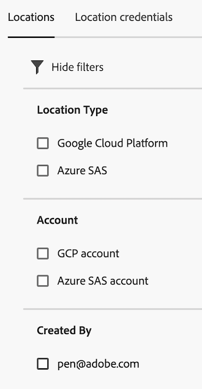
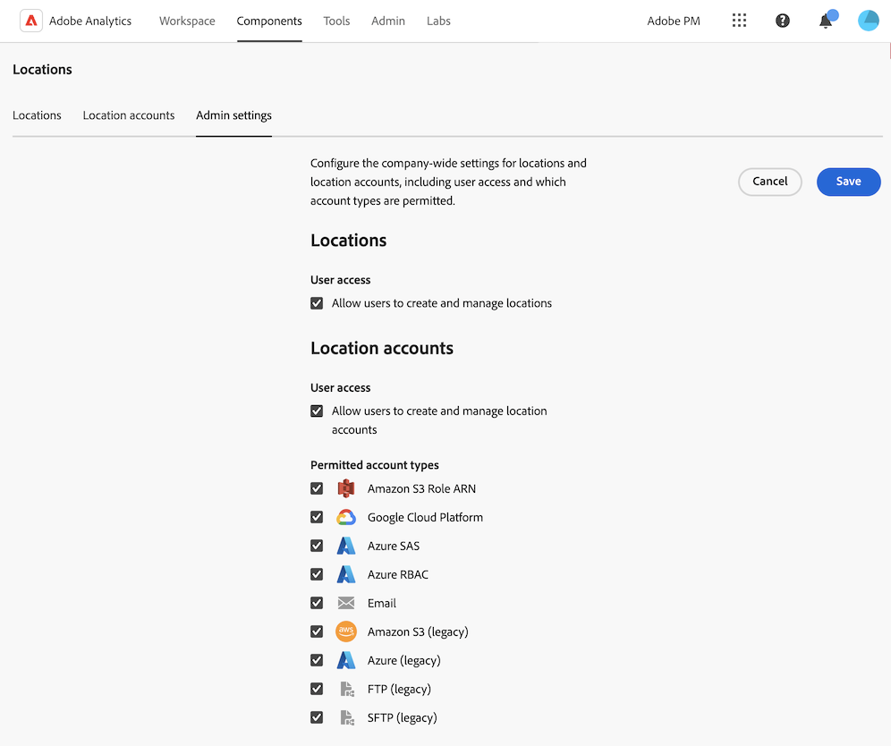

# 場所マネージャー

場所マネージャーを使用すると、アカウントと場所を表示、作成、編集、または削除できます。 これらは、次のいずれかの目的に使用できます。

* [ データフィード ](/help/export/analytics-data-feed/create-feed.md)を使用したファイルのエクスポート
* [Data Warehouse](/help/export/data-warehouse/create-request/dw-request-report-destinations.md)を使用したレポートのエクスポート
* [Report Builder](/help/analyze/report-builder/report-builder-export.md)の使用時にファイルをエクスポートする
* [分類セット ](/help/components/classifications/sets/overview.md)を使用したスキーマの読み込み

## 場所の表示、フィルター、検索

場所マネージャーを使用すると、作成した場所、または組織と共有されている場所を表示できます。 システム管理者は、共有されているかどうかにかかわらず、すべてのユーザーが作成した場所を表示できます。

1. Adobe Analyticsの場所マネージャーにアクセスするには、**[!UICONTROL コンポーネント]**/**[!UICONTROL 場所]**&#x200B;を選択します。

1. （条件付き）システム管理者の場合は、[!UICONTROL **すべてのユーザーの場所を表示**] オプションを有効にして、組織内のすべてのユーザーが作成した場所を表示できます。<!-- Maybe add a screenshot? This is new functionality -->

1. 場所のリストをフィルタリングまたは検索します。

   * **フィルター：** フィルターアイコンを選択して、場所のリストをフィルターします。

     場所は、**[!UICONTROL 場所タイプ]**、**[!UICONTROL アカウント]**、または&#x200B;**[!UICONTROL 作成者]**&#x200B;によってフィルタリングできます。

     

   * **検索：**&#x200B;検索フィールドに、表示する場所の名前を入力します。 入力時に結果がフィルタリングされます。 次の列が検索されます：**場所の名前**、**場所の種類**、**アカウント**、および&#x200B;**作成者**。

1. （オプション） 1,000個以上の場所がある場合は、最初の1,000個の表示のみです。 「[!UICONTROL **さらに読み込む**]」を選択して、さらに1,000個の場所を読み込みます。

## 場所マネージャーでの列の設定

次の列は、場所マネージャーで使用できます。 テーブルに表示される列をカスタマイズするには、**テーブルをカスタマイズ** アイコン を選択します。

* **[!UICONTROL 場所の名前]**：場所の名前。 場所の名前の横にある3点メニューを選択して、[場所を編集](/help/components/locations/configure-import-locations.md)するか、場所を削除します。
* **[!UICONTROL 場所の種類]**：場所に関連付けられているアカウントの種類。
* **[!UICONTROL アカウント]**：場所に関連付けられている特定のアカウント。
* **アプリケーション**：場所で使用できるアプリケーションの種類（データフィード、Data Warehouse、分類セットなど）。
* **[!UICONTROL 最終使用日]**：場所が最後に使用された日付。
* **[!UICONTROL 作成者]**：場所を作成したユーザー。
* **[!UICONTROL 作成日]**：場所が作成された日付。

## 場所の作成と管理

場所を作成、編集、削除できます。

### 場所の作成

場所の作成方法について詳しくは、[ クラウドの読み込みと書き出しの場所の設定](/help/components/locations/configure-import-locations.md)を参照してください。

<!-- Do I need to add some steps here about how to create a location and then assign that location to be used with DF, DW, or Classifications sets? Need to hear back from Ron and team whether we are including this functionality -->

### 場所の編集

場所は、作成したユーザーまたはシステム管理者のみが編集できます。

場所の編集方法について詳しくは、[ クラウドの読み込みと書き出しの場所の設定](/help/components/locations/configure-import-locations.md)を参照してください。

### 場所の削除

>[!IMPORTANT]
>
>場所が削除されると、削除された場所に関連付けられているデータフィードファイル、Data Warehouse レポート、または分類セットスキーマは、次回の使用時に失敗します。
>
>場所を削除する場合、機能する場所を使用するには、[ データフィード ](/help/export/analytics-data-feed/create-feed.md)、[Data Warehouse レポート ](/help/export/data-warehouse/create-request/dw-request-report-destinations.md)および[分類セット スキーマ ](/help/components/classifications/sets/manage/schema.md)を編集する必要があります。

場所は、その場所を作成したユーザーまたはシステム管理者のみが削除できます。

Adobe AnalyticsのLocations Managerで場所を削除するには：

1. **[!UICONTROL コンポーネント]**/**[!UICONTROL 場所]**&#x200B;を選択し、[!UICONTROL **場所**] タブを選択します。

1. 削除する場所の「[!UICONTROL **場所の名前**]」列の3 ドットメニューを選択します。

1. 「[!UICONTROL **削除**]」を選択します。

## アカウントの作成と管理

アカウントは作成、編集、削除できます。

### アカウントの作成

アカウントの作成方法について詳しくは、[ クラウドのインポートとエクスポートのアカウントの設定](/help/components/locations/configure-import-accounts.md)を参照してください。

### アカウントの編集

アカウントは、作成したユーザーまたはシステム管理者のみが編集できます。

アカウントの編集方法について詳しくは、[ クラウドのインポートとエクスポートのアカウントの設定](/help/components/locations/configure-import-accounts.md)を参照してください。

### アカウントキーの表示

アカウントを作成すると、そのアカウントに関連付けられているアカウントキーを表示できます。 この情報は、最初に[ アカウントを設定したときにクラウドプロバイダーでアカウントの設定を完了しなかった場合に表示する必要がある場合があります](/help/components/locations/configure-import-accounts.md)。

書き出しアカウントに関連付けられているキーを表示するには：

1. Adobe Analyticsで、**[!UICONTROL コンポーネント]** > **[!UICONTROL 場所]**&#x200B;を選択し、[!UICONTROL **場所アカウント**] タブを選択します。

1. （条件付き）システム管理者の場合は、[!UICONTROL **すべてのユーザーの場所を表示**] オプションを有効にして、組織内のすべてのユーザーが作成した場所を表示できます。<!-- Maybe add a screenshot? This is new functionality -->

1. 編集するアカウントの3 ドットアイコンを選択し、[!UICONTROL **アカウントキー**]&#x200B;を選択します。

### アカウントの削除

>[!IMPORTANT]
>
>アカウントは、使用している場所がない場合にのみ削除できます。 アカウントを削除する前に、[場所を削除](#delete-a-location)の説明に従って、最初にアカウント上の場所を削除する必要があります。

アカウントは、作成したユーザーまたはシステム管理者のみが削除できます。

アカウントを削除するには：

1. Adobe Analyticsで、**[!UICONTROL コンポーネント]** > **[!UICONTROL 場所]**&#x200B;を選択し、[!UICONTROL **場所アカウント**] タブを選択します。

1. （条件付き）システム管理者の場合は、[!UICONTROL **すべてのユーザーのアカウントを表示**] オプションを有効にして、組織内のすべてのユーザーが作成した場所を表示できます。

1. 編集するアカウントの3点アイコンを選択し、[!UICONTROL **アカウントを削除**]&#x200B;を選択します

## 会社全体の設定を行う（管理者のみ）

システム管理者は、ユーザーによるアカウントと場所の作成を制限したり、ユーザーが作成および使用できるアカウントの種類を制限したりできます。

### ユーザーがアカウントを作成および編集できるかどうかを設定します

デフォルトでは、組織内のすべてのユーザーは、Adobe Analytics環境で作成したアカウントを作成および編集できます（[configure cloud import and export accounts](/help/components/locations/configure-import-accounts.md)を参照）。

アカウントの作成をユーザーに制限できます。 この操作を行うと、ユーザーは既に作成したアカウントを引き続き使用できますが、編集することはできません。 [ アカウントの削除](#delete-an-account)の説明に従って、ユーザーが作成したアカウントを削除できます。

アカウントの作成と編集を全ユーザーに制限するには、次の手順を実行します。

1. Adobe Analyticsで、**[!UICONTROL コンポーネント]** > **[!UICONTROL 場所]**&#x200B;を選択し、[!UICONTROL **管理者設定**] タブを選択します。

1. [!UICONTROL **場所アカウント**] セクションで、「[!UICONTROL **ユーザーが場所アカウントを作成および管理することを許可する**]」オプションの選択を解除します。

1. 「[!UICONTROL **保存**]」を選択します。

1. （オプション） [ アカウントの削除](#delete-an-account)で説明しているように、ユーザーが作成したアカウントのうち、ユーザーが使用しないアカウントを削除します。

### ユーザーが場所を作成および編集できるかどうかを設定します

デフォルトでは、組織内のすべてのユーザーは、[ クラウドの読み込みと書き出しの場所の設定](/help/components/locations/configure-import-locations.md)で説明されているように、Adobe Analytics環境で作成した場所を作成および編集できます。

場所の作成をユーザーに制限できます。 この操作を行うと、ユーザーは作成済みの場所を引き続き使用できますが、編集することはできません。 [場所の削除](#delete-a-location)の説明に従って、ユーザーが作成した場所を削除できます。

すべてのユーザーが場所を作成および編集することを制限するには：

1. Adobe Analyticsで、**[!UICONTROL コンポーネント]** > **[!UICONTROL 場所]**&#x200B;を選択し、[!UICONTROL **管理者設定**] タブを選択します。

1. 「[!UICONTROL **場所**]」セクションで、「[!UICONTROL **ユーザーが場所を作成および管理することを許可する**]」オプションの選択を解除します。

1. 「[!UICONTROL **保存**]」を選択します。

1. （オプション）「[場所を削除](#delete-a-location)」の説明に従って、ユーザーが作成した場所のうち、ユーザーが使用しない場所を削除します。

### ユーザーが作成および使用できるアカウントタイプの制限

ユーザーが表示するアカウントタイプは、次の状況で制限できます。

* [新規アカウントの作成時](/help/components/locations/configure-import-accounts.md)。

* [ データフィード ](/help/export/analytics-data-feed/create-feed.md)を使用してファイルを書き出す場合、レポートを[Data Warehouse](/help/export/data-warehouse/create-request/dw-request-report-destinations.md)を使用して書き出す場合、または[分類セット ](/help/components/classifications/sets/overview.md)を使用してスキーマを読み込む場合に使用するアカウントを選択します。

この節で説明するようにアカウントタイプを制限すると、制限するアカウントタイプのアカウントはユーザーには表示されなくなります。 つまり、そのタイプの新しいアカウントは作成できず、そのタイプの既存のアカウントは、データフィード、Data Warehouse、または分類セットの作成時に使用できません。

ただし、スケジュールされた書き出しに設定されている既存のアカウントを使用できないように制限する場合は、そのアカウントを削除する必要があります。

#### スケジュールされた書き出しにアカウントが使用されないようにします

アカウントタイプを制限すると、既存のアカウントは非表示になり、削除されません。

スケジュールが、制限するタイプのアカウントにデータを送信するように既に設定されている場合、アカウントタイプを制限した後もスケジュールは実行され続け、データは引き続きアカウントに送信されます。  例えば、データフィードが、制限したアカウントタイプにデータを送信するようにスケジュールされている場合、スケジュールは引き続き実行されます。

特定のタイプのアカウントがスケジュールされた書き出しで使用されないように確認する必要がある場合は、[ アカウントタイプを制限](#limit-the-account-types-that-are-available-to-users)する前にアカウントを削除できます。

アカウントを削除するには：

1. スケジュールされた書き出しに使用されている、制限するアカウントタイプのアカウントを探します。

1. 「[ アカウントを削除](#delete-an-account)」の説明に従って、アカウントを削除します。

1. 次のセクションに進みます。[ ユーザーが利用できるアカウントタイプを制限します](#limit-the-account-types-that-are-available-to-users)。

#### ユーザーが利用できるアカウントタイプを制限する

アカウントを作成および使用する際にユーザーが使用できるアカウントタイプを制限するには、次の手順に従います。

1. Adobe Analyticsで、**[!UICONTROL コンポーネント]** > **[!UICONTROL 場所]**&#x200B;を選択し、[!UICONTROL **管理者設定**] タブを選択します。

1. 「[!UICONTROL **許可されたアカウントタイプ**]」セクションを探します。

   次のアカウントタイプは、デフォルトでユーザーが使用できます。 ユーザーの使用を制限するアカウントタイプの選択を解除します。

   少なくとも1つのアカウントタイプを選択してください。

   * [!UICONTROL **Amazon S3 Role ARN**]

   * [!UICONTROL **Google Cloud Platform**]

   * [!UICONTROL **Azure SAS**]

   * [!UICONTROL **Azure RBAC**]

   * [!UICONTROL **電子メール**]

   * [!UICONTROL **Amazon S3**]、[!UICONTROL **Azure**]、[!UICONTROL **FTP**]、[!UICONTROL **SFTP**]&#x200B;などのレガシーアカウントタイプ

1. 「[!UICONTROL **保存**]」を選択します。

