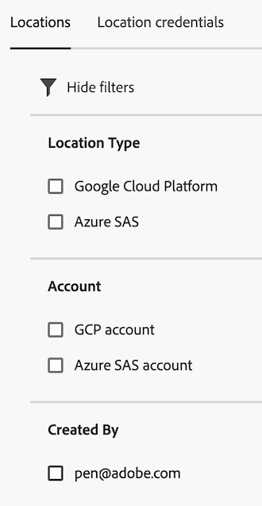

# 場所マネージャー

ロケーションマネージャーを使用すると、ロケーションを作成、編集、削除できます。 これらの場所を使用すると、書き出したファイルや読み込んだファイルのソースの保存先や再利用先を設定できます。 ロケーションマネージャーは、組織内のすべてのレポートスイートで [分類セット](../classifications/sets/overview.md) アーキテクチャ。

**[!UICONTROL コンポーネント]** > **[!UICONTROL 場所]**

## 場所をフィルター

ロケーションマネージャーの左側には、目的のロケーションを検索するためのフィルター設定が表示されます。

1. フィルターアイコンを選択します。

   場所は、 **[!UICONTROL 場所のタイプ]**, **[!UICONTROL アカウント]**&#x200B;または **[!UICONTROL 作成者]**.

   

## ロケーションマネージャーの列

ロケーションマネージャーでは、次の列を使用できます。

* **[!UICONTROL 場所名]**：場所の名前。 場所名の横にある 3 ドットメニューを選択して、次のいずれかを実行します。 [場所を編集](/help/components/locations/configure-import-locations.md) または削除します。
* **[!UICONTROL 場所のタイプ]**：場所に関連付けられているアカウントのタイプ。
* **[!UICONTROL アカウント]**：場所に関連付けられている特定のアカウント。
* **[!UICONTROL 最後に使用した日時]**：場所が最後に使用された日付。
* **[!UICONTROL 作成者]**：ロケーションを作成したユーザー。
* **[!UICONTROL 作成日]**：場所が作成された日付。

## オプションを作成または編集

ロケーションマネージャーでは、次のオプションを使用できます。

* **[!UICONTROL 場所を追加]**：ロケーションを作成します。

  詳しくは、 [クラウドの読み込み場所の設定](/help/components/locations/configure-import-locations.md).
* **[!UICONTROL 検索フィールド]**：場所を名前で検索します。
* **[!UICONTROL さらに読み込み]**：ロケーションマネージャーには、最初に最大 1,000 個のロケーションが表示されます。 このボタンを使用すると、さらに 1,000 の場所が読み込まれます。
* **テーブルをカスタマイズ**：テーブルのカスタマイズアイコン  では、テーブルに表示する列を選択できます。

場所の横にあるチェックボックスを選択すると、次のオプションが表示されます。

* **[!UICONTROL 編集]**：選択した場所を編集できます。 編集可能なフィールドについて詳しくは、 [クラウドの読み込み場所の設定](/help/components/locations/configure-import-accounts.md).
* **[!UICONTROL 削除]**：選択した場所を削除します。 このオプションを使用すると、複数の場所を選択できます。
