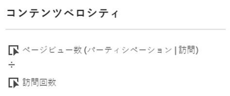
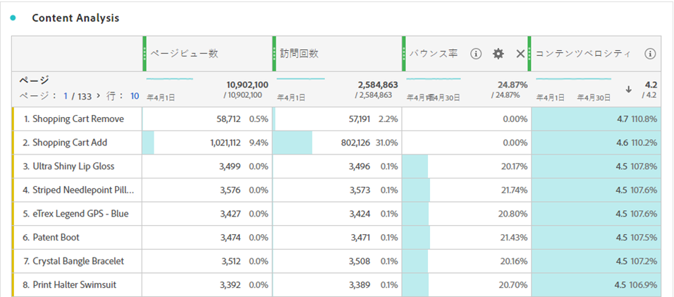

# コンテンツベロシティ

「コンテンツベロシティ」は、ダウンストリームコンテンツに対するディメンションの影響を測定するのに役立つ計算指標テンプレートです。「`Page views (Visit participation) divided by Visits`」式が使用されています。

[!UICONTROL コンテンツベロシティ]は、[!UICONTROL ページビュー]、[!UICONTROL 訪問回数]、[!UICONTROL バウンス率]など、他の主要指標と共に、コンテンツの分析で一般的に使用されます。

