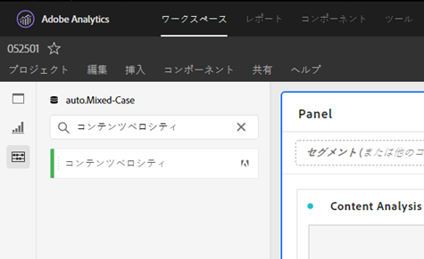

# [!UICONTROL コンテンツベロシティ]

[!UICONTROL コンテンツ速度] は、標準のAdobe Analytics指標テンプレートです。 [!UICONTROL コンテンツ速度] は[[!UICONTROL ページ表示]として定義されます。] | [!UICONTROL Visit Participation]] / [[!UICONTROL Visits]]を使用して、特定のコンテンツ要素（ページ、サイトセクションなど）が がダウンストリームコンテンツに含まれていた問題を修正しました。 Webサイトやモバイルアプリでユーザーを保持しているコンテンツと保持していないコンテンツを把握するのに役立ちます。

[!UICONTROL コンテンツの速度] は、分析ワークスペースで左側のレールをフィルターして(検索またはタグ(#Adobe Template)を使用して)確認できます。

[!UICONTROL コンテンツ速度] は、 [!UICONTROL ページ表示]、 [!UICONTROL 訪問回数]、直帰率など、他の主要指標と共に、コンテンツの分析で一般的に使用されます 。

