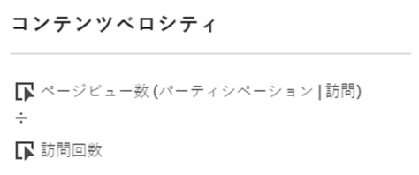
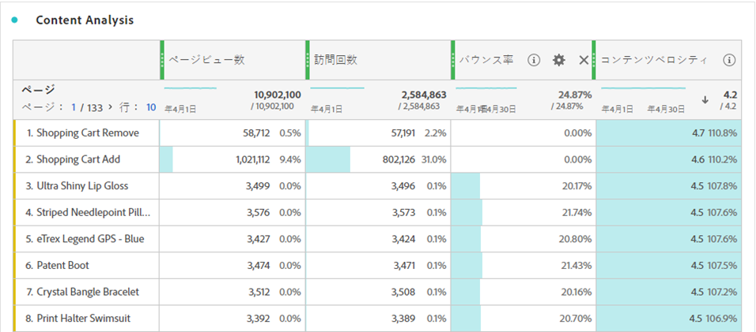

# コンテンツベロシティ

「コンテンツベロシティ」計算指標は、ディメンション（通常は[[!UICONTROL  ページ ]](/help/components/dimensions/page.md)）が、web サイトまたはアプリで時間を費やすユーザーにどのように貢献しているかを測定するのに役立ちます。

この指標は、計算の一部として、[ ページビュー](page-views.md)指標の[参加属性](/help/analyze/analysis-workspace/attribution/models.md)を使用します。 訪問参加では、ページがヒットするたびに、同じ訪問中に以前にヒットしたすべてのページに、ページビューのクレジットも付与されます。 この計算式は通常、ページが訪問中にヒットするのが早いほど、より多くのクレジットを受け取ることを意味します。 （詳しくは、[ ページビュー（参加|訪問）または「参加にアクセス」 ](#page-views-participation--visit-or-visit-participation)を参照してください）。

## 計算

「コンテンツベロシティ」は、デフォルトで計算される[指標](overview.md)であり、式`Page views (Visit participation)`を`Visits`で割ったものが使用されます。

## 一般的な用途

[!UICONTROL コンテンツベロシティ]は、[!UICONTROL ページビュー]、[!UICONTROL 訪問回数]、[!UICONTROL バウンス率]など、他の主要指標と共に、コンテンツの分析で一般的に使用されます。

## 例

次の例では、コンテンツベロシティの「ページビュー（参加者数|訪問者数）」と「訪問者数」の2つの部分について説明します。

### ページビュー（参加|訪問）または「参加を訪問」

次に、訪問の参加がアトリビューションに与える影響の例を示します。

Web サイトでは、ユーザーは次のページに次の順序でアクセスします。

* ページ A
* ページ B
* ページ C
* ページ D

上記の例では、A ページは4 ヒット、B ページは3 ヒット、C ページは2 ヒット、D ページは1 ヒットのクレジットを受け取ります。

次の例は、同じ原則を示していますが、一部のページは複数回訪問されています。

* ページ A
* ページ B
* ページ C
* ページ B
* ページ D
* ページ A

上記の例では、A ページは7 ヒット、B ページは8 ヒット、C ページは4 ヒット、D ページは2 ヒットのクレジットを受け取ります。

### 訪問回数

訪問参加数を計算すると、結果は訪問数で割られます。
