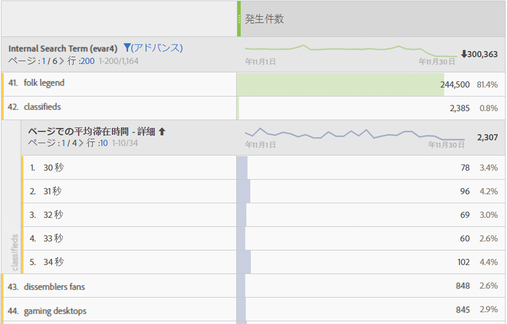
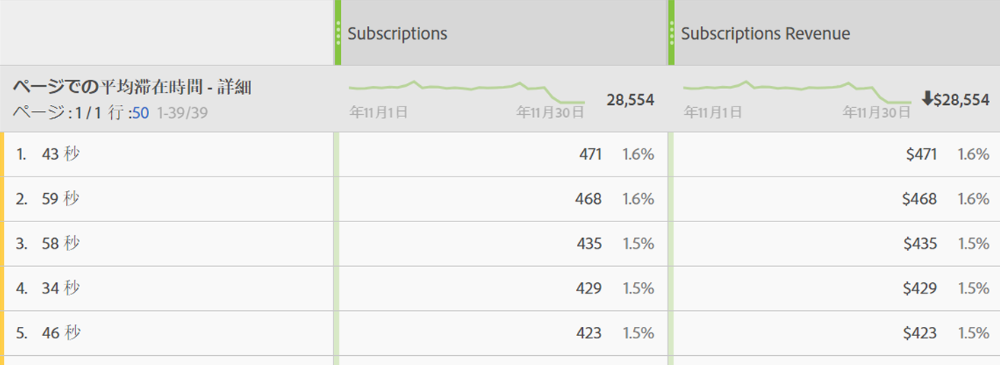

# 滞在時間の概要

様々な[!UICONTROL &#39;滞在時間&#39;] [指標](overview.md)とディメンションがAdobe Analytics製品全体で提供されます。 このページは、求めているディメンションや指標をわかりやすく提示するのに役立ちます。

## 滞在時間指標

| 指標 | 定義 | 次で使用可能 |
|---|---|---|
| [[!UICONTROL 合計滞在時間（秒）]](total-seconds-spent.md) | 訪問者が特定のディメンション項目に関与した合計時間を表します。 すべての後続のヒットにわたる値と永続性のインスタンスを含みます。 prop の場合、滞在時間には後続のリンクイベントもカウントされます。 | Analysis Workspace、Report Builder（「合計滞在時間」）、Data Warehouse |
| [[!UICONTROL 1訪問あたりの滞在時間] （秒） ](time-spent-per-visit.md) | 約&#x200B;*合計滞在時間/（訪問 – バウンス）* &#x200B;訪問ごとに特定のディメンション項目を訪問者が操作する平均時間を表します。 **注意**：この関数の分母が内部指標であるため、この指標を個別に計算することはできません。 | Analysis Workspace |
| [[!UICONTROL 訪問者あたりの滞在時間] （秒） ](time-spent-per-visitor.md) | 約&#x200B;*合計滞在時間/ユニーク訪問者* &#x200B;訪問者のライフタイム（Cookieの長さ）において、訪問者が特定のディメンション項目とインタラクションする平均時間を表します。 **注意**：この関数の分母が内部指標であるため、この指標を個別に計算することはできません。 | Analysis Workspace |
| [!UICONTROL 滞在時間/ユーザー（状態） ] | 約&#x200B;*モバイルアプリの合計滞在時間/モバイルアプリのユニーク訪問者*  モバイルアプリの訪問者が、訪問者のライフタイム（Cookieの長さ）全体で特定のディメンション項目とインタラクションする平均時間を表します。 **注意**：この関数の分母が内部指標であるため、この指標を個別に計算することはできません。 | Analysis Workspace |
| [[!UICONTROL  サイトでの平均滞在時間] （秒） ](average-time-on-site.md) | 訪問者が特定のディメンション項目を操作する合計時間を、ディメンション項目を含むシーケンスごとに表します。 名前が示すように、それは「サイト」平均に限定されるだけではありません。 シーケンスについて詳しくは、「滞在時間の計算方法」の節を参照してください。 **注**：この指標は、計算の分母の違いにより、ディメンション項目レベルの「訪問当たりの滞在時間」とは非常に異なる可能性が高くなります。 | Analysis Workspace、Report Builder（分単位で表示） |
| [[!UICONTROL サイトでの平均時間]](average-time-on-site.md) | これは、*サイトでの平均滞在時間（秒）*&#x200B;と同じ指標ですが、時間（`hh:mm:ss`）としてフォーマットされています | Analysis Workspace |
| [!UICONTROL ページでの平均滞在時間] | 非推奨の指標。  代わりに、ディメンション項目の平均時間が必要な場合は、[[!UICONTROL  サイトでの平均滞在時間]](average-time-on-site.md)を使用することをお勧めします。 | Report Builder（リクエストにディメンションがある場合） |

## 「滞在時間」ディメンション

| ディメンション | 定義 | 次で使用可能 |
| --- | --- | --- |
| [[!UICONTROL 訪問別滞在時間 - 詳細]](../dimensions/time-spent-per-visit.md) | 訪問中の合計滞在時間（秒単位）であり、訪問の一部として各ヒットに適用されます。 これは、訪問レベルのディメンションです。 | Analysis Workspace |
| [[!UICONTROL 訪問別滞在時間 - グループ]](../dimensions/time-spent-per-visit.md) | 詳細なディメンションは9つの異なる範囲に分類されています。 これは、訪問レベルのディメンションです。 範囲は次のとおりです。<ul><li>1 分未満</li><li>1～5分</li><li>5～10分</li><li>10～30分</li><li>30～60 分</li><li>1～2 時間</li><li>2～5時間</li><li>5～10時間</li><li>10～15時間</li></ul>**メモ**：訪問は 12 時間のアクティビティの後に有効期限が切れるので、これより大きいグループはありません。 | Analysis Workspace、Report Builder |
| [[!UICONTROL ページでの滞在時間 - 詳細]](../dimensions/time-spent-on-page.md) | 各ヒットに関する合計滞在時間（秒単位）です。 ヒットレベルのディメンションであり、ページビュー数およびリンクイベントを含みます。 その名前にもかかわらず、「ページ」ディメンションに限定されません。 | Analysis Workspace |
| [[!UICONTROL ページでの滞在時間 - グループ]](../dimensions/time-spent-on-page.md) | 詳細ディメンションは10の異なる範囲に分類されますが、グループ化されたディメンションではページビューのみがカウントされ、リンクイベントは除外されます。 これはヒットレベルのディメンションです。 範囲は次のとおりです。<ul><li>15 秒未満</li><li>15 ～ 29 秒</li><li>30 ～ 59 秒</li><li>1 ～ 3 分</li><li>3 ～ 5 分</li><li>5 ～ 10 分</li><li>10 ～ 15 分</li><li>15 ～ 20 分</li><li>20 ～ 30 分</li><li>30 分超</li></ul> | Analysis Workspace |

## 「滞在時間」の計算方法

Adobe Analyticsでは、明示的な値（リンクイベントやビデオビューを含む）を使用して、滞在時間を計算します。

>[!NOTE]
>
>[!UICONTROL ビデオ視聴]や[!UICONTROL 離脱リンク]などのリンクイベントが発生しない場合、訪問の最後のヒットでの滞在時間は確認できません。 また、同様の理由で、[!UICONTROL バウンス訪問]（つまり、単一のヒットを含む訪問）には、関連付けられた「滞在時間」がありません。

すべての滞在時間の計算での&#x200B;**分子**&#x200B;は、「合計滞在時間（秒）」です。

**分母**&#x200B;は、Adobe Analytics では個別の指標として使用できません。 ヒットレベルの「滞在時間」指標では、分母はシーケンスです。 シーケンスは、連続したヒットのセットであり、特定の変数が同じ値を含みます（設定されるか、後続に展開するか、永続化によって）。 「後続に展開」とは、滞在時間を計算するための、ページビュー間の（つまり、後続のリンクイベントにまたがる）prop の永続性のことをいいます。

* 例えば、[!UICONTROL ページ名]またはそのヒットレベルの他のディメンションの場合、分母は基本的に[!UICONTROL インスタンス]または[!UICONTROL ページビュー数]ですが、リロードして値が設定されていない場合（リンクイベントなど）は、単一のインタラクション（シーケンス）としてカウントされます。

* バウンスおよび離脱ヒットも、滞在&#39;時間が確認できないので、分母から削除されます。

## よくある質問（FAQ）

+++すべての「滞在時間」指標を任意のディメンションに適用できますか？

任意のディメンションに適用できる「滞在時間」指標は次のとおりです。

* [[!UICONTROL 合計滞在時間（秒）]](total-seconds-spent.md)

* [[!UICONTROL 訪問別滞在時間]（秒）](time-spent-per-visit.md)

* [[!UICONTROL 訪問者別滞在時間]（秒）](time-spent-per-visitor.md)

* [[!UICONTROL サイトでの平均滞在時間]（秒）](average-time-on-site.md)

+++

+++他のディメンションとの分類で、どの時間滞在ディメンションが最もよく使用されますか？

[[!UICONTROL  ページ滞在時間 – 詳細]](../dimensions/time-spent-on-page.md) ディメンションは、ヒットレベルのディメンションです。 これを他のディメンションで分類すると、ヒットが存続して分類ディメンションも存在した秒数がわかります。
下の例では、「classifieds」という検索語は、54秒や59秒などのヒット時間に関連付けられており、おそらく、訪問者がその用語に返されるコンテンツを読んでいる時間を示しています。

+++

+++「[!UICONTROL  ページ滞在時間 – 詳細]」のディメンションに対して、どの指標が適切ですか？

任意の指標： このディメンションは、イベントが発生したヒットの滞在時間を表します。 滞在時間が長くなると、訪問者がイベントが発生したページ（ヒット）により長く滞在したことを意味します。

ディメンションに費やした時間で使用されたカスタム指標を示す

+++

+++[!UICONTROL  サイトでの平均滞在時間]と[!UICONTROL 訪問あたりの滞在時間]との違いは何ですか？

違いは、指標の分母です。

* [[!UICONTROL サイトでの平均滞在時間]](average-time-on-site.md)は、ディメンション項目を含むシーケンスを使用します。

* [[!UICONTROL 訪問別滞在時間]](time-spent-per-visit.md)は、訪問数を使用します。

その結果、これらの指標は、訪問レベルでは同様の結果を示すことができますが、ヒットレベルでは異なります。

+++

+++[!UICONTROL  サイトでの平均滞在時間]の内訳の合計が親項目と一致しないのはなぜですか？

[!UICONTROL  サイトでの平均滞在時間]は、ディメンションの壊れていないシーケンスに依存し、内部報告書はこれらの実行を計算する際に外部報告書に依存しないためです。

例えば次の例について検討してみます。

| ヒット # | 1 | 2 | 3 |
|---|---|---|---|
| **秒間の使用時間** | 30 | 100 | 10 |
| **ページ名** | ホーム | 製品 | ホーム |
| **日付** | 1 月 1 日 | 1 月 1 日 | 1 月 1 日 |

ホームページの滞在時間を計算するときは (30 + 10) /2 = 20 となりますが、日別で分けると 1 月 1 日という大きなくくりでの実行となるので、(30 + 10) /1 = 40 となります。

その結果、これらの指標は、訪問レベルでは同様の結果を示すことができますが、ヒットレベルでは異なります。

+++

## [!UICONTROL 滞在時間]計算の例

次のサーバーコールのセットは、1 回の訪問での 1 名の訪問者のものであるとします。

| 訪問ヒット数 | 1 | 2 | 3 | 4 | 5 | 6 | 7 |
|---|---|---|---|---|---|---|---|
| **訪問経過時間（秒）** | 0 | 30 | 80 | 180 | 190 | 230 | 290 |
| **秒間の使用時間** | 30 | 50 | 100 | 10 | 40 | 60 | - |
| **ヒットタイプ** | ページ | リンク | ページ | ページ | ページ | ページ | ページ |
| **ページ名** | ホーム | - | 製品 | ホーム | ホーム（リロード） | 買い物かご | 注文確認 |
|  |  |  |  |  |  |  |  |
| **prop1** | A（設定） | A（前方に広がる） | 未設定 | B（設定） | B（設定） | A（設定） | C（設定） |
| **prop1秒が費やされました** | 30 | 50 | - | 10 | 40 | 60 | - |
|  |  |  |  |  |  |  |  |
| **eVar1** | 赤（設定） | 赤（持続） | （期限切れ） | 青（設定） | 青（設定） | 青（持続） | 赤（設定） |
| **eVar1 滞在時間（秒）** | 30 | 50 | - | 10 | 40 | 60 | - |

上の表に基づいて、滞在時間指標は次のように計算されます。

| prop1 | 合計滞在時間（秒） | 訪問別滞在時間 | 訪問者別滞在時間 | シーケンス数 | サイトでの平均滞在時間 |
|---|---|---|---|---|---|
| A | 30+50+60=140 | 140/1=140 | 140/1=140 | 2 | 140/2=70 |
| B | 10+40=50 | 50/1=50 | 50/1=50 | 1 | 50/1=50 |
| C | 0 | 0 | 0 | 0 | 0 |
| 帰属しない時間 | 100 | - | - | - | - |

| eVar1 | 合計滞在時間（秒） | 訪問別滞在時間 | 訪問者別滞在時間 | シーケンス数 | サイトでの平均滞在時間 |
|---|---|---|---|---|---|
| 赤 | 30+50=80 | 80/1=80 | 80/1=80 | 1 | 80/1=80 |
| 青 | 10+40+60=110 | 110/1=110 | 110/1=110 | 1 | 110/1=110 |
| 帰属しない時間 | 100 | - | - | - | - |

1訪問あたりの滞在時間（詳細）: 290
ページ滞在時間（詳細）: 10、30、40、50、60、100

この例の補足として、次の追加の注意事項があります。

* すべての滞在時間の計算は、訪問の最初のヒットでゼロから始まる、訪問の経過時間に基づいています。

* 「秒単位」は、現在のヒットのタイムスタンプと次のヒットのタイムスタンプの差です。 その結果、訪問の最後のヒット（およびバウンス）には時間が費やされません。

* 「シーケンス」とは、特定の変数に同じ値が含まれる連続したヒットのセットです（設定、スプレッド、永続化のいずれかで）。 たとえば、prop1 &quot;A&quot;には、ヒット 1と2、ヒット 6という2つのシーケンスがあります。 訪問の最後のヒットの値は、最後のヒットに費やした時間がないので、新しいシーケンスを開始しません。 サイトでの平均滞在時間では、分母にシーケンスを使用しています。

   * 使用された時間のみを目的として、propは、上記のようにヒット 2のprop1に対してページヒットから後続のリンクヒットまで「スプレッド・フォワード」されます。 これにより、ヒット 1のprop1に設定された値（「A」）を使用して、ヒット 2に費やした時間を蓄積できます。

   * eVar は、eVar が設定または永続化された任意のヒットの滞在時間を累計します。 eVar の永続性は、「Analytics／管理者の eVar 設定」で定義されます。
