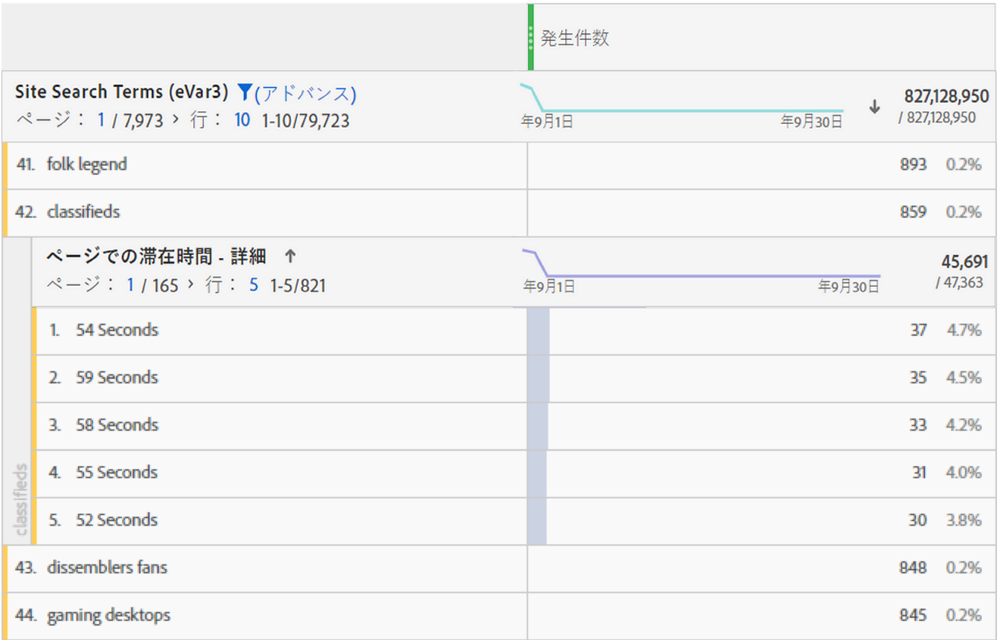

# 滞在時間の概要

Adobe Analytics 製品全体では、様々な「[!UICONTROL 滞在時間]」指標とディメンションが提供されています。

## 滞在時間指標

| 指標 | 定義 | 使用対象 |
|---|---|---|
| [!UICONTROL 合計滞在時間（秒）] | 訪問者が特定のディメンション項目に関与した合計時間を表します。すべての後続のヒットにわたる値と永続性のインスタンスを含みます。prop の場合、滞在時間には後続のリンクイベントもカウントされます。 | Analysis Workspace、Reports &amp; Analytics、Report Builder（「合計滞在時間」と呼ばれる）、Data Warehouse |
| [!UICONTROL 訪問別滞在時間]（秒） | *合計滞在時間（秒）／（訪問バウンス）* &#x200B;各訪問で訪問者が特定のディメンション項目に関与した平均時間を表します。 | Analysis Workspace、Reports &amp; Analytics |
| [!UICONTROL 訪問者別滞在時間]（秒） | *合計滞在時間（秒）／（ユニーク訪問者）*  訪問者のライフタイム（cookie の期間）にわたって訪問者が特定のディメンション項目に関与した平均時間を表します。 | Analysis Workspace、Reports &amp; Analytics |
| [!UICONTROL サイトでの平均滞在時間]（秒） | ディメンション項目のシーケンスごとに、訪問者が特定のディメンション項目に関与した合計時間を表します。名前が示すような「サイト」の平均に限定されません。シーケンスについて詳しくは、「滞在時間の計算方法」の節を参照してください。 **注意**： この指標は、計算での分母の違いにより、ディメンション項目レベルで「訪問別滞在時間」と異なる可能性が非常に高くなります。 | Analysis Workspace、Reports &amp; Analytics（分単位で表示）、Report Builder（分単位で表示） |
| [!UICONTROL ページでの平均滞在時間] | 廃止された指標です。 ディメンション項目の平均時間が必要な場合は、かわりに「サイトでの平均滞在時間」を使用することをお勧めします。 | Report Builder（リクエストにディメンションがある場合） |
| [!UICONTROL セッションの合計長]（別名：[!UICONTROL 以前のセッションの長さ]） | Mobile アプリ SDK のみ。 アプリが次回起動されたときに、以前のセッションの長さが決まります。この指標は、秒単位で計算され、アプリがバックグラウンドにある場合はカウントされず、使用中の場合のみカウントされます。これは、セッションレベルの指標です。 例：アプリ ABC をインストールして起動し、2 分間使用してからアプリを閉じます。このセッション時間に関するデータは送信されません。次回起動すると、[!UICONTROL 以前のセッションの長さ]（値は 120）が送信されます。 | Analysis Workspace、Reports &amp; Analytics、Report Builder、Mobile Services UI |
| [!UICONTROL 平均セッション時間]（モバイル） | *合計セッション長／（起動階数 — 初回起動）*  Mobile App SDK のみ。これは、セッションレベルの指標です。 | Report Builder、Mobile Services UI |

## 「滞在時間」ディメンション

| ディメンション | 定義 | 使用対象 |
| --- | --- | --- |
| [!UICONTROL 訪問別滞在時間 - 詳細] | 訪問中の合計滞在時間（秒単位）であり、訪問の一部として各ヒットに適用されます。これは、訪問レベルのディメンションです。 | Analysis Workspace |
| [!UICONTROL 訪問別滞在時間 - グループ] | 9 個の異なる範囲にグループ分けされた詳細なディメンションです。これは、訪問レベルのディメンションです。範囲を次に示します。<ul><li>1 分未満</li><li>1 ～ 5 分</li><li>5 ～ 10 分</li><li>10 ～ 30 分</li><li>30 ～ 60 分</li><li>1 ～ 2 時間</li><li>2 ～ 5 時間</li><li>5 ～ 10 時間</li><li>10 ～ 15 時間</li></ul>**メモ**：訪問は 12 時間のアクティビティの後に有効期限が切れるので、これより大きいグループはありません。 | Analysis Workspace、Reports &amp; Analytics、Report Builder |
| [!UICONTROL ページでの滞在時間 - 詳細] | 各ヒットに関する合計滞在時間（秒単位）です。ヒットレベルのディメンションであり、ページビュー数およびリンクイベントを含みます。名前にもかかわらず、「ページ」ディメンションに制限されません。 | Analysis Workspace |
| [!UICONTROL ページでの滞在時間 - グループ] | 10 個の異なる時間範囲にグループ分けされた詳細なディメンションです。ただし、グループディメンションは、ページビュー数のみをカウントします（リンクイベントを除く）。これは、ヒットレベルのディメンションです。範囲を次に示します。<ul><li>15 秒未満</li><li>15 ～ 29 秒</li><li>30 ～ 59 秒</li><li>1 ～ 3 分</li><li>3 ～ 5 分</li><li>5 ～ 10 分</li><li>10 ～ 15 分</li><li>15 ～ 20 分</li><li>20 ～ 30 分</li><li>31 分以上</li></ul> | Analysis Workspace、Reports &amp; Analytics |

## 「滞在時間」の計算方法

Adobe Analytics は、明示的な値（リンクイベントおよびビデオ視聴を含む）を使用して、[!UICONTROL 滞在時間]を計算します。

>[!NOTE]
>
>[!UICONTROL ビデオ視聴]や[!UICONTROL 離脱リンク]などのリンクイベントが発生しない場合、訪問の最後のヒットでの滞在時間は確認できません。また、同様の理由で、[!UICONTROL バウンス訪問]（つまり、単一のヒットを含む訪問）には、関連付けられた「滞在時間」がありません。

すべての滞在時間の計算での&#x200B;**分子**&#x200B;は、「合計滞在時間（秒）」です。

**分母**&#x200B;は、Adobe Analytics では個別の指標として使用できません。ヒットレベルの「滞在時間」指標では、分母はシーケンスです。シーケンスは、連続したヒットのセットであり、特定の変数が同じ値を含みます（設定されるか、後続に展開するか、永続化によって）。「後続に展開」とは、滞在時間を計算するための、ページビュー間の（つまり、後続のリンクイベントにまたがる）prop の永続性のことをいいます。

* 例えば、[!UICONTROL ページ名]またはそのヒットレベルの他のディメンションの場合、分母は基本的に[!UICONTROL インスタンス]または[!UICONTROL ページビュー数]ですが、リロードして値が設定されていない場合（リンクイベントなど）は、単一のインタラクション（シーケンス）としてカウントされます。

* バウンスおよび離脱ヒットも、滞在&#39;時間が確認できないので、分母から削除されます。

## よくある質問（FAQ）

**Q1：すべての滞在&#39;時間&#39;指標を任意のディメンションに適用できますか。**

回答：任意のディメンションに適用できる「滞在時間」指標は次のとおりです。

* [!UICONTROL 合計滞在時間（秒）]

* [!UICONTROL 訪問別滞在時間]（秒）

* [!UICONTROL 訪問者別滞在時間]（秒）

* [!UICONTROL サイトでの平均滞在時間]（秒）

**Q2：他のディメンションを使用した分類で使用するのに最適なのは、どの滞在時間ディメンションですか。**

回答：[!UICONTROL ページでの滞在時間 – 詳細]ディメンションは、ヒットレベルのディメンションです。これを他のディメンションで分類すると、ヒットが存続して分類ディメンションも存在した秒数がわかります。次の例では、検索語句「classifieds」が 54 秒、59 秒などのヒット時間に関連付けられており、おそらく訪問者がその語句で返されたコンテンツを読むのに時間を費やしていることを示しています。

「**Q3：[!UICONTROL ページでの滞在時間 – 詳細]」ディメンションに対して適切なのはどの指標ですか。**

回答：任意の指標です。このディメンションは、イベントが発生したヒットの滞在時間を表します。滞在時間が長くなると、訪問者がイベントが発生したページ（ヒット）により長く滞在したことを意味します。

**Q4：[!UICONTROL サイトでの平均滞在時間]は[!UICONTROL 訪問別滞在時間]とどのように異なりますか。**

回答：違いは、指標の分母です。

* [!UICONTROL サイトでの平均滞在時間]は、ディメンション項目を含むシーケンスを使用します。

* [!UICONTROL 訪問別滞在時間]は、訪問数を使用します。

結果として、これらの指標は、訪問レベルでは似たような結果を生みますが、ヒットレベルでは異なります。

**Q5：[!UICONTROL サイトでの平均滞在時間]を含む分類の合計が親行項目と一致しないのはなぜですか。**

A：[!UICONTROL サイトでの平均滞在時間]は、ディメンションの分類されていないシーケンスに依存するので、これらの実行を計算する際に、内部レポートは外部レポートに依存しません。

例えば次の例について検討してみます。

| ヒット# | 1 | 2 | 3 |
|---|---|---|---|
| **滞在時間（秒）** | 30 | 100 | 10 |
| **ページ名** | ホーム | 製品 | ホーム |
| **date** | 1 月 1 日 | 1 月 1 日 | 1 月 1 日 |

ホームページの滞在時間を計算するときは (30 + 10) /2 = 20 となりますが、日別で分けると 1 月 1 日という大きなくくりでの実行となるので、(30 + 10) /1 = 40 となります。

結果として、これらの指標は、訪問レベルでは似たような結果を生みますが、ヒットレベルでは異なります。

## [!UICONTROL 滞在時間]計算の例

次のサーバーコールのセットは、1 回の訪問での 1 名の訪問者のものであるとします。

| 訪問ヒット数 | 1 | 2 | 3 | 4 | 5 | 6 | 7 |
|---|---|---|---|---|---|---|---|
| **訪問経過時間（秒）** | 0 | 30 | 80 | 180 | 190 | 230 | 290 |
| **滞在時間（秒）** | 30 | 50 | 100 | 10 | 40 | 60 | - |
| **ヒットタイプ** | ページ | リンク | ページ | ページ | ページ | ページ | ページ |
| **ページ名** | ホーム | - | 製品 | ホーム | ホーム（リロード） | 買い物かご | 注文確認 |
|  |  |  |  |  |  |  |  |
| **prop1** | A（設定） | A（前方に広がる） | 未設定 | B（設定） | B（設定） | A（設定） | C（設定） |
| **prop1 滞在時間（秒）** | 30 | 50 | - | 10 | 40 | 60 | - |
|  |  |  |  |  |  |  |  |
| **eVar1** | 赤（設定） | 赤（持続） | （期限切れ） | 青（設定） | 青（設定） | 青（持続） | 赤（設定） |
| **eVar1 滞在時間（秒）** | 30 | 50 | - | 10 | 40 | 60 | - |

上の表に基づいて、滞在時間指標は次のように計算されます。

| prop1 | 合計滞在時間（秒） | 訪問別滞在時間 | 訪問者別滞在時間 | シーケンス数 | サイトでの平均滞在時間 |
|---|---|---|---|---|---|
| A | 30+50+60=140 | 140/1=140 | 140/1=140 | 2 | 140/2=70 |
| B | 10+40=50 | 50/1=50 | 50/1=50 | 1 | 50/1=50 |
| C | 0 | 0 | 0 | 0 | 0 |
| 不明な時間 | 100 | - | - | - | - |

| eVar1 | 合計滞在時間（秒） | 訪問別滞在時間 | 訪問者別滞在時間 | シーケンス数 | サイトでの平均滞在時間 |
|---|---|---|---|---|---|
| 赤 | 30+50=80 | 80/1=80 | 80/1=80 | 1 | 80/1=80 |
| 青 | 10+40+60=110 | 110/1=110 | 110/1=110 | 1 | 110/1=110 |
| 不明な時間 | 100 | - | - | - | - |

訪問別滞在時間（詳細）：290 ページでの滞在時間（詳細）：10、30、40、50、60、100

この例の補足として、次の追加の注意事項があります。

* すべての滞在時間の計算は、訪問の最初のヒットでゼロから始まる、訪問の経過時間に基づいています。

* 「滞在時間（秒）」は、現在のヒットのタイムスタンプと次のヒットのタイムスタンプの間の差異です。結果として、訪問の最後のヒット（およびバウンス数）には滞在時間が含まれません。

* 「シーケンス」は、連続したヒットのセットであり、特定の変数が同じ値を含みます（設定されるか、後続に展開するか、永続化によって）。例えば、prop1「A」には、ヒット 1 と 2 およびヒット 6 の 2 つのシーケンスがあります。最後のヒットは滞在時間を含まないので、訪問の最後のヒットの値では新しいシーケンスは開始されません。サイトでの平均滞在時間は、分母のシーケンスを使用します。

   * 滞在時間を目的とする場合のみ、前述の prop1 のヒット 2 に示されているように、prop がページヒットから後続のリンクヒットに「後続に展開」されます。これにより、prop1 のヒット 1（「A」）に設定された値をヒット 2 の滞在時間に累計できます。

   * eVar は、eVar が設定または永続化された任意のヒットの滞在時間を累計します。eVar の永続性は、「Analytics／管理者の eVar 設定」で定義されます。
