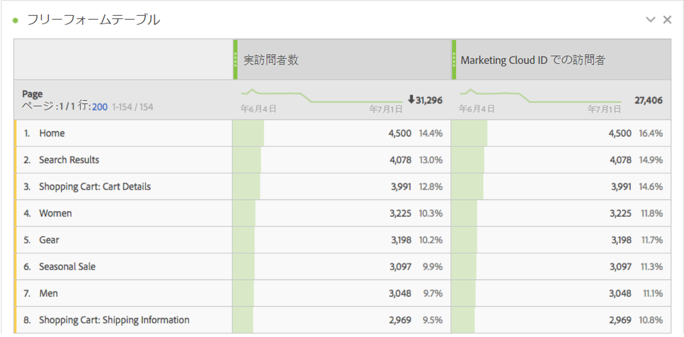
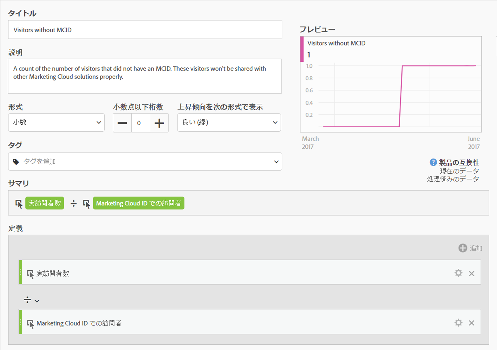
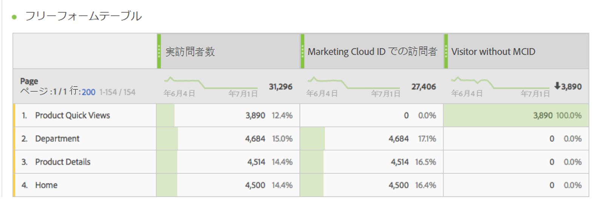

# Experience Cloud ID を持つ訪問者

「Experience Cloud ID を持つ訪問者」指標は、アドビが [Experience Cloud ID サービス](https://docs.adobe.com/content/help/ja-JP/id-service/using/home.html)を使用して識別した一意の訪問者の数を示します。このディメンションは、[個別訪問者数](unique-visitors.md)指標と比較して、サイトへの大部分の訪問者が ID サービスを使用していることを確認するのに役立ちます。訪問者の大部分が ID サービス cookie を使用していない場合は、実装内の問題を示している可能性があります。

>[!NOTE]
>
>この指標は、Adobe Target や Adobe Audience Manager など複数の Experience Cloud サービスを使用する場合のデバッグに特に重要です。Experience Cloud 製品間で共有されるセグメントには、Experience Cloud ID のない訪問者は含まれません。

## この指標の計算方法

この指標は、[個別訪問者数](unique-visitors.md)指標に基づきますが、`mid` クエリ文字列（[`s_ecid`](https://docs.adobe.com/content/help/ja-JP/core-services/interface/ec-cookies/cookies-analytics.html) cookie に基づく）を使用して識別された個人のみが含まれます。

## Experience Cloud ID 設定のデバッグ

「Experience Cloud ID を持つ訪問者」指標は、Experience Cloud 統合のトラブルシューティングや、ID サービスがデプロイされていないサイトの領域の特定に役立ちます。

「Experience Cloud ID を持つ訪問者」を個別訪問者数と並べてドラッグして比較します。

この例では、各ページの実訪問者数が Experience Cloud ID での訪問者と同じ数になっていることに注意してください&#39;。ただし、実訪問者数の合計数は Experience Cloud ID での訪問者の合計数より大きくなっています。ID サービスが設定されていないページを調べる[計算指標](../c-calcmetrics/cm-overview.md)を作成できます。次の定義を使用できます。

この計算指標をレポートに追加することで、MCID を持たない訪問者の数が最も多いページがひとめでわかるように、ページレポートをソートすることができます。

「製品クイックビュー」ディメンション項目は、ID サービスでは正しく実装されないことに注意してください。組織内の適切なチームと協力して、これらのページを可能な限り早く更新できます。[ブラウザーのタイプ、](../dimensions/browser-type.md)[サイトセクション](../dimensions/site-section.md)、[eVar](../dimensions/evar.md) など、あらゆるタイプのディメンションを使用して、類似したレポートを作成できます。
