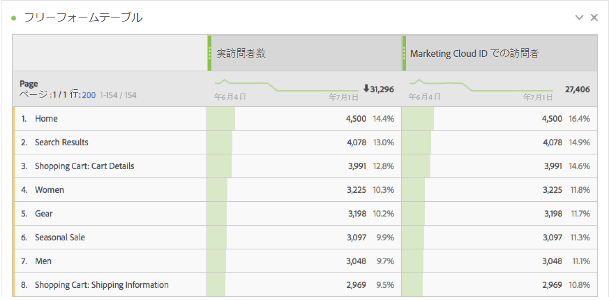
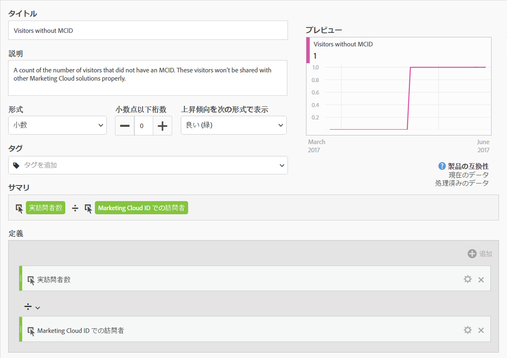
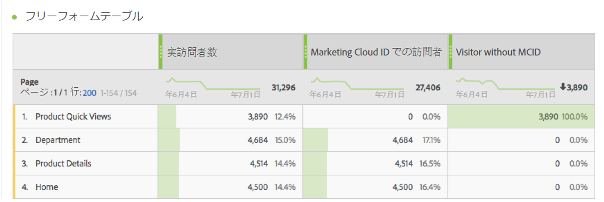

# Experience Cloud ID を持つ訪問者

「Experience Cloud IDを持つ訪問者」の[指標](overview.md)は、[Experience Cloud ID サービス &#x200B;](https://experienceleague.adobe.com/docs/id-service/using/home.html?lang=ja)を使用してAdobeによって識別された一意の訪問者の数を示します。 この指標は、[ユニーク訪問者](unique-visitors.md)指標と比較して、サイトへの訪問者の大半が ID サービスを使用していることを確認するのに役立ちます。 訪問者の大部分が ID サービス cookie を使用していない場合は、実装内の問題を示している可能性があります。

>[!NOTE]
>
>この指標は、Adobe TargetやAdobe Audience Managerなど、複数のCX Enterprise サービスを使用する場合のデバッグに特に重要です。 CX Enterprise製品間で共有されるセグメントには、Experience Cloud IDのない訪問者は含まれません。

## この指標の計算方法

この指標は、[ユニーク訪問者](unique-visitors.md)指標に基づきますが、`mid` クエリ文字列（[`s_ecid`](https://experienceleague.adobe.com/docs/core-services/interface/ec-cookies/cookies-analytics.html?lang=ja) cookie に基づく）を使用して識別された個人のみが含まれます。

## Experience Cloud ID 設定のデバッグ

「Experience Cloud IDを持つ訪問者」指標は、CX Enterprise統合のトラブルシューティングや、ID サービスがデプロイされていないサイトの領域の特定に役立ちます。

「Experience Cloud ID を持つ訪問者」をユニーク訪問者と並べてドラッグして比較します。

この例では、各ページのユニーク訪問者が Experience Cloud ID での訪問者と同じ数になっていることに注意してください。 ただし、ユニーク訪問者の合計数は Experience Cloud ID での訪問者の合計数より大きくなっています。 ID サービスが設定されていないページを調べる[計算指標](../calculated-metrics/cm-overview.md)を作成できます。 次の定義を使用できます。

この計算指標をレポートに追加することで、MCID を持たない訪問者の数が最も多いページがひとめでわかるように、ページレポートをソートすることができます。

「製品クイックビュー」ディメンション項目は、ID サービスでは正しく実装されないことに注意してください。 組織内の適切なチームと協力して、これらのページを可能な限り早く更新できます。 [ブラウザーのタイプ](../dimensions/browser-type.md)、[サイトセクション](../dimensions/site-section.md)、[eVar](../dimensions/evar.md) など、あらゆるタイプのディメンションを使用して、類似したレポートを作成できます。
