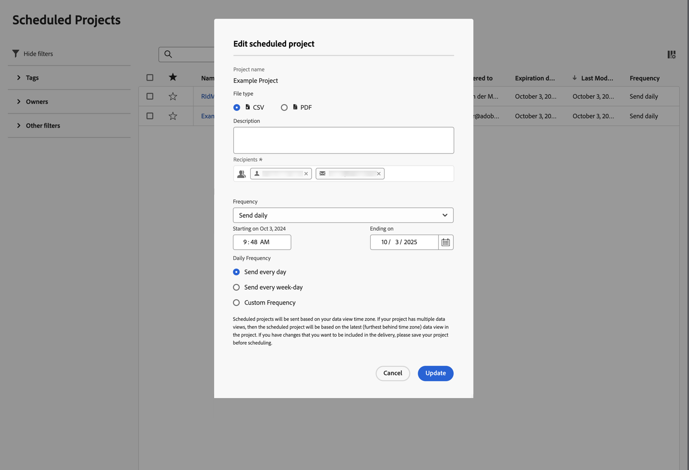
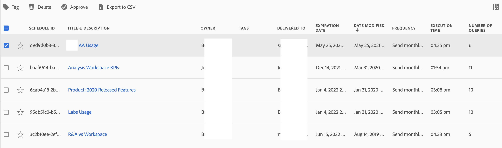

# スケジュールされたプロジェクト

スケジュールされたAnalysis Workspace プロジェクトは、**[!UICONTROL コンポーネント]**/**[!UICONTROL スケジュールされたプロジェクト]**&#x200B;を使用してAdobe Analyticsで管理できます。

**[!UICONTROL スケジュール済みプロジェクト]**&#x200B;では、定期的なプロジェクト スケジュールを編集および削除できます。  [&#x200B; スケジュール済みプロジェクトリスト &#x200B;](#scheduled-project-list)には、特定のユーザーが作成したアイテムが表示されます。 アプリケーションでユーザーアカウントが無効になっている場合、スケジュールされたすべての配信が停止します。

## スケジュール済みプロジェクトリスト

スケジュール済みプロジェクト リスト ➊には、次の列が表示されます。

| 列 | 説明 |
| --- | --- |
|  | 1つ以上のスケジュール済みプロジェクトを選択すると、スケジュール済みプロジェクトインターフェイスの下部に青いアクションバーが表示されます。 詳しくは、[アクション](#actions)を参照してください。 |
|  | スケジュールされたプロジェクトでを優先するか、を優先しない場合に選択します。 |
| **[!UICONTROL スケジュール ID]** | 主にデバッグ目的で使用されるID。 |
| **[!UICONTROL 名前]** | このプロジェクトの名前。  スケジュールされたプロジェクトの詳細を表示するには、を選択します。  コンテキストメニューを開くには、を選択します。 このメニューから、次の操作を実行できます。<ul><li>削除&#x200B;**[!UICONTROL 削除]**&#x200B;します。</li><li>スケジュールされたプロジェクトの **[!UICONTROL タグ]**。</li><li> **[!UICONTROL スケジュールされたプロジェクトを]**&#x200B;承認します。</li><li> **[!UICONTROL CSV]**&#x200B;の書き出し：スケジュールされたプロジェクトをCSV ファイルに書き出します。</li></ul> |
| **[!UICONTROL 所有者]** | プロジェクトを作成し所有しているユーザー。 |
| **[!UICONTROL タグ]** | （任意）タグ付けは、プロジェクトを整理するのに適した方法です。 すべてのユーザーがタグを作成し、1 つ以上のタグをプロジェクトに適用できます。 ただし、タグを表示できるのは、自分が所有しているプロジェクトか、自分と共有されているプロジェクトに限られます。 |
| **[!UICONTROL 配信先]** | このスケジュールされたプロジェクトの受信者。 |
| **[!UICONTROL 有効期限]** | スケジュールの頻度に関係なく、有効期限を最大 1 年まで設定できます。 |
| **[!UICONTROL 頻度]** | このスケジュール プロジェクトを1人以上の受信者に送信する頻度。 |
| **[!UICONTROL 実行時刻]** | このスケジュールされたプロジェクトが送信される時刻。 |
| **[!UICONTROL クエリ数]** | このプロジェクトに対するクエリの数。 |
| **[!UICONTROL 最長の日付範囲]** | スケジュールされたプロジェクトに定義された最も長い日付範囲。 この値は、パフォーマンスの問題を調査するのに関連する場合があります。 詳しくは、[Reporting Activity Manager](/help/admin/tools/reporting-activity-manager/reporting-activity-overview.md)を参照してください。 |
| **[!UICONTROL クエリ数]** | スケジュールされたプロジェクトに対して実行されたクエリの数。 この値は、パフォーマンスの問題を調査するのに関連する場合があります。 詳しくは、[Reporting Activity Manager](/help/admin/tools/reporting-activity-manager/reporting-activity-overview.md)を参照してください。 |

を使用して、表示する列を設定できます。

を使用して、スケジュールされたプロジェクトを検索します。 また、フィルターパネルからフィルターが適用されているかどうかも確認できます。 フィルターを削除するには、フィルターのを選択します。 すべてのフィルターを削除するには、**[!UICONTROL すべてをクリア]**&#x200B;を選択します。

スケジュール済みプロジェクトを編集するには、スケジュール済みプロジェクトのタイトルを選択します。 スケジュールの詳細を更新するには、**[!UICONTROL スケジュール済みプロジェクトを編集]** ダイアログを使用します。 詳しくは、[他の](../analyze/analysis-workspace/curate-share/t-schedule-report.md)へのファイルの送信を参照してください。

スケジュールを更新するには、**[!UICONTROL 更新]**&#x200B;を選択します。

## アクション

スケジュール済みプロジェクトマネージャーでの一般的な操作は次のとおりです。 1つ以上のスケジュール済みプロジェクトを選択する場合は、コンテキストメニューまたは青いアクションバーからアクションを選択できます。

| アイコン | アクション | 説明 |
|:---:|---|---|
|  | **[!UICONTROL *x *個を選択済み]** | 選択したスケジュール済みプロジェクトの選択を解除するには、を選択します。 |
|  | **[!UICONTROL 削除]** | プロジェクトに対して選択したスケジュール済みプロジェクトを削除します。プロジェクトは削除されません。 
プロジェクトの削除について詳しくは、[&#x200B; プロジェクトの概要](/help/analyze/analysis-workspace/build-workspace-project/freeform-overview.md)を参照してください。
 |
|  | **[!UICONTROL タグ]** | 選択したスケジュール済みプロジェクトにタグ付けします。 **[!UICONTROL スケジュール済みプロジェクト]**&#x200B;でタグを選択し、**[!UICONTROL 保存]**&#x200B;を選択して保存します。 |
|  | **[!UICONTROL 承認]** | 選択したスケジュール済みプロジェクトを承認します。 |
|  | **[!UICONTROL CSV に書き出し]** | 選択したスケジュール済みプロジェクトを`Export Scheduled Projects List.csv`という名前のファイルに書き出します。 |

## フィルター

スケジュール済みプロジェクト [&#x200B; スケジュール済みプロジェクトリスト &#x200B;](#scheduled-project-list)は、フィルターパネル ➌を使用してフィルタリングできます。 フィルターパネルを表示または非表示にするには、 を使用します。

フィルターパネルは、次のセクションで構成されています。

### タグ

| タグ | 説明 |
|---|---|
| {width="300"} | 「**[!UICONTROL タグ]**」セクションでは、タグでフィルタリングできます。 <ul><li>フィルタリングに使用するタグを検索するには、 **[!UICONTROL タグを検索]**&#x200B;を使用します。</li><li>複数のタグを選択できます。 使用できるタグは、フィルターパネルの他のセクションでの選択によって異なります。</li><li>数値は次の内容を示します。<ul><li>7︎⃣：特定のタグに関連付けられているスケジュール済みプロジェクトの数。</li></ul></li></ul> |

### 所有者

| 所有者 | 説明 |
|---|---|
| {width="300"} | 「**[!UICONTROL 所有者]**」セクションでは、所有者でフィルタリングできます。 <ul><li>フィルタリングに使用する所有者を検索するには、 *所有者を検索*&#x200B;を使用します。</li><li>複数の所有者を選択できます。 使用できる所有者は、フィルターパネルの他のセクションでの選択によって異なります。</li><li>数値は次の内容を示します。<ul><li>4︎⃣：特定の所有者に関連付けられているスケジュール済みプロジェクトの数。</li></ul></li></ul> |

### その他のフィルター

| その他のフィルター | 説明 |
|---|---|
| {width="300"} | 「**[!UICONTROL その他のフィルター]**」セクションでは、他の定義済みフィルターでフィルタリングできます。<ul><li>次のオプションから 1 つ以上を選択できます。<ul><li> **[!UICONTROL 期限切れ]**：期限切れのスケジュール済みプロジェクトでフィルターを実行します。</li><li>**[!UICONTROL 失敗]**: スケジュールが失敗したスケジュール済みプロジェクトでフィルターを実行します。</li></ul>選択できる内容は、役割と権限によって異なります。</li><li>複数のフィルターを選択できます。 使用できるその他のフィルターは、フィルターパネルの他のセクションでの選択によって異なります。</li><li>数値は次の内容を示します。<ul><li>4︎⃣：特定の他のフィルターに関連付けられているスケジュール済みプロジェクトの数。</li></ul></li></ul> |

<!--
# Scheduled projects

Scheduled Analysis Workspace projects can be managed under **Analytics > Components > Scheduled Projects**.

When you manage scheduled projects, you can edit and delete recurring project schedules:

*  Change the file type (.csv or PDF)
*  Update the project description
*  Add or remove recipients
*  Change the frequency

To modify a scheduled project

1.  Select **Analytics > Components > Scheduled Projects**.
1.  Search for a schedule in the search bar or by using the filter options in the left rail. You can filter by [!UICONTROL Tags], [!UICONTROL Owners], [!UICONTROL Favorites], and more.

## Available columns

| Field | Description |
| --- | --- |
| [!UICONTROL Favorites] | Selecting the star icon makes this schedule a favorite. |
| [!UICONTROL Schedule ID] | This ID is used mainly for debugging purposes. |
| [!UICONTROL Title and description] | Title and description of this project. |
| [!UICONTROL Owner] | The person who created and owns the project. |
| [!UICONTROL Tags] | (optional) Tagging is a good way to organize projects. All users can create tags and apply one or more tags to a project. However, you can see tags only for those projects that you own or that have been shared with you.  |
| [!UICONTROL Delivered to] | The recipient(s) of this scheduled project. |
| [!UICONTROL Expiration date] | For any scheduled project frequency, you can set the expiration date for up to one year in the future. |
| [!UICONTROL Frequency] | How often you want to have this schedule project sent to the recipient(s). |
| [!UICONTROL Execution time] | At what time of day this scheduled project gets sent. |
| [!UICONTROL Number of queries] | The number of queries against this project. |

## Common actions

The following are common actions in the Scheduled Projects manager:

|Action|Description|
|---|---|
|**[!UICONTROL Edit]**|Select the title of the schedule to update its delivery settings.|
|**[!UICONTROL Delete]**|Select the scheduled project in the list and then click Delete from the menu. This will delete the selected schedule for the project; the project itself will not be deleted.|
|**[!UICONTROL Tag]**|Select the scheduled project in the list and then choose "Tag" or "Approve" to organize your schedules and make them easier to search for.|
|**[!UICONTROL View failed schedules]**|Navigate to the left rail > Other filters > Failed to see schedules that have failed.|
|**[!UICONTROL View expired schedules]**|Navigate to the left rail > Other filters > Expired to see schedules that have expired. Click the title of the schedule to setup a new delivery schedule.|
|**[!UICONTROL View schedule ID]**|Navigate to column options in the top right and add the Schedule ID column to the table. The scheduled ID is often useful for debugging.|

The Scheduled Projects manager shows the items that a specific user created. If the user account is disabled in the application, all scheduled deliveries stop. Scheduled project ownership can be transferred to a new user under **Admin** > **Analytics Users & Assets** > **Transfer Assets**.
-->