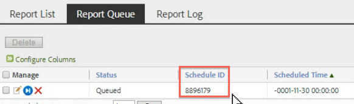

# 予定レポートキュー

管理者レベルのユーザーは、組織全体の予定レポートを表示および管理できます。

**[!UICONTROL Analytics]**／**[!UICONTROL コンポーネント]**／**[!UICONTROL すべてのコンポーネント]**／**[!UICONTROL 予定レポート]**

予定レポートマネージャーの管理者レベルの機能には次のものがあります。

* 組織内のすべてのスケジュール済みレポート [&#128279;](/help/components/scheduled-reports-admin.md#section_3F167CAAEEC24140B476CF95B7402690)を表示するオプション。
* 組織全体で[高度なフィルタリング機能](/help/components/scheduled-reports-admin.md#section_206A52A85DE84947AAB3AD082FBF6275)。
* レポートサーバーで実行のためにキューに入れられているすべてのレポートを一覧表示する新しい[&#x200B; レポートキュー](/help/components/scheduled-reports-admin.md#section_03C866115D354BB182E90BF4D52F1E0B) タブ。
* レポートキューインターフェイスで[&#x200B; スケジュール ID](/help/components/scheduled-reports-admin.md#section_568B70F4228C4229977CB85D2DCD53A1)を公開しています。

## スケジュール済みのすべてのレポートを表示 {#section_3F167CAAEEC24140B476CF95B7402690}

「**[!UICONTROL レポートリスト]**」タブでは、自身でスケジュールしたレポートに加えて、組織の&#x200B;**[!UICONTROL すべての予定レポートを表示]**&#x200B;できます。

>[!NOTE]
>
>「**[!UICONTROL レポート名]**」列にはスケジュールされているレポートの名前が表示され、「**[!UICONTROL ファイル名]**」列には「アドバンス配信」オプションで設定したカスタムファイル名が表示されます。 その結果、同じレポートタイプの複数のレポートをスケジュールし、それぞれにカスタマイズされた名前を指定すると、スケジュールされたレポートマネージャーには、同じレポート名で異なるファイル名を持つ複数のエントリが表示されます。 これは、スケジュールされているバックエンドレポートが同じであるため、「レポート名」列には、カスタマイズされたファイル名（設定されている）以外のすべてのレポート名が同じになります。

## 高度なフィルタリング機能 {#section_206A52A85DE84947AAB3AD082FBF6275}

例えば、1 時間ごとにスケジュールされたすべてのレポートをフィルタリングする場合は、**[!UICONTROL アドバンス]**&#x200B;フィルターで&#x200B;**[!UICONTROL 「頻度」「完全に一致する」「1 時間ごと」]**&#x200B;を指定して、「**[!UICONTROL 適用]**」をクリックします。

## レポートキュー {#section_03C866115D354BB182E90BF4D52F1E0B}

このキューを使用すると、キューが「詰まっている」スケジュール済みレポートを管理および削除できます。 （通常、レポートは4時間後にタイムアウトします）。

レポートキューでは、「スケジュールされたレポートを1回スキップ」することもできます。 「**[!UICONTROL 管理]**」列にある青色のアイコンをクリックします。

## スケジュール ID {#section_568B70F4228C4229977CB85D2DCD53A1}

レポートキューインターフェイスで公開された&#x200B;**[!UICONTROL スケジュール ID]** は、予定レポートの問題を解決するために Adobe Client Care に連絡する必要がある場合に役立ちます。

