# セグメントコンテナ

セグメントは、訪問者の属性やサイトでのインタラクションに基づいて訪問者をフィルタリングする条件を設定します。 セグメントに条件を設定するには、訪問者をその特性やナビゲーションの特徴に基づいて選別するフィルタールールを設定します。訪問者データをさらに分類するには、各訪問者の特定の訪問やページビューヒットに基づくフィルターを適用します。セグメントビルダーは、これらのサブセットを作成するためのシンプルなアーキテクチャで、訪問者／訪問／ヒットコンテナの順にネストされた階層的なコンテナとしてルールを適用します。

セグメントビルダーで使用されるコンテナアーキテクチャは、

-  **[!UICONTROL 訪問者]** を最も外側にあるコンテナとして追加します。このコンテナには、訪問とページビューの全体で訪問者に固有の最も重要なデータが格納されます。
-  入れ子 **[!UICONTROL 訪問]** コンテナを使用すると、訪問に基づいて訪問者のデータを分類するルールを設定でき、
-  入れ子 **[!UICONTROL ヒット]** コンテナを使用すると、訪問者情報を個々のページビューに基づいて分類できます。

各コンテナを使用すると、訪問者の履歴、訪問ごとに分類されたインタラクション、または個々のヒットの分析結果をレポートできます。

<table style="table-layout: fixed; border: none;">

<tr>
<td style="background-color: #FFFFFF; border: 0; " colspan="5">
</tr>

<tr style="border: none;">
<td style="background-color: #FFFFFF; border: 0;"></td>
<td style="background-color: #E5E4E2;" colspan="3" width="200" height="100"> 訪問者</td>
<td></td>
</tr>

<tr>
<td></td>
<td style="background-color: #E5E4E2;" width="200"></td>
<td style="background-color: #D3D3D3;" colspan="2" width="200" height="100"> 訪問数</td>
<td></td>
</tr>

<tr>
<td></td>
<td style="background-color: #E5E4E2;" width="200" height="100"></td>
<td style="background-color: #D3D3D3;" width="200" height="100"></td>
<td style="background-color: #C0C0C0;" width="200" height="100" colspan="1"> ヒット数</td>
<td></td>
</tr>

<tr>
<td colspan="5">
<tr>
</table>

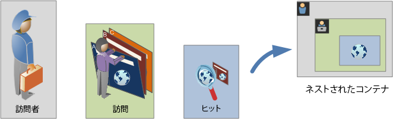

以下は、セグメントコンテナの概要に関するビデオです。

>[!VIDEO](https://video.tv.adobe.com/v/25401/?quality=12)

## 訪問者コンテナ

訪問者コンテナには、指定期間内に発生した訪問者による訪問とページビューがすべて含まれます。訪問者レベルのセグメントは、条件を満たすページと、訪問者が閲覧した（かつ、日付範囲の定義によって制限された）ページをすべて返します。訪問者コンテナは最も幅広い定義を持つコンテナなので、訪問者コンテナレベルで生成されるレポートは、すべての訪問にわたってページビューを返し、マルチ訪問分析を生成できます。 したがって、訪問者コンテナは、日付範囲の定義に基づく変化の影響を最も受けやすいコンテナです。

訪問者コンテナには、訪問者の履歴全体に基づく値が含まれます。

- 初回購入までの日数
- オリジナルの入口ページ
- オリジナルの参照ドメイン

## 訪問コンテナ

訪問コンテナでは、特定の Web セッションのページでのインタラクション、キャンペーンまたはコンバージョンを識別できます。訪問レベルのセグメントは、条件を満たすページと、訪問セッションの一部として表示された（かつ、日付範囲の定義によって制限された）その他すべてのページを返します。 訪問コンテナは、ルールを満たすと訪問セッション全体の行動を取り込むので、最も一般的に使用されるコンテナです。 訪問コンテナを使用すると、セグメントの作成と適用に含める訪問と除外する訪問を定義できます。 訪問コンテナを使用すると、同じ訪問でニュース＆スポーツセクションを閲覧した訪問者が何人いたか、または購入へのコンバージョンにつながったページが何ページあったかを容易に答えることができます。

訪問コンテナには、1 回の訪問あたりの発生件数に基づく値が含まれます。

- 訪問数
- 入口ページ
- 再来訪頻度
- パーティシペーション指標
- 線形的に割り当てられた指標

## ヒットコンテナ

ヒットコンテナは、セグメントに含めるまたは除外するページヒットを定義します。ヒットコンテナは、使用可能な最も狭いコンテナで、条件が true の特定のクリック数やページビューを識別します。 単一のトラッキングコードを表示したり、サイトの特定のセクション内の行動を分離したりできます。 また、アクションが発生したときの特定の値（注文が発生したときのマーケティングチャネルなど）を把握することもできます。

ヒットコンテナには、単一ページの分類に基づく値が含まれます。

- 製品
- リスト prop
- リスト eVar
- マーチャンダイジング eVar（イベントのコンテキスト内）

   >[!NOTE]
   >
   >このコンテナを持続する値（eVar など）で使用すると、その値が持続するヒットがすべてコンテナに取り込まれます。 1 週間後に有効期限切れになるトラッキングコードがある場合、その値は、複数の訪問間で持続する可能性があります。

## 論理グループコンテナ

論理グループコンテナは、セグメントルール内の個別のコンテナを提供して、階層に基づかずにエンティティをフィルタリングするために使用できます。例えば、訪問者に基づいてフィルタリングするセグメント内にネストされたコンテナを提供するとします。このタイプのロジックでは、（トップレベルの訪問者コンテナを既に使用しているので）階層を分割して、選択した訪問者のみをフィルタリングする必要があります。 詳しくは、 [論理グループの例](/help/components/segmentation/segmentation-workflow/seg-sequential-build.md) を参照してください。

## コンテナのネスト {#nest-containers}

セグメントコンテナを他のコンテナ内に作成する場合、本質的には、セグメントを他のセグメント内に作成しています。ネストされたコンテナでは、次のロジックが使用されます。

1. どのようなデータが含まれているかを、最も外側にあるコンテナによって調べます。この外部ルールと一致しないデータは、セグメント化レポートですべて削除されます。
1. ネストされたルールを残りのデータに適用します。ネストされたルールは、最初のルールで拒否されたヒットには適用されません。
1. ネストされたコンテナルールがすべて計算されるまで繰り返します。その結果、残りのデータが結果レポートに含まれます。

ネストは、コンテナ間およびコンテナ内のルール間で使用できます。 次に、各コンテナ内でネストできる要素を示します。

| コンテナ名 | コンテナ内でネストできる要素 |
|---|---|
| ヒット | イベントのみ |
| 訪問 | ヒットコンテナ、イベント |
| 訪問者。 | 訪問コンテナ、ヒットコンテナ、イベント |
| 論理グループ | 訪問者コンテナ、訪問コンテナ、ヒットコンテナ |

### 単一の定義に複数のコンテナを含める

新しい複合セグメントに複数のセグメントを含めると、データをさらに正確にできます。既存の 2 つのセグメントをドラッグすると、これらのセグメントは、訪問者のフィルタリングで「OR」ステートメントとして機能します。キャンバス内のすべてのコンテナがすべてのデータと確認され、いずれかまたはいくつかのコンテナと一致するデータがレポートに含まれます。

例えば、Country = United States の訪問コンテナと、Order = True の訪問コンテナをドラッグしたとします。、

```
Country = United States + Order = True
```

は、次の順序で動作するセグメントを作成します。

1. 最初に、データ全体が調べられ、United States の訪問者がすべて識別されます。
2. その後、すべてのデータが再度調べられ、訪問者が注文したかどうかを確認します。
3. 次に、両方のデータセットがレポートに適用されます。

## 順次セグメントのコンテナ {#containers-sequential}

順次セグメントでは、階層的にネストされた[!UICONTROL 訪問者]、[!UICONTROL 訪問]および[!UICONTROL ヒット]（ページビューや他のディメンションを含む）などの同じ基本コンテナを利用します。

<table style="table-layout:fixed;">
<tr>
<td style="background-color: #FFFFFF; " colspan="5">
<tr>
<tr style="border: 0;">
<td style="background-color: #FFFFFF; border: 0;"></td>
<td style="background-color: #E5E4E2;" colspan="3" width="200" height="100"> 訪問者</td>
<td></td>
</tr>
<tr>
<td></td>
<td style="background-color: #E5E4E2;" width="200"></td>
<td style="background-color: #D3D3D3;" colspan="2" width="200" height="100"> 訪問数</td>
<td></td>
</tr>
<tr>
<td></td>
<td style="background-color: #E5E4E2;" width="200" height="100"></td>
<td style="background-color: #D3D3D3;" width="200" height="100"></td>
<td style="background-color: #C0C0C0;" width="200" height="100" colspan="1"> ヒット数</td>
<td></td>
</tr>
<tr>
<td colspan="5">
<tr>
</table>


「[!UICONTROL 訪問者]」コンテナは順次セグメントでは最上位のコンテナです。「[!UICONTROL 訪問]」コンテナは、「[!UICONTROL 訪問者]」コンテナ内に含まれ、「[!UICONTROL ヒット]」コンテナは「[!UICONTROL 訪問者]」コンテナまたは「[!UICONTROL 訪問]」コンテナ内に含まれます。適切な順序の順次セグメントを作成するためには、この[コンテナ階層](/help/components/segmentation/seg-overview.md#section_7FDF47B3C6A94C38AE40D3559AFFAF70)を維持する必要があります。

**順次セグメントを作成するには**&#x200B;コンテナはネストされ、 [!UICONTROL THEN] 各コンテナを `true` 訪問者のシーケンスに基づいて。

<table style="table-layout:fixed;">
<tr>
<td style="background-color: #FFFFFF; " colspan="5">
<tr>
<tr style="border: 0;">
<td style="background-color: #FFFFFF; border: 0;"></td>
<td style="background-color: #E5E4E2;" colspan="3" width="200" height="100"> 訪問者</td>
<td></td>
</tr>
<tr>
<td></td>
<td style="background-color: #E5E4E2;" width="200"></td>
<td style="background-color: #D3D3D3;" colspan="2" width="200" height="100"> 訪問数</td>
<td></td>
</tr>
<tr>
<td></td>
<td style="background-color: #E5E4E2;" width="200" height="100"></td>
<td style="background-color: #D3D3D3;" width="200" height="100"></td>
<td style="background-color: #C0C0C0;" width="200" height="100" colspan="1"> ヒット数</td>
<td></td>
</tr>
<tr><td ></td><td style="background-color: #E5E4E2;"></td><td colspan="2">THEN</td></td><td></td></tr>
<tr>
<td></td>
<td style="background-color: #E5E4E2;" width="200"></td>
<td style="background-color: #D3D3D3;" colspan="2" width="200" height="100"> 訪問回数</td>
<td></td>
</tr>
<tr>
<td></td>
<td style="background-color: #E5E4E2;" width="200" height="100"></td>
<td style="background-color: #D3D3D3;" width="200" height="100"></td>
<td style="background-color: #C0C0C0;" width="200" height="100" colspan="1"> ヒット数</td>
<td></td>
</tr>
<tr>
<td colspan="5">
<tr>
</table>


このコンテナ階層の唯一の例外は、 [論理グループコンテナ](/help/components/segmentation/segmentation-workflow/seg-sequential-build.md). [!UICONTROL 論理グループ]コンテナでは、特定の順序に従わずに、コンテナ内でヒットをネストしてイベントやディメンションを収集できます。

<table style="table-layout:fixed;">
<tr>
<td style="background-color: #FFFFFF; " colspan="5">
<tr>
<tr style="border: 0;">
<td style="background-color: #FFFFFF; border: 0;"></td>
<td style="background-color: #E5E4E2;" colspan="3" width="200" height="100"> 訪問者</td>
<td></td>
</tr>
<tr>
<td></td>
<td style="background-color: #E5E4E2;" width="200"></td>
<td style="background-color: #D3D3D3;" colspan="2" width="200" height="100"> 訪問数</td>
<td></td>
</tr>
<tr>
<td></td>
<td style="background-color: #E5E4E2;" width="200" height="100"></td>
<td style="background-color: #D3D3D3;" width="200" height="100"></td>
<td style="background-color: #C0C0C0;" width="200" height="100" colspan="1"> ヒット数</td>
<td></td>
</tr>
<tr><td ></td><td style="background-color: #E5E4E2;"></td><td colspan="2">THEN</td></td><td></td></tr>
<tr>
<td></td>
<td style="background-color: #E5E4E2;" width="200"></td>
<td style="background-color: #D3D3D3;" colspan="2" width="200" height="100"> グループ</td>
<td></td>
</tr>
<tr>
<td></td>
<td style="background-color: #E5E4E2;" width="200" height="100"></td>
<td style="background-color: #D3D3D3;" width="200" height="100"></td>
<td style="background-color: #C0C0C0;" width="200" height="100" colspan="1"> ヒット数</td>
<td></td>
</tr>
<tr>
<td></td>
<td style="background-color: #E5E4E2;" width="200" height="100"></td>
<td style="background-color: #D3D3D3;" width="200" height="100"></td>
<td style="background-color: #C0C0C0;" width="200" height="100" colspan="1"> 訪問回数</td>
<td></td>
</tr>
<tr>
<td colspan="5">
<tr>
</table>


## コンテナデータに基づくレポート {#reports}

コンテナを使用すると、セグメントを分類してレポートに適用するときに、レポート値に基づいて様々なデータを様々な方法でフィルタリングできます。

訪問者／訪問／ヒットコンテナの階層構造の各レベルで収集されるデータは、セグメントの作成方法に影響します。同じデータセットを使用して、同じセグメントを同じレポートに適用した場合、レポートの生成元となるコンテナに基づいて異なる値が得られます。 コンテナレポートのレベルや、ヒット間の値の永続性などの要因は、レポートの精度に大きな変更を与える可能性があります。

### コンテナデータの基本事項 {#container-data}

例えば、次の図に示す訪問者は、サイトの初回訪問時に、ランディングページとしてホームページを開き、さらに 3 つのページを訪問して購入にいたっています。別の訪問では、今回は商品ページを通じてランディングし、ホームページに移動した後、再度商品ページに移動し、冬用帽子を見た後で、セッションを終了しています。セグメントの各コンテナに対して取り込まれたデータに基づいて、異なる値がレポートに表示されます。

次の例では、「*ページが Winter Coats（冬用コート）に等しい*」セグメントを&#x200B;**ページレポート**&#x200B;に適用しています。

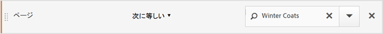

選択したコンテナに基づいて、レポートには様々な結果が表示されます。

<table style="table-layout:fixed;">
<tr>
<td style="background-color: #FFFFFF; " colspan="7">
</tr>
<tr>
<td></td>
<td style="background-color: #E5E4E2;"></td>
<td style="background-color: #E5E4E2;"colspan="5"><b>訪問 1</b></td>
</tr>
<tr>
<tr style="border: 0;">
<td style="background-color: #FFFFFF; border: 0;"></td>
<td style="background-color: #E5E4E2;">

</td>
<td style="background-color: #FFFFFF; "><br/>ホーム</td>
<td style="background-color: #FFFFFF;"><br/>冬物衣料</td>
<td style="background-color: #FFFFFF;"><br/>Winter Coat</td>
<td style="background-color: #FFFFFF;"><br/>$100 を購入</td>
<td></td>
</tr>
<tr>
<td colspan="7">
</tr>
<tr>
<td></td>
<td style="background-color: #E5E4E2;"></td>
<td style="background-color: #E5E4E2;"colspan="5"><b>訪問 2</b></td>
</tr>
<tr>
<tr style="border: 0;">
<td style="background-color: #FFFFFF; border: 0;"></td>
<td style="background-color: #E5E4E2;">

</td>
<td style="background-color: #FFFFFF; "><br/>冬物衣料</td>
<td style="background-color: #FFFFFF;"><br/>冬用ブーツ</td>
<td style="background-color: #FFFFFF;"><br/>冬物衣料</td>
<td style="background-color: #FFFFFF;"><br/>冬帽子</td>
<td></td>
</tr>
<tr>
<td colspan="7">
</tr>
</table>


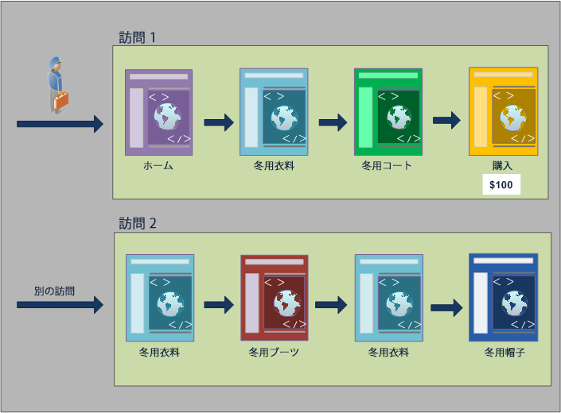

### ヒットコンテナからのレポート作成

この条件がヒットコンテナ内にある場合、レポートには *ページ = Winter Coats* が真になるページのみが示されます。1 ページのみが収集されるコンテナ内には、この条件と一致するページが 1 ページしかないので、冬用コートページのみが表示されます。

| ページ | ページビュー数 |
|---|--:|
| Winter Coat | 1 |

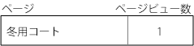

ヒットコンテナからのレポート作成では、様々なコンテナからのレポート作成がレポート値全体にどのように影響するかを確認できます。 セグメントレポートを表示すると、ページビュー数は訪問回数とほぼ同じになります（1 回の訪問で約 2,000 人の訪問者が重複ページを閲覧し、その結果ページビューの合計数になります）。 また、個別訪問者数は、訪問回数とほぼ同じ数です（約 2,000 人の個別訪問者が 2 回以上訪問）。

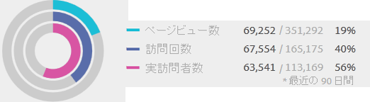

>[!IMPORTANT]
>
>データの表示方法（「ヒット」、「訪問」または「訪問者」コンテナからの値）に関係なく、この例では、訪問者数はすべて同じ 63,541 人です。 レポートの生成方法に関係なく、初期訪問者条件（冬用コートページを表示した訪問者）は変わりません。 このデータサブセットから、様々なレベルのレポートを作成することになります。

### 訪問コンテナからのレポート作成

この同じ条件が訪問コンテナ内にある場合、レポートには *ページ = Winter Coats* が真になる訪問のページがすべて示されます。これは冬用コートページをフィルタリングするだけでなく、指定の条件が真になる訪問で訪れた他のページもすべて収集します。訪問者は訪問内でホーム、製品、購入の各ページも訪問したので、訪問者コンテナデータを使用してレポートする場合、これらの追加のページがレポートに表示されます。

| ページ | ページビュー数 |
|---|--:|
| ホーム | 1 |
| 製品 | 1 |
| Winter Coat | 1 |
| 購入 | 1 |

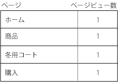

セグメント値を訪問コンテナから表示すると、ページビュー数が大幅に増加していることがわかります。この増加は、訪問コンテナからのレポートでは、条件を満たすすべてのページと、訪問で表示された他のすべてのページ（各訪問コンテナにキャプチャされたすべてのページビュー数）が識別されるからです。

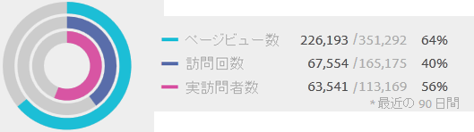

### 訪問者コンテナからのレポート作成

この同じ条件が訪問者コンテナ内にある場合、レポートには *ページ = Winter Coats* が真になる任意の訪問者が閲覧したページがすべて示されます。この条件は、訪問者が冬用コートページを表示した場合、訪問者コンテナ内のすべてのページ（他の訪問でのページビューを含む）がリストされることを意味します。 したがって、訪問者が以前閲覧したページがあるので、条件に一致しないページもレポートに表示されます。 訪問者コンテナ内のすべてのページが、以前に発生し、条件を特に満たしていない場合でも、レポートにリスト表示されます。

| 訪問 1<br/>ページ | <br/>ページビュー数 |
|---|--:|
| ホーム | 1 |
| 冬物衣料 | 1 |
| Winter Coat | 1 |
| 購入 | 1 |

| 訪問 2<br/>ページ | <br/>ページビュー数 |
|---|--:|
| 冬物衣料 | 2 |
| 冬用ブーツ | 1 |
| 冬帽子 | 1 |

| 訪問 1 +訪問 2<br/>ページ | <br/>ページビュー数 |
|---|--:|
| 冬物衣料 | 3 |
| ホーム | 1 |
| Winter Coat | 1 |
| 購入 | 1 |
| 冬用ブーツ | 1 |
| 冬帽子 | 1 |

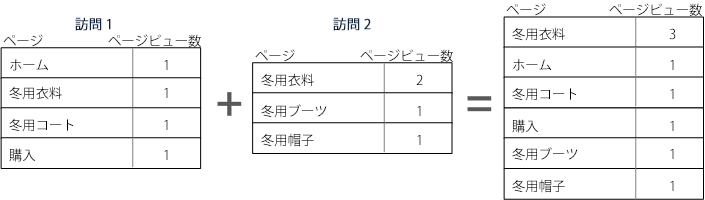

セグメントを訪問者コンテナから表示すると、ページビュー数と訪問回数が増加していることがわかります。この増加は、訪問者レベルから見ると、訪問者が冬用コートページを 1 回だけ訪問した場合（条件を真にする）、その訪問者に対してキャプチャされた他のすべてのページビュー数とその他すべての訪問数が増加するからです。

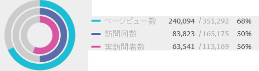

これまでの説明をまとめると、様々なデータ分類に対するセグメント化の機能を理解することが、セグメント化が返すデータを解釈するうえで重要となります。

## コンテナに基づくレポート作成 {#reporting}

セグメントデータの分類にはそれぞれ、適用されるスコープがあります。ほとんどのレポート分類は&#x200B;*ページビュー*&#x200B;に基づきますが、重要性の高い多くのセグメントは&#x200B;*訪問*&#x200B;コンテナに基づき、重要性の低いセグメントは&#x200B;*訪問者*&#x200B;コンテナに基づきます。コンテナのスコープに基づくレポート作成について理解することが重要です。

の使用 *Page = Winter Coats* セグメントの例を次に示します。以下に、コンテナデータの適用方法と、データの範囲がセグメントタイプとどのように一致するかに基づいた、このセグメントの結果の例を示します。

### 一致するセグメントルールに基づくセグメントコンテナ

データの固有スコープに対してセグメントコンテナを適用すると、行項目がセグメントルールと一致する、予測された結果が得られます。

- **ページが「Winter Coat」（冬用コート）に等しいヒットコンテナ**：このセグメントによって&#x200B;*ページ*&#x200B;レポートを表示すると、「Winter Coat」に等しい値のみが返されます。それ以外のページは、レポートからすべて除外されます。
- **入口ページが「Winter Apparel」（冬物衣料）に等しい訪問コンテナ**：このセグメントによって&#x200B;*入口ページ*&#x200B;レポートを表示すると、2 番目の訪問が返されます。これは、入口ページがセグメントルールと一致するからです。
- **通算訪問回数が 1 に等しい訪問コンテナ**：訪問を表示すると、初回訪問からのすべてのページビューがレポートに含まれます。これは、初回訪問がセグメントルールと一致するからです。

### 訪問コンテナレベルでのページビュー

多くのセグメントルールが 1 回の訪問あたりのページビューを識別します。この識別が発生すると、1 回のヒットのみがルールと一致する場合は、訪問者コンテナ全体が適用されます。 訪問に基づくページビューは、1 回の訪問あたりのページビューに基づいてインサイトを提供するので、このセグメントレポートは特に重要です。

- **ページが「Winter Coat」（冬物コート）ページに等しい訪問コンテナ**：訪問者コンテナレベルでのページレポートには、冬物衣料ページの閲覧を含む訪問のすべてのページビューが表示されます。ページがセグメントルールと一致する場合は、その訪問に関連するページビューがすべてレポートに含まれます。
- **ページが「ホーム」ページに等しいコンテナにアクセスします。**:このセグメントを含むページレポートでは、2 回目の訪問では「ホーム」ページが表示されなかったので、最初の訪問のデータのみが表示されます。
- **ページが「Winter Apparel」（冬物衣料）に等しい訪問者コンテナ**：このセグメントによるページレポートには、両方の訪問からのすべてのデータが抽出されます。これは、両方の訪問で訪問者が冬物衣料ページを閲覧したからです。

### ページビューよりも少ないヒット数を識別するセグメントコンテナ

分類スコープよりも小さいコンテナをセグメントで使用すると、予期しないデータが返されます。さらに小さい分類を使用すると、データのスコープからすべてのヒットが抽出されます。

- **入口ページが Product（商品）ページに等しいヒットコンテナ**：すべてのページが訪問の入口ページに関連し、訪問ベースの分類になります。このセグメントを使用すると、製品ページの入口ページだけでなく、その訪問のすべてのヒットも取り込まれます。
- **リスト変数 1 に値 1 が含まれるヒットコンテナ**：複数の値がリスト変数と同じヒットに定義されている場合、セグメントにはすべての変数値が含まれます。ヒットを分類する最小のセグメントコンテナはヒットコンテナなので、同じページビューで発生する値を分類する方法はありません。
- **ページが「Purchase」（購入）に等しいヒットコンテナ**：ページビューを指標として使用すると、購入ページのみが表示されます（予測された動作）。パーティシペーション指標は訪問ベースなので、売上高パーティシペーションレポートを使用すると、初回訪問のすべてのページが $100 を受け取ります。
- **ページが「Winter Coat」（冬物コート）に等しいヒットコンテナ**：ページビューを指標として使用すると、冬物コートページのみが表示されます（予測された動作）。このディメンションは持続的なディメンションを必要とするので、売上高パーティシペーションレポートを使用すると、どのページもクレジットを受け取りません。実際に購入が行われた（購入ページの）ページビューは、ヒットコンテナに含まれないので、売上高パーティシペーションレポートはどの項目にも与えられません。ただし、訪問コンテナからレポートを実行すると、その訪問のすべてのページビューが含まれて、セッションで閲覧されたページ全体で売上高パーティシペーション（$100）が分散されます。

## コンテナ間での持続性 {#persistence}

キャンペーンeVarや参照ディメンションなど、ページの範囲をまたいで持続するディメンションによるフィルタリングは、コンテナレベルで収集されるデータに影響し、レポートの精度を高めるために理解する必要があります。

セグメントデータは、選択されたページ間でディメンションや適用される変数の持続性に応じて変化します。ページディメンションなどのディメンションは、ページレベルで一意の値を提供し、ヒットコンテナのデータに基づいてフィルタリングされます（[コンテナデータに基づくレポート](/help/components/segmentation/seg-overview.md)の例を参照してください）。また、参照ドメインディメンションなどのディメンションは、訪問の複数のページ間で持続します。訪問期間などのディメンションや適用される変数は、訪問者の履歴全体に及びます。

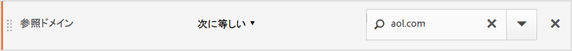

ページディメンションとは異なり、参照ドメイン値は、この訪問の各ページに添付されます。例えば、次の訪問者は、ある参照元サイトから Home ページを訪問しています。したがって、その訪問内のすべてのページに同じ参照ドメイン値が割り当てられます。

次の *参照ドメイン = aol.com* セグメントは、**ページレポート**&#x200B;に適用されます。

<table style="table-layout:fixed;">
<tr>
<td style="background-color: #FFFFFF; " colspan="7">
</tr>
<tr>
<td></td>
<td style="background-color: #E5E4E2;"></td>
<td style="background-color: #E5E4E2;"colspan="5"><b>訪問 1</b></td>
</tr>
<tr>
<tr style="border: 0;">
<td style="background-color: #FFFFFF; border: 0;"></td>
<td style="background-color: #E5E4E2;">
<br/>aol.com
</td>
<td style="background-color: #FFFFFF; "><br/>ホーム</td>
<td style="background-color: #FFFFFF;"><br/>冬物衣料</td>
<td style="background-color: #FFFFFF;"><br/>Winter Coat</td>
<td style="background-color: #FFFFFF;"><br/>$100 を購入</td>
<td></td>
</tr>
<tr>
<td colspan="7">
</tr>
<tr>
<td></td>
<td style="background-color: #E5E4E2;"></td>
<td style="background-color: #E5E4E2;"colspan="5"><b>訪問 2</b></td>
</tr>
<tr>
<tr style="border: 0;">
<td style="background-color: #FFFFFF; border: 0;"></td>
<td style="background-color: #E5E4E2;">
<br/>weather.com
</td>
<td style="background-color: #FFFFFF; "><br/>冬物衣料</td>
<td style="background-color: #FFFFFF;"><br/>冬用ブーツ</td>
<td style="background-color: #FFFFFF;"><br/>冬物衣料</td>
<td style="background-color: #FFFFFF;"><br/>冬帽子</td>
<td></td>
</tr>
<tr>
<td colspan="7">
</tr>
</table>

<!--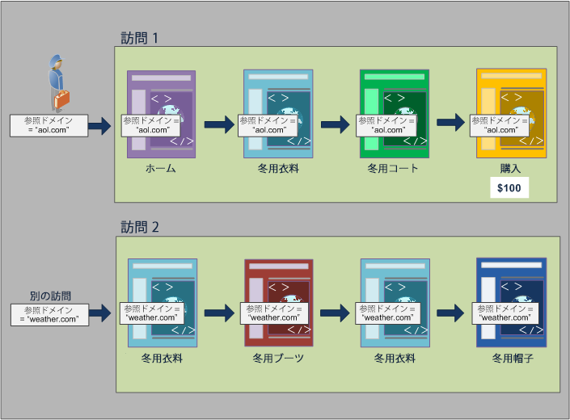-->

新しい訪問では、訪問者は別のサイトから参照されます。したがって、新しい訪問のすべてのページに、各ページビューの新しい参照ドメイン値が割り当てられます。

### ヒットコンテナからのレポート作成

同じ訪問のすべてのページビューに、同じ参照ドメイン値が割り当てられるので、*参照ドメイン = &quot;aol.com&quot;* となるヒットコンテナレベルでのレポートは、次の表に示すように、すべてのページを返します。

| 参照ドメイン= &#39;aol.com&#39; | ページビュー数 |
|----|---:|
| ホーム | 1 |
| 冬物衣料 | 1 |
| Winter Coat | 1 |
| 購入 | 1 |

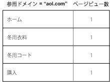

ヒットコンテナのデータを見ると、32,000 人を超える訪問者による 33,000 回を超える訪問回数で 92,000 回を超えるページビューが閲覧されています。平均では、訪問ごとのページビューは 3 回で、ほとんどすべての訪問がユニーク訪問者によって行われています。

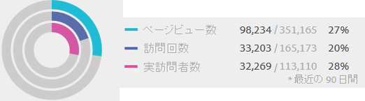

### 訪問コンテナからのレポート作成

この同じ条件が訪問コンテナでページレポート用にフィルタリングされると、*参照ドメイン = &quot;aol.com&quot;* が真になる訪問のすべてのページが返されます。参照ドメインの値は、訪問レベルで設定されるので、ページビューレベルと訪問レベルでのレポートは同じです。

| 参照ドメイン= &#39;aol.com&#39; | ページビュー数 |
|----|---:|
| ホーム | 1 |
| 冬物衣料 | 1 |
| Winter Coat | 1 |
| 購入 | 1 |


すべてのページは訪問に基づく参照ドメイン値が同じなので、訪問コンテナレベルのレポートとページビューコンテナのレポートは（ほぼ）同じになります。 データの異常が原因で、わずかなオフセット（98,234 対 98,248）があります。

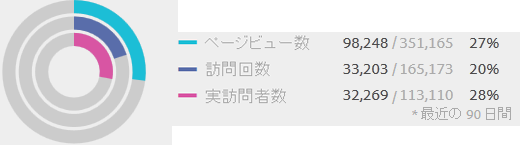

### 訪問者コンテナからのレポート作成

訪問者コンテナから、ページレポートには、*参照ドメイン = &quot;aol.com&quot;* が真になる任意の訪問者が閲覧したページがすべて示されます。したがって、訪問者が *&quot;aol.com&quot;* を履歴の任意の時点（定義された期間内）の参照ドメインとして指定すると、訪問者コンテナ内のすべてのページ（他の訪問でのページビューを含む）が表示されます。 プライマリ条件に一致しないページも、訪問者コンテナに含まれるので、レポートにリスト表示されます。 訪問者コンテナ内のすべてのページが、以前に発生し、条件を特に満たしていない場合でも、レポートに表示されます。

参照ドメインレポートでは、4 つのページビューで *参照ドメイン = &quot;aol.com&quot;* が真ですが、訪問者がヒットした他のページでは *参照ドメイン = &quot;weather.com&quot;* が真です。「訪問者」コンテナから、「aol.com」が真の訪問者のリストを取得します。また、参照ドメインが「weather.com」であるページも表示されます。セグメント内の最初のリクエストに一致した値ではありません。

| 訪問 1<br/>参照ドメイン= &#39;aol.com&#39; | <br/>ページビュー数 |
|----|---:|
| ホーム | 1 |
| 冬物衣料 | 1 |
| Winter Coat | 1 |
| 購入 | 1 |

| 訪問 2<br/>参照ドメイン= &#39;weather.com&#39; | <br/>ページビュー数 |
|----|---:|
| 冬物衣料 | 2 |
| Winter Coat | 1 |
| 購入 | 1 |

| 訪問者コンテナ<br/>参照ドメイン= &#39;aol.com&#39; | ページビュー数 |
|----|---:|
| 冬物衣料<br/>参照ドメイン= &#39;aol.com&#39; | 1 |
| 冬物衣料<br/>参照ドメイン= &#39;weather.com&#39; | 1 |
| ホーム <br/>参照ドメイン= &#39;aol.com&#39; | 1 |
| Winter Coat <br/>参照ドメイン= &#39;aol.com&#39; | 1 |
| 購入<br/>参照ドメイン= &#39;aol.com&#39; | 1 |
| 冬用ブーツ<br/>参照ドメイン= &#39;weather.com&#39; | 1 |
| 冬帽子<br/>参照ドメイン= &#39;weather.com&#39; | 1 |


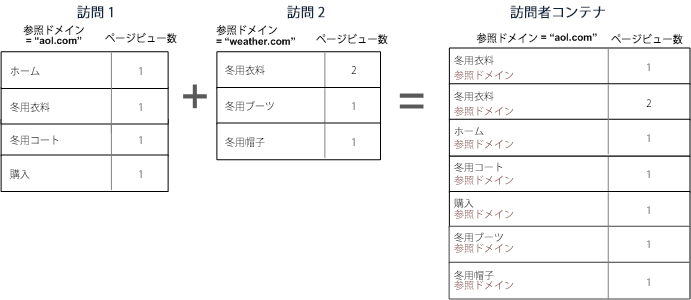

訪問者コンテナのデータを表示すると、ページビューが（98,248 から 112,925 に）大幅に増加していることに注意してください。この増加は、訪問者によるすべてのページビュー（訪問者コンテナレベルでに保存された他の参照ドメイン値を持つページを含む）がリストに表示されたためです。 さらに、その訪問者の訪問数が 33,203 から 43,448 に増加しています。

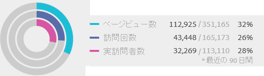

## 概要

- 訪問者コンテナは、少なくとも 1 つのページが条件を満たす訪問者が閲覧したすべてのページを返します。 したがって、1 日目の訪問 1 でページが表示された場合、複数回の訪問で訪問者が閲覧したすべてのページがデータに含まれます。
- 訪問コンテナは、1 つ以上のページが条件を満たす、訪問で閲覧されたすべてのページを返します。 したがって、ページが Day 1 の Visit 1 でしか閲覧されていない場合でも、訪問全体で閲覧されたすべてのページがデータに含まれます。
- セグメント化に使用する条件は、eVarや他のタイプの永続的な変数に基づくように注意してください。 例えば、「キャンペーンに電子メールを含む」という条件を使用し、キャンペーンの有効期限を 7 日後に設定したとします。 したがって、最初の訪問でキャンペーンが設定された場合、キャンペーンはさらに 7 日間持続します。 キャンペーンが最初の訪問でのみ設定された場合でも、各訪問は含まれます。 他の訪問も含まれます（レポートの日付範囲にある限り）。 持続的な値を排除して含めないようにしたい場合は、イベントのインスタンスを使用するか、同等の Prop 変数があれば、その Prop 変数を使用します。
