# セグメントコンテナ

セグメントは、訪問者の属性やサイトとのインタラクションにもとづいて、訪問者をフィルタリングするための条件を設定します。 セグメントの条件を設定するには、訪問者の特性やナビゲーション特性に基づいて訪問者をフィルタリングするルールを設定します。 訪問者データをさらに分類するには、各訪問者の特定の訪問やページビューヒットに基づくフィルターを適用します。 セグメントビルダーは、これらのサブセットを作成し、ネストされた階層の訪問者、訪問、またはヒットコンテナとしてルールを適用するためのシンプルなアーキテクチャを提供します。

[&#x200B; セグメントビルダー](/help/components/segmentation/segmentation-workflow/seg-build.md)で使用されるコンテナアーキテクチャでは、次の項目が定義されます。

-  **[!UICONTROL 訪問者]**&#x200B;が最も外側のコンテナとなり、訪問とページビューをまたいで訪問者に固有の包括的なデータが含まれます。
-  ネストされた&#x200B;**[!UICONTROL 訪問]**&#x200B;コンテナを使用すると、訪問に基づいて訪問者のデータを分類するルールを設定できます。
-  ネストされた&#x200B;**[!UICONTROL ヒット]** コンテナを使用すると、個々のページビューに基づいて訪問者情報を分類できます。

各コンテナでは、訪問者の履歴全体で訪問別に分類されたインタラクションのレポートを作成したり、個々のヒットを分類したりできます。

<table style="table-layout: fixed; border: none;">

<tr>
<td style="background-color: #E5E4E2;" colspan="3" width="200" height="100"> 訪問者</td>
</tr>

<tr>
<td style="background-color: #E5E4E2;" width="200"></td>
<td style="background-color: #D3D3D3;" colspan="2" width="200" height="100"> 訪問回数</td>
</tr>

<tr>
<td style="background-color: #E5E4E2;" width="200" height="100"></td>
<td style="background-color: #D3D3D3;" width="200" height="100"></td>
<td style="background-color: #C0C0C0;" width="200" height="100" colspan="1"> ヒット数</td>
</tr>
</table>

<!--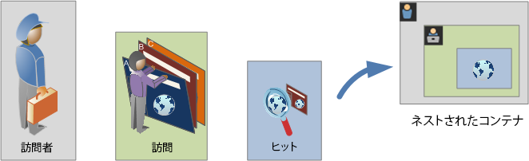-->


>[!BEGINSHADEBOX]

デモビデオについて詳しくは、 [セグメントコンテナ](https://experienceleague.adobe.com/en/docs/analytics-learn/tutorials/components/segmentation/segment-containers){target="_blank"}を参照してください。

>[!ENDSHADEBOX]


## 訪問者コンテナ

訪問者コンテナには、指定された時間枠内の訪問者のあらゆる訪問とページビューが含まれます。 訪問者レベルのセグメントは、条件を満たすページと、訪問者が表示するその他すべてのページを返します（定義された日付範囲によって制限されるページのみ）。 訪問者コンテナレベルで生成されたレポートは最も広義のコンテナとして、すべての訪問のページビューを返し、複数回の訪問にわたる分析の生成を可能にします。 したがって、訪問者コンテナは、定義された日付範囲に基づく変化の影響を最も受けやすくなります。

訪問者コンテナには、訪問者の全体的な履歴に基づく値を含めることができます。

- 初回購入までの日数
- オリジナルの入口ページ
- オリジナルの参照ドメイン

## 訪問コンテナ

訪問コンテナでは、特定の web セッションのページインタラクション、キャンペーンまたはコンバージョンを識別できます。 訪問レベルのセグメントは、条件を満たすページと、訪問セッションの一部として表示される（かつ、定義された日付範囲によってのみ制約される）他のすべてのページを返します。 訪問コンテナは、ルールに合致すると訪問セッション全体の行動を取り込むので、最も一般的に使用されるコンテナです。 訪問コンテナでは、セグメントの作成と適用に含める訪問と除外する訪問を定義できます。 同じ訪問でニュースとスポーツのセクションを閲覧した訪問者の数に関する質問に答えるのに役立ちますか？ コンバージョンに至ったページを特定できます？

訪問コンテナには、訪問ごとの発生件数に基づく値が含まれます。

- 訪問数
- 入口ページ
- 再来訪頻度
- 参加指標
- 線形割り当て指標

## ヒットコンテナ

ヒットコンテナは、セグメントに含めるまたは除外するページヒットを定義します。 ヒットコンテナは、条件が成り立つ特定のクリックやページビューの識別に使用できるコンテナの中で最も範囲が狭いものです。 単一のトラッキングコードを表示したり、サイトの特定のセクション内での行動を分離したりできます。 また、アクションが発生したときの特定の値（注文が発生したときのマーケティングチャネルなど）を把握することもできます。

ヒットコンテナには、シングルページの分類に基づく値が含まれます。

- 製品
- リスト prop
- eVarのリスト
- マーチャンダイジング eVar （イベントのコンテキスト）

  >[!NOTE]
  >
  >このコンテナを持続的な値（eVar など）に対して使用すると、その値が持続するすべてのヒットがコンテナに取り込まれます。 1 週間後に有効期限切れになるトラッキングコードがある場合、その値は、複数の訪問にわたって持続する可能性があります。

## 論理グループコンテナ

ロジックグループコンテナを使用すると、セグメントルール内に別のコンテナを指定して、階層に基づかないエンティティをフィルタリングできます。 例えば、訪問者に基づいてフィルタリングするセグメント内にネストされたコンテナを指定できます。 この論理タイプでは、（トップレベルの訪問者コンテナを既に使用したので）階層を超えて選択した訪問者のみを選別する必要があります。 詳しくは、[論理グループの例](/help/components/segmentation/segmentation-workflow/seg-sequential-build.md)を参照してください。

## コンテナのネスト {#nest-containers}

他のコンテナ内にセグメントコンテナを作成する場合、本質的にセグメント内にセグメントを作成します。 ネストされたコンテナでは、次のロジックが使用されます。

1. どのようなデータが含まれているかを、最も外側にあるコンテナによって調べます。 この外部規則に一致しないデータは、セグメント化されたレポートに破棄されます。
1. ネストされたルールを残りのデータに適用します。 ネストされたルールは、最初のルールがスローするヒットには適用されません。
1. すべてのネストされたコンテナルールが計算されるまで繰り返します。 その後、残りのデータがレポートに含まれます。

>[!NOTE]
>
>セグメント内にセグメントをネストする場合（例えば、コンポーネントパネルからセグメントをセグメント定義にドラッグする場合）、ドラッグしたセグメントルールのコピー（参照ではない）を含むコンテナが作成されます。

ネストは、コンテナ間でもコンテナ内のルール間でも使用できます。 以下は、各コンテナにネストできる内容です。

| コンテナ名 | 内部にネストできるもの |
|---|---|
| ヒット | イベントのみ |
| 訪問 | ヒットコンテナ、イベント |
| 訪問者。 | 訪問コンテナ，ヒットコンテナ，イベント |
| 論理グループ | 訪問者コンテナ、訪問コンテナ、ヒットコンテナ |

### 単一の定義に複数のコンテナを含める

新しい複合セグメントに複数のセグメントを含めると、データをさらに絞り込むことができます。 訪問者をフィルタリングする際に、既存の2つのセグメントを一緒にドラッグすると、「OR」ステートメントとして機能します。 キャンバス内のすべてのコンテナがすべてのデータに対してレビューされ、いずれかのコンテナに一致するデータがレポートに含まれます。

例えば、Country = United States の訪問コンテナと、Order = True の Visit コンテナをドラッグすると、

```
Country = United States + Order = True
```

次の順序で動作するセグメントが作成されます。

1. まず、データ全体を調べ、米国内のすべての訪問者を識別します。
2. 次に、すべてのデータを再度調べ、訪問者が注文したかどうかを確認します。
3. 次に、両方のデータセットがレポートに適用されます。

## 順次セグメントのコンテナ {#containers-sequential}

順次セグメントでは、階層的にネストされた[!UICONTROL 訪問者数]、[!UICONTROL 訪問回数]および[!UICONTROL ヒット数]（ページビュー数や他のディメンションを含む）などの同じ基本コンテナを使用します。

<table style="table-layout:fixed; border: none;">

<tr>
<td style="background-color: #E5E4E2;" colspan="3" width="200" height="100"> 訪問者</td>
</tr>

<tr>
<td style="background-color: #E5E4E2;" width="200"></td>
<td style="background-color: #D3D3D3;" colspan="2" width="200" height="100"> 訪問回数</td>
</tr>

<tr>
<td style="background-color: #E5E4E2;" width="200" height="100"></td>
<td style="background-color: #D3D3D3;" width="200" height="100"></td>
<td style="background-color: #C0C0C0;" width="200" height="100" colspan="1"> ヒット数</td>
</tr>
</table>

<!--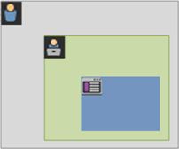-->

[!UICONTROL 訪問者数]は順次セグメントにおける最上位のコンテナとなり、[!UICONTROL 訪問回数]コンテナが[!UICONTROL 訪問者数]コンテナ内に含まれ、[!UICONTROL ヒット数]コンテナが[!UICONTROL 訪問者数]または[!UICONTROL 訪問回数]コンテナ内に含まれます。 適切に順序付けされた順次セグメントを作成するには、この[コンテナ階層](/help/components/segmentation/seg-overview.md#section_7FDF47B3C6A94C38AE40D3559AFFAF70)を維持する必要があります。

**順次セグメントを作成するには**、コンテナをネストし、[!UICONTROL THEN] 演算子を使用して順次ロジックを結合します。この演算子では、訪問者のシーケンスに基づいて各コンテナが `true` であることが必要です。

<table style="table-layout:fixed; border: none;">

<tr>

<td style="background-color: #E5E4E2;" colspan="3" width="200" height="100"> 訪問者</td>
</tr>

<tr>
<td style="background-color: #E5E4E2;" width="200"></td>
<td style="background-color: #D3D3D3;" colspan="2" width="200" height="100"> 訪問回数</td>
</tr>

<tr>
<td style="background-color: #E5E4E2;" width="200" height="100"></td>
<td style="background-color: #D3D3D3;" width="200" height="100"></td>
<td style="background-color: #C0C0C0;" width="200" height="100" colspan="1"> ヒット数</td>
</tr>

<tr>
<td style="background-color: #E5E4E2;"></td><td colspan="2">THEN</td></td>
</tr>

<tr>
<td style="background-color: #E5E4E2;" width="200"></td>
<td style="background-color: #D3D3D3;" colspan="2" width="200" height="100"> 訪問回数</td>
</tr>

<tr>
<td style="background-color: #E5E4E2;" width="200" height="100"></td>
<td style="background-color: #D3D3D3;" width="200" height="100"></td>
<td style="background-color: #C0C0C0;" width="200" height="100" colspan="1"> ヒット数</td>
</tr>
</table>

<!--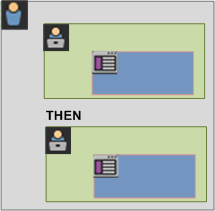-->

このコンテナ階層の唯一の例外は、[論理グループコンテナ](/help/components/segmentation/segmentation-workflow/seg-sequential-build.md)を使用する場合です。 [!UICONTROL 論理グループ]コンテナでは、コンテナ内で順序なしでヒットをネストして、イベントやディメンションを非順次に取り込むことができます。

<table style="table-layout:fixed; border: none;">

<tr>
<td style="background-color: #E5E4E2;" colspan="3" width="200" height="100"> 訪問者</td>
</tr>

<tr>
<td style="background-color: #E5E4E2;" width="200"></td>
<td style="background-color: #D3D3D3;" colspan="2" width="200" height="100"> 訪問回数</td>
</tr>

<tr>
<td style="background-color: #E5E4E2;" width="200" height="100"></td>
<td style="background-color: #D3D3D3;" width="200" height="100"></td>
<td style="background-color: #C0C0C0;" width="200" height="100" colspan="1"> ヒット数</td>
</tr>

<tr>
<td style="background-color: #E5E4E2;"></td><td colspan="2">THEN</td></td>
</tr>

<tr>
<td style="background-color: #E5E4E2;" width="200"></td>
<td style="background-color: #D3D3D3;" colspan="2" width="200" height="100"> グループ</td>
</tr>

<tr>
<td style="background-color: #E5E4E2;" width="200" height="100"></td>
<td style="background-color: #D3D3D3;" width="200" height="100"></td>
<td style="background-color: #C0C0C0;" width="200" height="100" colspan="1"> ヒット数</td>
</tr>

<tr>
<td style="background-color: #E5E4E2;" width="200" height="100"></td>
<td style="background-color: #D3D3D3;" width="200" height="100"></td>
<td style="background-color: #C0C0C0;" width="200" height="100" colspan="1"> 訪問回数</td>
</tr>

</table>

<!--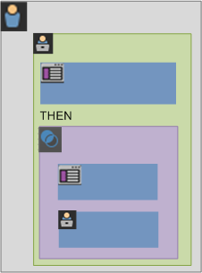-->

## コンテナデータに基づくレポート {#reports}

コンテナを使用すると、セグメントを分割してレポートに適用する際に、レポート値に基づいて異なるデータを異なる方法でフィルタリングできます。

訪問者/訪問/ヒットコンテナ階層の各レベルでキャプチャされたデータは、セグメントの構築方法に影響します。 同じデータセットを使用して、同じセグメントを同じレポートに適用しても、レポートの生成時に基になるコンテナに応じて異なる値が得られます。 コンテナレポートのレベルや、ヒット全体での値の永続化などの要素が、レポートの精度に大きな変化をもたらす可能性があります。

### コンテナデータの基本事項 {#container-data}

例えば、次に示す訪問者は、最初の訪問時にサイトを訪問し、ホームページにアクセスしてから、さらに3つのページを訪問し、訪問を売上に転換しました。 別の訪問では、今回は製品ページから製品ページ、次にホームページに移動し、製品ページに戻り、Winter Hatsを見た後にセッションを終了しました。 セグメントのコンテナごとに取り込まれたデータに応じて、レポートには様々な値が表示されます。

以下の `Pages equals Winter Coat` セグメントは、**ページレポート**&#x200B;に適用されます。


選択されたコンテナに基づき、レポートには、訪問者による以下の訪問とページビューに関する異なる結果が表示されます。

<table style="table-layout:auto; border: 0;">

<tr>
<td style="background-color: #E5E4E2;"></td>
<td style="background-color: #E5E4E2;" colspan="4"><b>訪問 1</b></td>
</tr>
<tr>
<tr>
<td style="background-color: #E5E4E2;">

</td>
<td style="background-color: #FFFFFF; "><br/>ホーム</td>
<td style="background-color: #FFFFFF;"><br/>冬物アパレル</td>
<td style="background-color: #FFFFFF;"><br/>冬物コート</td>
<td style="background-color: #FFFFFF;"><br/>購入額 100 ドル</td>
</tr>
<tr>
<td colspan="5">
</tr>
<tr>
<td style="background-color: #E5E4E2;"></td>
<td style="background-color: #E5E4E2;"colspan="4"><b>訪問 2</b></td>
</tr>
<tr>
<tr style="border: 0;">

<td style="background-color: #E5E4E2;">

</td>
<td style="background-color: #FFFFFF; "><br/>冬物アパレル</td>
<td style="background-color: #FFFFFF;"><br/>冬用ブーツ</td>
<td style="background-color: #FFFFFF;"><br/>冬物アパレル</td>
<td style="background-color: #FFFFFF;"><br/>冬用帽子</td>

</table>


<!--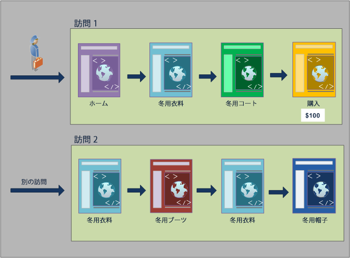-->

### ヒットコンテナからのレポート作成

この条件がヒットコンテナ内にある場合、レポートには&#x200B;*Page = Winter Coats*&#x200B;がtrueのページのみが一覧表示されます。 この条件に一致するページは1 ページのコンテナ内に1 ページだけなので、「冬のコート」ページのみが表示されます。

| ページ | ページビュー数 |
|---|--:|
| 冬物コート | 1 |

<!--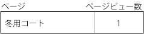-->

ヒットコンテナからレポートを作成すると、様々なコンテナからのレポート作成がレポート値全体にどのような影響を及ぼすかを確認できます。 セグメントレポートを表示すると、ページビュー数は訪問回数とほぼ同じになります（1 回の訪問で約 2,000 人の訪問者が重複するページを閲覧し、その結果がページビューの合計数になります）。 また、ユニーク訪問者数は、訪問回数とほぼ同じです（約 2,000 人のユニーク訪問者が 2 回以上訪問しています）。

|  | 指標 | # | ％ |
|---|---|--:|--:|
| | ページビュー：<br/>ビュー：<br/>ユニーク訪問者 | **69,252 件**（351,292 件中）<br/>**67,554 件**（165,175 件中）<br/>**63,541 件**（113,169 件中） | **19％**<br/>**40％**<br/>**56％** |


<!--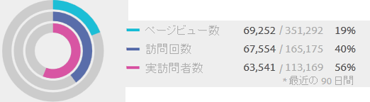-->

>[!IMPORTANT]
>
>データの表示方法（ヒットコンテナ、訪問コンテナまたは訪問者コンテナのいずれからデータを表示したか）にかかわらず、この例では、訪問者数はどれも同じ 63,541 人です。 どの方法でレポートを生成した場合でも、初回訪問者条件（冬用コートのページを表示した訪問者）は変わりません。 このデータサブセットから、様々なレベルのレポートを作成します。

### 訪問コンテナからのレポート

同じ条件が訪問コンテナ内にある場合、レポートには訪問のすべてのページが一覧表示されます。このページでは、*ページが冬のコート*&#x200B;に等しい場合です。 冬のコーツページをフィルタリングしますが、条件がtrueの訪問中の他のすべてのページもキャプチャします。 この訪問者は、ホーム、製品および購入のページも訪れているので、訪問者コンテナデータを使用してレポートを作成する場合、これらの追加ページもレポートに示されます。

| ページ | ページビュー数 |
|---|--:|
| ホーム | 1 |
| 製品 | 1 |
| 冬物コート | 1 |
| 購入 | 1 |

<!--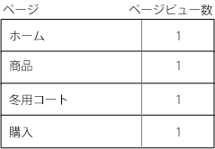-->

セグメント値を訪問コンテナから表示すると、ページビュー数が大幅に増加していることがわかります。 これは、訪問コンテナからのレポートでは、条件を満たすすべてのページだけでなく、訪問で閲覧された他のページも（各訪問コンテナに収集されたすべてのページビューと共に）すべて識別されるからです。

|  | 指標 | # | ％ |
|---|---|--:|--:|
| | ページビュー：<br/>ビュー：<br/>ユニーク訪問者 | 351,292 件中&#x200B;**226,193 件** 165,175 件中&#x200B;<br/>**67,554 件** 113,169 件中&#x200B;<br/>**63,541 件** | **64%**<br/>**40%**<br/>**56%** |

<!--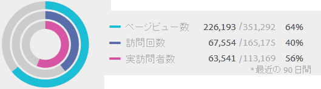-->

### 訪問者コンテナからのレポート

この同じ条件が訪問者コンテナ内にある場合、レポートには&#x200B;*ページ = Winter Coats* が真になる任意の訪問者が閲覧したページがすべて示されます。 つまり、訪問者が冬用コートのページを閲覧した場合、訪問者コンテナ内のページ（他の訪問のページビューを含む）がすべて示されます。 したがって、条件に一致しないページも、訪問者が以前閲覧したことがあるページなので、レポートに示されます。 以前に発生し、条件を明確に満たしていなくても、訪問者コンテナに含まれるページは、レポートにすべて示されます。

| 訪問 1<br/>ページ | <br/>ページビュー数 |
|---|--:|
| ホーム | 1 |
| 冬物アパレル | 1 |
| 冬物コート | 1 |
| 購入 | 1 |

| 訪問 2<br/>ページ | <br/>ページビュー数 |
|---|--:|
| 冬物アパレル | 2 |
| 冬用ブーツ | 1 |
| 冬用帽子 | 1 |

| 訪問 1 + 訪問 2<br/>ページ | <br/>ページビュー数 |
|---|--:|
| 冬物アパレル | 3 |
| ホーム | 1 |
| 冬物コート | 1 |
| 購入 | 1 |
| 冬用ブーツ | 1 |
| 冬用帽子 | 1 |

<!--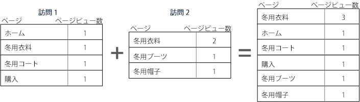-->

セグメントを訪問者コンテナから表示すると、ページビュー数と訪問回数が増加していることがわかります。 これは、訪問者レベルで考えると、訪問者が冬用コートのページを閲覧したのは 1 回のみであっても、（条件が true となるので）その訪問者に関する他のすべてのページビューと他のすべての訪問が収集されるからです。

|  | 指標 | # | ％ |
|---|---|--:|--:|
| | ページビュー：<br/>ビュー：<br/>ユニーク訪問者 | 351,292 件中&#x200B;**240,094 件** 165,175 件中&#x200B;<br/>**83,823 件** 113,169 件中&#x200B;<br/>**63,541 件** | **68%**<br/>**50%**<br/>**56%** |

<!--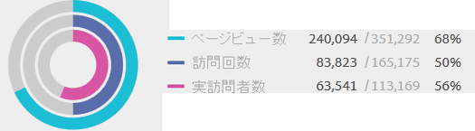-->

これまでの説明をまとめると、様々なデータ分類に対するセグメント化の機能を理解することが、セグメント化が返すデータを解釈するうえで重要となります。

## コンテナに基づくレポート作成 {#reporting}

セグメントデータの分類にはそれぞれ、適用されるスコープがあります。 ほとんどのレポート分類は&#x200B;*ページビュー*&#x200B;に基づきますが、重要性の高い多くのセグメントは&#x200B;*訪問*&#x200B;コンテナに基づき、重要性の低いセグメントは&#x200B;*訪問者*&#x200B;コンテナに基づきます。 コンテナのスコープに基づくレポート作成について理解することが重要です。

`Page equals Winter Coats` セグメントの例を使用して、コンテナデータの適用方法と、データの範囲がセグメントタイプとどのように一致するかに基づいて、このセグメントの結果の例を以下に示します。

### 一致するセグメントルールに基づくセグメントコンテナ

データの固有スコープに対してセグメントコンテナを適用すると、行項目がセグメントルールと一致する、予測された結果が得られます。

- **ページが「Winter Coat」（冬用コート）に等しいヒットコンテナ**：このセグメントによって&#x200B;*ページ*&#x200B;レポートを表示すると、「Winter Coat」に等しい値のみが返されます。 それ以外のページは、レポートからすべて除外されます。
- **入口ページが「Winter Apparel」（冬物衣料）に等しい訪問コンテナ**：このセグメントによって&#x200B;*入口ページ*&#x200B;レポートを表示すると、2 番目の訪問が返されます。これは、入口ページがセグメントルールと一致するからです。
- **通算訪問回数が 1 に等しい訪問コンテナ**：訪問を表示すると、初回訪問からのすべてのページビューがレポートに含まれます。これは、初回訪問がセグメントルールと一致するからです。

### 訪問コンテナレベルでのページビュー

多くのセグメントルールが 1 回の訪問あたりのページビューを識別します。 このように識別された場合、単一のヒットがルールと一致するだけで、訪問者コンテナ全体が適用されます。 このセグメントレポートは、訪問に基づくページビューが、訪問ごとのページビューに基づくinsightを提供するので、特に価値があります。

- **ページが「冬のコート」ページに等しい訪問コンテナ**：訪問者コンテナレベルのページレポートには、「冬のアパレル」ページのビューを含む訪問のすべてのページビューが表示されます。 ページがセグメントルールと一致する場合、その訪問に関連付けられたすべてのページビューがレポートに含まれます。
- **ページが「ホーム」ページに等しいコンテナに訪問します**。このセグメントを含むページレポートでは、2 回目の訪問では訪問者は「ホーム」ページを表示しなかったので、最初の訪問のデータのみが表示されます。
- **ページが「Winter Apparel」（冬物衣料）に等しい訪問者コンテナ**：このセグメントによるページレポートには、両方の訪問からのすべてのデータが取得されます。これは、両方の訪問で訪問者が冬物衣料ページを閲覧したからです。

### ページビューよりも少ないヒット数を識別するセグメントコンテナ

分類スコープよりも小さいコンテナでセグメントを使用すると、予期しないデータが返されます。 小さな内訳を使用しても、そのデータスコープからすべてのヒットが引き出されます。

- **入口ページが製品ページに等しい場合にコンテナをヒット**：すべてのページが訪問の入口ページに関連付けられるので、訪問ベースの分類になります。 このセグメントを使用すると、入口となるページの製品ページだけでなく、その訪問のすべてのヒットも抽出されます。
- **リスト Var 1にValueA**&#x200B;が含まれるヒットコンテナ：リスト varと同じヒットに複数の値が定義されている場合、すべての変数値がセグメントに含まれます。 ヒット コンテナは、ヒットを分割する最小のセグメントコンテナであるため、同じページビューで発生する値を分離することはできません。
- **ページが「購入」に等しいコンテナをヒット**: ページビューを指標として使用する場合、購入ページのみが（想定どおりに）表示されます。 「収益参加」レポートを使用する場合、参加指標は訪問ベースであるため、最初の訪問のすべてのページは100 ドルを受け取ります。
- **ページが「冬のコート」に等しいコンテナをヒットします**: ページビューを指標として使用する場合、冬のコートページのみが（想定どおり）表示されます。 収益参加レポートを使用する場合、このディメンションには永続的なディメンションが必要なため、ページにクレジットは付与されません。 実際に購入したページビュー（購入ページ）はヒットコンテナに含まれていないため、どの項目にも収益参加は与えられません。 ただし、訪問コンテナからレポートを実行すると、その訪問にすべてのページビューが含まれ、セッションで表示されるすべてのページに収益参加（$100）が配布されます。

## コンテナ間での持続性 {#persistence}

キャンペーン eVar や、参照ディメンションなど、ページの範囲間で持続するディメンションを使用したフィルタリングは、コンテナレベルで収集されるデータに影響します。精度の高いレポートを作成するには、こうしたフィルタリングについて理解する必要があります。

セグメントデータは、ディメンションの永続性や、選択したページに適用された変数によって異なる場合があります。 ページディメンションなどの一部のディメンションは、ページレベルで一意の値を提供し、ヒットコンテナのデータに基づいてフィルタリングされます。 （[コンテナデータに基づくレポート](/help/components/segmentation/seg-overview.md)の例を参照してください）。 また、参照ドメインディメンションなどのディメンションは、訪問の複数のページ間で持続します。 例：`Referring Domain equals aol.com`。 訪問時間などのディメンションや適用変数は、訪問者の履歴全体にわたって広がります。

<!--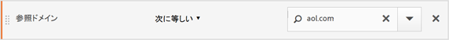-->

ページ ディメンションとは異なり、参照ドメインの値は、この訪問の各ページに添付されます。 例えば、以下の訪問者は、参照サイトからホームページにアクセスします。 したがって、この訪問のすべてのページに、同じ参照ドメイン値が割り当てられます。

`Referring Domain equals aol.com` 以下のセグメントは、**ページレポート**&#x200B;に適用されます。

<table style="table-layout:fixed; border: 0;">

<tr>
<td style="background-color: #E5E4E2;"></td>
<td style="background-color: #E5E4E2;" colspan="4"><b>訪問 1</b></td>
</tr>
<tr>
<tr>
<td style="background-color: #E5E4E2;">
<br/>aol.com
</td>
<td style="background-color: #FFFFFF; "><br/>ホーム</td>
<td style="background-color: #FFFFFF;"><br/>冬物アパレル</td>
<td style="background-color: #FFFFFF;"><br/>冬物コート</td>
<td style="background-color: #FFFFFF;"><br/>購入額 100 ドル</td>
</tr>
<tr>
<td colspan="5">
</tr>
<tr>
<td style="background-color: #E5E4E2;"></td>
<td style="background-color: #E5E4E2;"colspan="4"><b>訪問 2</b></td>
</tr>
<tr>
<tr style="border: 0;">

<td style="background-color: #E5E4E2;">
<br/>weather.com
</td>
<td style="background-color: #FFFFFF; "><br/>冬物アパレル</td>
<td style="background-color: #FFFFFF;"><br/>冬用ブーツ</td>
<td style="background-color: #FFFFFF;"><br/>冬物アパレル</td>
<td style="background-color: #FFFFFF;"><br/>冬用帽子</td>

</table>

<!--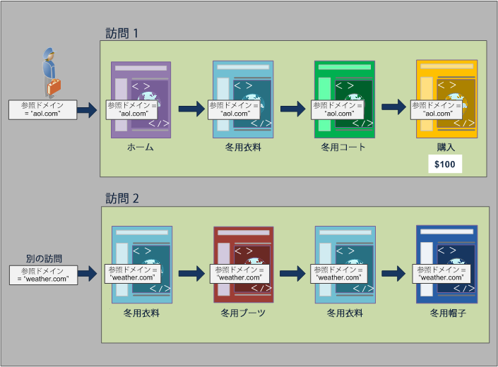-->

新しい訪問では、訪問者は別のサイトから参照されます。 したがって、新しい訪問のすべてのページに、各ページビューの新しい参照ドメイン値が割り当てられます。

### ヒットコンテナからのレポート作成

同じ訪問のすべてのページビューに、同じ参照ドメイン値が割り当てられるので、`Referring Domain equsls 'aol.com'` となるヒットコンテナレベルでのレポートは、次の表に示すように、すべてのページを返します。

| 参照ドメイン = &#39;aol.com&#39; | ページビュー数 |
|----|---:|
| ホーム | 1 |
| 冬物アパレル | 1 |
| 冬物コート | 1 |
| 購入 | 1 |

<!--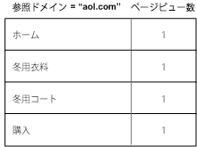-->

Hit コンテナのデータを見ると、32,000人を超える訪問者が33,000回以上の訪問で92,000回を超えるページビューを閲覧しました。 平均して、各訪問には3つのページビューがあり、ほぼすべての訪問はユニーク訪問者によるものでした。

|  | 指標 | # | ％ |
|---|---|--:|--:|
| | ページビュー：<br/>ビュー：<br/>ユニーク訪問者 | 351,165 件中&#x200B;**98,234 件** 165,173 件中&#x200B;<br/>**33,203 件** 113,110 件中&#x200B;<br/>**32,269 件** | **27%**<br/>**20%**<br/>**28%** |

<!--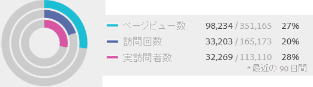-->

### 訪問コンテナからのレポート

この同じ条件が訪問コンテナでページレポート用にフィルタリングされると、`Referring Domain equals 'aol.com'` が true になる訪問のすべてのページが対象となります。 参照ドメインの値は、訪問レベルで設定されるので、ページビューレベルと訪問レベルでのレポートは同じです。

| 参照ドメイン = &#39;aol.com&#39; | ページビュー数 |
|----|---:|
| ホーム | 1 |
| 冬物アパレル | 1 |
| 冬物コート | 1 |
| 購入 | 1 |

<!---->

どのページも、訪問に基づく同じ参照ドメイン値を持つため、訪問コンテナレベルからのレポートは、ページビューコンテナからのレポートと（ほとんど）同じです。 データの異常が原因のオフセットが若干（98,234 対 98,248）があります。

|  | 指標 | # | ％ |
|---|---|--:|--:|
| | ページビュー：<br/>ビュー：<br/>ユニーク訪問者 | 351,165 件中&#x200B;**98,248 件** 165,173 件中&#x200B;<br/>**33,203 件** 113,110 件中&#x200B;<br/>**32,269 件** | **27%**<br/>**20%**<br/>**28%** |

<!--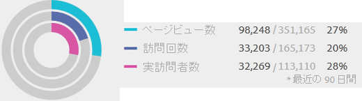-->

### 訪問者コンテナからのレポート

訪問者コンテナから、ページレポートには、`Referring Domain equals 'aol.com'` がtrue である任意の訪問者が閲覧したページがすべて示されます。 したがって、訪問者が（定義された期間内の）履歴のいずれかの時点で&#x200B;*「aol.com」*&#x200B;を参照ドメインとして持つ場合、訪問者コンテナに含まれるすべてのページ（他の訪問でのページビューを含む）が示されます。 第一条件に一致しないページも、訪問者コンテナに含まれるページなので、レポートに一覧表示されます。 訪問者コンテナ内のすべてのページは、以前に発生し、条件を特に満たしていない場合でも、レポートに一覧表示されます。

参照ドメインレポートでは、4 つのページビューで `Referring Domain equals 'aol.com'` が true ですが、訪問者がヒットした他のページでは `Referring Domain equals "weather.com"` が true です。 「訪問者」コンテナから、「aol.com」が true の訪問者のリストを取得します。 また、参照ドメインが「weather.com」であるページも表示されます。セグメント内の最初のリクエストに一致した値ではありません。

| 訪問 1<br/> 参照ドメイン =「aol.com」 | <br/>ページビュー数 |
|----|---:|
| ホーム | 1 |
| 冬物アパレル | 1 |
| 冬物コート | 1 |
| 購入 | 1 |

| 訪問 2<br/> 参照ドメイン =「weather.com」 | <br/>ページビュー数 |
|----|---:|
| 冬物アパレル | 2 |
| 冬物コート | 1 |
| 購入 | 1 |

| 訪問者コンテナ<br/>参照ドメイン =「aol.com」 | ページビュー数 |
|----|---:|
| 冬物衣料<br/>参照ドメイン：「aol.com」 | 1 |
| 冬物衣料<br/>参照ドメイン：「weather.com」 | 1 |
| ホーム<br/>参照ドメイン：「aol.com」 | 1 |
| 冬用コート<br/>参照ドメイン：「aol.com」 | 1 |
| 購入<br/>参照ドメイン：「aol.com」 | 1 |
| 冬用ブーツ<br/>参照ドメイン：「weather.com」 | 1 |
| 冬用帽子<br/>参照ドメイン：「weather.com」 | 1 |


<!--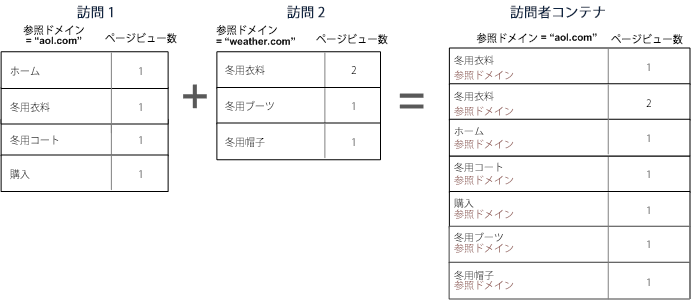-->

訪問者コンテナのデータを表示すると、ページビューが（98,248 から 112,925 に）大幅に増加していることに注意してください。 この増加は、訪問者によるすべてのページビュー（訪問者コンテナレベルで保存された他の参照ドメイン値を持つページを含む）がリストされたからです。 さらに、その訪問者による追加の訪問数が 33,203 から 43,448 に増加しています。

|  | 指標 | # | ％ |
|---|---|--:|--:|
| | ページビュー：<br/>ビュー：<br/>ユニーク訪問者 | 351,165 件中&#x200B;**112,925 件** 165,173 件中&#x200B;<br/>**43,448 件** 113,110 件中&#x200B;<br/>**32,269 件** | **32%**<br/>**26%**<br/>**28%** |

<!--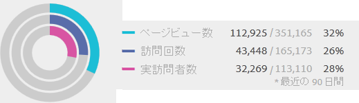-->

## 概要

- 訪問者コンテナは、少なくとも 1 つのページが条件を満たす訪問者に閲覧されたすべてのページを返します。 したがって、あるページが 1 日目の 訪問 1 でしか閲覧されていない場合でも、その訪問者が複数の訪問で閲覧したすべてのページがデータに含まれます。
- 訪問コンテナは、訪問で表示されたすべてのページのうち、少なくとも 1 つのページが条件を満たすページを返します。 したがって、あるページが 1 日目の 訪問 1 でしか閲覧されていない場合でも、訪問全体で閲覧されたすべてのページがデータに含まれます。
- セグメント化に使用する条件は、eVar またはその他のタイプの永続変数に基づいて行うように注意してください。 例えば、「キャンペーンにメールを含む」という条件を使用すれば、キャンペーンは 7 日後に有効期限切れとなります。 この場合、初回訪問時にキャンペーンが設定されると、キャンペーンはさらに 7 日間継続します。 キャンペーンが初回訪問時にのみ設定された場合も、各訪問が含まれます。 他の訪問も含まれます（これらの訪問がレポートの日付範囲に含まれている場合）。 持続的な値を排除して含めないようにする場合は、イベントのインスタンスを使用するか、同等の Prop 変数があれば、その Prop 変数を使用します。
