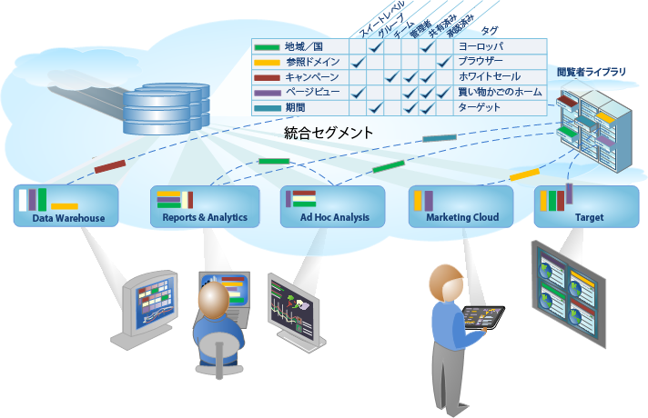

# Analytics のセグメント化

Adobe Analytics では、Analytics 機能、Adobe Experience Cloud、Adobe Target および統合された他の Adobe 製品を使用して、強力かつ重要な閲覧者セグメントを構築、管理、共有し、レポートに適用できます。

Analytics のセグメント機能には、セグメントを作成して事前テストを実行する[セグメントビルダー](/help/components/segmentation/segmentation-workflow/seg-workflow.md)や、組織全体でセグメントを収集し、タグ付けし、承認し、セキュリティ設定し、共有する[セグメントマネージャー](/help/components/segmentation/segmentation-workflow/seg-workflow.md)が含まれます。

データサイエンティストやマーケティングアナリストは、セグメントをニーズ固有の分析に合わせて利用、拡張および調整し、保存することができます。他のユーザーは、これらの保存されたセグメントを拡張および調整し、新しいセグメントとしてライブラリに保存できます。実際の運用では、これは体系化された閲覧者インサイトを[統合セグメントワークフロー](/help/components/segmentation/segmentation-workflow/seg-workflow.md)として設計および管理する一連のサイクルとなります。

**はじめに**

[セグメントワークフローの設定](/help/components/segmentation/segmentation-workflow/seg-workflow.md)または[セグメントの作成](/help/components/segmentation/segmentation-workflow/seg-build.md)を開始するか、「[セグメントについて](/help/components/segmentation/seg-overview.md)」で概要を確認してください。
