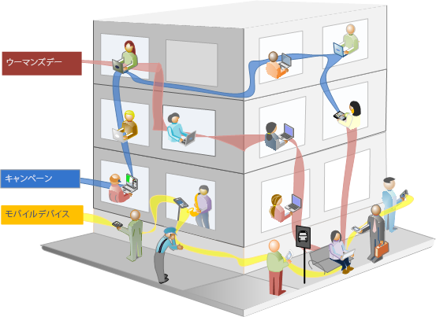

# セグメントについて

セグメントを使用すると、特性や web サイトでのやり取りに基づいて訪問者のサブセットを識別できます。セグメントは、特定のニーズに合わせて構築し、検証、編集、他のチームメンバーと共有、他のアドビ製品や Analytics 機能で使用したりできるオーディエンスインサイトとして設計されています。

セグメントは、[!UICONTROL 訪問者]、[!UICONTROL 訪問]および[!UICONTROL ヒット]の各レベル階層に基づき、ネストされたコンテナモデルを使用します。ネストされたコンテナを使用することで、コンテナ間およびコンテナ内のルールに基づいて、訪問者の属性とアクションを定義できます。Analytics セグメントは、[!DNL Adobe Experience Cloud] の複数の製品および機能間で構築、承認、共有、保存および実行できます。セグメントはレポートから生成したり、ダッシュボードレポートに組み込んだりできます。また、セグメントをブックマークに登録すると、セグメントにすばやくアクセスできるようになります。

セグメントビルダーでセグメントを作成して保存することも、（[!UICONTROL Analysis Workspace]で）フォールアウトレポートからセグメントを生成することもできます。また、事前作成されたセグメントをネストされたコンテナ間の特定のルールに基づいて利用および拡張し、結果をフィルタリングしてレポートに適用することもできます。また、複数のセグメントをまとめて、[積み重ねセグメント](/help/components/segmentation/segmentation-workflow/seg-workflow.md)として使用することもできます。

セグメントは次の項目を識別します。

- 訪問者（国、性別、コーヒーショップ）
- 訪問者が使用するデバイスやサービス（ブラウザー、検索エンジン、モバイルデバイス）
- 訪問者がどこからアクセスしてきたか（検索エンジン、前の出口ページ、自然検索）
- 他にもたくさんあります。

<!---->

セグメントは、次の値に基づくことができます。

- 属性に基づく訪問者 - ブラウザーのタイプ、デバイス、訪問回数、国、性別。
- インタラクションに基づく訪問者 - キャンペーン、キーワード検索、検索エンジン。
- 出口および入口に基づく訪問者 - Facebook、定義済みのランディングページ、参照ドメインからの訪問者。
- カスタム変数に基づく訪問者 - フォームフィールド、定義済みのカテゴリ、顧客 ID。

セグメントビルダーで閲覧者セグメントを作成するときに、コンテナ間で [!UICONTROL AND] および [!UICONTROL OR] 演算子を使用して条件を定義できます。

<table style="table-layout:fixed; border: none;">

<tr>

<td style="background-color: #E5E4E2;" colspan="3" width="200" height="100"> 訪問者</td>
</tr>

<tr>
<td style="background-color: #E5E4E2;" width="200"></td>
<td style="background-color: #D3D3D3;" colspan="2" width="200" height="100"> 訪問回数</td>
</tr>

<tr>
<td style="background-color: #E5E4E2;" width="200" height="100"></td>
<td style="background-color: #D3D3D3;" width="200" height="100"></td>
<td style="background-color: #C0C0C0;" width="200" height="100" colspan="1"> ヒット数</td>
</tr>

<tr>
<td style="background-color: #E5E4E2;"></td><td colspan="2">AND</td></td>
</tr>

<tr>
<td style="background-color: #E5E4E2;" width="200"></td>
<td style="background-color: #D3D3D3;" colspan="2" width="200" height="100"> 訪問回数</td>
</tr>

<tr>
<td style="background-color: #E5E4E2;" width="200" height="100"></td>
<td style="background-color: #D3D3D3;" width="200" height="100"></td>
<td style="background-color: #C0C0C0;" width="200" height="100" colspan="1"> ヒット数</td>
</tr>
</table>

<table style="table-layout:fixed; border: none;">

<tr>

<td style="background-color: #E5E4E2;" colspan="3" width="200" height="100"> 訪問者</td>
</tr>

<tr>
<td style="background-color: #E5E4E2;" width="200"></td>
<td style="background-color: #D3D3D3;" colspan="2" width="200" height="100"> 訪問回数</td>
</tr>

<tr>
<td style="background-color: #E5E4E2;" width="200" height="100"></td>
<td style="background-color: #D3D3D3;" width="200" height="100"></td>
<td style="background-color: #C0C0C0;" width="200" height="100" colspan="1"> ヒット数</td>
</tr>

<tr>
<td style="background-color: #E5E4E2;"></td><td colspan="2">OR</td></td>
</tr>

<tr>
<td style="background-color: #E5E4E2;" width="200"></td>
<td style="background-color: #D3D3D3;" colspan="2" width="200" height="100"> 訪問回数</td>
</tr>

<tr>
<td style="background-color: #E5E4E2;" width="200" height="100"></td>
<td style="background-color: #D3D3D3;" width="200" height="100"></td>
<td style="background-color: #C0C0C0;" width="200" height="100" colspan="1"> ヒット数</td>
</tr>
</table>

<!---->

このタイプのセグメントは、[!UICONTROL AND] および [!UICONTROL OR] 演算子を使用して結合された特性に基づいてデータセットをフィルタリングします。

- [レポートやプロジェクトに複数のセグメントを適用](/help/components/segmentation/segmentation-workflow/seg-workflow.md)できます。
- セグメントが、レポートスイート全体で共通になりました。
- [セグメントビルダー](/help/components/segmentation/segmentation-workflow/seg-workflow.md)は、セグメント作成を簡素化します。
- [セグメントマネージャ](/help/components/segmentation/segmentation-workflow/seg-workflow.md)を使用すると、セグメントの共有、タグ設定、検証および承認の機能を使用して[ワークフロー](/help/components/segmentation/segmentation-workflow/seg-workflow.md)を設定できます。
- フォルダーを使用する代わりに[セグメントにタグを設定](/help/components/segmentation/segmentation-workflow/seg-workflow.md)して、セグメントを整理したり検索したりできます。
- [連続セグメント](/help/components/segmentation/segmentation-workflow/seg-sequential-build.md)を作成できます。
- [!UICONTROL ページビュー]コンテナは、ページビューだけにとどまらずあらゆる種類のデータをセグメント化するコンテナであることを示すために、名称が[!UICONTROL ヒット]コンテナに変更されています。例えば、リンクトラッキング呼び出しと、モバイル SDK からの trackAction 呼び出しは、ヒットコンテナによって含まれたり、除外されたりします。

## Analysis Workspace のセグメント化

Analysis Workspace には、次の追加機能が含まれます。

- [セグメントを比較](../../analyze/analysis-workspace/c-panels/c-segment-comparison/segment-comparison.md)できます。
- 比較の[ディメンションとしてセグメント](https://experienceleague.adobe.com/docs/core-services/interface/audiences/audience-library.html?lang=ja)を使用できます。
- [フォールアウト分析](../../analyze/analysis-workspace/visualizations/fallout/compare-segments-fallout.md)でセグメントを使用できます。

## アドビが提供するセグメント

画面の左側のコンポーネントパネルには、ユーザーとその会社が作成したセグメントと、標準で提供されるアドビのセグメントが表示されます。「**[!UICONTROL すべて表示]**」をクリックすると、通常、これらのセグメントはリストの下部に表示され、右側のアドビロゴで識別されます。

## 順次セグメント {#sequential}

順次セグメントでは、サイト間でのナビゲーションとページビューに基づいて訪問者を識別し、定義済みのアクションとインタラクションのセグメントを提供できます。順次セグメントを使用すると、訪問者が好むものとそうでないものを容易に識別できます。順次セグメントを作成するときは、[!UICONTROL THEN] 演算子を使用して訪問者のナビゲーションを定義し、順序を指定します。

<!---->

| 訪問 1 | 訪問 2 | 訪問 3 |
|---|---|---|
| 1 回目の訪問では、訪問者はメインランディングページ A にアクセスし、キャンペーンページ B を除き、製品ページ C を閲覧しています。 | 2 回目の訪問では、訪問者は再度メインランディングページ A にアクセスし、キャンペーンページ B を除き、再度製品ページ C にアクセスし、さらに、新しいページ D にアクセスしています。 | 3 回目の訪問では、訪問者は 1 回目および 2 回目の訪問時と同じページに入って同じページをたどり、ページ F を除き、目的の製品ページ G に直接移動しています。 |

次のヒット値に基づく順次セグメントを定義できます。

- ページヒット順序に基づく訪問者：単一の訪問のページビュー、個別訪問間のページビュー、ページビューを除外した訪問。
- ページビュー間またはページビュー後の時間に基づく訪問者：期間終了後、ヒット間、イベント後。

<table style="table-layout:fixed; border: none;">

<tr>

<td style="background-color: #E5E4E2;" colspan="3" width="200" height="100"> 訪問者</td>
</tr>

<tr>
<td style="background-color: #E5E4E2;" width="200"></td>
<td style="background-color: #D3D3D3;" colspan="2" width="200" height="100"> 訪問回数</td>
</tr>

<tr>
<td style="background-color: #E5E4E2;" width="200" height="100"></td>
<td style="background-color: #D3D3D3;" width="200" height="100"></td>
<td style="background-color: #C0C0C0;" width="200" height="100" colspan="1"> ヒット数</td>
</tr>

<tr>
<td style="background-color: #E5E4E2;"></td><td colspan="2">THEN</td></td>
</tr>

<tr>
<td style="background-color: #E5E4E2;" width="200"></td>
<td style="background-color: #D3D3D3;" colspan="2" width="200" height="100"> 訪問回数</td>
</tr>

<tr>
<td style="background-color: #E5E4E2;" width="200" height="100"></td>
<td style="background-color: #D3D3D3;" width="200" height="100"></td>
<td style="background-color: #C0C0C0;" width="200" height="100" colspan="1"> ヒット数</td>
</tr>
</table>

<table style="table-layout:fixed; border: none;">

<tr>

<td style="background-color: #E5E4E2;" colspan="3" width="200" height="100"> 訪問者</td>
</tr>

<tr>
<td style="background-color: #E5E4E2;" width="200"></td>
<td style="background-color: #D3D3D3;" colspan="2" width="200" height="100"> 訪問回数</td>
</tr>

<tr>
<td style="background-color: #E5E4E2;" width="200" height="100"></td>
<td style="background-color: #D3D3D3;" width="200" height="100"></td>
<td style="background-color: #C0C0C0;" width="200" height="100" colspan="1"> ヒット数</td>
</tr>

<tr>
<td style="background-color: #E5E4E2;"></td><td style="background-color: #D3D3D3;"></td><td>AND</td></td>
</tr>

<tr>
<td style="background-color: #E5E4E2;" width="200" height="100"></td>
<td style="background-color: #D3D3D3;" width="200" height="100"></td>
<td style="background-color: #C0C0C0;" width="200" height="100" colspan="1"> ヒット数</td>
</tr>

<tr>
<td style="background-color: #E5E4E2;"></td><td colspan="2">THEN</td></td>
</tr>

<tr>
<td style="background-color: #E5E4E2;" width="200"></td>
<td style="background-color: #D3D3D3;" colspan="2" width="200" height="100"> 訪問回数</td>
</tr>

<tr>
<td style="background-color: #E5E4E2;" width="200" height="100"></td>
<td style="background-color: #D3D3D3;" width="200" height="100"></td>
<td style="background-color: #C0C0C0;" width="200" height="100" colspan="1"> ヒット数</td>

<tr>
<td style="background-color: #E5E4E2;"></td><td style="background-color: #D3D3D3;"></td><td>OR</td></td>
</tr>

<tr>
<td style="background-color: #E5E4E2;" width="200" height="100"></td>
<td style="background-color: #D3D3D3;" width="200" height="100"></td>
<td style="background-color: #C0C0C0;" width="200" height="100" colspan="1"> ヒット数</td>
</tr>
</tr>
</table>

<!---->

順次セグメントでは、[!UICONTROL THEN] 演算子を使用したユーザーアクションに基づいてデータセットをフィルターします。

## ハウツーセグメント化のビデオ {#segment-video}

このビデオでは、セグメントコンテナの概要と使用方法について簡単に説明します。

>[!BEGINSHADEBOX]

デモビデオについては、[ セグメントコンテナ ](https://video.tv.adobe.com/v/25401?quality=12&learn=on){target="_blank"} を参照してください。

>[!ENDSHADEBOX]

## セグメントツールにアクセスする {#access}

+++ **セグメントビルダーへの移動方法**

セグメントビルダーには、次のようにアクセスします。

- 既存のレポートを表示し、左側のナビゲーションでセグメントアイコン  をクリックします。表示されるセグメントレールで、「**[!UICONTROL 追加]**」をクリックします。または

- セグメントマネージャの上部で、「**[!UICONTROL + 追加]**」 をクリックします。

   または

- セグメントマネージャ内で既存のセグメントタイトルをクリックし、そのセグメントをセグメントビルダーで編集します。

+++

+++ **セグメントマネージャへの移動方法**

セグメントマネージャには、次のようにアクセスします。

- 上部のナビゲーションから **[!UICONTROL Analytics]**／**[!UICONTROL コンポーネント]**&#x200B;に移動します。次に、「**[!UICONTROL セグメント]**」をクリックするか、または

- 既存のレポートを表示し、左側のナビゲーションでセグメントアイコン  をクリックします。次に、「**[!UICONTROL 管理]**」をクリックします。または

- インターフェイス内の任意の場所でスラッシュキー「/」を押して、セグメントマネージャを検索します。

+++

## 権限 {#section_648DFA3A882146C485A84ED014EEC707}

+++ **セグメントの使用、作成および管理に必要な権限と許可**

デフォルトでは、すべてのユーザーが個人用のセグメントを作成および編集できます。ただし、管理者の判断により、[セグメントを作成する権限](https://experienceleague.adobe.com/docs/analytics/admin/admin-console/home.html?lang=ja)を持つべきユーザーを決定し、特定のグループに割り当てることができます。これらのセグメントは、他の Analytics ユーザーと直接共有できます。

管理者はすべてのセグメントを編集できます。また、グループや組織のメンバー全員とセグメントを共有することもできます。[さらに詳しく...](/help/components/segmentation/seg-reference/seg-rights.md)

+++

+++ **社内のすべてのセグメントを表示できますか？**

管理者は、[!DNL Analysis Workspace] ユーザーインターフェイス内ですべてのセグメントを表示できます。

Report Builder には、自分が所有するセグメントと自分が共有しているセグメントが表示されます。

+++

+++ **セグメントマネージャーでは Analytics のセグメントをすべて管理できますか？**

はい。すべてのセグメントをセグメントマネージャで管理できます。セグメントマネージャには、所有者（セグメントを作成したユーザー）、共有先ユーザーおよび管理者ユーザーに表示されるセグメントが表示されます。セグメントの選択には、ユーザーによって所有および共有されるセグメントが表示されます。

管理者は、Analysis Workspace ユーザーインターフェイス内ですべてのセグメントを表示できます。

Report Builder では、自分が作成したセグメントまたは自分に共有されているセグメントのみが表示されます。

+++

+++ **このセグメントを削除できないのはなぜですか？**

セグメントが [Experience Cloud に公開されている](/help/components/segmentation/segmentation-workflow/seg-workflow.md)場合には、そのセグメントを削除したり、編集したりすることはできません。ただし、コピーしたうえでそのコピーしたものを編集することは可能です。

+++
