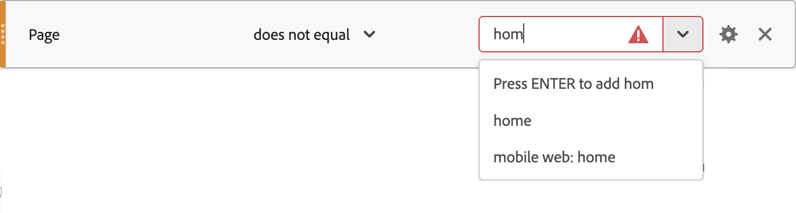

# セグメントの比較演算子

セグメントビルダーでは、選択した演算子を使用して値を比較および制約できます。 演算子には、[標準](#standard-operators)、[Data Warehouse](#data-warehouse-operators)、[個別カウント &#x200B;](#distinct-count-operators)の3つのカテゴリがあります。

選択した演算子に応じて、次の操作を行います。

* 値を入力できます。
* 値の一部を入力し、ドロップダウンメニュー（使用可能な場合）から選択できます。
* ドロップダウンメニューから値をすばやく選択します（使用可能な場合）。

使用可能な値を検証する演算子（**[!UICONTROL 等しい]**&#x200B;など）の値を入力し、その値がコンポーネントで使用可能な値と一致しない場合、 アイコンが表示されます。 ドロップダウンメニューから値を選択するか、**[!UICONTROL _Enter_]**&#x200B;を押して値を入力します。

に等しい

## ワイルドカード

ワイルドカードをサポートする演算子でサポートされているワイルドカード文字は、アスタリスク `*`のみです。 特定の&#42;文字を検索する必要がある場合は、`\*`のようにバックスラッシュでエスケープできます。

例えば、*My cool product*&#x200B;というページ名があります。

* セグメントルール **[!UICONTROL ページ名]** **[!UICONTROL 一致]** `* product`は、上記のページ名と一致します。
* ただし、ルール **[!UICONTROL ページ名]** **[!UICONTROL は]** `My \* product`と一致し、ページ名&#x200B;*マイ*&#x200B;製品*のみと一致します。

## 標準演算子

| 演算子 | 選択されたディメンション、セグメントまたは指標イベント： |
|--- |--- |
| **[!UICONTROL が]**&#x200B;に等しい | 数字または文字列の値に完全に一致する項目を返します。 注意：ワイルドカード文字を使用する場合は、**[!UICONTROL matches]**&#x200B;演算子を使用します。 |
| **[!UICONTROL が]**&#x200B;と等しくありません | 入力された値の完全一致を含まない項目をすべて返します。  注意：ワイルドカード文字を使用する場合は、**[!UICONTROL が]**&#x200B;演算子と一致しません。 |
| **[!UICONTROL が]**&#x200B;のいずれかに等しい | 入力フィールド内の任意の値に完全に一致する項目を返します（最大 500 項目）。 例えば、この演算子を使用して&#x200B;**[!UICONTROL ページ名]** ディメンションに`Search Results, Homepage`と入力すると、*検索結果*&#x200B;と&#x200B;*ホームページ*&#x200B;が一致し、2つの項目としてカウントされます。 この演算子の入力フィールドはコンマで区切ります。 |
| **[!UICONTROL は]**&#x200B;と等しくありません | 入力フィールド内の任意の値（最大 500 個の項目）に完全に一致する項目を識別し、これらの値を持たない項目のみを返します。 例えば、**[!UICONTROL ページ名]** ディメンションに対してこの演算子を使用して`Search Results, Homepage`と入力すると、*検索結果*&#x200B;と&#x200B;*ホームページ*&#x200B;が識別され、次に&#x200B;**返された項目から**&#x200B;それらを除外します。 この例では、2 項目としてカウントされます。 この演算子の入力フィールドはコンマで区切ります。 |
| **[!UICONTROL contains]** | 入力された値のサブ文字列と比較される項目を返します。 例えば、ルールが&#x200B;**[!UICONTROL Page Name]** **[!UICONTROL contains]** `Search`の場合、このルールは、*検索結果*、*検索*、*検索中*&#x200B;など、部分文字列`Search`を含むあらゆるページと一致します。 Adobe Analytics の「次を含む」句では大文字と小文字が区別されませんが、Customer Journey Analytics では大文字と小文字が区別されます。 |
| **[!UICONTROL に]**&#x200B;が含まれていません | **[!UICONTROL contains]** ルールの逆を返します。 具体的には、入力された値に一致するすべての項目が、入力された値から除外されます。 例えば、ルールが&#x200B;**[!UICONTROL Page Name]** **[!UICONTROL に]** `Search`が含まれていない場合、*検索結果*、*検索*、*検索中*&#x200B;など、サブ文字列`Search`を含むページは一致しません。 これらの値は結果から除外されます。 |
| **[!UICONTROL すべて]**&#x200B;が含まれます | 複数の値を結合するなど、サブストリングと比較した項目を返します。 例えば、**[!UICONTROL ページ名]** ディメンションに対してこの演算子を使用して`Search Results`と入力すると、*検索結果*&#x200B;と&#x200B;*検索結果*&#x200B;が一致しますが、*検索*&#x200B;または&#x200B;*結果*&#x200B;は個別に一致しません。 ルールは、*検索*&#x200B;と&#x200B;*結果*&#x200B;が一緒に見つかった場合に一致します。 この演算子の入力フィールドは、スペースで区切られます（100 語）。 |
| **[!UICONTROL にすべての]**&#x200B;が含まれていません | 複数の値を結合するなど、サブストリングと比較して項目を識別し、これらの値を持たない項目のみを返します。 例えば、**[!UICONTROL ページ名]** ディメンションに対してこの演算子を使用して`Search Results`と入力すると、*検索結果*&#x200B;と&#x200B;*検索結果*&#x200B;が識別され（ただし、*検索*&#x200B;または&#x200B;*結果*&#x200B;は個別に識別されません）、これらの項目が除外されます。 この演算子の入力フィールドは、スペースで区切られます（100 語）。 |
| **[!UICONTROL には]**&#x200B;のいずれかが含まれます | サブストリングと比較して、結合または独立して識別された複数の値を含む項目を返します。 例えば、この演算子を使用して`Search Results`と入力すると、*検索結果*、*検索結果*、*検索*、*結果*&#x200B;と一致します。 これは、*検索*&#x200B;または&#x200B;*結果*&#x200B;が一緒に、または個別に見つかった場合に一致します。 この演算子の入力フィールドは、スペースで区切られます（100 語）。 |
| **[!UICONTROL には]**&#x200B;のいずれも含まれていません | サブストリングに基づいて項目を識別し、これらのサブストリングを含まない値を返します。 複数の結合値または値を個別に識別できます。 例えば、**[!UICONTROL ページ名]** ディメンションに`Search Results`と入力すると、*検索結果* s、*検索結果*、*検索*、*結果*&#x200B;に一致し、*検索*&#x200B;または&#x200B;*結果*&#x200B;が同時にまたは個別に検索されます。 次に、これらのサブ文字列を含む項目が除外されます。 この演算子の入力フィールドは、スペースで区切られます（100 語）。 |
| **[!UICONTROL が]**&#x200B;で始まります | 入力された文字列値で始まる項目を返します。 |
| **[!UICONTROL が]**&#x200B;で始まりません | 入力された文字列値で始まらないすべての項目を返します。 これは、**演算子で始まる**&#x200B;の逆です。 |
| **[!UICONTROL は]**&#x200B;で終わります | 文字列値で終わる項目を返します。 |
| **[!UICONTROL が]**&#x200B;で終わりません | 入力された文字列値で終わらないすべての項目を返します。 これは&#x200B;**[!UICONTROL の逆で、]**&#x200B;演算子で終わります。 |
| **[!UICONTROL 一致]** | 指定された数字または文字列の値に基づいて完全に一致する項目を返します。 **[!UICONTROL matches]**&#x200B;句では、Adobe AnalyticsとCustomer Journey Analyticsで大文字と小文字が区別されます。 **メモ**: [&#x200B; ワイルドカード &#x200B;](#wildcards) （グロビング）機能を使用する場合は、この演算子を使用します。 「グロビング」の例：<ul><li>`a*e` は、`ae`、`abcde`、`adobe`、`a whole sentence` と一致します。</li><li>`adob*` は、`adobe`、`adobe analytics`、`adobo recipe` と一致します。</li><li>`*dobe` は、`dobe`、`adobe`、`cute little dobe` と一致します。</li></ul> |
| **[!UICONTROL が]**&#x200B;と一致しません | 入力された値の完全一致を含まない項目をすべて返します。 注意：[&#x200B; ワイルドカード &#x200B;](#wildcards) （グロビング）機能を使用する場合は、この演算子を使用します。 |
| **[!UICONTROL 存在]** | 存在する項目の数を返します。 例えば、**[!UICONTROL exist]**&#x200B;演算子を使用して&#x200B;**[!UICONTROL Pages Not Found]** ディメンションを評価すると、存在するエラーページの数が返されます。 |
| **[!UICONTROL が存在しません]** | 存在しないすべての項目を返します。 例えば、**[!UICONTROL が存在しない]**&#x200B;演算子を使用して&#x200B;**[!UICONTROL ページが見つかりません]** ディメンションを評価する場合、このエラーページが存在しないページの数が返されます。 |

## Data Warehouse 演算子

| 演算子 | 選択されたディメンション、セグメントまたは指標イベント： |
| --- | --- |
| **[!UICONTROL が]**&#x200B;より小さい | 入力された値よりも小さい数字を持つ項目を返します。 |
| **[!UICONTROL が]**&#x200B;以下 | 入力された値よりも小さいか等しい数字を持つ項目を返します。 |
| **[!UICONTROL は]**&#x200B;より大きい | 入力された値よりも大きい数字を持つ項目を返します。 |
| **[!UICONTROL が]**&#x200B;以上 | 入力された値よりも大きいか等しい数字を持つ項目を返します。 |

## 個別カウント演算子

セグメントの条件としてディメンション項目のアイテム数を指定できます。 例：5つ以上の異なる製品を閲覧した&#x200B;*訪問者*、または5つ以上の異なるページを閲覧した&#x200B;*訪問*。

| 演算子 | 選択されたディメンション、セグメントまたは指標イベント： |
| --- | --- |
| **[!UICONTROL が]**&#x200B;に等しい | 入力された値と等しいユニーク数を持つディメンション項目を返します。 |
| **[!UICONTROL が]**&#x200B;と等しくありません | 入力された値と等しくないユニーク数を持つディメンション項目を返します。 |
| **[!UICONTROL は]**&#x200B;より大きい | 入力された値よりも大きいユニーク数を持つディメンション項目を返します。 |
| **[!UICONTROL が]**&#x200B;より小さい | 入力された値よりも小さいユニーク数を持つディメンション項目を返します。 |
| **[!UICONTROL が]**&#x200B;以上 | 入力された値以上のユニーク数を持つディメンション項目を返します。 |
| **[!UICONTROL が]**&#x200B;以下 | 入力された値以下のユニーク数を持つディメンション項目を返します。 |

>[!BEGINSHADEBOX]

デモ動画については、 [個別ディメンション数](https://experienceleague.adobe.com/en/docs/analytics-learn/tutorials/components/segmentation/segmentation-on-distinct-dimension-counts){target="_blank"}を参照してください。

>[!ENDSHADEBOX]
