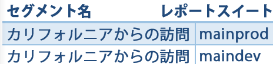
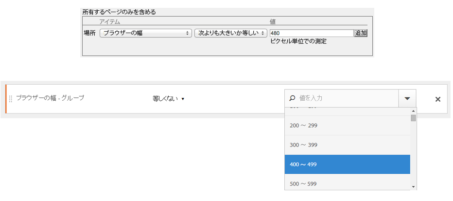

# レガシーセグメント

この記事では、レガシーセグメントを管理するためのベストプラクティスに関するよくある質問に回答します。 レガシーセグメントとは、2014年より前に作成されたセグメントのことです。

## レガシーセグメントの管理 {#legacy}

+++ **既存のセグメントへの影響**

既存のセグメントは以前と同じように機能し続けます。 これらのセグメントが適用されたレポートは、引き続き正しく機能します。

ほとんどの事前に定義されたセグメントとスイートセグメントは、セグメントビルダーにセグメントテンプレートとして移行されます。 セグメントテンプレートを使用して、一般的なオーディエンスを含むカスタムセグメントをすばやく構築できます。 セグメントテンプレートは、レポートに直接適用することはできませんが、カスタムセグメントに簡単に保存できます。

セグメントテンプレートは、セグメントビルダーで特別なアイコン でマークされます。

+++

+++ **セグメントが適用された予定レポートへの影響**

スケジュールされたレポートは、定義したセグメントで引き続き適切に実行されます。

セグメントを削除すると、このセグメントが適用されたスケジュール済みレポートとダッシュボードは引き続き正常に機能します。つまり、セグメントまたはダッシュボードは削除されたセグメントを引き続き使用します。

スケジュールされたレポートは、同じ名前のセグメントを編集しても更新されません。 次に例を示します。異なるレポートスイートに同じ名前を持つ2つのセグメントがあるとします。

**[!UICONTROL mainprod]** レポートスイートのセグメントを参照するビジュアライゼーションがあります。 このセグメントは重複しているので、セグメントを削除します。 削除されたセグメントの定義を参照して、ビジュアライゼーションが引き続き実行されます。 メインデブ セグメントのセグメント定義を変更してCatalina Islandとメキシコのティファナを含める場合、ビジュアライゼーションに適用されるセグメントは変更されず、古い定義が使用されます。 新しい定義を使用するには、ビジュアライゼーションを更新して新しい定義を参照します。 ビジュアライゼーション、プロジェクトレポートまたはスケジュール済みレポートが削除されたセグメントを使用しているかどうかわからない場合は、残りのセグメントの名前を変更して、ビジュアライゼーションが残りのセグメントを使用しているかどうかを表示します。

+++

+++ **データウェアハウスセグメントへの影響**

既存のデータウェアハウスセグメントは、今後もデータウェアハウス内ですべて機能します。 ほとんどのData Warehouse セグメントは、Analysis Workspaceなどの他のコンポーネントでも動作します。

セグメントビルダー/マネージャーで、新しいData Warehouse セグメントを作成または編集できます。 セグメントビルダーの製品互換性メカニズムは、セグメントがData Warehouseと互換性があるかどうかを自動的に判断します。

+++

+++ **事前設定済みのセグメントへの影響**

* **直帰数**
* **モバイルデバイスからの訪問**
* **自然検索からの訪問**
* **有料検索からの訪問**
* **訪問者 ID cookie を使用した訪問**

これらのセグメントは、セグメントテンプレートとしてセグメントビルダーに移行されます。 セグメントが適用された既存のレポートも、これまでと同様に適切に機能します。

+++

+++ **CX Enterprise （Suite） セグメントに起こったこと：**

* 非購入者
* 購入者
* 初回訪問回数
* ソーシャルサイトからの訪問件数
* 10分以上の訪問*
* 5回以上の以前の訪問*
* Facebookからの訪問*

これらのセグメントのほとんどは（アスタリスク * が付いているセグメントを除く）、セグメントテンプレートとしてセグメントビルダーに移行します。 このほかに、新しいセグメントテンプレートがいくつか追加されています。

セグメントが適用された既存のレポートも、これまでと同様に適切に機能します。

+++

+++ **管理者セグメント（「グローバル」セグメントとも言う）への影響**

**管理者** セグメントが新しいセグメントインターフェイスに移行され、すべてのユーザーと共有されたセグメントとして表示されます。

これらのセグメントの所有者は、最も古い管理者ユーザーのアカウントを持つ管理者に設定されます。 ただし、すべての管理者はこれらのセグメントを削除、編集、共有できます。

管理者がこれらのグローバルセグメントを作成および管理するAdmin Consoleのセグメント管理インターフェイスは使用できなくなりました。 次に、管理者は、新しいセグメントビルダーを使用してセグメントを作成し、適切なグループや個人または全員と共有する必要があります。

このドキュメントの説明に従って変更されたロジックを使用する既存のセグメントは引き続き正しく機能しますが、セグメントを再度保存する前に更新する必要があります。 例えば、**[!UICONTROL US States]** **[!UICONTROL に]** `New York`が含まれている既存のセグメントがある場合、そのセグメントは引き続き正しく機能します。 次回セグメントを編集する際は、セグメントを更新して、**[!UICONTROL 等しい]**&#x200B;条件を持つ列挙型を使用する必要があります。

+++

+++ **同じ名前を持つセグメントが重複していますが、定義が異なる場合があります。** 
セグメントが複数のレポートスイートで動作するようになったことから、同じ名前のセグメントが複数存在する結果になることがあります。 次のことをおこなう必要があります。

* 同じ名前で定義が異なるセグメントの名前を変更する、または
* 不要になったセグメントを削除します。

+++

+++ **セグメントのクリーンアップに関して、Adobeで推奨される点は何ですか？**

* すべてのセグメントに従来のタグを付けます。
* 既存のセグメントを見直しましょう。
* 該当する場合は、セグメントライブラリにこれらを追加します。
* 規範的なセグメントを承認。
* [ベストプラクティス](/help/components/segmentation/segmentation-workflow/seg-workflow.md)に従ってセグメントにタグを設定します。

+++

### 移行に関するヒント

次のヒントは、共通ディメンションの移行に役立ちます。

* 地域 - 市／地域／国 - 部分一致を使用するのではなく、特定の市町村、地域または国を検索して選択します。
* Browsers - Browser Types ディメンションを使用して、Google Chromeなどの型のすべてのブラウザーを取得します
* オペレーティングシステム - OS タイプのディメンションを使用して、Microsoft Windowsなどのタイプのすべてのオペレーティングシステムを取得します。
* 「新しいディメンションと名前が変更されたディメンション」を参照してください（以下を参照）。

## 新しいディメンションと名前を変更したディメンション {#renamed}

次の表に、セグメントビルダーで名前が変更されたディメンションのリストを示します。

| 新しいDimension名 | 前の名前 | メモ |
|--- |--- |--- |
| オペレーティングシステムの種類 | 新規 | 2015年春に追加。 |
| ブラウザーの幅 - グループ | ブラウザーの幅 | このディメンションは、すべてのインターフェイスと互換性があり、特定の整数値ではなく、列挙された範囲のリストに分割されます。 特定の値をセグメント化する必要がある場合は、Data Warehouse セグメントでこのディメンションの詳細バージョンを使用します。 |
| ブラウザーの高さ - グループ | ブラウザーの高さ | このディメンションは、すべてのインターフェイスと互換性があり、特定の整数値ではなく、列挙された範囲のリストに分割されます。 特定の値をセグメント化する必要がある場合は、Data Warehouse セグメントでこのディメンションの詳細バージョンを使用します。 |
| ブラウザーの幅 - 詳細 | ブラウザーの幅 | このディメンションは名前が変更され、Data Warehouseとのみ互換性があります。 すべてのインターフェイスと互換性のあるセグメントを定義する場合は、列挙タイプの「ブラウザーの幅 – バケット化」を使用します。 |
| ブラウザーの高さ - 詳細 | ブラウザーの高さ | このディメンションは名前が変更され、Data Warehouseとのみ互換性があります。 すべてのインターフェイスと互換性のあるセグメントを定義する場合は、列挙タイプの「ブラウザーの高さ – バケット化」を使用します。 |
| cookie サポート | Cookie | - |
| 色深度 | 画面の色設定 | - |
| - | 「アプリ - *」 | 「アプリ – 」プレフィックスが多くのディメンション タイプから削除されました。 モバイルアプリのデータは通常、web データを含まないレポートスイートで取り込まれるため、これらの接頭辞は必要ありませんでした。 |
| オリジナルの入口ページ | オリジナルの入口ページ | - |
| Java 有効 | Java | - |
| モバイルのブラウザー URL 最大長 | モバイル ブラウザ URL の長さ | - |
| モバイルデコレーションメール | モバイル デコレーションメールのサポート | - |
| モバイルデバイス | モバイルデバイス名 | - |
| モバイルのブックマーク最大長 | モバイル ブックマーク URL の最大長 | - |
| モバイルの電子メール最大長 | モバイル メール URL の最大長 | - |
| モバイルオペレーティングシステム （非推奨） | モバイル OS | 代わりに、オペレーティングシステム ディメンションを使用して、モバイルデバイスセグメントからの訪問を適用します。 |
| モバイルプッシュトゥトーク | モバイル PTT | - |
| 調査ビュー | アンケートの合計閲覧数 | - |
| アンケート回答 | アンケートの回答数 | - |
| 訪問の深さ | パスの長さ | - |
| 郵便番号 | 郵便番号 | - |

{style="table-layout:auto"}

## 既知の値を持つ文字列ベースのディメンションの変更 {#string-based-dims}

既知の値セットを持つ文字列ベースのディメンションは、列挙型に変更されました。 これらのディメンションを使用してセグメントを作成する場合、リストにはすべての既知の値が事前入力され、サポートされている演算子は&#x200B;**[!UICONTROL equals]**&#x200B;のみです。 この値の母集団を使用すると、より制限の少ないマッチングを使用する際に、意図しない値を選択することなく、探していた値を正確にセグメント化できます。

次のディメンションが列挙リストに変更されました。

| ディメンション名 | ディメンション名 | ディメンション名 |
| --- | --- | --- |
| モバイルメーカー | モバイルメールの長さ | 色深度 |
| モバイル画面サイズ | モバイルデバイス番号 | 解像度を監視 |
| モバイル画面の高さ | モバイルのプッシュ通知 | プラグイン |
| モバイル cookieのサポート | モバイルメールの装飾 | オペレーティングシステム |
| モバイル画像サポート | モバイル情報サービス | リファラータイプ |
| モバイル色深度 | モバイルデバイスタイプ | 検索エンジン |
| モバイルオーディオのサポート | ブラウザータイプ | 都道府県 |
| モバイル動画サポート | ブラウザー | 地域レベル |
| モバイル drm | 接続タイプ | 地域 |
| モバイルネットプロトコル | 携帯電話会社 | 地理的都市 |
| モバイル os | cookie | 地域dma |
| mobile java vm | 顧客の忠誠度 | 永続的なCookie |
| モバイルブックマークの長さ | java有効 | 有料検索 |
| モバイル urlの長さ | 言語 |  |

## 既知の値を持つ整数ベースのディメンションの変更 {#integer-based-dims}

既知の値セットを持つ整数ベースのディメンション（ブラウザーの幅など）が列挙型の範囲に分割されるので、特定の範囲のセグメントをすばやく定義できます。 これらの列挙リストには、ディメンション名の後に「 – バケット付き」が追加されます。 以前のセグメントビルダーインターフェイスと新しいセグメントビルダーインターフェイスを使用して、これらのディメンションをセグメント化する方法を次のスクリーンに示します。

より小さい演算子、より大きい演算子、および同様の演算子は、Data Warehouse セグメントとのみ互換性があります。 すべてのレポートインターフェイスと互換性を持つように意図されたセグメントでは、**[!UICONTROL equals]**&#x200B;演算子を持つ指標の「バケット化」バージョンを使用する必要があります。
