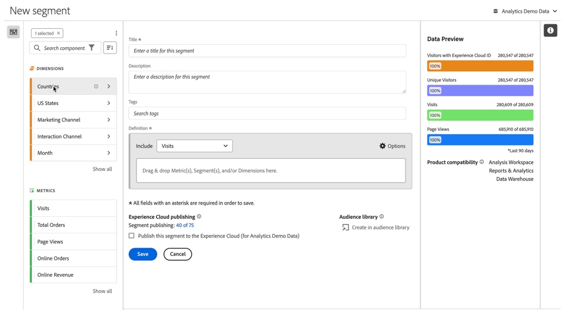
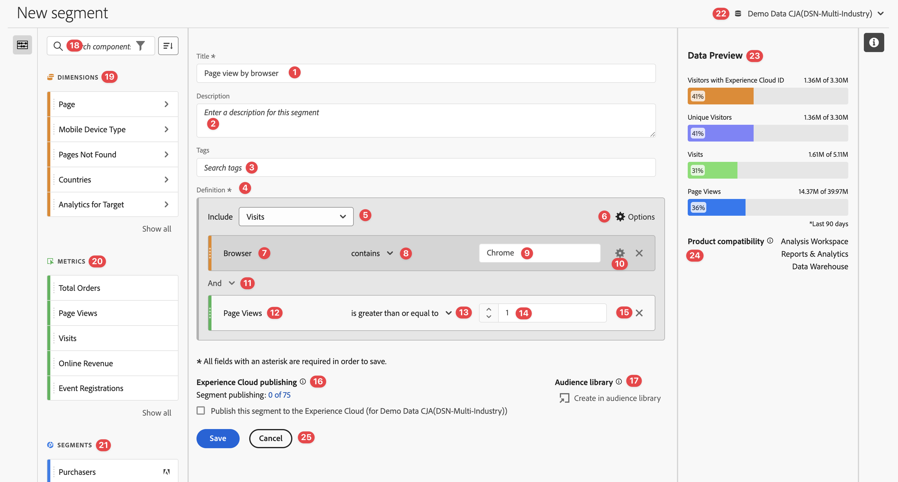
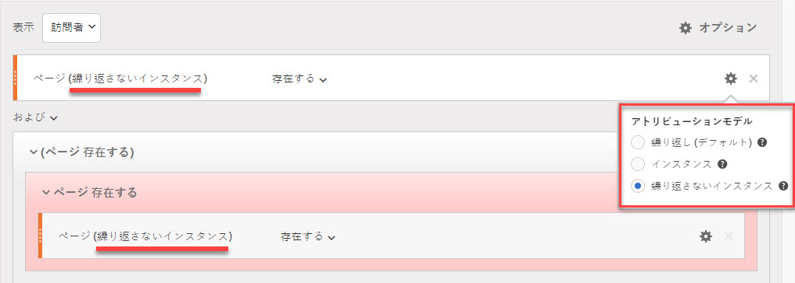
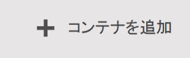
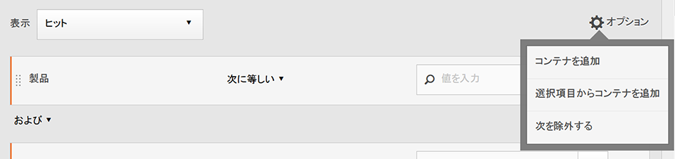
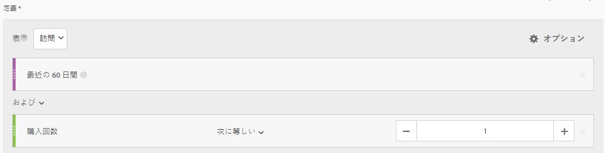
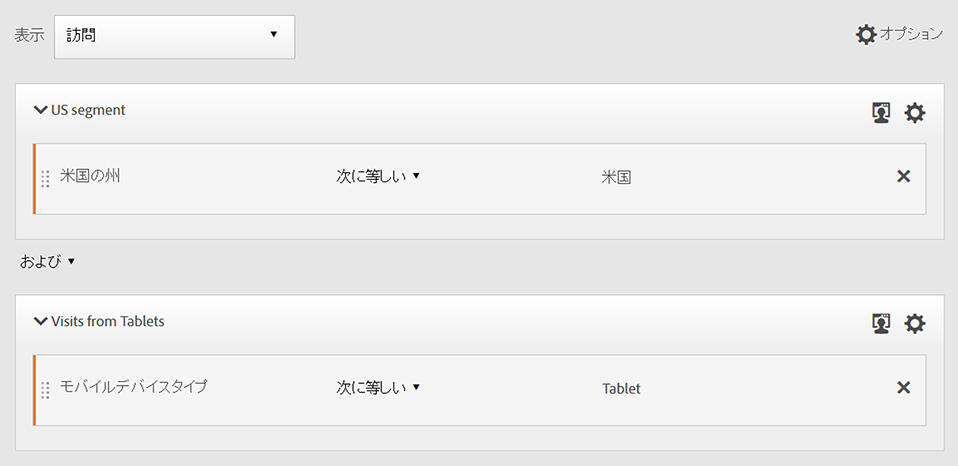

# セグメントの作成 {#build-segments}

>[!CONTEXTUALHELP]
>id="components_segments_productcompatibility"
>title="製品の互換性"
>abstract="使用可能な一部のセグメント条件は、すべての Adobe Analytics ツールと互換性がありません。このリストには、セグメントと互換性のあるツールが示されています。セグメントにすべての Adobe Analytics ツールとの互換性を持たせるには、条件を編集します。"

>[!CONTEXTUALHELP]
>id="components_filters_createaudience"
>title="オーディエンスの作成"
>abstract="セグメントからオーディエンスを作成し、Adobe Experience Platform と共有してアクティブ化することができます。"

>[!CONTEXTUALHELP]
>id="components_filters_datapreview"
>title="データのプレビュー"
>abstract="このセグメントのデータとレポートスイートのデータを比較します。プレビューの割合は、**過去 90 日間**&#x200B;の接続の合計数に基づきます。  プレビューが読み込まれない場合、接続でバックフィル中の可能性があります。"

**[!UICONTROL セグメントビルダー]**&#x200B;ダイアログは、新しいセグメントの作成または既存のセグメントの編集に使用します。ダイアログのタイトルは、[[!UICONTROL セグメント]マネージャー](/help/components/segmentation/segmentation-workflow/seg-manage.md)から作成または管理するセグメントの場合、**[!UICONTROL 新しいセグメント]**&#x200B;または&#x200B;**[!UICONTROL セグメントを編集]**&#x200B;になります。

>[!BEGINTABS]

>[!TAB セグメントビルダー]

>[!TAB セグメントの作成または編集]

>[!ENDTABS]

1. 次の詳細を指定します（は必須です）。

   | 要素 | 説明 |
   | --- | --- |
   | **[!UICONTROL レポートスイート]** | セグメントのレポートスイートを選択できます。 |
   | **[!UICONTROL プロジェクトのみのセグメント]** | セグメントが作成されたプロジェクトにのみ表示され、セグメントがコンポーネントリストに追加されないことを説明する情報ボックス。この設定を変更するには、**[!UICONTROL このセグメントをすべてのプロジェクトで使用できるようにし、コンポーネントリストに追加]**&#x200B;を有効にします。この情報ボックスは、[クイックセグメント](seg-quick.md)を作成し、[!UICONTROL クイックセグメント]インターフェイスから&#x200B;**[!UICONTROL ビルダーを開く]**&#x200B;を使用してクイックセグメント情報を通常のセグメントに変換した場合にのみ表示されます。 |
   | **[!UICONTROL タイトル]**  | セグメントに名前を付けます（例：`Last month mobile visitors`）。 |
   | **[!UICONTROL 説明]** | セグメントに説明を付けます（例：`Segment to define the mobile customers for the last month`）。 |
   | **[!UICONTROL タグ]** | 1 つ以上のタグを作成または適用して、セグメントを整理します。入力を開始すると、選択できる既存のタグが見つかります。または、**[!UICONTROL Enter]** キーを押して新しいタグを追加します。「」を選択して、タグを削除します。 |
   | **[!UICONTROL 定義]**  | [定義ビルダー](#definition-builder)を使用して、セグメントを定義します。 |

   {style="table-layout:auto"}

1. セグメント定義が正しいかどうかを確認するには、右上にあるセグメントの結果の一貫して更新されるプレビューを使用します。
1. Experience Cloud にセグメントを公開するには、「**[!UICONTROL Experience Cloud にこのセグメントを公開（*レポートスイート*用）]**」を選択します。詳しくは、[Experience Cloud へのセグメントの公開](/help/components/segmentation/segmentation-workflow/seg-publish.md)を参照してください。
1. 次のいずれかを選択します。
   * 「**[!UICONTROL 保存]**」を選択して、セグメントを保存します。
   * 「**[!UICONTROL 名前を付けて保存]**」を選択して、セグメントのコピーを保存します。
   * 「**[!UICONTROL 削除]**」を選択して、セグメントを削除します。
   * 「**[!UICONTROL キャンセル]**」を選択して、セグメントに対して行った変更をキャンセルするか、新しいセグメントの作成をキャンセルします。

## 定義ビルダー

セグメント定義を作成するには、定義ビルダーを使用します。この作成では、コンポーネント、コンテナ、演算子およびロジックを使用します。

定義のタイプと範囲を設定できます。

1. 定義のタイプを指定するには、この作成にインクルード定義または除外定義を含めるかどうかを指定します。 **[!UICONTROL オプション]**&#x200B;を選択し、ドロップダウンメニューから&#x200B;**[!UICONTROL 含める]**&#x200B;または&#x200B;**[!UICONTROL 除外]**&#x200B;を選択します。
1. 定義の範囲を指定するには、**[!UICONTROL 含める]**&#x200B;または&#x200B;**[!UICONTROL 除外]**&#x200B;ドロップダウンメニューから、定義の範囲を「**[!UICONTROL ヒット数]**」、「**[!UICONTROL 訪問回数]**」、「**[!UICONTROL 訪問者数]**」のいずれにするかを選択します。

これらの設定は、後で常に変更できます。

### コンポーネント

セグメント定義の作成の重要な部分は、ディメンション、指標、既存のセグメントおよび日付範囲を使用することです。これらのすべてのコンポーネントは、セグメントビルダーのコンポーネントパネルから使用できます。

{width=100%}

コンポーネントを追加するには、次の手順に従います。

1. コンポーネントパネルからコンポーネントを&#x200B;**[!UICONTROL ここに指標、セグメント、ディメンションをドラッグ＆ドロップ]**&#x200B;にドラッグ＆ドロップします。コンポーネントバーの  を使用して、特定のコンポーネントを検索できます。
1. コンポーネントの詳細を指定します。例えば、「**[!UICONTROL 値を選択]**」から値を選択します。または値を入力します。1 つ以上の値を指定できる内容と方法は、コンポーネントと演算子によって異なります。
1. オプションで、デフォルトの演算子を変更します。例えば、**[!UICONTROL 等しい]**&#x200B;から&#x200B;**[!UICONTROL 次のいずれかと等しい]**&#x200B;に変更します。使用可能な演算子の概要について詳しくは、[演算子](../seg-reference/seg-operators.md)を参照してください。

コンポーネントを編集するには：

* 演算子ドロップダウンメニューからコンポーネントの新しい演算子を選択します。
* 必要に応じて、演算子に別の値を選択または指定します。
* コンポーネントタイプがディメンションの場合は、アトリビューションモデルを定義できます。 詳しくは、[アトリビューションモデル](#attribution)を参照してください。

コンポーネントを削除するには：

* コンポーネントで「」を選択します。

### コンテナ

複数のコンポーネントを 1 つ以上のコンテナにグループ化し、コンテナ内およびコンテナ間でロジックを定義できます。コンテナを使用すると、セグメントの複雑な定義を作成できます。

{Width=100%}

* コンテナを追加するには、 **[!UICONTROL オプション]** から「**[!UICONTROL コンテナを追加]**」を選択します。
* 既存のコンポーネントをコンテナに追加するには、コンテナにコンポーネントをドラッグ＆ドロップします。
* 別のコンポーネントをコンテナに追加するには、コンポーネントパネルからコンテナにコンポーネントをドラッグ＆ドロップします。青色の挿入線をガイドとして使用します。
* 別のコンポーネントをコンテナの外側に追加するには、コンテナの外側、メイン定義コンテナの内側にあるコンポーネントパネルからコンポーネントをドラッグ＆ドロップします。青色の挿入線をガイドとして使用します。
* コンテナ内のコンポーネント間、コンテナ間またはコンテナとコンポーネント間のロジックを変更するには、適切な「**[!UICONTROL および]**」、「**[!UICONTROL または]**」、「**[!UICONTROL 次に]**」を選択します。「**[!UICONTROL Then]**」を選択すると、セグメントが順次セグメントに変わります。詳しくは、[順次セグメントの作成](seg-sequential-build.md)を参照してください。
* コンテナレベルを切り替えるには、 **[!UICONTROL ヒット数]**、 **[!UICONTROL 訪問回数]**&#x200B;または **[!UICONTROL 訪問者数]**&#x200B;を選択します。

コンテナ内の  は、次のアクションに使用できます。

| コンテナアクション | 説明 |
|---|---|
| **[!UICONTROL コンテナを追加]** | ネストされたコンテナをコンテナに追加します。 |
| **[!UICONTROL 除外]** | セグメント定義のコンテナから結果を除外します。薄い赤色の左側のバーは、除外コンテナを示します。 |
| **[!UICONTROL 含める]** | コンテナからの結果をセグメント定義に含めます。「含める」がデフォルトです。薄いグレーの左側のバーは、インクルードコンテナを示します。 |
| **[!UICONTROL コンテナに名前を付ける]** | コンテナの名前をデフォルトの説明から変更します。テキストフィールドに名前を入力します。入力しない場合、デフォルトの説明が使用されます。 |
| **[!UICONTROL コンテナを削除]** | 定義からコンテナを削除します。 |

## 日付範囲

周期的な日付範囲を含むセグメントを作成できます。このようにして、進行中のキャンペーンやイベントに関する質問に回答できます。例えば、*過去 60 日間にオンラインで購入したすべてのユーザー*&#x200B;を含むセグメントを作成できます。

>[!BEGINSHADEBOX]

デモビデオについて詳しくは、 [セグメントでの周期的な日付範囲](https://video.tv.adobe.com/v/25403/?quality=12&learn=on){target="_blank"}を参照してください。

>[!ENDSHADEBOX]

## セグメントの積み重ね {#stack}

セグメントを使用して、セグメントを作成できます。セグメント内でセグメントを使用すると、セグメントを最適化して複雑さを軽減できます。

インタラクションチャネル（5）と米国の州（50）の組み合わせでセグメント化するとします。デバイスタイプ（携帯電話とタブレット）と米国の州の一意の組み合わせごとに 250 個のセグメントを作成できます。カリフォルニア州のタブレットユーザーを取得するには、250 個のセグメントのいずれかを使用します。

または、米国の州用に 50 個のセグメント、可能なインタラクションチャネル用に 5 個の合計 55 個のセグメントを定義することもできます。次に、セグメントを積み重ねて、同じ結果を取得します。カリフォルニア州のモバイルアプリユーザーを取得するには、次の 2 つのセグメントを積み重ねます。

## アトリビューション {#attribution}

>[!CONTEXTUALHELP]
>id="components_filters_attribution_repeating"
>title="繰り返し"
>abstract="ディメンションのインスタンスと持続値を含みます。"

>[!CONTEXTUALHELP]
>id="components_filters_attribution_instance"
>title="インスタンス"
>abstract="ディメンションのインスタンスを含みます。"

>[!CONTEXTUALHELP]
>id="components_filters_attribution_nonrepeatinginstance"
>title="繰り返さないインスタンス"
>abstract="ディメンション固有の（繰り返さない）インスタンスを含みます。"

セグメントビルダーでディメンションを使用する際、このディメンションのアトリビューションモデルを指定するオプションがあります。選択したアトリビューションモデルによって、ディメンションコンポーネントに指定した条件に対して選定されるデータが決まります。

ディメンションコンポーネント内で  を選択し、ポップアップからアトリビューションモデルのいずれかを選択します。

| モデル | 説明 |
|---|---|
| **[!UICONTROL 繰り返しモデル（デフォルト）]** | ディメンションにインスタンスと永続化された値を含めると、選定が決まります。 |
| **[!UICONTROL インスタンス]** | ディメンションにインスタンス値のみを含めると、選定が決まります。 |
| **[!UICONTROL 繰り返さないインスタンス]** | ディメンションに一意のインスタンス（繰り返さない）値を含めると、選定が決まります。 |

### 例

セグメント定義の一部として、条件「ページ名が女性に等しい」を指定しました。上記の例と同様です。他の 2 つのアトリビューションモデルを使用して、このセグメント定義を繰り返します。したがって、それぞれ独自のアトリビューションモデルを持つ 3 つのセグメントがあることになります。

* 女性ページ - アトリビューション - 繰り返し（デフォルト）
* 女性ページ - アトリビューション - インスタンス
* 女性ページ - アトリビューション - 繰り返さないインスタンス

次の表に、各アトリビューションモデルについて、この条件で選定  される受信イベントを示します。

| 女性ページ - アトリビューション -  *アトリビューションモデル* | イベント 1： ページ名が 女性と等しい | イベント 2： ページ名が 男性と等しい | イベント 3： ページ名が 女性と等しい | イベント 4： ページ名が 女性と等しい （永続化） | イベント 5： ページ名が チェックアウトと等しい | イベント 6： ページ名が 女性と等しい | イベント 7： ページ名が ホームと等しい |
|---|:---:|:---:|:---:|:---:|:---:|:---:|:--:|
| 繰り返し（デフォルト） |  |  |  |  |  |  |  |
| インスタンス |  |  |  |  |  |  |  |
| 繰り返さないインスタンス |  |  |  |  |  |  |  |

3 つのセグメントを使用したイベントに関するレポートの例を次に示します。

<!--

The [!UICONTROL Segment builder] lets you build simple or complex segments that identify visitor attributes and actions across visits and page hits. It provides a canvas to drag and drop metric dimensions, events, or other segments in order to segment visitors based on hierarchy logic, rules, and operators.

There are several ways to access the Segment builder:

* **Analytics top navigation**: Click **[!UICONTROL Analytics]** > **[!UICONTROL Components]** > **[!UICONTROL Segments]**.
* **[!UICONTROL Analysis Workspace]**: Click **[!UICONTROL Analytics]** > **[!UICONTROL Workspace]**, open a project and click **[!UICONTROL + New]** > **[!UICONTROL Create Segment]**.
* **[!UICONTROL Report Builder]**: [Add or edit segments in Report Builder](/help/analyze/report-builder/work-with-segments.md).

## Builder criteria {#section_F61C4268A5974C788629399ADE1E6E7C}

You can add rule definitions and containers to define your segments.

1. **[!UICONTROL Title]**: Name the segment.
1. **[!UICONTROL Description]**: Provide a description for the segment. 
1. **[!UICONTROL Tags]**: [Tag the segment](/help/components/segmentation/segmentation-workflow/seg-workflow.md) you are creating by picking from a list of existing tags or creating a new tag.
1. **[!UICONTROL Definitions]**: This is where you [build and configure segments](/help/components/segmentation/segmentation-workflow/seg-workflow.md), add rules, and nest and sequence containers. 
1. **[!UICONTROL Show]**: (Top Container selector.) Lets you select the top-level [container](/help/components/segmentation/seg-overview.md) ( [!UICONTROL Visitor], [!UICONTROL Visit], [!UICONTROL Hit]). The default top-level container is the Hit container.
1. **[!UICONTROL Options]**: (gear) icon

   * **[!UICONTROL + Add container]**: Lets you add a new container (below the top-level container) to the segment definition.
   * **[!UICONTROL Exclude]**: Lets you define the segment by excluding one or more dimensions, segments, or metrics.

1. **[!UICONTROL Dimensions]**: Components are dragged and dropped from the Dimensions list (orange sidebar).
1. **[!UICONTROL Operator]**: You can compare and constrain values using selected operators.
1. **[!UICONTROL Value]**: The value you entered or selected for the dimension or segment or metric.
1. **[!UICONTROL Attribution Models]**: Available for dimensions only, these models determine what values in a dimension to segment for. Dimension models are particularly useful in sequential segmentation.

   * **[!UICONTROL Repeating]** (default): Includes instances and persisted values for the dimension.
   * **[!UICONTROL Instance]**: Includes instances for the dimension.
   * **[!UICONTROL Non-repeating instance]**: Includes unique instances (non-repeating) for the dimension. This is the model applied in Flow when repeat instances are excluded.

   

   **Example: Hit segment where eVar1 = A** 

   |  Example  | A  | A  |  A (persisted) | B  | A  | C  |
   |---|---|---|---|---|---|---|
   |  Repeating  | X  | X  | X  | -  | X  | -  |
   |  Instance  | X  | X  | - | - | X | - |
   |  Non-repeating instance  | X | - | - | -  | X  | -  |

1. **[!UICONTROL And/Or/Then]**: Assigns the [!UICONTROL AND/OR/THEN] operators between containers or rules. The THEN operator lets you [define sequential segments](/help/components/segmentation/segmentation-workflow/seg-sequential-build.md).
1. **[!UICONTROL Metric]**: (Green sidebar) Metric that was dragged and dropped from the Metrics list.
1. **[!UICONTROL Comparison]** operator: You can compare and constrain values using selected operators.
1. **[!UICONTROL Value]**: The value you entered or selected for the dimension or segment or metric.
1. **[!UICONTROL X]**: (Delete) Lets you delete this part of the segment definition.
1. **[!UICONTROL Experience Cloud publishing]**: Publishing an Adobe Analytics segment to the Experience Cloud lets you use the segment for marketing activity in [!DNL Audience Manager] and in other activation channels. [Learn more...](/help/components/segmentation/segmentation-workflow/seg-publish.md)
1. **[!UICONTROL Audience library]**: Adobe's audience services manage the translation of visitor data into audience segmentation. As such, creating and managing audiences is similar to creating and using segments, with the added ability to share the audience segment to the Experience Cloud. [Learn more...](https://experienceleague.adobe.com/docs/core-services/interface/audiences/audience-library.html)
1. **[!UICONTROL Search]**: Searches the list of dimensions, segments, or metrics.
1. **[!UICONTROL Dimensions]**: (List) Click the header to expand.
1. **[!UICONTROL Metrics]**: Click the header to expand.
1. **[!UICONTROL Segments]**: Click the header to expand.
1. **[!UICONTROL Report suite selector]**: Lets you select the report suite that this segment will be saved under. You can still utilize the segment in all report suites.
1. **[!UICONTROL Segment Preview]**: Lets you preview the key metrics to see whether you have a valid segment and how broad the segment is. Represents the breakdown of the data set you can expect to see if you apply this segment. Shows 3 concentric circles and a list to show the number and percentage of matches for [!UICONTROL Hits], [!UICONTROL Visits], and [!UICONTROL Visitors] for a segment run against a data set. This chart is updated immediately after you create or make changes to your segment definition.
1. **[!UICONTROL Product Compatibility]**: Provides a list of which Adobe Analytics products (Analysis Workspace, Data Warehouse) with which the segment you created is compatible. Most segments are compatible with all products. However, not all operators and dimensions are compatible with all Analytics products, especially [Data Warehouse](/help/components/segmentation/seg-reference/seg-compatibility.md). This chart is updated immediately after you make changes to your segment definition.
1. **[!UICONTROL Save]** or **[!UICONTROL Cancel]**: Saves or cancels the segment. After clicking **[!UICONTROL Save]**, you are taken to the Segment manager where you can manage the segment.

## Build segments {#build-segments}

1. Simply drag a Dimension, Segment, or Metric Event from the left pane to the [!UICONTROL Definitions] field.

   

   The default top-level [!UICONTROL Hit] container is shown after dragging an element to [!UICONTROL Definitions]. You can change the container type to Visit or Visitor from the **[!UICONTROL Show]** drop-down menu.

1. Set the [operator](/help/components/segmentation/seg-reference/seg-operators.md) from the drop-down menu.
1. Enter or select a value for the item selected.
1. Add additional containers if needed, using **[!UICONTROL And]**, **[!UICONTROL Or]**, or **[!UICONTROL Then]** rules.
1. After placing the containers and setting the rules, see the results of the segment in the validation chart at the top right. The validator indicates the percentage and absolute number of page views, visits, and unique visitors that match the segment you created.
1. Under **[!UICONTROL Tags]**, [tag](/help/components/segmentation/segmentation-workflow/seg-tag.md) the container by selecting an existing tag or creating a new one.
1. Click **[!UICONTROL Save]** to save the segment.

You are now taken to the [Segment manager](/help/components/segmentation/segmentation-workflow/seg-manage.md), where you can tag, share, and manage your segment in multiple ways.

## Add containers {#section_1C38F15703B44474B0718CEF06639EFD}

You can [build a framework of containers](/help/components/segmentation/seg-overview.md) and then place logic rules and operators between.

1. Click **[!UICONTROL Options > Add Container]**.

   

   A new [!UICONTROL Hit] container opens without a [!UICONTROL Hit] (Page View) identified.

   

1. Change the container type as needed.
1. Drag a Dimension, Segment, or Event from the left pane to the container.
1. Continue to add new containers from the top-level **[!UICONTROL Options]** > **[!UICONTROL Add container]** button at the top of the definition, or add containers from within a container to nest logic.

   **OR**

   Select one or more rules and then click **[!UICONTROL Options]** > **[!UICONTROL Add container from selection]**. This turns your selection into a separate container.

## Use date ranges {#concept_252A83D43B6F4A4EBAB55F08AB2A1ACE}

You can build segments that contain rolling date ranges in order to answer questions about ongoing campaigns or events.

For example, you can easily build a segment that includes "everyone who has made a purchase over the past 60 days".

You create a Visit container and within it, add the [!UICONTROL Last 60 days] time range and the metric [!UICONTROL Orders is greater than or equal to 1], with an AND operator:

>[!BEGINSHADEBOX]

See  [Rolling date ranges in segments](https://video.tv.adobe.com/v/25403?quality=12&learn=on){target="_blank"} for a demo video.

>[!ENDSHADEBOX]

## Stack segments {#task_58140F17FFD64FF1BC30DC7B0A1B0E6D}

Stacking segments works by combining the criteria in each segment using an 'and' operator, and then applying the combined criteria. This can be done in a Workspace project directly or in segment builder. 

For example, stacking a "mobile phone users" segment and a "US geography" segment would return data only for mobile phone users in the US.

Think of these segments as building blocks or modules that you can include in a segment library, for users to use as they see fit. That way, you can dramatically reduce the number of segments needed. For example, assume you have 40 segments:

* 20 for mobile phone users in different countries (US_mobile, Germany_mobile, France_mobile, Brazil_mobile, etc.) 
* 20 for tablet users in different countries (US_tablet, Germany_tablet, France_tablet, Brazil_tablet, etc.)

By using segment stacking, you can reduce your segment count to 22 and stack them as needed. You would need to create these segments:

* one segment for mobile users 
* one segment for tablet users 
* 20 segments for the different geographies

>[!NOTE]
>
>When stacking two segments, they are by default joined by an AND statement. This cannot be changed to an OR statement.

1. Go to the Segment builder.
1. Provide a title and description for the segment.

   Step Result 1. Click **[!UICONTROL Show Segments]** to bring up the list of segments in the left navigation.

   Step Result 1. Drag and drop the segments you want to stack to the segment definition canvas. Here is an example of a segment that stacks the existing segments "Visits from Tablets" and "US Geo":

   

1. Save the segment.

   Step Result 

-->

## セグメントテンプレート {#concept_5098446CC78D441E93B8E4D1D1EA6558}

セグメントテンプレートは、**[!UICONTROL 初回訪問回数]**&#x200B;や&#x200B;**[!UICONTROL モバイルデバイスからの訪問回数]**&#x200B;など、一般的なセグメントのユースケースに対して提供されます。これらは、Workspace プロジェクトおよびセグメントビルダーで、新しいセグメントの構成要素として使用できます。

アドビのロゴ  で、テンプレートを識別します。使用可能なテンプレートのサンプルを以下に示します。

<table id="table_98B87D807E9344C9BEBF072C65D87B1B"> 
 <thead> 
  <tr> 
   <th colname="col1" class="entry"> テンプレート名 </th> 
   <th colname="col2" class="entry"> 定義 </th> 
  </tr> 
 </thead>
 <tbody> 
  <tr> 
   <td colname="col1"> カートを放棄 </td> 
   <td colname="col2">買い物かごにアイテムを追加したが注文しなかった訪問者のデータを表示します。 セグメント定義のコンテナは「訪問」です。 </td> 
  </tr> 
  <tr> 
   <td colname="col1"> 初回訪問回数 </td> 
   <td colname="col2">最大 1 回 [1] 回の訪問を行った訪問者のデータを表示します。 セグメント定義のコンテナは「訪問」です。 
 </td> 
  </tr> 
  <tr> 
   <td colname="col1"> 非購入者 </td> 
   <td colname="col2">注文イベントに参加しなかった訪問者のデータを表示します。 </td> 
  </tr> 
  <tr> 
   <td colname="col1"> 単一ページ訪問数以外（非バウンス） </td> 
   <td colname="col2">複数回訪問した訪問者のデータを表示します。
 </td> 
  </tr> 
  <tr> 
   <td colname="col1"> 有料検索 </td> 
   <td colname="col2">有料検索から訪問した訪問者のデータを表示します。  </td> 
  </tr> 
  <tr> 
   <td colname="col1"> 購入者 </td> 
   <td colname="col2">注文イベントに参加した訪問者のデータを表示します。  </td> 
  </tr> 
  <tr> 
   <td colname="col1"> 再来訪 </td> 
   <td colname="col2">少なくとも 1 回訪問した訪問者のデータを表示します。  </td> 
  </tr> 
  <tr> 
   <td colname="col1"> 単一ページ訪問数 </td> 
   <td colname="col2"> その訪問中に複数のページビューを送信した場合でも、単一のページ値が表示された訪問からのデータを表示します。 離脱リンクイベントを持つ単一ページ訪問数がセグメントに含まれます。  </td> 
  </tr> 
  <tr> 
   <td colname="col1"> 閲覧された製品が買い物かごに追加されなかった </td> 
   <td colname="col2">製品を閲覧したが、買い物かごに追加しなかった訪問者のデータを表示します。  </td> 
  </tr> 
  <tr> 
   <td colname="col1"> キャンペーンからの訪問回数 </td> 
   <td colname="col2">キャンペーンから参照された訪問者のデータを表示します。 </td> 
  </tr> 
  <tr> 
   <td colname="col1"> モバイルデバイスからの訪問 </td> 
   <td colname="col2">モバイルデバイスを使用している訪問者のデータを表示します。 </td> 
  </tr> 
  <tr> 
   <td colname="col1"> 自然検索からの訪問 </td> 
   <td colname="col2">有料検索以外からの訪問者のデータを表示します。  </td> 
  </tr> 
  <tr> 
   <td colname="col1"> モバイルデバイス以外からの訪問回数 </td> 
   <td colname="col2">モバイルデバイスを使用していない訪問者のデータを表示します。 </td> 
  </tr> 
  <tr> 
   <td colname="col1"> 電話からの訪問回数 </td> 
   <td colname="col2">電話を使用している訪問者のデータを表示します。  </td> 
  </tr> 
  <tr> 
   <td colname="col1"> 検索エンジンからの訪問回数 </td> 
   <td colname="col2">検索エンジンから参照された訪問者のデータを表示します。</td> 
  </tr> 
  <tr> 
   <td colname="col1"> ソーシャルサイトからの訪問件数 </td> 
   <td colname="col2">ソーシャルサイトから参照された訪問者のデータを表示します。</td> 
  </tr> 
  <tr> 
   <td colname="col1"> タブレットからの訪問回数 </td> 
   <td colname="col2">タブレットを使用している訪問者のデータを表示します。</td> 
  </tr> 
  <tr> 
   <td colname="col1"> 訪問者 ID cookie を使用した訪問 </td> 
   <td colname="col2">永続的な cookie が必要なサイトへの訪問者のデータを表示します。</td> 
  </tr> 
 </tbody> 
</table>

各セグメントの定義を表示するには、 を使用します。例えば、**[!UICONTROL iOS]** テンプレートの場合：

