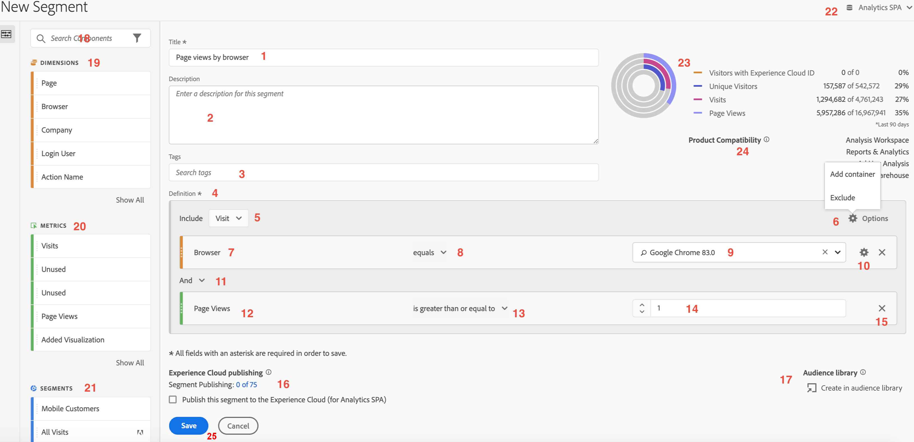
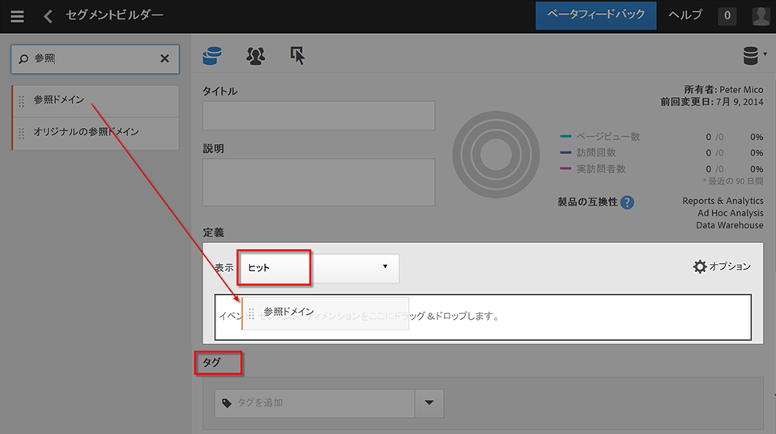

# セグメントビルダー

[!UICONTROL セグメントビルダー]を使用すると、訪問やページヒットを対象として訪問者の属性やアクションを識別する、セグメントを作成できます。セグメントビルダーのキャンバスに、指標ディメンション、イベントまたはその他のセグメントをドラッグ＆ドロップすることで、階層ロジック、ルールおよび演算子に基づいて訪問者をセグメント化できます。

セグメントビルダーにアクセスする方法はいくつかあります。

* **Analytics 上部ナビゲーション**：**[!UICONTROL Analytics]**／**[!UICONTROL コンポーネント]**／**[!UICONTROL セグメント]**&#x200B;をクリックします。
* **[!UICONTROL Analysis Workspace]**：**[!UICONTROL Analytics]**／**[!UICONTROL Workspace]** に移動し、プロジェクトを開いて **[!UICONTROL + 新規]**／**[!UICONTROL セグメントを作成]**&#x200B;をクリックします。
* **[!UICONTROL Reports &amp; Analytics]**：**[!UICONTROL Analytics]**／**[!UICONTROL レポート]**&#x200B;で、既存のレポートを開いて、左側のナビゲーションでセグメントアイコン  をクリックしてから、「**[!UICONTROL 追加]**」をクリックします。
* **[!UICONTROL Report Builder]**：[レポートビルダーでセグメントを追加または編集します。](https://experienceleague.adobe.com/docs/analytics/analyze/report-builder/data-requests/segmentation.html)

## ビルダー条件 {#section_F61C4268A5974C788629399ADE1E6E7C}

ルールの定義とコンテナを追加して、セグメントを定義できます。

1. **[!UICONTROL タイトル]**：セグメントに名前を付けます。
1. **[!UICONTROL 説明]**：セグメントの説明を入力します。
1. **[!UICONTROL タグ]**：既存のタグのリストから選択、または新しいタグを作成して、作成するセグメントに[タグを付ける](/help/components/segmentation/segmentation-workflow/seg-workflow.md)ことができます。
1. **[!UICONTROL 定義]**：[セグメントを作成および設定](/help/components/segmentation/segmentation-workflow/seg-workflow.md)して、ルールを追加し、コンテナをネストして順に並べるための作業領域です。
1. **[!UICONTROL 表示]**：（上部のコンテナセレクター）トップレベルの[コンテナ](/help/components/segmentation/seg-overview.md)（[!UICONTROL 訪問者]、[!UICONTROL 訪問]、[!UICONTROL ヒット]）を選択できます。デフォルトのトップレベルのコンテナは、ヒットコンテナです。
1. **[!UICONTROL オプション]**：（ギア）アイコン

   * **[!UICONTROL + コンテナを追加]**：セグメント定義（トップレベルのコンテナの下）に新しいコンテナを追加できます。
   * **[!UICONTROL 次を除外する]**：1 つ以上のディメンション、セグメントまたは指標を除外することで、セグメントを定義できます。

1. **[!UICONTROL ディメンション]**：コンポーネントがディメンションリスト（オレンジ色のサイドバー）からドラッグ&amp;ドロップされます。
1. **[!UICONTROL 演算子]**：選択した演算子を使用して値を比較および制限できます。
1. **[!UICONTROL 値]**：ディメンション、セグメントまたは指標のために入力または選択した値。
1. **[!UICONTROL アトリビューションモデル]**：ディメンションに対してのみ使用でき、これらのモデルは、セグメント化するディメンションの値を決定します。ディメンションモデルは、順次セグメントで特に役立ちます。

   * **[!UICONTROL 繰り返し]**（デフォルト）：ディメンションに直接的にセットされる値に加えて、以前のヒットから引き継がれた値も対象になります。
   * **[!UICONTROL インスタンス]**：ディメンションに直接的にセットされるインスタンスのみが対象になります。
   * **[!UICONTROL 繰り返さないインスタンス]**：後続のヒットで同じ値が連続的に繰り返されるヒットを除いたインスタンスのみが対象になります。これは、繰り返しインスタンスが除外される場合にフローに適用されるモデルです。

   

   **例：eVar1 = A であるヒットセグメント**

   | 例 | A | A | A（持続） | B | A | C |
   |---|---|---|---|---|---|---|
   | 繰り返し | X | X | X | - | X | - |
   | インスタンス | X | X | - | - | X | - |
   | 繰り返しなしインスタンス | X | - | - | - | X | - |
1. **[!UICONTROL And／Or／Then]**：コンテナまたはルールの間に [!UICONTROL AND／OR／THEN] 演算子を割り当てます。THEN 演算子は、[順次セグメントを定義](/help/components/segmentation/segmentation-workflow/seg-sequential-build.md)します。
1. **[!UICONTROL 指標]**：（緑色のサイドバー）指標リストからドラッグ＆ドロップした指標。
1. **[!UICONTROL 比較]**&#x200B;演算子：選択した演算子を使用して値を比較および制限できます。
1. **[!UICONTROL 値]**：ディメンション、セグメントまたは指標のために入力または選択した値。
1. **[!UICONTROL X]**：（削除）セグメント定義のこの部分を削除できます。
1. **[!UICONTROL Experience Cloud パブリッシング]**：Adobe Analytics セグメントを Experience Cloud に公開すると、[!DNL Audience Manager] や他のアクティベーションチャネルでのマーケティングアクティビティでセグメントを使用できます。[詳細情報...](/help/components/segmentation/segmentation-workflow/seg-publish.md)
1. **[!UICONTROL オーディエンスライブラリ]**：アドビのオーディエンスサービスは、訪問者データからオーディエンスセグメントへの変換を管理します。したがって、オーディエンスを作成および管理することは、セグメントを作成および使用することに似ています。また、オーディエンスセグメントを Experience Cloud と共有することもできます。[詳細情報...](https://experienceleague.adobe.com/docs/core-services/interface/audiences/audience-library.html)
1. **[!UICONTROL 検索]**：ディメンション、セグメントまたは指標のリストを検索します。
1. **[!UICONTROL ディメンション]**：（リスト）ヘッダーをクリックして展開します。
1. **[!UICONTROL 指標]**：ヘッダーをクリックして展開します。
1. **[!UICONTROL セグメント]**：ヘッダーをクリックして展開します。
1. **[!UICONTROL レポートスイートセレクタ]**：このセグメントを保存するレポートスイートを選択します。セグメントは、すべてのレポートスイートで利用できます。
1. **[!UICONTROL セグメントのプレビュー]**：主要な指標をプレビューして、有効なセグメントであるかどうかおよびセグメントの範囲を確認します。このセグメントを適用した場合に期待するデータセットの分類を表します。データセットに対してセグメントを実行した結果の[!UICONTROL ヒット数]、[!UICONTROL 訪問]および[!UICONTROL 訪問者]の件数と割合が 3 つの同心円とリストで表示されます。このグラフは、セグメント定義を作成または変更するとすぐに更新されます。
1. **[!UICONTROL 製品機能]**：作成したセグメントと互換性がある Adobe Analytics 製品（Analysis Workspace、[!UICONTROL Reports &amp; Analytics]、Data Warehouse）のリストが表示されます。ほとんどのセグメントは、すべての製品と互換性があります。ただし、演算子とディメンションは、すべての Analytics 製品と互換性があるとは限りません。特に、[Data Warehouse](/help/components/segmentation/seg-reference/seg-compatibility.md) とは互換性がない場合があります。このグラフは、セグメント定義を変更するとすぐに更新されます。
1. **[!UICONTROL 保存]**&#x200B;または&#x200B;**[!UICONTROL キャンセル]**：セグメントを保存またはキャンセルします。「**[!UICONTROL 保存]**」をクリックした後、セグメントを管理できるセグメントマネージャが表示されます。

日付範囲が埋め込まれているセグメントの動作は、今後も Analysis Workspace と [!UICONTROL Reports &amp; Analytics] では異なります。ワークスペースでは、日付範囲が埋め込まれているセグメントがパネルの日付範囲より優先されます。これに対して、[!UICONTROL Reports &amp; Analytics] では、レポートの日付範囲とセグメントの埋め込みの日付範囲が重なる期間のみが対象期間になります。

## セグメントの構築 {#build-segments}

1. 左のパネルから、ディメンション、セグメントまたは指標イベントを[!UICONTROL 定義]フィールドにドラッグします。

   

   要素を[!UICONTROL 定義]にドラッグすると、デフォルトのトップレベルコンテナである[!UICONTROL ヒット]が表示されます。**[!UICONTROL 表示]**&#x200B;ドロップダウンメニューから、コンテナタイプを訪問または訪問者に変更できます。

1. ドロップダウンメニューから[演算子](/help/components/segmentation/seg-reference/seg-operators.md)を設定します。
1. 選択した項目に対して値を入力または選択します。
1. **[!UICONTROL AND]**、**[!UICONTROL OR]** または **[!UICONTROL THEN]** ルールを使用して、必要に応じて他のコンテナを追加します。
1. コンテナを配置してルールを設定したら、右上の検証グラフにセグメントの結果を表示します。バリデーターは、作成されたセグメントと一致するページビュー、訪問回数およびユニーク訪問者数の割合と絶対値を示します。
1. 「**[!UICONTROL タグ]**」で、既存のタグを選択するか、新しいタグを作成して、コンテナに[タグ](/help/components/segmentation/segmentation-workflow/seg-tag.md)を付けます。
1. 「**[!UICONTROL 保存]**」をクリックしてセグメントを保存します。

[セグメントマネージャ](/help/components/segmentation/segmentation-workflow/seg-manage.md)に移動し、複数の方法でセグメントにタグ付け、共有、管理できます。

## 追加コンテナ {#section_1C38F15703B44474B0718CEF06639EFD}

[コンテナのフレームワークを作成](/help/components/segmentation/seg-overview.md)し、論理ルールと演算子を配置できます。

1. **[!UICONTROL オプション／コンテナを追加]**&#x200B;をクリックします。

   

   新しい[!UICONTROL ヒット]コンテナが、[!UICONTROL ヒット]（ページビュー）を識別していない状態で開きます。

   

1. 必要に応じて、コンテナタイプを変更します。
1. 左のパネルから、ディメンション、セグメントまたはイベントをコンテナにドラッグします。
1. 定義の最上部にあるトップレベルの&#x200B;**[!UICONTROL オプション]**／**[!UICONTROL コンテナを追加]**&#x200B;を使用して、新しいコンテナの追加を続行するか、コンテナ内でコンテナを追加してロジックをネストします。

   **OR**

   1 つ以上のルールを選択し、**[!UICONTROL オプション]**／**[!UICONTROL 選択項目からコンテナを追加]**&#x200B;をクリックします。選択が別個のコンテナに変換されます。

## 日付範囲の使用 {#concept_252A83D43B6F4A4EBAB55F08AB2A1ACE}

実施中のキャンペーンやイベントに関する質問に回答するため、日付範囲の周期を含むセグメントを構築できます。

例えば、「過去 60 日間に購入したすべてのユーザー」を含むセグメントを容易に構築できます。

訪問コンテナーを作成し、そこに、AND 演算子を使用して、「[!UICONTROL 最近の 60 日間]」という期間と「[!UICONTROL 購入回数が 1 よりも大きいか等しい]」という指標を追加します。

## セグメントの積み重ね {#task_58140F17FFD64FF1BC30DC7B0A1B0E6D}

セグメントを積み重ねると、各セグメントの条件が「and」演算子で結合され、結合された条件が適用されます。これは、Workspace プロジェクトで直接実行するか、セグメントビルダーで実行できます。

例えば、「携帯電話ユーザー」セグメントと「米国地域」セグメントを積み重ねると、米国の携帯電話ユーザーのデータのみが返されます。

これらのセグメントは、セグメントライブラリに含めることができる構成要素またはモジュールと見なすことができ、ユーザーが必要に応じてライブラリから利用できます。これにより、必要なセグメントの数を大きく減らすことができます。例えば、次のような 40 個のセグメントがあるとします。

* 各国の携帯電話ユーザー用のセグメントが 20 個（米国の携帯電話ユーザー用、ドイツの携帯電話ユーザー用、フランスの携帯電話ユーザー用、ブラジルの携帯電話ユーザー用など）
* 各国のタブレットユーザー用のセグメントが 20 個（米国のタブレットユーザー用、ドイツのタブレットユーザー用、フランスのタブレットユーザー用、ブラジルのタブレットユーザー用など）

セグメントの積み重ねを使用すると、全体のセグメント数を 22 個に減らし、それらを必要に応じて積み重ねることができます。具体的には、次のようなセグメントを作成する必要があります。

* 携帯電話ユーザー用の 1 つのセグメント
* タブレットユーザー用の 1 つのセグメント
* 各国用の 20 個のセグメント

>[!NOTE]
>
>2 つのセグメントを積み重ねると、デフォルトで、それらのセグメントが AND ステートメントで結合されます。これを OR ステートメントに変更することはできません。

1. セグメントビルダーに移動します。
1. セグメントのタイトルと説明を指定します。

   手順の結果 1「**[!UICONTROL セグメントを表示]**」をクリックして、左のナビゲーションにセグメントのリストを表示します。

   手順の結果 1積み重ねるセグメントをセグメント定義キャンバスにドラッグ＆ドロップします。次に、既存のセグメント Visits from Tablets と US Geo を積み重ねたセグメントの例を示します。

   

1. セグメントを保存します。

   手順の結果

## セグメントテンプレート {#concept_5098446CC78D441E93B8E4D1D1EA6558}

セグメントテンプレートは、「初回訪問」や「モバイルデバイスからの訪問」など、一般的なセグメントの使用例に対して提供されます。これらは、Workspace プロジェクトおよびセグメントビルダーで、新しいセグメントの構成要素として使用できます。

テンプレートは、アドビの「A」ロゴで示されます。テンプレートの例を以下に示します。

<table id="table_98B87D807E9344C9BEBF072C65D87B1B"> 
 <thead> 
  <tr> 
   <th colname="col1" class="entry"> テンプレート名 </th> 
   <th colname="col2" class="entry"> 定義 </th> 
  </tr> 
 </thead>
 <tbody> 
  <tr> 
   <td colname="col1"> 買い物かごを放棄 </td> 
   <td colname="col2">商品を買い物かごに追加したが、何も注文しなかった訪問者のデータを表示します。セグメント定義のコンテナは「訪問」です。この順次セグメントのルールは 
 「買い物かごへの追加数が null でない 
 
その場合 
 
注文数が 0 に等しい」です。 
 </td> 
  </tr> 
  <tr> 
   <td colname="col1"> 初回訪問回数 </td> 
   <td colname="col2">最大 1 回訪問した訪問者のデータを表示します。セグメント定義のコンテナは「訪問」です。ルールは 
訪問回数が 1 と等しい 
 </td> 
  </tr> 
  <tr> 
   <td colname="col1"> 非購入者 </td> 
   <td colname="col2">注文イベントに参加しなかった訪問者のデータを表示します。セグメント定義のコンテナは「訪問者」です。このセグメントでは除外ロジックを使用します。ルールは 
「注文数が null でない」です。 
 </td> 
  </tr> 
  <tr> 
   <td colname="col1"> 非直帰数（非バウンス） </td> 
   <td colname="col2">複数のページを訪問した訪問者のデータを表示します。セグメント定義のコンテナは「訪問者」です。このセグメントでは除外ロジックを使用します。ルールは 
「単一アクセスが null でない」です。 
 </td> 
  </tr> 
  <tr> 
   <td colname="col1"> 有料検索 </td> 
   <td colname="col2">有料検索から訪問した訪問者のデータを表示します。セグメント定義のコンテナは「訪問」です。ルールは 
「有料検索が 1」です。 
 </td> 
  </tr> 
  <tr> 
   <td colname="col1"> 購入者 </td> 
   <td colname="col2">注文イベントを発生させた訪問者のデータを表示します。セグメント定義のコンテナは「訪問者」です。ルールは 
「注文数が null でない」です。 
 </td> 
  </tr> 
  <tr> 
   <td colname="col1"> 再来訪 </td> 
   <td colname="col2">少なくとも 1 回訪問した訪問者のデータを表示します。セグメント定義のコンテナは「訪問」です。ルールは 
「訪問回数が 1 より大きい」です。 
 </td> 
  </tr> 
  <tr> 
   <td colname="col1"> 単一ページ訪問数 </td> 
   <td colname="col2"> 訪問時に複数のページビューを送信していても、単一のページ値を表示する訪問のデータを表示します。出口リンクイベントを持つ単一ページ訪問数がセグメントに含まれます。セグメント定義のコンテナは「訪問」です。ルールは 
単一ページ訪問が 1 です。 
 </td> 
  </tr> 
  <tr> 
   <td colname="col1"> 閲覧された製品がカートに追加されませんでした </td> 
   <td colname="col2">製品を閲覧したが、買い物かごに追加しなかった訪問者のデータを表示します。セグメント定義のコンテナは「訪問」です。この順次セグメントのルールは 
「製品表示が null でない 
 
その場合 
 
 買い物かごへの追加数が 0 に等しい」です。 
 </td> 
  </tr> 
  <tr> 
   <td colname="col1"> キャンペーンからの訪問回数 </td> 
   <td colname="col2">キャンペーンから参照された訪問者のデータを表示します。セグメント定義のコンテナは「訪問」です。ルールは 
「トラッキングコードが null でない」です。 
 </td> 
  </tr> 
  <tr> 
   <td colname="col1"> モバイルデバイスからの訪問 </td> 
   <td colname="col2">モバイルデバイスを使用している訪問者のデータを表示します。セグメント定義のコンテナは「訪問」です。ルールは 
「モバイルデバイスがヌルでない」です。 
 </td> 
  </tr> 
  <tr> 
   <td colname="col1"> 自然検索からの訪問 </td> 
   <td colname="col2">有料検索から訪問していない訪問者のデータを表示します。セグメント定義のコンテナは「訪問」です。ルールは 
「有料検索が 0」です。 
 </td> 
  </tr> 
  <tr> 
   <td colname="col1"> モバイルデバイス以外からの訪問回数 </td> 
   <td colname="col2">モバイルデバイスを使用していない訪問者のデータを表示します。セグメント定義のコンテナは「訪問」です。このセグメントでは除外ロジックを使用します。ルールは 
「モバイルデバイスタイプが携帯電話に等しい」 
 
または 
 
「モバイルデバイスタイプがタブレットに等しい」です。 
 </td> 
  </tr> 
  <tr> 
   <td colname="col1"> 電話からの訪問回数 </td> 
   <td colname="col2">電話を使用している訪問者のデータを表示します。セグメント定義のコンテナは「訪問」です。ルールは 
「デバイスタイプが携帯電話に等しい」です。 
 </td> 
  </tr> 
  <tr> 
   <td colname="col1"> 検索エンジンからの訪問回数 </td> 
   <td colname="col2">検索エンジンから参照された訪問者のデータを表示します。セグメント定義のコンテナは「訪問」です。ルールは 
「リファラータイプが検索エンジンに等しい」です。 
 </td> 
  </tr> 
  <tr> 
   <td colname="col1"> ソーシャルサイトからの訪問件数 </td> 
   <td colname="col2">ソーシャルサイトから参照された訪問者のデータを表示します。セグメント定義のコンテナは「訪問」です。ルールは 
「リファラータイプがソーシャルネットワークに等しい」です。 
 </td> 
  </tr> 
  <tr> 
   <td colname="col1"> タブレットからの訪問回数 </td> 
   <td colname="col2">タブレットを使用している訪問者のデータを表示します。セグメント定義のコンテナは「訪問」です。ルールは 
「デバイスタイプがタブレットに等しい」です。 
 </td> 
  </tr> 
  <tr> 
   <td colname="col1"> 訪問者 ID cookie の訪問 </td> 
   <td colname="col2">持続的 cookie が必要なサイトへの訪問者のデータを表示します。セグメント定義のコンテナは「訪問」です。ルールは 
「持続的 Cookie が 1」です。 
 </td> 
  </tr> 
 </tbody> 
</table>
