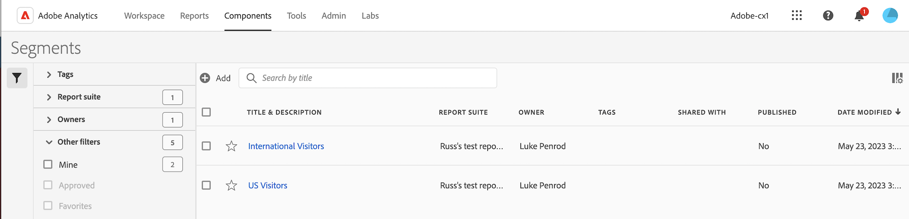

# セグメントの管理

[共有](t-seg-share.md)、[&#x200B; セグメント &#x200B;](t-seg-filter.md)、[&#x200B; タグ &#x200B;](seg-tag.md)、[承認](seg-approve.md)、名前変更、[&#x200B; コピー](seg-copy.md)、セグメントの削除、書き出し、セグメントを[お気に入り](t-seg-favorite.md)としてマークできます。これらは、中央の[!UICONTROL &#x200B; セグメント &#x200B;]管理インターフェイスから実行できます。 セグメントを管理するには：

* メインインターフェイスで「**[!UICONTROL コンポーネント]**」を選択し、「**[!UICONTROL セグメント]**」を選択します。

>[!NOTE]
>
>特定のWorkspace プロジェクト内で作成したクイックセグメントは、すべてのプロジェクトでセグメントを使用可能にしていない限り、[!UICONTROL &#x200B; セグメント &#x200B;] マネージャーには表示されません。
>

## セグメントマネージャー

セグメントマネージャーには、次のインターフェイス要素があります。

### セグメントリスト

セグメント リスト ➊には、所有しているすべてのセグメント、すべてのプロジェクトに対してスコープが設定されているセグメント、および共有されているセグメントが表示されます。 リストには、次の列があります。

| 列 | 説明 |
| --- | --- |
|  | セグメントのを優先するか、を優先しないかを選択します。 [&#x200B; セグメントをお気に入りにマーク &#x200B;](t-seg-favorite.md)する |
| **[!UICONTROL タイトルと説明]** | セグメントを編集するには、タイトルリンクを選択します。これにより、[&#x200B; セグメントビルダー](seg-build.md)が開きます。 共有セグメントはで示されます。 |
| **[!UICONTROL レポートスイート]** | このセグメントが適用されるレポートスイート。 |
| **[!UICONTROL 所有者]** | セグメントの所有者。 ユーザーは、自分が所有するセグメントまたは自分と共有されている注釈のみを表示できます。 |
| **[!UICONTROL タグ]** | このセグメントのタグ。 |
| **[!UICONTROL 共有先]** | セグメントを共有した個人またはグループの数。 選択して、**[!UICONTROL コンポーネントを共有]**&#x200B;ダイアログを開きます。 詳しくは、[&#x200B; セグメントの共有](t-seg-share.md)を参照してください。 |
| **[!UICONTROL パブリッシュ済み]** | [&#x200B; セグメントがCX Enterpriseに](seg-publish.md)公開されているかどうか。 |
| **[!UICONTROL 変更日時]** | セグメントが最後に変更された日時。 |

 を使用して、表示する列を指定します。

### アクションバー

アクション バー➋を使用して、セグメントに対してアクションを実行できます。 アクションバーには、次のアクションが含まれます。

| アクション | 説明 |
|---|---|
|  **[!UICONTROL Add]** | [&#x200B; セグメントビルダー](seg-build.md)を使用して、別のセグメントを追加します。 |
|  [!UICONTROL *タイトルで検索*] | リストでセグメントが選択されていない場合は、この検索フィールドを使用してセグメントを検索します。 |
| 、**[!UICONTROL タグ]** | 選択したセグメントにタグ付けします。 **[!UICONTROL タグセグメント]** ダイアログで、選択したセグメントのタグを選択または選択解除します。 選択したセグメントのタグを保存するには、**[!UICONTROL 保存]**&#x200B;を選択します。 詳しくは、[&#x200B; セグメントのタグ付け](seg-tag.md)を参照してください。 |
| 、**[!UICONTROL 共有]** | 選択したセグメントを共有します。 **[!UICONTROL セグメントを共有]** ダイアログで、 *個人またはグループを検索*&#x200B;するか、**[!UICONTROL 組織]**&#x200B;または&#x200B;**[!UICONTROL グループ]**&#x200B;を選択できます。 選択したセグメントの共有の詳細を保存するには、**[!UICONTROL 保存]**&#x200B;を選択します。 詳しくは、[&#x200B; セグメントの共有](t-seg-share.md)を参照してください。 |
| 、**[!UICONTROL 削除]** | 選択したセグメントを削除します。 確認メッセージが表示されます。 |
| **[!UICONTROL 名前を変更]** | 選択した1つのセグメントの名前を変更します。 選択すると、セグメントの名前をインラインで変更できます。 |
|  **[!UICONTROL 承認]** | 選択したセグメントを承認します。 詳しくは、[&#x200B; セグメントの承認](seg-approve.md)を参照してください。 |
| **[!UICONTROL コピー]** | 選択したセグメントをコピーします。 新しいセグメントが、同じ名前とサフィックス `(Copy)`で作成されます。 |
|  **[!UICONTROL CSV に書き出し]** | セグメントを`Segments List.csv` ファイルに書き出します。 |

### アクティブなフィルターバー

フィルターバー➌には、フィルターパネルからセグメントのリスト（存在する場合）に適用されたアクティブなセグメントが表示されます。  を使用すると、フィルターをすばやく削除できます。 複数のフィルターが指定されている場合は、**[!UICONTROL すべてを削除]**&#x200B;を使用してすべてのフィルターを削除できます。

### フィルターパネル

 **[!UICONTROL フィルター]**&#x200B;左側のパネル ➍を使用して、セグメントのリストをフィルターできます。 フィルターパネルには、フィルターのタイプと、特定のフィルターを適用するセグメントの数が表示されます。 「」を選択して、フィルターパネルの表示を切り替えます。

詳しくは、[&#x200B; セグメントのリストのフィルタリング &#x200B;](t-seg-filter.md)を参照してください。

<!--

The Segment manager offers many ways of curating segments, such as sharing, filtering, tagging, approving, copying, deleting, and marking as favorites.

The Analytics Segment manager shows you all the segments you own and that have been shared with you. Admin-level users can see all segments in the organization. This overview presents the user interface and the capabilities of the Segment manager. 

## Access the Segment manager

1. In Adobe Analytics, select the **[!UICONTROL Components]** tab, then select **[!UICONTROL Segments]**.

   Or 

   In an existing report, select the Segments icon  in the left navigation, then select **[!UICONTROL Manage]**.

## Available actions in the Segment manager

In the Segment manager, you can:

* [Filter segments](/help/components/segmentation/segmentation-workflow/t-seg-filter.md)

* [Mark segments as favorites](/help/components/segmentation/segmentation-workflow/t-seg-favorite.md)

* [Approve segments](/help/components/segmentation/segmentation-workflow/seg-approve.md)

* [Tag segments](/help/components/segmentation/segmentation-workflow/seg-tag.md)

* [Share segments](/help/components/segmentation/segmentation-workflow/t-seg-share.md)

* Export a segment to a CSV file.

* [Copy segments](/help/components/segmentation/segmentation-workflow/seg-copy.md)

* [Delete segments](/help/components/segmentation/segmentation-workflow/seg-delete.md)

## Configure columns

You can configure the information displayed for each segment in the Segment manager by configuring the columns that are displayed.

To configure the visible columns in the Segment manager:

1. In Adobe Analytics, select the **[!UICONTROL Components]** tab, then select **[!UICONTROL Segments]**. 

1. In the Segment manager, select the **Customize columns** icon , then select the columns that you want to be displayed in the Segment manager.

   The following columns are available:

   | Column title | Description  |
   |---|---|
   | Title and description | These values are provided in the Segment builder. To edit the title and description, select the title link to open the Segment builder.  |
   | Favorites  | Displays star icons next to each segment, allowing you to mark segments as favorites. For more information, see [Mark segments as favorites](/help/components/segmentation/segmentation-workflow/t-seg-favorite.md). |
   | Report suites  | This column indicates in which report suite the segment was last saved.  |
   | Owner  | Indicates who owns the segment. As a non-Admin, you can see only segments you own or those that were shared with you.  |
   | Tags (not checked in column selector, hence column not appearing)  | Tags that were applied to the segment, either by you or by people who shared the segment with you.  |
   | Shared with  | Lists individuals or groups (Admin only) or All (Admin only) that you shared the segment with. 
When a segment is being shared by you or with you, a share icon displays next to the segment name.
|
   | Date modified  | Shows the date that the segment was last modified.  |
   | Used in | Shows where segments are currently being used, and how many times they are being used in each area. 
For example, if the segment is being used in 40 projects and 2 alerts, then the value of this column shows as [!UICONTROL **42 components**].
 
Select the value in this column to see the breakdown of where the segments are being used (for example, [!UICONTROL **Projects (40)**], [!UICONTROL **Alerts (2)**]). Furthermore, you can view the list of items where the segments are being used. For example, so see the list of projects where they are being used, select the [!UICONTROL **Projects (40)**] link.

Each of the following areas shows the number of instances of segments being used in that area:
  <ul><li>[!UICONTROL **Projects**]
Contains segments that were [created in the segment builder](/help/components/segmentation/segmentation-workflow/seg-build.md) and are available for all projects.
</li><li>[!UICONTROL **Ad hoc components**]
Contains segments that were [created as quick segments](/help/analyze/analysis-workspace/components/segments/quick-segments.md) and are available only within a single project.
</li><li>[!UICONTROL **Scheduled projects**]</li><li>[!UICONTROL **Mobile Scorecards**]</li><li>[!UICONTROL **Annotations**]</li><li>[!UICONTROL **Alerts**]</li><li>[!UICONTROL **Calculated metrics**]</li><li>[!UICONTROL **Report Builder**]
Selecting this option downloads a CSV file, with the following columns of data:
<ul><li>Report Builder Name</li><li>Last accessed</li><li>Last accessed IMS User ID</li><li>Last accessed user name</li></ul>
When viewing information for Report Builder, usage information is available starting in September 2024.
</li></ul>
This information can help you determine whether a component is valuable to users in your organization, where it is used, and if it needs to be deleted or modified.

Consider the following when viewing this column:
<ul><li>This information is available only to system administrators.</li><li>The [!UICONTROL **Used in**] column does not display by default. [Configure columns](#configure-columns) to display it.</li><li>If a segment includes another segment in its definition, any use of that segment is not shown in the [!UICONTROL **Used in**] column. If a segment is included in the definition of another type of component (such as a calculated metric), then usage is shown in the [!UICONTROL **Used in**] column.</li><li>This information does not include usage from the API or Data Warehouse.</li><li>If there is no data in this column for a given component but it has a [!UICONTROL **Last used**] date, the component might have been used in an analysis without being saved.</li><li>Usage information is available starting in September 2023.</li></ul>
You can use the [Data Dictionary](/help/analyze/analysis-workspace/components/data-dictionary/data-dictionary-overview.md) along with this information to help you keep track of and better understand how components are being used in your organization.
  |
   | Last used | Shows the date when the segment was last used in any of the following component types: <ul><li>Alerts</li><li>Calculated metrics</li><li>Projects</li><li>Scheduled projects</li><li>Segments</li></ul> 
This information can help you determine whether a component is valuable to users in your organization, where it is used, and if it needs to be deleted or modified.

Consider the following when viewing this column:
<ul><li>This information does not include usage from the API, Report Builder, or Data Warehouse.</li><li>For some components, this column might not contain data if the component was last used prior to September 2023.</li><li>This information is available only to system administrators.</li></ul>
You can use the [Data Dictionary](/help/analyze/analysis-workspace/components/data-dictionary/data-dictionary-overview.md) along with this information to help you keep track of and better understand how components are being used in your organization. |
   
   {style="table-layout:auto"}

## How-To Video {#section_B3C5DA22DC5248DBA17C56E03DA2D4F2}

This [Adobe Analytics video](https://experienceleague.adobe.com/docs/analytics-learn/tutorials/components/segmentation/segment-management-and-sharing.html) gives a short overview of how to use the Segment manager.

-->